# **PIC16F87XA Data Sheet**

28/40/44-Pin Enhanced Flash Microcontrollers

#### **Note the following details of the code protection feature on Microchip devices:**

- Microchip products meet the specification contained in their particular Microchip Data Sheet.
- Microchip believes that its family of products is one of the most secure families of its kind on the market today, when used in the intended manner and under normal conditions.
- There are dishonest and possibly illegal methods used to breach the code protection feature. All of these methods, to our knowledge, require using the Microchip products in a manner outside the operating specifications contained in Microchip's Data Sheets. Most likely, the person doing so is engaged in theft of intellectual property.
- Microchip is willing to work with the customer who is concerned about the integrity of their code.
- Neither Microchip nor any other semiconductor manufacturer can guarantee the security of their code. Code protection does not mean that we are guaranteeing the product as "unbreakable."

Code protection is constantly evolving. We at Microchip are committed to continuously improving the code protection features of our products. Attempts to break microchip's code protection feature may be a violation of the Digital Millennium Copyright Act. If such acts allow unauthorized access to your software or other copyrighted work, you may have a right to sue for relief under that Act.

Information contained in this publication regarding device applications and the like is intended through suggestion only and may be superseded by updates. It is your responsibility to ensure that your application meets with your specifications. No representation or warranty is given and no liability is assumed by Microchip Technology Incorporated with respect to the accuracy or use of such information, or infringement of patents or other intellectual property rights arising from such use or otherwise. Use of Microchip's products as critical components in life support systems is not authorized except with express written approval by Microchip. No licenses are conveyed, implicitly or otherwise, under any intellectual property rights.

#### **Trademarks**

The Microchip name and logo, the Microchip logo, Accuron, dsPIC, KEELOQ, MPLAB, PIC, PICmicro, PICSTART, PRO MATE and PowerSmart are registered trademarks of Microchip Technology Incorporated in the U.S.A. and other countries.

AmpLab, FilterLab, microID, MXDEV, MXLAB, PICMASTER, SEEVAL and The Embedded Control Solutions Company are registered trademarks of Microchip Technology Incorporated in the U.S.A.

Application Maestro, dsPICDEM, dsPICDEM.net, ECAN, ECONOMONITOR, FanSense, FlexROM, fuzzyLAB, In-Circuit Serial Programming, ICSP, ICEPIC, microPort, Migratable Memory, MPASM, MPLIB, MPLINK, MPSIM, PICkit, PICDEM, PICDEM.net, PowerCal, PowerInfo, PowerMate, PowerTool, rfLAB, rfPIC, Select Mode, SmartSensor, SmartShunt, SmartTel and Total Endurance are trademarks of Microchip Technology Incorporated in the U.S.A. and other countries.

Serialized Quick Turn Programming (SQTP) is a service mark of Microchip Technology Incorporated in the U.S.A.

All other trademarks mentioned herein are property of their respective companies.

© 2003, Microchip Technology Incorporated, Printed in the U.S.A., All Rights Reserved.


*Microchip received QS-9000 quality system certification for its worldwide headquarters, design and wafer fabrication facilities in Chandler and Tempe, Arizona in July 1999 and Mountain View, California in March 2002. The Company's quality system processes and procedures are QS-9000 compliant for its PICmicro® 8-bit MCUs, KEELOQ® code hopping devices, Serial EEPROMs, microperipherals, non-volatile memory and analog products. In addition, Microchip's quality system for the design and manufacture of development systems is ISO 9001 certified.*


## 28/40/44-Pin Enhanced Flash Microcontrollers

### **Devices Included in this Data Sheet:**

- PIC16F873A
- PIC16F876A
- PIC16F874A
- PIC16F877A

### **High-Performance RISC CPU:**

- Only 35 single-word instructions to learn
- All single-cycle instructions except for program branches, which are two-cycle
- <span id="page-2-0"></span> Operating speed: DC – 20 MHz clock input DC – 200 ns instruction cycle
- Up to 8K x 14 words of Flash Program Memory, Up to 368 x 8 bytes of Data Memory (RAM), Up to 256 x 8 bytes of EEPROM Data Memory
- Pinout compatible to other 28-pin or 40/44-pin PIC16CXXX and PIC16FXXX microcontrollers

### **Peripheral Features:**

- Timer0: 8-bit timer/counter with 8-bit prescaler
- Timer1: 16-bit timer/counter with prescaler, can be incremented during Sleep via external crystal/clock
- Timer2: 8-bit timer/counter with 8-bit period register, prescaler and postscaler
- · Two Capture, Compare, PWM modules
  - Capture is 16-bit, max. resolution is 12.5 ns
  - Compare is 16-bit, max. resolution is 200 ns
  - PWM max. resolution is 10-bit
- Synchronous Serial Port (SSP) with SPI<sup>™</sup> (Master mode) and I<sup>2</sup>C<sup>™</sup> (Master/Slave)
- Universal Synchronous Asynchronous Receiver Transmitter (USART/SCI) with 9-bit address detection
- Parallel Slave Port (PSP) 8 bits wide with external RD, WR and CS controls (40/44-pin only)
- Brown-out detection circuitry for Brown-out Reset (BOR)

### **Analog Features:**

- 10-bit, up to 8-channel Analog-to-Digital Converter (A/D)
- Brown-out Reset (BOR)
- Analog Comparator module with:
  - Two analog comparators
  - Programmable on-chip voltage reference (VREF) module
  - Programmable input multiplexing from device inputs and internal voltage reference
  - Comparator outputs are externally accessible

### **Special Microcontroller Features:**

- 100,000 erase/write cycle Enhanced Flash program memory typical
- 1,000,000 erase/write cycle Data EEPROM memory typical
- Data EEPROM Retention > 40 years
- Self-reprogrammable under software control
- In-Circuit Serial Programming<sup>™</sup> (ICSP<sup>™</sup>) via two pins
- Single-supply 5V In-Circuit Serial Programming
- Watchdog Timer (WDT) with its own on-chip RC oscillator for reliable operation
- Programmable code protection
- Power saving Sleep mode
- Selectable oscillator options
- · In-Circuit Debug (ICD) via two pins

### **CMOS Technology:**

- Low-power, high-speed Flash/EEPROM technology
- Fully static design
- Wide operating voltage range (2.0V to 5.5V)
- Commercial and Industrial temperature ranges
- Low-power consumption

|            | Prog  | Program Memory             |                 | EEPROM  |     | 10-bit   | ССР | MSSP |                            |       | Timers   |             |
|------------|-------|----------------------------|-----------------|---------|-----|----------|-----|------|----------------------------|-------|----------|-------------|
| Device     | Bytes | # Single Word Instructions | SRAM<br>(Bytes) | (Bytes) | I/O | A/D (ch) |     | SPI  | Master<br>I <sup>2</sup> C | USART | 8/16-bit | Comparators |
| PIC16F873A | 7.2K  | 4096                       | 192             | 128     | 22  | 5        | 2   | Yes  | Yes                        | Yes   | 2/1      | 2           |
| PIC16F874A | 7.2K  | 4096                       | 192             | 128     | 33  | 8        | 2   | Yes  | Yes                        | Yes   | 2/1      | 2           |
| PIC16F876A | 14.3K | 8192                       | 368             | 256     | 22  | 5        | 2   | Yes  | Yes                        | Yes   | 2/1      | 2           |
| PIC16F877A | 14.3K | 8192                       | 368             | 256     | 33  | 8        | 2   | Yes  | Yes                        | Yes   | 2/1      | 2           |

### **Pin Diagrams**

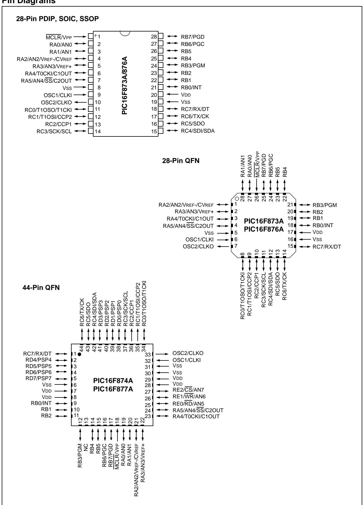

### Pin Diagrams (Continued)


### **Table of Contents**

| 1.0  | Device Overview 5                                                               |  |
|------|---------------------------------------------------------------------------------|--|
| 2.0  | Memory Organization 15                                                          |  |
| 3.0  | Data EEPROM and Flash Program Memory 33                                         |  |
| 4.0  | I/O Ports 41                                                                    |  |
| 5.0  | Timer0 Module 53                                                                |  |
| 6.0  | Timer1 Module 57                                                                |  |
| 7.0  | Timer2 Module 61                                                                |  |
| 8.0  | Capture/Compare/PWM Modules 63                                                  |  |
| 9.0  | Master Synchronous Serial Port (MSSP) Module 71                                 |  |
| 10.0 | Addressable Universal Synchronous Asynchronous Receiver Transmitter (USART) 111 |  |
| 11.0 | Analog-to-Digital Converter (A/D) Module 127                                    |  |
| 12.0 | Comparator Module 135                                                           |  |
| 13.0 | Comparator Voltage Reference Module 141                                         |  |
| 14.0 | Special Features of the CPU 143                                                 |  |
| 15.0 | Instruction Set Summary 159                                                     |  |
| 16.0 | Development Support 167                                                         |  |
| 17.0 | Electrical Characteristics 173                                                  |  |
| 18.0 | DC and AC Characteristics Graphs and Tables 197                                 |  |
| 19.0 | Packaging Information 209                                                       |  |
|      | Appendix A: Revision History 219                                                |  |
|      | Appendix B: Device Differences 219                                              |  |
|      | Appendix C: Conversion Considerations 220                                       |  |
|      | Index 221                                                                       |  |
|      | On-Line Support 229                                                             |  |
|      | Systems Information and Upgrade Hot Line 229                                    |  |
|      | Reader Response 230                                                             |  |
|      | PIC16F87XA Product Identification System 231                                    |  |

## **TO OUR VALUED CUSTOMERS**

It is our intention to provide our valued customers with the best documentation possible to ensure successful use of your Microchip products. To this end, we will continue to improve our publications to better suit your needs. Our publications will be refined and enhanced as new volumes and updates are introduced.

If you have any questions or comments regarding this publication, please contact the Marketing Communications Department via E-mail at **docerrors@mail.microchip.com** or fax the **Reader Response Form** in the back of this data sheet to (480) 792-4150. We welcome your feedback.

## **Most Current Data Sheet**

To obtain the most up-to-date version of this data sheet, please register at our Worldwide Web site at:

<span id="page-5-1"></span>http://www.microchip.com

You can determine the version of a data sheet by examining its literature number found on the bottom outside corner of any page. The last character of the literature number is the version number, (e.g., DS30000A is version A of document DS30000).

### <span id="page-5-0"></span>**Errata**

An errata sheet, describing minor operational differences from the data sheet and recommended workarounds, may exist for current devices. As device/documentation issues become known to us, we will publish an errata sheet. The errata will specify the revision of silicon and revision of document to which it applies.

To determine if an errata sheet exists for a particular device, please check with one of the following:

- Microchip's Worldwide Web site; http://www.microchip.com
- Your local Microchip sales office (see last page)
- The Microchip Corporate Literature Center; U.S. FAX: (480) 792-7277

When contacting a sales office or the literature center, please specify which device, revision of silicon and data sheet (include literature number) you are using.

### **Customer Notification System**

Register on our Web site at **www.microchip.com/cn** to receive the most current information on all of our products.

## <span id="page-6-2"></span><span id="page-6-0"></span>**1.0 DEVICE OVERVIEW**

This document contains device specific information about the following devices:

- PIC16F873A
- PIC16F874A
- PIC16F876A
- PIC16F877A

PIC16F873A/876A devices are available only in 28-pin packages, while PIC16F874A/877A devices are available in 40-pin and 44-pin packages. All devices in the PIC16F87XA family share common architecture with the following differences:

- The PIC16F873A and PIC16F874A have one-half of the total on-chip memory of the PIC16F876A and PIC16F877A
- The 28-pin devices have three I/O ports, while the 40/44-pin devices have five
- The 28-pin devices have fourteen interrupts, while the 40/44-pin devices have fifteen
- The 28-pin devices have five A/D input channels, while the 40/44-pin devices have eight
- The Parallel Slave Port is implemented only on the 40/44-pin devices

The available features are summarized in [Table 1-1.](#page-6-1) Block diagrams of the PIC16F873A/876A and PIC16F874A/877A devices are provided in [Figure 1-1](#page-7-0) and [Figure 1-2](#page-8-0), respectively. The pinouts for these device families are listed in [Table 1-2](#page-9-0) and [Table 1-3.](#page-11-0)

Additional information may be found in the PICmicro® Mid-Range Reference Manual (DS33023), which may be obtained from your local Microchip Sales Representative or downloaded from the Microchip web site. The Reference Manual should be considered a complementary document to this data sheet and is highly recommended reading for a better understanding of the device architecture and operation of the peripheral modules.

<span id="page-6-1"></span>**TABLE 1-1: PIC16F87XA DEVICE FEATURES**

| Key Features                           | PIC16F873A                                              | PIC16F874A                                              | PIC16F876A                                              | PIC16F877A                                              |
|----------------------------------------|---------------------------------------------------------|---------------------------------------------------------|---------------------------------------------------------|---------------------------------------------------------|
| Operating Frequency                    | DC – 20 MHz                                             | DC – 20 MHz                                             | DC – 20 MHz                                             | DC – 20 MHz                                             |
| Resets (and Delays)                    | POR, BOR<br>(PWRT, OST)                                 | POR, BOR<br>(PWRT, OST)                                 | POR, BOR<br>(PWRT, OST)                                 | POR, BOR<br>(PWRT, OST)                                 |
| Flash Program Memory<br>(14-bit words) | 4K                                                      | 4K                                                      | 8K                                                      | 8K                                                      |
| Data Memory (bytes)                    | 192                                                     | 192                                                     | 368                                                     | 368                                                     |
| EEPROM Data Memory (bytes)             | 128                                                     | 128                                                     | 256                                                     | 256                                                     |
| Interrupts                             | 14                                                      | 15                                                      | 14                                                      | 15                                                      |
| I/O Ports                              | Ports A, B, C                                           | Ports A, B, C, D, E                                     | Ports A, B, C                                           | Ports A, B, C, D, E                                     |
| Timers                                 | 3                                                       | 3                                                       | 3                                                       | 3                                                       |
| Capture/Compare/PWM modules            | 2                                                       | 2                                                       | 2                                                       | 2                                                       |
| Serial Communications                  | MSSP, USART                                             | MSSP, USART                                             | MSSP, USART                                             | MSSP, USART                                             |
| Parallel Communications                | —                                                       | PSP                                                     | —                                                       | PSP                                                     |
| 10-bit Analog-to-Digital Module        | 5 input channels                                        | 8 input channels                                        | 5 input channels                                        | 8 input channels                                        |
| Analog Comparators                     | 2                                                       | 2                                                       | 2                                                       | 2                                                       |
| Instruction Set                        | 35 Instructions                                         | 35 Instructions                                         | 35 Instructions                                         | 35 Instructions                                         |
| Packages                               | 28-pin PDIP<br>28-pin SOIC<br>28-pin SSOP<br>28-pin QFN | 40-pin PDIP<br>44-pin PLCC<br>44-pin TQFP<br>44-pin QFN | 28-pin PDIP<br>28-pin SOIC<br>28-pin SSOP<br>28-pin QFN | 40-pin PDIP<br>44-pin PLCC<br>44-pin TQFP<br>44-pin QFN |

<span id="page-7-0"></span>**FIGURE 1-1: PIC16F873A/876A BLOCK DIAGRAM**

<span id="page-7-1"></span>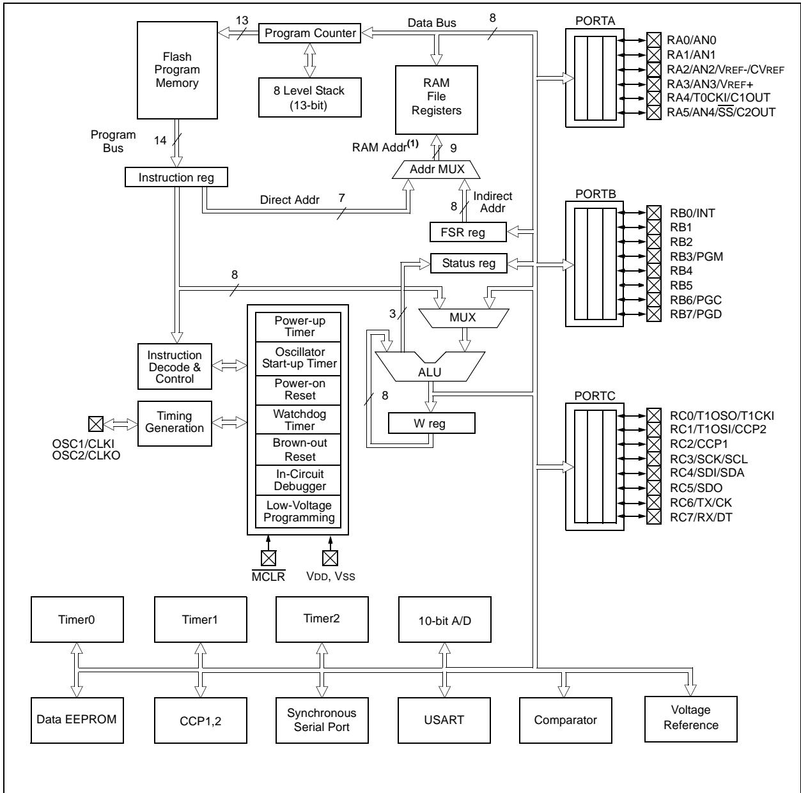

| Device     | Program Flash | Data Memory | Data EEPROM |
|------------|---------------|-------------|-------------|
| PIC16F873A | 4K words      | 192 Bytes   | 128 Bytes   |
| PIC16F876A | 8K words      | 368 Bytes   | 256 Bytes   |

**Note 1:** Higher order bits are from the Status register.

<span id="page-8-1"></span><span id="page-8-0"></span>

<span id="page-9-5"></span><span id="page-9-4"></span><span id="page-9-0"></span>**TABLE 1-2: PIC16F873A/876A PINOUT DESCRIPTION**

<span id="page-9-7"></span><span id="page-9-6"></span><span id="page-9-3"></span><span id="page-9-2"></span><span id="page-9-1"></span>

| Pin Name                                               | PDIP, SOIC,<br>SSOP Pin# | QFN<br>Pin# | I/O/P<br>Type      | Buffer<br>Type | Description                                                                                                                                                                                                                                                                              |
|--------------------------------------------------------|--------------------------|-------------|--------------------|----------------|------------------------------------------------------------------------------------------------------------------------------------------------------------------------------------------------------------------------------------------------------------------------------------------|
| OSC1/CLKI<br>OSC1<br>CLKI                              | 9                        | 6           | I<br>I             |                | ST/CMOS(3) Oscillator crystal or external clock input.<br>Oscillator crystal input or external clock source input. ST<br>buffer when configured in RC mode; otherwise CMOS.<br>External clock source input. Always associated with pin<br>function OSC1 (see OSC1/CLKI, OSC2/CLKO pins). |
| OSC2/CLKO<br>OSC2<br>CLKO                              | 10                       | 7           | O<br>O             | —              | Oscillator crystal or clock output.<br>Oscillator crystal output. Connects to crystal or resonator<br>in Crystal Oscillator mode.<br>In RC mode, OSC2 pin outputs CLKO, which has 1/4 the<br>frequency of OSC1 and denotes the instruction cycle rate.                                   |
| MCLR/VPP<br>MCLR<br>VPP                                | 1                        | 26          | I<br>P             | ST             | Master Clear (input) or programming voltage (output).<br>Master Clear (Reset) input. This pin is an active low Reset<br>to the device.<br>Programming voltage input.                                                                                                                     |
| RA0/AN0<br>RA0<br>AN0                                  | 2                        | 27          | I/O<br>I           | TTL            | PORTA is a bidirectional I/O port.<br>Digital I/O.<br>Analog input 0.                                                                                                                                                                                                                    |
| RA1/AN1<br>RA1<br>AN1                                  | 3                        | 28          | I/O<br>I           | TTL            | Digital I/O.<br>Analog input 1.                                                                                                                                                                                                                                                          |
| RA2/AN2/VREF-/<br>CVREF<br>RA2<br>AN2<br>VREF<br>CVREF | 4                        | 1           | I/O<br>I<br>I<br>O | TTL            | Digital I/O.<br>Analog input 2.<br>A/D reference voltage (Low) input.<br>Comparator VREF output.                                                                                                                                                                                         |
| RA3/AN3/VREF+<br>RA3<br>AN3<br>VREF+                   | 5                        | 2           | I/O<br>I<br>I      | TTL            | Digital I/O.<br>Analog input 3.<br>A/D reference voltage (High) input.                                                                                                                                                                                                                   |
| RA4/T0CKI/C1OUT<br>RA4<br>T0CKI<br>C1OUT               | 6                        | 3           | I/O<br>I<br>O      | ST             | Digital I/O – Open-drain when configured as output.<br>Timer0 external clock input.<br>Comparator 1 output.                                                                                                                                                                              |
| RA5/AN4/SS/C2OUT<br>RA5<br>AN4<br>SS<br>C2OUT          | 7                        | 4           | I/O<br>I<br>I<br>O | TTL            | Digital I/O.<br>Analog input 4.<br>SPI slave select input.<br>Comparator 2 output.                                                                                                                                                                                                       |

<span id="page-9-11"></span><span id="page-9-10"></span><span id="page-9-9"></span><span id="page-9-8"></span>**Legend:** I = input O = output I/O = input/output P = power — = Not used TTL = TTL input ST = Schmitt Trigger input

**Note 1:** This buffer is a Schmitt Trigger input when configured as the external interrupt.

**2:** This buffer is a Schmitt Trigger input when used in Serial Programming mode.

<span id="page-10-2"></span><span id="page-10-1"></span>**TABLE 1-2: PIC16F873A/876A PINOUT DESCRIPTION (CONTINUED)**

<span id="page-10-12"></span><span id="page-10-11"></span><span id="page-10-10"></span><span id="page-10-9"></span><span id="page-10-8"></span><span id="page-10-7"></span><span id="page-10-6"></span><span id="page-10-5"></span><span id="page-10-4"></span><span id="page-10-3"></span><span id="page-10-0"></span>

| Pin Name           | PDIP, SOIC,<br>SSOP Pin# | QFN<br>Pin# | I/O/P<br>Type | Buffer<br>Type | Description                                                              |
|--------------------|--------------------------|-------------|---------------|----------------|--------------------------------------------------------------------------|
|                    |                          |             |               |                | PORTB is a bidirectional I/O port. PORTB can be software                 |
|                    |                          |             |               |                | programmed for internal weak pull-ups on all inputs.                     |
| RB0/INT            | 21                       | 18          |               | TTL/ST(1)      |                                                                          |
| RB0<br>INT         |                          |             | I/O<br>I      |                | Digital I/O.<br>External interrupt.                                      |
|                    | 22                       | 19          | I/O           | TTL            |                                                                          |
| RB1                |                          |             |               |                | Digital I/O.                                                             |
| RB2                | 23                       | 20          | I/O           | TTL            | Digital I/O.                                                             |
| RB3/PGM            | 24                       | 21          | I/O           | TTL            |                                                                          |
| RB3<br>PGM         |                          |             | I             |                | Digital I/O.<br>Low-voltage (single-supply) ICSP programming enable pin. |
| RB4                | 25                       | 22          | I/O           | TTL            | Digital I/O.                                                             |
|                    |                          |             |               |                |                                                                          |
| RB5                | 26                       | 23          | I/O           | TTL            | Digital I/O.                                                             |
| RB6/PGC<br>RB6     | 27                       | 24          | I/O           | TTL/ST(2)      | Digital I/O.                                                             |
| PGC                |                          |             | I             |                | In-circuit debugger and ICSP programming clock.                          |
| RB7/PGD            | 28                       | 25          |               | TTL/ST(2)      |                                                                          |
| RB7                |                          |             | I/O           |                | Digital I/O.                                                             |
| PGD                |                          |             | I/O           |                | In-circuit debugger and ICSP programming data.                           |
|                    |                          |             |               |                | PORTC is a bidirectional I/O port.                                       |
| RC0/T1OSO/T1CKI    | 11                       | 8           |               | ST             |                                                                          |
| RC0                |                          |             | I/O           |                | Digital I/O.                                                             |
| T1OSO              |                          |             | O             |                | Timer1 oscillator output.                                                |
| T1CKI              |                          |             | I             |                | Timer1 external clock input.                                             |
| RC1/T1OSI/CCP2     | 12                       | 9           |               | ST             |                                                                          |
| RC1<br>T1OSI       |                          |             | I/O<br>I      |                | Digital I/O.<br>Timer1 oscillator input.                                 |
| CCP2               |                          |             | I/O           |                | Capture2 input, Compare2 output, PWM2 output.                            |
| RC2/CCP1           | 13                       | 10          |               | ST             |                                                                          |
| RC2                |                          |             | I/O           |                | Digital I/O.                                                             |
| CCP1               |                          |             | I/O           |                | Capture1 input, Compare1 output, PWM1 output.                            |
| RC3/SCK/SCL        | 14                       | 11          |               | ST             |                                                                          |
| RC3                |                          |             | I/O           |                | Digital I/O.                                                             |
| SCK                |                          |             | I/O           |                | Synchronous serial clock input/output for SPI mode.                      |
| SCL                |                          |             | I/O           |                | Synchronous serial clock input/output for I2C mode.                      |
| RC4/SDI/SDA<br>RC4 | 15                       | 12          | I/O           | ST             | Digital I/O.                                                             |
| SDI                |                          |             | I             |                | SPI data in.                                                             |
| SDA                |                          |             | I/O           |                | 2C data I/O.<br>I                                                        |
| RC5/SDO            | 16                       | 13          |               | ST             |                                                                          |
| RC5                |                          |             | I/O           |                | Digital I/O.                                                             |
| SDO                |                          |             | O             |                | SPI data out.                                                            |
| RC6/TX/CK          | 17                       | 14          |               | ST             |                                                                          |
| RC6                |                          |             | I/O           |                | Digital I/O.                                                             |
| TX<br>CK           |                          |             | O<br>I/O      |                | USART asynchronous transmit.<br>USART1 synchronous clock.                |
|                    |                          |             |               |                |                                                                          |
| RC7/RX/DT<br>RC7   | 18                       | 15          | I/O           | ST             | Digital I/O.                                                             |
| RX                 |                          |             | I             |                | USART asynchronous receive.                                              |
| DT                 |                          |             | I/O           |                | USART synchronous data.                                                  |
| VSS                | 8, 19                    | 5, 6        | P             | —              | Ground reference for logic and I/O pins.                                 |
| VDD                | 20                       | 17          | P             | —              | Positive supply for logic and I/O pins.                                  |

<span id="page-10-20"></span><span id="page-10-19"></span><span id="page-10-18"></span><span id="page-10-17"></span><span id="page-10-16"></span><span id="page-10-15"></span><span id="page-10-14"></span><span id="page-10-13"></span>**Legend:** I = input O = output I/O = input/output P = power — = Not used TTL = TTL input ST = Schmitt Trigger input

**Note 1:** This buffer is a Schmitt Trigger input when configured as the external interrupt.

**2:** This buffer is a Schmitt Trigger input when used in Serial Programming mode.

<span id="page-11-0"></span>**TABLE 1-3: PIC16F874A/877A PINOUT DESCRIPTION**

<span id="page-11-5"></span><span id="page-11-3"></span><span id="page-11-2"></span><span id="page-11-1"></span>

| Pin Name                                           | PDIP<br>Pin# | PLCC<br>Pin# | TQFP<br>Pin# | QFN<br>Pin# | I/O/P<br>Type      | Buffer<br>Type | Description                                                                                                                                                                                                                                                                                    |
|----------------------------------------------------|--------------|--------------|--------------|-------------|--------------------|----------------|------------------------------------------------------------------------------------------------------------------------------------------------------------------------------------------------------------------------------------------------------------------------------------------------|
| OSC1/CLKI<br>OSC1<br>CLKI                          | 13           | 14           | 30           | 32          | I<br>I             |                | ST/CMOS(4) Oscillator crystal or external clock input.<br>Oscillator crystal input or external clock source<br>input. ST buffer when configured in RC mode;<br>otherwise CMOS.<br>External clock source input. Always associated<br>with pin function OSC1 (see OSC1/CLKI,<br>OSC2/CLKO pins). |
| OSC2/CLKO<br>OSC2<br>CLKO                          | 14           | 15           | 31           | 33          | O<br>O             | —              | Oscillator crystal or clock output.<br>Oscillator crystal output.<br>Connects to crystal or resonator in Crystal<br>Oscillator mode.<br>In RC mode, OSC2 pin outputs CLKO, which<br>has 1/4 the frequency of OSC1 and denotes the<br>instruction cycle rate.                                   |
| MCLR/VPP<br>MCLR<br>VPP                            | 1            | 2            | 18           | 18          | I<br>P             | ST             | Master Clear (input) or programming voltage (output).<br>Master Clear (Reset) input. This pin is an active<br>low Reset to the device.<br>Programming voltage input.                                                                                                                           |
|                                                    |              |              |              |             |                    |                | PORTA is a bidirectional I/O port.                                                                                                                                                                                                                                                             |
| RA0/AN0<br>RA0<br>AN0                              | 2            | 3            | 19           | 19          | I/O<br>I           | TTL            | Digital I/O.<br>Analog input 0.                                                                                                                                                                                                                                                                |
| RA1/AN1<br>RA1<br>AN1                              | 3            | 4            | 20           | 20          | I/O<br>I           | TTL            | Digital I/O.<br>Analog input 1.                                                                                                                                                                                                                                                                |
| RA2/AN2/VREF-/CVREF<br>RA2<br>AN2<br>VREF<br>CVREF | 4            | 5            | 21           | 21          | I/O<br>I<br>I<br>O | TTL            | Digital I/O.<br>Analog input 2.<br>A/D reference voltage (Low) input.<br>Comparator VREF output.                                                                                                                                                                                               |
| RA3/AN3/VREF+<br>RA3<br>AN3<br>VREF+               | 5            | 6            | 22           | 22          | I/O<br>I<br>I      | TTL            | Digital I/O.<br>Analog input 3.<br>A/D reference voltage (High) input.                                                                                                                                                                                                                         |
| RA4/T0CKI/C1OUT<br>RA4                             | 6            | 7            | 23           | 23          | I/O                | ST             | Digital I/O – Open-drain when configured as<br>output.                                                                                                                                                                                                                                         |
| T0CKI<br>C1OUT                                     |              |              |              |             | I<br>O             |                | Timer0 external clock input.<br>Comparator 1 output.                                                                                                                                                                                                                                           |
| RA5/AN4/SS/C2OUT<br>RA5<br>AN4<br>SS<br>C2OUT      | 7            | 8            | 24           | 24          | I/O<br>I<br>I<br>O | TTL            | Digital I/O.<br>Analog input 4.<br>SPI slave select input.<br>Comparator 2 output.                                                                                                                                                                                                             |

<span id="page-11-10"></span><span id="page-11-9"></span><span id="page-11-8"></span><span id="page-11-7"></span><span id="page-11-6"></span>**Legend:** I = input O = output I/O = input/output P = power

<span id="page-11-4"></span>

— = Not used TTL = TTL input ST = Schmitt Trigger input

**Note 1:** This buffer is a Schmitt Trigger input when configured as the external interrupt.

**2:** This buffer is a Schmitt Trigger input when used in Serial Programming mode.

**TABLE 1-3: PIC16F874A/877A PINOUT DESCRIPTION (CONTINUED)**

<span id="page-12-5"></span><span id="page-12-4"></span><span id="page-12-3"></span><span id="page-12-2"></span><span id="page-12-0"></span>

| Pin Name   | PDIP<br>Pin# | PLCC<br>Pin# | TQFP<br>Pin# | QFN<br>Pin# | I/O/P<br>Type | Buffer<br>Type | Description                                                     |
|------------|--------------|--------------|--------------|-------------|---------------|----------------|-----------------------------------------------------------------|
|            |              |              |              |             |               |                | PORTB is a bidirectional I/O port. PORTB can be                 |
|            |              |              |              |             |               |                | software programmed for internal weak pull-up on all<br>inputs. |
| RB0/INT    | 33           | 36           | 8            | 9           |               | TTL/ST(1)      |                                                                 |
| RB0<br>INT |              |              |              |             | I/O<br>I      |                | Digital I/O.<br>External interrupt.                             |
| RB1        | 34           | 37           | 9            | 10          | I/O           | TTL            | Digital I/O.                                                    |
| RB2        | 35           | 38           | 10           | 11          | I/O           | TTL            | Digital I/O.                                                    |
| RB3/PGM    | 36           | 39           | 11           | 12          |               | TTL            |                                                                 |
| RB3        |              |              |              |             | I/O           |                | Digital I/O.                                                    |
| PGM        |              |              |              |             | I             |                | Low-voltage ICSP programming enable pin.                        |
| RB4        | 37           | 41           | 14           | 14          | I/O           | TTL            | Digital I/O.                                                    |
| RB5        | 38           | 42           | 15           | 15          | I/O           | TTL            | Digital I/O.                                                    |
| RB6/PGC    | 39           | 43           | 16           | 16          |               | TTL/ST(2)      |                                                                 |
| RB6        |              |              |              |             | I/O           |                | Digital I/O.                                                    |
| PGC        |              |              |              |             | I             |                | In-circuit debugger and ICSP programming clock.                 |
| RB7/PGD    | 40           | 44           | 17           | 17          |               | TTL/ST(2)      |                                                                 |
| RB7        |              |              |              |             | I/O           |                | Digital I/O.                                                    |
| PGD        |              |              |              |             | I/O           |                | In-circuit debugger and ICSP programming data.                  |

<span id="page-12-9"></span><span id="page-12-8"></span><span id="page-12-7"></span><span id="page-12-6"></span>

**Legend:** I = input O = output I/O = input/output P = power

<span id="page-12-1"></span>

— = Not used TTL = TTL input ST = Schmitt Trigger input

**Note 1:** This buffer is a Schmitt Trigger input when configured as the external interrupt.

**2:** This buffer is a Schmitt Trigger input when used in Serial Programming mode.

<span id="page-13-0"></span>**TABLE 1-3: PIC16F874A/877A PINOUT DESCRIPTION (CONTINUED)**

<span id="page-13-4"></span><span id="page-13-3"></span><span id="page-13-2"></span><span id="page-13-1"></span>

| Pin Name                                 | PDIP<br>Pin# | PLCC<br>Pin# | TQFP<br>Pin# | QFN<br>Pin# | I/O/P<br>Type   | Buffer<br>Type | Description                                                                                                             |
|------------------------------------------|--------------|--------------|--------------|-------------|-----------------|----------------|-------------------------------------------------------------------------------------------------------------------------|
|                                          |              |              |              |             |                 |                | PORTC is a bidirectional I/O port.                                                                                      |
| RC0/T1OSO/T1CKI<br>RC0<br>T1OSO<br>T1CKI | 15           | 16           | 32           | 34          | I/O<br>O<br>I   | ST             | Digital I/O.<br>Timer1 oscillator output.<br>Timer1 external clock input.                                               |
| RC1/T1OSI/CCP2<br>RC1<br>T1OSI<br>CCP2   | 16           | 18           | 35           | 35          | I/O<br>I<br>I/O | ST             | Digital I/O.<br>Timer1 oscillator input.<br>Capture2 input, Compare2 output, PWM2 output.                               |
| RC2/CCP1<br>RC2<br>CCP1                  | 17           | 19           | 36           | 36          | I/O<br>I/O      | ST             | Digital I/O.<br>Capture1 input, Compare1 output, PWM1 output.                                                           |
| RC3/SCK/SCL<br>RC3<br>SCK                | 18           | 20           | 37           | 37          | I/O<br>I/O      | ST             | Digital I/O.<br>Synchronous serial clock input/output for SPI<br>mode.<br>Synchronous serial clock input/output for I2C |
| SCL                                      |              |              |              |             | I/O             |                | mode.                                                                                                                   |
| RC4/SDI/SDA<br>RC4<br>SDI<br>SDA         | 23           | 25           | 42           | 42          | I/O<br>I<br>I/O | ST             | Digital I/O.<br>SPI data in.<br>2C data I/O.<br>I                                                                       |
| RC5/SDO<br>RC5<br>SDO                    | 24           | 26           | 43           | 43          | I/O<br>O        | ST             | Digital I/O.<br>SPI data out.                                                                                           |
| RC6/TX/CK<br>RC6<br>TX<br>CK             | 25           | 27           | 44           | 44          | I/O<br>O<br>I/O | ST             | Digital I/O.<br>USART asynchronous transmit.<br>USART1 synchronous clock.                                               |
| RC7/RX/DT<br>RC7<br>RX<br>DT             | 26           | 29           | 1            | 1           | I/O<br>I<br>I/O | ST             | Digital I/O.<br>USART asynchronous receive.<br>USART synchronous data.                                                  |

<span id="page-13-8"></span><span id="page-13-7"></span><span id="page-13-6"></span><span id="page-13-5"></span>**Legend:** I = input O = output I/O = input/output P = power — = Not used TTL = TTL input ST = Schmitt Trigger input

**Note 1:** This buffer is a Schmitt Trigger input when configured as the external interrupt.

**<sup>2:</sup>** This buffer is a Schmitt Trigger input when used in Serial Programming mode.

**<sup>3:</sup>** This buffer is a Schmitt Trigger input when configured in RC Oscillator mode and a CMOS input otherwise.

<span id="page-14-1"></span><span id="page-14-0"></span>**TABLE 1-3: PIC16F874A/877A PINOUT DESCRIPTION (CONTINUED)**

<span id="page-14-9"></span><span id="page-14-8"></span><span id="page-14-7"></span><span id="page-14-6"></span><span id="page-14-5"></span><span id="page-14-4"></span><span id="page-14-3"></span>

| Pin Name                       | PDIP<br>Pin# | PLCC<br>Pin#     | TQFP<br>Pin#     | QFN<br>Pin#           | I/O/P<br>Type | Buffer<br>Type | Description                                                                                           |
|--------------------------------|--------------|------------------|------------------|-----------------------|---------------|----------------|-------------------------------------------------------------------------------------------------------|
|                                |              |                  |                  |                       |               |                | PORTD is a bidirectional I/O port or Parallel Slave<br>Port when interfacing to a microprocessor bus. |
| RD0/PSP0<br>RD0<br>PSP0        | 19           | 21               | 38               | 38                    | I/O<br>I/O    | ST/TTL(3)      | Digital I/O.<br>Parallel Slave Port data.                                                             |
| RD1/PSP1<br>RD1<br>PSP1        | 20           | 22               | 39               | 39                    | I/O<br>I/O    | ST/TTL(3)      | Digital I/O.<br>Parallel Slave Port data.                                                             |
| RD2/PSP2<br>RD2<br>PSP2        | 21           | 23               | 40               | 40                    | I/O<br>I/O    | ST/TTL(3)      | Digital I/O.<br>Parallel Slave Port data.                                                             |
| RD3/PSP3<br>RD3<br>PSP3        | 22           | 24               | 41               | 41                    | I/O<br>I/O    | ST/TTL(3)      | Digital I/O.<br>Parallel Slave Port data.                                                             |
| RD4/PSP4<br>RD4<br>PSP4        | 27           | 30               | 2                | 2                     | I/O<br>I/O    | ST/TTL(3)      | Digital I/O.<br>Parallel Slave Port data.                                                             |
| RD5/PSP5<br>RD5<br>PSP5        | 28           | 31               | 3                | 3                     | I/O<br>I/O    | ST/TTL(3)      | Digital I/O.<br>Parallel Slave Port data.                                                             |
| RD6/PSP6<br>RD6<br>PSP6        | 29           | 32               | 4                | 4                     | I/O<br>I/O    | ST/TTL(3)      | Digital I/O.<br>Parallel Slave Port data.                                                             |
| RD7/PSP7<br>RD7<br>PSP7        | 30           | 33               | 5                | 5                     | I/O<br>I/O    | ST/TTL(3)      | Digital I/O.<br>Parallel Slave Port data.                                                             |
|                                |              |                  |                  |                       |               |                | PORTE is a bidirectional I/O port.                                                                    |
| RE0/RD/AN5<br>RE0<br>RD<br>AN5 | 8            | 9                | 25               | 25                    | I/O<br>I<br>I | ST/TTL(3)      | Digital I/O.<br>Read control for Parallel Slave Port.<br>Analog input 5.                              |
| RE1/WR/AN6<br>RE1<br>WR<br>AN6 | 9            | 10               | 26               | 26                    | I/O<br>I<br>I | ST/TTL(3)      | Digital I/O.<br>Write control for Parallel Slave Port.<br>Analog input 6.                             |
| RE2/CS/AN7<br>RE2<br>CS        | 10           | 11               | 27               | 27                    | I/O<br>I      | ST/TTL(3)      | Digital I/O.<br>Chip select control for Parallel Slave Port.                                          |
| AN7<br>VSS                     | 12, 31       | 13, 34           | 6, 29            | 6, 30,                | I<br>P        | —              | Analog input 7.<br>Ground reference for logic and I/O pins.                                           |
| VDD                            | 11, 32       | 12, 35           | 7, 28            | 31<br>7, 8,<br>28, 29 | P             | —              | Positive supply for logic and I/O pins.                                                               |
| NC                             | —            | 1, 17,<br>28, 40 | 12,13,<br>33, 34 | 13                    | —             | —              | These pins are not internally connected. These pins<br>should be left unconnected.                    |

<span id="page-14-15"></span><span id="page-14-14"></span><span id="page-14-13"></span><span id="page-14-12"></span><span id="page-14-11"></span><span id="page-14-10"></span>**Legend:** I = input O = output I/O = input/output P = power

<span id="page-14-2"></span>

— = Not used TTL = TTL input ST = Schmitt Trigger input

**Note 1:** This buffer is a Schmitt Trigger input when configured as the external interrupt.

**2:** This buffer is a Schmitt Trigger input when used in Serial Programming mode.

**NOTES:**

## <span id="page-16-1"></span><span id="page-16-0"></span>**2.0 MEMORY ORGANIZATION**

There are three memory blocks in each of the PIC16F87XA devices. The program memory and data memory have separate buses so that concurrent access can occur and is detailed in this section. The EEPROM data memory block is detailed in **[Section 3.0](#page-34-1) ["Data EEPROM and Flash Program Memory"](#page-34-1)**.

Additional information on device memory may be found in the PICmicro® Mid-Range MCU Family Reference Manual (DS33023).

<span id="page-16-5"></span>**FIGURE 2-1: PIC16F876A/877A PROGRAM MEMORY MAP AND STACK** 

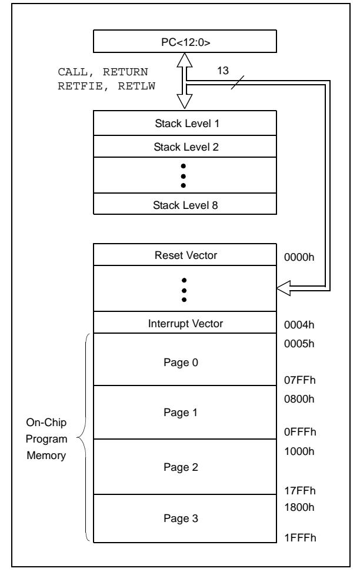

### <span id="page-16-2"></span>**2.1 Program Memory Organization**

The PIC16F87XA devices have a 13-bit program counter capable of addressing an 8K word x 14 bit program memory space. The PIC16F876A/877A devices have 8K words x 14 bits of Flash program memory, while PIC16F873A/874A devices have 4K words x 14 bits. Accessing a location above the physically implemented address will cause a wraparound.

<span id="page-16-6"></span><span id="page-16-3"></span>The Reset vector is at 0000h and the interrupt vector is at 0004h.

<span id="page-16-4"></span>**FIGURE 2-2: PIC16F873A/874A PROGRAM MEMORY MAP AND STACK** 


### <span id="page-17-1"></span>**2.2 Data Memory Organization**

The data memory is partitioned into multiple banks which contain the General Purpose Registers and the Special Function Registers. Bits RP1 (Status<6>) and RP0 (Status<5>) are the bank select bits.

| RP1:RP0 | Bank |
|---------|------|
| 00      | 0    |
| 01      | 1    |
| 10      | 2    |
| 11      | 3    |

<span id="page-17-0"></span>Each bank extends up to 7Fh (128 bytes). The lower locations of each bank are reserved for the Special Function Registers. Above the Special Function Registers are General Purpose Registers, implemented as static RAM. All implemented banks contain Special Function Registers. Some frequently used Special Function Registers from one bank may be mirrored in another bank for code reduction and quicker access.

| Note: | The EEPROM data memory description can |
|-------|----------------------------------------|
|       | be found in Section 3.0 "Data EEPROM   |
|       | and Flash Program Memory" of this data |
|       | sheet.                                 |

### <span id="page-17-2"></span>2.2.1 GENERAL PURPOSE REGISTER FILE

<span id="page-17-3"></span>The register file can be accessed either directly, or indirectly, through the File Select Register (FSR).

<span id="page-18-1"></span><span id="page-18-0"></span>**FIGURE 2-3: PIC16F876A/877A REGISTER FILE MAP** 

|                     | File<br>Address |                                | File<br>Address |                                | File<br>Address |                                | File<br>Address |
|---------------------|-----------------|--------------------------------|-----------------|--------------------------------|-----------------|--------------------------------|-----------------|
| Indirect addr.(*)   | 00h             | Indirect addr.(*)              | 80h             | Indirect addr.(*)              | 100h            | Indirect addr.(*)              | 180h            |
| TMR0                | 01h             | OPTION_REG                     | 81h             | TMR0                           | 101h            | OPTION_REG                     | 181h            |
| PCL                 | 02h             | PCL                            | 82h             | PCL                            | 102h            | PCL                            | 182h            |
| STATUS              | 03h             | STATUS                         | 83h             | STATUS                         | 103h            | STATUS                         | 183h            |
| FSR                 | 04h             | FSR                            | 84h             | FSR                            | 104h            | FSR                            | 184h            |
| PORTA               | 05h             | TRISA                          | 85h             |                                | 105h            |                                | 185h            |
| PORTB               | 06h             | TRISB                          | 86h             | PORTB                          | 106h            | TRISB                          | 186h            |
| PORTC               | 07h             | TRISC                          | 87h             |                                | 107h            |                                | 187h            |
| PORTD(1)            | 08h             | TRISD(1)                       | 88h             |                                | 108h            |                                | 188h            |
| PORTE(1)            | 09h             | TRISE(1)                       | 89h             |                                | 109h            |                                | 189h            |
| PCLATH              | 0Ah             | PCLATH                         | 8Ah             | PCLATH                         | 10Ah            | PCLATH                         | 18Ah            |
| INTCON              | 0Bh             | INTCON                         | 8Bh             | INTCON                         | 10Bh            | INTCON                         | 18Bh            |
| PIR1                | 0Ch             | PIE1                           | 8Ch             | EEDATA                         | 10Ch            | EECON1                         | 18Ch            |
| PIR2                | 0Dh             | PIE2                           | 8Dh             | EEADR                          | 10Dh            | EECON2                         | 18Dh            |
| TMR1L               | 0Eh             | PCON                           | 8Eh             | EEDATH                         | 10Eh            | Reserved(2)                    | 18Eh            |
| TMR1H               | 0Fh             |                                | 8Fh             | EEADRH                         | 10Fh            | Reserved(2)                    | 18Fh            |
| T1CON               | 10h             |                                | 90h             |                                | 110h            |                                | 190h            |
| TMR2                | 11h             | SSPCON2                        | 91h             |                                | 111h            |                                | 191h            |
| T2CON               | 12h             | PR2                            | 92h             |                                | 112h            |                                | 192h            |
| SSPBUF              | 13h             | SSPADD                         | 93h             |                                | 113h            |                                | 193h            |
| SSPCON              | 14h             | SSPSTAT                        | 94h             |                                | 114h            |                                | 194h            |
| CCPR1L              | 15h             |                                | 95h             |                                | 115h            |                                | 195h            |
| CCPR1H              | 16h             |                                | 96h             |                                | 116h            |                                | 196h            |
| CCP1CON             | 17h             |                                | 97h             | General                        | 117h            | General                        | 197h            |
| RCSTA               | 18h             | TXSTA                          | 98h             | Purpose<br>Register            | 118h            | Purpose<br>Register            | 198h            |
| TXREG               | 19h             | SPBRG                          | 99h             | 16 Bytes                       | 119h            | 16 Bytes                       | 199h            |
| RCREG               | 1Ah             |                                | 9Ah             |                                | 11Ah            |                                | 19Ah            |
| CCPR2L              | 1Bh             |                                | 9Bh             |                                | 11Bh            |                                | 19Bh            |
| CCPR2H              | 1Ch             | CMCON                          | 9Ch             |                                | 11Ch            |                                | 19Ch            |
| CCP2CON             | 1Dh             | CVRCON                         | 9Dh             |                                | 11Dh            |                                | 19Dh            |
| ADRESH              | 1Eh             | ADRESL                         | 9Eh             |                                | 11Eh            |                                | 19Eh            |
| ADCON0              | 1Fh             | ADCON1                         | 9Fh             |                                | 11Fh            |                                | 19Fh            |
|                     | 20h             |                                | A0h             |                                | 120h            |                                | 1A0h            |
| General             |                 | General<br>Purpose<br>Register |                 | General<br>Purpose<br>Register |                 | General<br>Purpose<br>Register |                 |
| Purpose<br>Register |                 | 80 Bytes                       |                 | 80 Bytes                       |                 | 80 Bytes                       |                 |
| 96 Bytes            |                 |                                | EFh             |                                | 16Fh            |                                | 1EFh            |
|                     |                 | accesses<br>70h-7Fh            | F0h             | accesses<br>70h-7Fh            | 170h            | accesses<br>70h - 7Fh          | 1F0h            |
| Bank 0              | 7Fh             | Bank 1                         | FFh             | Bank 2                         | 17Fh            | Bank 3                         | 1FFh            |

Unimplemented data memory locations, read as '0'.

<sup>\*</sup> Not a physical register.

**Note 1:** These registers are not implemented on the PIC16F876A.

**<sup>2:</sup>** These registers are reserved; maintain these registers clear.

<span id="page-19-0"></span>**FIGURE 2-4: PIC16F873A/874A REGISTER FILE MAP** 

|                    | File<br>Address |                    | File<br>Address |                     | File<br>Address |                       | File<br>Address |
|--------------------|-----------------|--------------------|-----------------|---------------------|-----------------|-----------------------|-----------------|
| Indirect addr.(*)  | 00h             | Indirect addr.(*)  | 80h             | Indirect addr.(*)   | 100h            | Indirect addr.(*)     | 180h            |
| TMR0               | 01h             | OPTION_REG         | 81h             | TMR0                | 101h            | OPTION_REG            | 181h            |
| PCL                | 02h             | PCL                | 82h             | PCL                 | 102h            | PCL                   | 182h            |
| STATUS             | 03h             | STATUS             | 83h             | STATUS              | 103h            | STATUS                | 183h            |
| FSR                | 04h             | FSR                | 84h             | FSR                 | 104h            | FSR                   | 184h            |
| PORTA              | 05h             | TRISA              | 85h             |                     | 105h            |                       | 185h            |
| PORTB              | 06h             | TRISB              | 86h             | PORTB               | 106h            | TRISB                 | 186h            |
| PORTC              | 07h             | TRISC              | 87h             |                     | 107h            |                       | 187h            |
| PORTD(1)           | 08h             | TRISD(1)           | 88h             |                     | 108h            |                       | 188h            |
| PORTE(1)           | 09h             | TRISE(1)           | 89h             |                     | 109h            |                       | 189h            |
| PCLATH             | 0Ah             | PCLATH             | 8Ah             | PCLATH              | 10Ah            | PCLATH                | 18Ah            |
| INTCON             | 0Bh             | INTCON             | 8Bh             | INTCON              | 10Bh            | INTCON                | 18Bh            |
| PIR1               | 0Ch             | PIE1               | 8Ch             | EEDATA              | 10Ch            | EECON1                | 18Ch            |
| PIR2               | 0Dh             | PIE2               | 8Dh             | EEADR               | 10Dh            | EECON2                | 18Dh            |
| TMR1L              | 0Eh             | PCON               | 8Eh             | EEDATH              | 10Eh            | Reserved(2)           | 18Eh            |
| TMR1H              | 0Fh             |                    | 8Fh             | EEADRH              | 10Fh            | Reserved(2)           | 18Fh            |
| T1CON              | 10h             |                    | 90h             |                     | 110h            |                       | 190h            |
| TMR2               | 11h             | SSPCON2            | 91h             |                     |                 |                       |                 |
| T2CON              | 12h             | PR2                | 92h             |                     |                 |                       |                 |
| SSPBUF             | 13h             | SSPADD             | 93h             |                     |                 |                       |                 |
| SSPCON             | 14h             | SSPSTAT            | 94h             |                     |                 |                       |                 |
| CCPR1L             | 15h             |                    | 95h             |                     |                 |                       |                 |
| CCPR1H             | 16h             |                    | 96h             |                     |                 |                       |                 |
| CCP1CON            | 17h             |                    | 97h             |                     |                 |                       |                 |
| RCSTA              | 18h             | TXSTA              | 98h             |                     |                 |                       |                 |
| TXREG              | 19h             | SPBRG              | 99h             |                     |                 |                       |                 |
| RCREG              | 1Ah             |                    | 9Ah             |                     |                 |                       |                 |
| CCPR2L             | 1Bh             |                    | 9Bh             |                     |                 |                       |                 |
| CCPR2H             | 1Ch             | CMCON              | 9Ch             |                     |                 |                       |                 |
| CCP2CON            | 1Dh             | CVRCON             | 9Dh             |                     |                 |                       |                 |
| ADRESH             | 1Eh             | ADRESL             | 9Eh             |                     |                 |                       |                 |
| ADCON0             | 1Fh             | ADCON1             | 9Fh             |                     |                 |                       |                 |
|                    | 20h             |                    | A0h             |                     | 120h            |                       | 1A0h            |
|                    |                 |                    |                 |                     |                 |                       |                 |
|                    |                 |                    |                 |                     |                 |                       |                 |
| General<br>Purpose |                 | General<br>Purpose |                 |                     |                 |                       |                 |
| Register           |                 | Register           |                 | accesses<br>20h-7Fh |                 | accesses<br>A0h - FFh |                 |
| 96 Bytes           |                 | 96 Bytes           |                 |                     | 16Fh            |                       | 1EFh            |
|                    |                 |                    |                 |                     | 170h            |                       | 1F0h            |
|                    | 7Fh             |                    | FFh             |                     | 17Fh            |                       | 1FFh            |
| Bank 0             |                 | Bank 1             |                 | Bank 2              |                 | Bank 3                |                 |

Unimplemented data memory locations, read as '0'.

<sup>\*</sup> Not a physical register.

**Note 1:** These registers are not implemented on the PIC16F873A.

**<sup>2:</sup>** These registers are reserved; maintain these registers clear.

### <span id="page-20-9"></span>2.2.2 SPECIAL FUNCTION REGISTERS

The Special Function Registers are registers used by the CPU and peripheral modules for controlling the desired operation of the device. These registers are implemented as static RAM. A list of these registers is given in [Table 2-1](#page-20-0).

The Special Function Registers can be classified into two sets: core (CPU) and peripheral. Those registers associated with the core functions are described in detail in this section. Those related to the operation of the peripheral features are described in detail in the peripheral features section.

<span id="page-20-23"></span><span id="page-20-0"></span>**TABLE 2-1: SPECIAL FUNCTION REGISTER SUMMARY**

<span id="page-20-30"></span><span id="page-20-29"></span><span id="page-20-28"></span><span id="page-20-20"></span><span id="page-20-19"></span><span id="page-20-18"></span><span id="page-20-17"></span><span id="page-20-16"></span><span id="page-20-15"></span><span id="page-20-14"></span><span id="page-20-13"></span><span id="page-20-12"></span><span id="page-20-11"></span><span id="page-20-10"></span>

| Address  | Name    | Bit 7                                | Bit 6                                                                       | Bit 5   | Bit 4                                                    | Bit 3     | Bit 2                                                                                                    | Bit 1  | Bit 0                     | Value on:<br>POR, BOR | Details<br>on page: |
|----------|---------|--------------------------------------|-----------------------------------------------------------------------------|---------|----------------------------------------------------------|-----------|----------------------------------------------------------------------------------------------------------|--------|---------------------------|-----------------------|---------------------|
| Bank 0   |         |                                      |                                                                             |         |                                                          |           |                                                                                                          |        |                           |                       |                     |
| 00h(3)   | INDF    |                                      |                                                                             |         |                                                          |           | Addressing this location uses contents of FSR to address data memory (not a physical register) 0000 0000 |        |                           |                       | 31, 150             |
| 01h      | TMR0    |                                      | Timer0 Module Register                                                      |         |                                                          |           |                                                                                                          |        |                           | xxxx xxxx             | 55, 150             |
| 02h(3)   | PCL     |                                      | Program Counter (PC) Least Significant Byte                                 |         |                                                          |           |                                                                                                          |        |                           | 0000 0000             | 30, 150             |
| 03h(3)   | STATUS  | IRP                                  | RP1                                                                         | RP0     | TO                                                       | PD        | Z                                                                                                        | DC     | C                         | 0001 1xxx             | 22, 150             |
| 04h(3)   | FSR     |                                      | Indirect Data Memory Address Pointer                                        |         |                                                          |           |                                                                                                          |        | xxxx xxxx                 | 31, 150               |                     |
| 05h      | PORTA   | —                                    | —<br>PORTA Data Latch when written: PORTA pins when read                    |         |                                                          |           |                                                                                                          |        |                           | 0x 0000               | 43, 150             |
| 06h      | PORTB   |                                      | PORTB Data Latch when written: PORTB pins when read                         |         |                                                          |           |                                                                                                          |        |                           | xxxx xxxx             | 45, 150             |
| 07h      | PORTC   |                                      | PORTC Data Latch when written: PORTC pins when read                         |         |                                                          |           |                                                                                                          |        |                           | xxxx xxxx             | 47, 150             |
| 08h(4)   | PORTD   |                                      |                                                                             |         | PORTD Data Latch when written: PORTD pins when read      |           |                                                                                                          |        |                           | xxxx xxxx             | 48, 150             |
| 09h(4)   | PORTE   | —                                    | —                                                                           | —       | —                                                        | —         | RE2                                                                                                      | RE1    | RE0                       | xxx                   | 49, 150             |
| 0Ah(1,3) | PCLATH  | —                                    | —                                                                           | —       |                                                          |           | Write Buffer for the upper 5 bits of the Program Counter                                                 |        |                           | 0 0000                | 30, 150             |
| 0Bh(3)   | INTCON  | GIE                                  | PEIE                                                                        | TMR0IE  | INTE                                                     | RBIE      | TMR0IF                                                                                                   | INTF   | RBIF                      | 0000 000x             | 24, 150             |
| 0Ch      | PIR1    | PSPIF(3)                             | ADIF                                                                        | RCIF    | TXIF                                                     | SSPIF     | CCP1IF                                                                                                   | TMR2IF | TMR1IF                    | 0000 0000             | 26, 150             |
| 0Dh      | PIR2    | —                                    | CMIF                                                                        | —       | EEIF                                                     | BCLIF     | —                                                                                                        | —      | CCP2IF                    | -0-0 00               | 28, 150             |
| 0Eh      | TMR1L   |                                      | Holding Register for the Least Significant Byte of the 16-bit TMR1 Register |         |                                                          |           |                                                                                                          |        | xxxx xxxx                 | 60, 150               |                     |
| 0Fh      | TMR1H   |                                      |                                                                             |         |                                                          |           | Holding Register for the Most Significant Byte of the 16-bit TMR1 Register                               |        |                           | xxxx xxxx             | 60, 150             |
| 10h      | T1CON   | —                                    | —                                                                           | T1CKPS1 | T1CKPS0                                                  | T1OSCEN   | T1SYNC                                                                                                   | TMR1CS | TMR1ON00 0000             |                       | 57, 150             |
| 11h      | TMR2    |                                      | Timer2 Module Register                                                      |         |                                                          |           |                                                                                                          |        |                           | 0000 0000             | 62, 150             |
| 12h      | T2CON   | —                                    |                                                                             |         | TOUTPS3 TOUTPS2 TOUTPS1                                  | TOUTPS0   | TMR2ON                                                                                                   |        | T2CKPS1 T2CKPS0 -000 0000 |                       | 61, 150             |
| 13h      | SSPBUF  |                                      |                                                                             |         | Synchronous Serial Port Receive Buffer/Transmit Register |           |                                                                                                          |        |                           | xxxx xxxx             | 79, 150             |
| 14h      | SSPCON  | WCOL                                 | SSPOV                                                                       | SSPEN   | CKP                                                      | SSPM3     | SSPM2                                                                                                    | SSPM1  | SSPM0                     | 0000 0000             | 82, 82,<br>150      |
| 15h      | CCPR1L  |                                      | Capture/Compare/PWM Register 1 (LSB)                                        |         |                                                          |           |                                                                                                          |        |                           | xxxx xxxx             | 63, 150             |
| 16h      | CCPR1H  |                                      | Capture/Compare/PWM Register 1 (MSB)                                        |         |                                                          |           |                                                                                                          |        |                           | xxxx xxxx             | 63, 150             |
| 17h      | CCP1CON | —                                    | —                                                                           | CCP1X   | CCP1Y                                                    | CCP1M3    | CCP1M2                                                                                                   | CCP1M1 | CCP1M000 0000             |                       | 64, 150             |
| 18h      | RCSTA   | SPEN                                 | RX9                                                                         | SREN    | CREN                                                     | ADDEN     | FERR                                                                                                     | OERR   | RX9D                      |                       | 0000 000x 112, 150  |
| 19h      | TXREG   |                                      | USART Transmit Data Register                                                |         |                                                          |           |                                                                                                          |        |                           |                       | 0000 0000 118, 150  |
| 1Ah      | RCREG   |                                      | USART Receive Data Register                                                 |         |                                                          |           |                                                                                                          |        |                           | 0000 0000 118, 150    |                     |
| 1Bh      | CCPR2L  | Capture/Compare/PWM Register 2 (LSB) |                                                                             |         |                                                          | xxxx xxxx | 63, 150                                                                                                  |        |                           |                       |                     |
| 1Ch      | CCPR2H  |                                      | Capture/Compare/PWM Register 2 (MSB)                                        |         |                                                          |           |                                                                                                          |        |                           | xxxx xxxx             | 63, 150             |
| 1Dh      | CCP2CON | —                                    | —                                                                           | CCP2X   | CCP2Y                                                    | CCP2M3    | CCP2M2                                                                                                   | CCP2M1 | CCP2M000 0000             |                       | 64, 150             |
| 1Eh      | ADRESH  |                                      | A/D Result Register High Byte                                               |         |                                                          |           |                                                                                                          |        |                           |                       | xxxx xxxx 133, 150  |
| 1Fh      | ADCON0  | ADCS1                                | ADCS0                                                                       | CHS2    | CHS1                                                     | CHS0      | GO/DONE                                                                                                  | —      | ADON                      |                       | 0000 00-0 127, 150  |

<span id="page-20-32"></span><span id="page-20-31"></span><span id="page-20-27"></span><span id="page-20-26"></span><span id="page-20-25"></span><span id="page-20-24"></span><span id="page-20-22"></span><span id="page-20-21"></span><span id="page-20-8"></span><span id="page-20-7"></span><span id="page-20-6"></span><span id="page-20-5"></span><span id="page-20-4"></span><span id="page-20-3"></span><span id="page-20-2"></span><span id="page-20-1"></span>**Legend:** x = unknown, u = unchanged, q = value depends on condition, - = unimplemented, read as '0', r = reserved. Shaded locations are unimplemented, read as '0'.

- **Note 1:** The upper byte of the program counter is not directly accessible. PCLATH is a holding register for the PC<12:8>, whose contents are transferred to the upper byte of the program counter.
  - **2:** Bits PSPIE and PSPIF are reserved on PIC16F873A/876A devices; always maintain these bits clear.
  - **3:** These registers can be addressed from any bank.
  - **4:** PORTD, PORTE, TRISD and TRISE are not implemented on PIC16F873A/876A devices, read as '0'.
  - **5:** Bit 4 of EEADRH implemented only on the PIC16F876A/877A devices.

**TABLE 2-1: SPECIAL FUNCTION REGISTER SUMMARY (CONTINUED)**

<span id="page-21-20"></span><span id="page-21-19"></span><span id="page-21-18"></span><span id="page-21-17"></span><span id="page-21-16"></span><span id="page-21-10"></span><span id="page-21-9"></span><span id="page-21-8"></span><span id="page-21-7"></span><span id="page-21-6"></span><span id="page-21-5"></span><span id="page-21-4"></span>

| Address  | Name                                                                              | Bit 7                                                           | Bit 6                         | Bit 5                                       | Bit 4                                               | Bit 3 | Bit 2     | Bit 1     | Bit 0   | Value on:<br>POR, BOR                                                                                    | Details<br>on page: |
|----------|-----------------------------------------------------------------------------------|-----------------------------------------------------------------|-------------------------------|---------------------------------------------|-----------------------------------------------------|-------|-----------|-----------|---------|----------------------------------------------------------------------------------------------------------|---------------------|
| Bank 1   |                                                                                   |                                                                 |                               |                                             |                                                     |       |           |           |         |                                                                                                          |                     |
| 80h(3)   | INDF                                                                              |                                                                 |                               |                                             |                                                     |       |           |           |         | Addressing this location uses contents of FSR to address data memory (not a physical register) 0000 0000 | 31, 150             |
| 81h      | OPTION_REG                                                                        | RBPU                                                            | INTEDG                        | T0CS                                        | T0SE                                                | PSA   | PS2       | PS1       | PS0     | 1111 1111                                                                                                | 23, 150             |
| 82h(3)   | PCL                                                                               |                                                                 |                               | Program Counter (PC) Least Significant Byte |                                                     |       |           |           |         | 0000 0000                                                                                                | 30, 150             |
| 83h(3)   | STATUS                                                                            | IRP<br>RP1<br>RP0<br>TO<br>PD<br>Z<br>DC<br>C                   |                               |                                             |                                                     |       | 0001 1xxx | 22, 150   |         |                                                                                                          |                     |
| 84h(3)   | FSR                                                                               |                                                                 |                               | Indirect Data Memory Address Pointer        |                                                     |       |           |           |         | xxxx xxxx                                                                                                | 31, 150             |
| 85h      | TRISA                                                                             | —                                                               | —                             |                                             | PORTA Data Direction Register                       |       |           |           |         | 11 1111                                                                                                  | 43, 150             |
| 86h      | TRISB                                                                             |                                                                 | PORTB Data Direction Register |                                             |                                                     |       |           |           |         | 1111 1111                                                                                                | 45, 150             |
| 87h      | TRISC                                                                             |                                                                 |                               | PORTC Data Direction Register               |                                                     |       |           |           |         | 1111 1111                                                                                                | 47, 150             |
| 88h(4)   | TRISD                                                                             |                                                                 | PORTD Data Direction Register |                                             |                                                     |       |           |           |         | 1111 1111                                                                                                | 48, 151             |
| 89h(4)   | TRISE                                                                             | IBF<br>OBF<br>IBOV<br>PSPMODE<br>—<br>PORTE Data Direction bits |                               |                                             |                                                     |       |           | 0000 -111 | 50, 151 |                                                                                                          |                     |
| 8Ah(1,3) | PCLATH<br>—<br>—<br>—<br>Write Buffer for the upper 5 bits of the Program Counter |                                                                 |                               |                                             |                                                     |       | 0 0000    | 30, 150   |         |                                                                                                          |                     |
| 8Bh(3)   | INTCON                                                                            | GIE                                                             | PEIE                          | TMR0IE                                      | INTE                                                | RBIE  | TMR0IF    | INTF      | RBIF    | 0000 000x                                                                                                | 24, 150             |
| 8Ch      | PIE1                                                                              | PSPIE(2)                                                        | ADIE                          | RCIE                                        | TXIE                                                | SSPIE | CCP1IE    | TMR2IE    | TMR1IE  | 0000 0000                                                                                                | 25, 151             |
| 8Dh      | PIE2                                                                              | —                                                               | CMIE                          | —                                           | EEIE                                                | BCLIE | —         | —         | CCP2IE  | -0-0 00                                                                                                  | 27, 151             |
| 8Eh      | PCON                                                                              | —                                                               | —                             | —                                           | —                                                   | —     | —         | POR       | BOR     | qq                                                                                                       | 29, 151             |
| 8Fh      | —                                                                                 | Unimplemented                                                   |                               |                                             |                                                     |       |           |           |         | —                                                                                                        | —                   |
| 90h      | —                                                                                 | Unimplemented                                                   |                               |                                             |                                                     |       |           |           |         | —                                                                                                        | —                   |
| 91h      | SSPCON2                                                                           | GCEN                                                            | ACKSTAT                       | ACKDT                                       | ACKEN                                               | RCEN  | PEN       | RSEN      | SEN     | 0000 0000                                                                                                | 83, 151             |
| 92h      | PR2                                                                               |                                                                 | Timer2 Period Register        |                                             |                                                     |       |           |           |         | 1111 1111                                                                                                | 62, 151             |
| 93h      | SSPADD                                                                            |                                                                 |                               |                                             | Synchronous Serial Port (I2C mode) Address Register |       |           |           |         | 0000 0000                                                                                                | 79, 151             |
| 94h      | SSPSTAT                                                                           | SMP                                                             | CKE                           | D/A                                         | P                                                   | S     | R/W       | UA        | BF      | 0000 0000                                                                                                | 79, 151             |
| 95h      | —                                                                                 | Unimplemented                                                   |                               |                                             |                                                     |       |           |           |         | —                                                                                                        | —                   |
| 96h      | —                                                                                 | Unimplemented                                                   |                               |                                             |                                                     |       |           |           |         | —                                                                                                        | —                   |
| 97h      | —                                                                                 | Unimplemented                                                   |                               |                                             |                                                     |       |           |           |         | —                                                                                                        | —                   |
| 98h      | TXSTA                                                                             | CSRC                                                            | TX9                           | TXEN                                        | SYNC                                                | —     | BRGH      | TRMT      | TX9D    | 0000 -010 111, 151                                                                                       |                     |
| 99h      | SPBRG                                                                             |                                                                 | Baud Rate Generator Register  |                                             |                                                     |       |           |           |         | 0000 0000 113, 151                                                                                       |                     |
| 9Ah      | —                                                                                 |                                                                 | Unimplemented                 |                                             |                                                     |       |           |           |         | —                                                                                                        | —                   |
| 9Bh      | —                                                                                 | Unimplemented                                                   |                               |                                             |                                                     |       |           | —         | —       |                                                                                                          |                     |
| 9Ch      | CMCON                                                                             | C2OUT                                                           | C1OUT                         | C2INV                                       | C1INV                                               | CIS   | CM2       | CM1       | CM0     | 0000 0111 135, 151                                                                                       |                     |
| 9Dh      | CVRCON                                                                            | CVREN                                                           | CVROE                         | CVRR                                        | —                                                   | CVR3  | CVR2      | CVR1      | CVR0    | 000- 0000 141, 151                                                                                       |                     |
| 9Eh      | ADRESL<br>A/D Result Register Low Byte                                            |                                                                 |                               |                                             | xxxx xxxx 133, 151                                  |       |           |           |         |                                                                                                          |                     |
| 9Fh      | ADCON1                                                                            | ADFM                                                            | ADCS2                         | —                                           | —                                                   | PCFG3 | PCFG2     | PCFG1     | PCFG0   | 00 0000 128, 151                                                                                         |                     |
|          |                                                                                   |                                                                 |                               |                                             |                                                     |       |           |           |         |                                                                                                          |                     |

<span id="page-21-21"></span><span id="page-21-15"></span><span id="page-21-14"></span><span id="page-21-13"></span><span id="page-21-12"></span><span id="page-21-11"></span><span id="page-21-3"></span><span id="page-21-2"></span><span id="page-21-1"></span><span id="page-21-0"></span>**Legend:** x = unknown, u = unchanged, q = value depends on condition, - = unimplemented, read as '0', r = reserved. Shaded locations are unimplemented, read as '0'.

- **Note 1:** The upper byte of the program counter is not directly accessible. PCLATH is a holding register for the PC<12:8>, whose contents are transferred to the upper byte of the program counter.
  - **2:** Bits PSPIE and PSPIF are reserved on PIC16F873A/876A devices; always maintain these bits clear.
  - **3:** These registers can be addressed from any bank.
  - **4:** PORTD, PORTE, TRISD and TRISE are not implemented on PIC16F873A/876A devices, read as '0'.
  - **5:** Bit 4 of EEADRH implemented only on the PIC16F876A/877A devices.

**TABLE 2-1: SPECIAL FUNCTION REGISTER SUMMARY (CONTINUED)**

<span id="page-22-8"></span><span id="page-22-7"></span><span id="page-22-5"></span><span id="page-22-4"></span><span id="page-22-1"></span><span id="page-22-0"></span>

| Address | Name             | Bit 7                                                                   | Bit 6                                                              | Bit 5  | Bit 4                                               | Bit 3 | Bit 2                             | Bit 1 | Bit 0  | Value on:<br>POR, BOR                                                                                    | Details<br>on page: |
|---------|------------------|-------------------------------------------------------------------------|--------------------------------------------------------------------|--------|-----------------------------------------------------|-------|-----------------------------------|-------|--------|----------------------------------------------------------------------------------------------------------|---------------------|
| Bank 2  |                  |                                                                         |                                                                    |        |                                                     |       |                                   |       |        |                                                                                                          |                     |
| 100h(3) | INDF             |                                                                         |                                                                    |        |                                                     |       |                                   |       |        | Addressing this location uses contents of FSR to address data memory (not a physical register) 0000 0000 | 31, 150             |
| 101h    | TMR0             |                                                                         | Timer0 Module Register                                             |        |                                                     |       |                                   |       |        | xxxx xxxx                                                                                                | 55, 150             |
| 102h(3) | PCL              |                                                                         |                                                                    |        | Program Counter's (PC) Least Significant Byte       |       |                                   |       |        | 0000 0000                                                                                                | 30, 150             |
| 103h(3) | STATUS           | IRP                                                                     | RP1                                                                | RP0    | TO                                                  | PD    | Z                                 | DC    | C      | 0001 1xxx                                                                                                | 22, 150             |
| 104h(3) | FSR              |                                                                         | Indirect Data Memory Address Pointer                               |        |                                                     |       |                                   |       |        | xxxx xxxx                                                                                                | 31, 150             |
| 105h    | —                | Unimplemented                                                           |                                                                    |        |                                                     |       |                                   |       |        | —                                                                                                        | —                   |
| 106h    | PORTB            |                                                                         |                                                                    |        | PORTB Data Latch when written: PORTB pins when read |       |                                   |       |        | xxxx xxxx                                                                                                | 45, 150             |
| 107h    | —                | Unimplemented                                                           |                                                                    |        |                                                     |       |                                   |       |        | —                                                                                                        | —                   |
| 108h    | —                | Unimplemented                                                           |                                                                    |        |                                                     |       |                                   |       |        | —                                                                                                        | —                   |
| 109h    | —                | Unimplemented                                                           |                                                                    |        |                                                     |       |                                   |       |        | —                                                                                                        | —                   |
|         | 10Ah(1,3) PCLATH | —                                                                       | —<br>—<br>Write Buffer for the upper 5 bits of the Program Counter |        |                                                     |       |                                   |       |        |                                                                                                          | 30, 150             |
| 10Bh(3) | INTCON           | GIE                                                                     | PEIE<br>TMR0IE<br>INTE<br>RBIE<br>TMR0IF<br>INTF<br>RBIF           |        |                                                     |       |                                   |       |        |                                                                                                          | 24, 150             |
| 10Ch    | EEDATA           |                                                                         | EEPROM Data Register Low Byte                                      |        |                                                     |       |                                   |       |        | xxxx xxxx                                                                                                | 39, 151             |
| 10Dh    | EEADR            |                                                                         | EEPROM Address Register Low Byte                                   |        |                                                     |       |                                   |       |        |                                                                                                          | 39, 151             |
| 10Eh    | EEDATH           | —                                                                       | —                                                                  |        | EEPROM Data Register High Byte                      |       |                                   |       |        | xx xxxx                                                                                                  | 39, 151             |
| 10Fh    | EEADRH           | —                                                                       | —                                                                  | —      | —(5)                                                |       | EEPROM Address Register High Byte |       |        | xxxx                                                                                                     | 39, 151             |
| Bank 3  |                  |                                                                         |                                                                    |        |                                                     |       |                                   |       |        |                                                                                                          |                     |
| 180h(3) | INDF             |                                                                         |                                                                    |        |                                                     |       |                                   |       |        | Addressing this location uses contents of FSR to address data memory (not a physical register) 0000 0000 | 31, 150             |
| 181h    | OPTION_REG       | RBPU                                                                    | INTEDG                                                             | T0CS   | T0SE                                                | PSA   | PS2                               | PS1   | PS0    | 1111 1111                                                                                                | 23, 150             |
| 182h(3) | PCL              |                                                                         | Program Counter (PC) Least Significant Byte                        |        |                                                     |       |                                   |       |        | 0000 0000                                                                                                | 30, 150             |
| 183h(3) | STATUS           | IRP                                                                     | RP1                                                                | RP0    | TO                                                  | PD    | Z                                 | DC    | C      | 0001 1xxx                                                                                                | 22, 150             |
| 184h(3) | FSR              |                                                                         | Indirect Data Memory Address Pointer                               |        |                                                     |       |                                   |       |        | xxxx xxxx                                                                                                | 31, 150             |
| 185h    | —                | Unimplemented                                                           |                                                                    |        |                                                     |       |                                   |       |        | —                                                                                                        | —                   |
| 186h    | TRISB            |                                                                         | PORTB Data Direction Register                                      |        |                                                     |       |                                   |       |        | 1111 1111                                                                                                | 45, 150             |
| 187h    | —                | Unimplemented                                                           |                                                                    |        |                                                     |       |                                   |       |        | —                                                                                                        | —                   |
| 188h    | —                | Unimplemented                                                           |                                                                    |        |                                                     |       |                                   |       |        | —                                                                                                        | —                   |
| 189h    | —                | Unimplemented                                                           |                                                                    |        |                                                     |       |                                   |       |        | —                                                                                                        | —                   |
|         | 18Ah(1,3) PCLATH | —<br>—<br>—<br>Write Buffer for the upper 5 bits of the Program Counter |                                                                    |        |                                                     |       |                                   |       |        | 0 0000                                                                                                   | 30, 150             |
| 18Bh(3) | INTCON           | GIE                                                                     | PEIE                                                               | TMR0IE | INTE                                                | RBIE  | TMR0IF                            | INTF  | RBIF   | 0000 000x                                                                                                | 24, 150             |
| 18Ch    | EECON1           | EEPGD<br>—<br>—<br>—<br>WRERR<br>WREN<br>WR<br>RD                       |                                                                    |        |                                                     |       |                                   |       | x x000 | 34, 151                                                                                                  |                     |
| 18Dh    | EECON2           | EEPROM Control Register 2 (not a physical register)                     |                                                                    |        |                                                     |       |                                   |       |        | 39, 151                                                                                                  |                     |
| 18Eh    | —                |                                                                         | Reserved; maintain clear                                           |        |                                                     |       |                                   |       |        | 0000 0000                                                                                                | —                   |
| 18Fh    | —                |                                                                         | Reserved; maintain clear                                           |        |                                                     |       |                                   |       |        | 0000 0000                                                                                                | —                   |

<span id="page-22-6"></span><span id="page-22-3"></span><span id="page-22-2"></span>**Legend:** x = unknown, u = unchanged, q = value depends on condition, - = unimplemented, read as '0', r = reserved. Shaded locations are unimplemented, read as '0'.

**Note 1:** The upper byte of the program counter is not directly accessible. PCLATH is a holding register for the PC<12:8>, whose contents are transferred to the upper byte of the program counter.

- **2:** Bits PSPIE and PSPIF are reserved on PIC16F873A/876A devices; always maintain these bits clear.
- **3:** These registers can be addressed from any bank.
- **4:** PORTD, PORTE, TRISD and TRISE are not implemented on PIC16F873A/876A devices, read as '0'.
- **5:** Bit 4 of EEADRH implemented only on the PIC16F876A/877A devices.

### 2.2.2.1 Status Register

The Status register contains the arithmetic status of the ALU, the Reset status and the bank select bits for data memory.

The Status register can be the destination for any instruction, as with any other register. If the Status register is the destination for an instruction that affects the Z, DC or C bits, then the write to these three bits is disabled. These bits are set or cleared according to the device logic. Furthermore, the TO and PD bits are not writable, therefore, the result of an instruction with the Status register as destination may be different than intended.

For example, CLRF STATUS, will clear the upper three bits and set the Z bit. This leaves the Status register as 000u u1uu (where u = unchanged).

It is recommended, therefore, that only BCF, BSF, SWAPF and MOVWF instructions are used to alter the Status register because these instructions do not affect the Z, C or DC bits from the Status register. For other instructions not affecting any status bits, see **[Section 15.0 "Instruction Set Summary"](#page-160-1)**.

**Note:** The C and DC bits operate as a borrow and digit borrow bit, respectively, in subtraction. See the SUBLW and SUBWF instructions for examples.

### <span id="page-23-0"></span>**REGISTER 2-1: STATUS REGISTER (ADDRESS 03h, 83h, 103h, 183h)**

<span id="page-23-4"></span>

| R/W-0 | R/W-0 | R/W-0 | R-1 | R-1 | R/W-x | R/W-x | R/W-x |  |
|-------|-------|-------|-----|-----|-------|-------|-------|--|
| IRP   | RP1   | RP0   | TO  | PD  | Z     | DC    | C     |  |
| bit 7 |       |       |     |     |       |       | bit 0 |  |

bit 7 **IRP:** Register Bank Select bit (used for indirect addressing)

<span id="page-23-7"></span>1 = Bank 2, 3 (100h-1FFh)

<span id="page-23-1"></span>0 = Bank 0, 1 (00h-FFh)

bit 6-5 **RP1:RP0**: Register Bank Select bits (used for direct addressing)

11 = Bank 3 (180h-1FFh)

10 = Bank 2 (100h-17Fh)

01 = Bank 1 (80h-FFh)

00 = Bank 0 (00h-7Fh)

<span id="page-23-3"></span>Each bank is 128 bytes.

bit 4 **TO**: Time-out bit

1 = After power-up, CLRWDT instruction or SLEEP instruction

<span id="page-23-2"></span>0 = A WDT time-out occurred

bit 3 **PD**: Power-down bit

1 = After power-up or by the CLRWDT instruction

<span id="page-23-8"></span>0 = By execution of the SLEEP instruction

bit 2 **Z**: Zero bit

1 = The result of an arithmetic or logic operation is zero

<span id="page-23-6"></span>0 = The result of an arithmetic or logic operation is not zero

bit 1 **DC**: Digit carry/borrow bit (ADDWF, ADDLW,SUBLW,SUBWF instructions)

(for borrow, the polarity is reversed)

1 = A carry-out from the 4th low order bit of the result occurred

<span id="page-23-5"></span>0 = No carry-out from the 4th low order bit of the result

bit 0 **C**: Carry/borrow bit (ADDWF, ADDLW,SUBLW,SUBWF instructions)

1 = A carry-out from the Most Significant bit of the result occurred

0 = No carry-out from the Most Significant bit of the result occurred

**Note:** For borrow, the polarity is reversed. A subtraction is executed by adding the two's complement of the second operand. For rotate (RRF, RLF) instructions, this bit is loaded with either the high, or low order bit of the source register.

| Legend:            |                  |                                    |                    |
|--------------------|------------------|------------------------------------|--------------------|
| R = Readable bit   | W = Writable bit | U = Unimplemented bit, read as '0' |                    |
| - n = Value at POR | '1' = Bit is set | '0' = Bit is cleared               | x = Bit is unknown |

### <span id="page-24-1"></span>2.2.2.2 OPTION\_REG Register

The OPTION\_REG Register is a readable and writable register, which contains various control bits to configure the TMR0 prescaler/WDT postscaler (single assignable register known also as the prescaler), the external INT interrupt, TMR0 and the weak pull-ups on PORTB. **Note:** To achieve a 1:1 prescaler assignment for the TMR0 register, assign the prescaler to the Watchdog Timer.

### <span id="page-24-0"></span>**REGISTER 2-2: OPTION\_REG REGISTER (ADDRESS 81h, 181h)**

<span id="page-24-8"></span>

| R/W-1 | R/W-1  | R/W-1 | R/W-1 | R/W-1 | R/W-1 | R/W-1 | R/W-1 |
|-------|--------|-------|-------|-------|-------|-------|-------|
| RBPU  | INTEDG | T0CS  | T0SE  | PSA   | PS2   | PS1   | PS0   |
| bit 7 |        |       |       |       |       |       | bit 0 |

bit 7 **RBPU:** PORTB Pull-up Enable bit

<span id="page-24-5"></span>1 = PORTB pull-ups are disabled

<span id="page-24-2"></span>0 = PORTB pull-ups are enabled by individual port latch values

bit 6 **INTEDG**: Interrupt Edge Select bit

<span id="page-24-6"></span>1 = Interrupt on rising edge of RB0/INT pin 0 = Interrupt on falling edge of RB0/INT pin

bit 5 **T0CS**: TMR0 Clock Source Select bit

1 = Transition on RA4/T0CKI pin

<span id="page-24-7"></span>0 = Internal instruction cycle clock (CLKO)

bit 4 **T0SE**: TMR0 Source Edge Select bit

1 = Increment on high-to-low transition on RA4/T0CKI pin

<span id="page-24-4"></span>0 = Increment on low-to-high transition on RA4/T0CKI pin

bit 3 **PSA**: Prescaler Assignment bit

1 = Prescaler is assigned to the WDT

<span id="page-24-3"></span>0 = Prescaler is assigned to the Timer0 module

bit 2-0 **PS2:PS0**: Prescaler Rate Select bits

### Bit Value TMR0 Rate WDT Rate

| 000 | 1 : 2   | 1 : 1   |
|-----|---------|---------|
| 001 | 1 : 4   | 1 : 2   |
| 010 | 1 : 8   | 1 : 4   |
| 011 | 1 : 16  | 1 : 8   |
| 100 | 1 : 32  | 1 : 16  |
| 101 | 1 : 64  | 1 : 32  |
| 110 | 1 : 128 | 1 : 64  |
| 111 | 1 : 256 | 1 : 128 |
|     |         |         |

#### **Legend:**

R = Readable bit W = Writable bit U = Unimplemented bit, read as '0' - n = Value at POR '1' = Bit is set '0' = Bit is cleared x = Bit is unknown

**Note:** When using Low-Voltage ICSP Programming (LVP) and the pull-ups on PORTB are enabled, bit 3 in the TRISB register must be cleared to disable the pull-up on RB3 and ensure the proper operation of the device

### <span id="page-25-1"></span>2.2.2.3 INTCON Register

The INTCON register is a readable and writable register, which contains various enable and flag bits for the TMR0 register overflow, RB port change and external RB0/INT pin interrupts.

**Note:** Interrupt flag bits are set when an interrupt condition occurs regardless of the state of its corresponding enable bit or the global enable bit, GIE (INTCON<7>). User software should ensure the appropriate interrupt flag bits are clear prior to enabling an interrupt.

### <span id="page-25-0"></span>**REGISTER 2-3: INTCON REGISTER (ADDRESS 0Bh, 8Bh, 10Bh, 18Bh)**

<span id="page-25-10"></span>

| R/W-0 | R/W-0 | R/W-0  | R/W-0 | R/W-0 | R/W-0  | R/W-0 | R/W-x |
|-------|-------|--------|-------|-------|--------|-------|-------|
| GIE   | PEIE  | TMR0IE | INTE  | RBIE  | TMR0IF | INTF  | RBIF  |
| bit 7 |       |        |       |       |        |       | bit 0 |

bit 7 **GIE:** Global Interrupt Enable bit

<span id="page-25-2"></span>1 = Enables all unmasked interrupts

<span id="page-25-5"></span>0 = Disables all interrupts

bit 6 **PEIE**: Peripheral Interrupt Enable bit

1 = Enables all unmasked peripheral interrupts

<span id="page-25-8"></span>0 = Disables all peripheral interrupts

bit 5 **TMR0IE**: TMR0 Overflow Interrupt Enable bit

1 = Enables the TMR0 interrupt

<span id="page-25-3"></span>0 = Disables the TMR0 interrupt

bit 4 **INTE**: RB0/INT External Interrupt Enable bit

1 = Enables the RB0/INT external interrupt

<span id="page-25-6"></span>0 = Disables the RB0/INT external interrupt

bit 3 **RBIE**: RB Port Change Interrupt Enable bit

1 = Enables the RB port change interrupt

<span id="page-25-9"></span>0 = Disables the RB port change interrupt

bit 2 **TMR0IF**: TMR0 Overflow Interrupt Flag bit

1 = TMR0 register has overflowed (must be cleared in software)

<span id="page-25-4"></span>0 = TMR0 register did not overflow

bit 1 **INTF**: RB0/INT External Interrupt Flag bit

1 = The RB0/INT external interrupt occurred (must be cleared in software)

<span id="page-25-7"></span>0 = The RB0/INT external interrupt did not occur

bit 0 **RBIF**: RB Port Change Interrupt Flag bit

1 = At least one of the RB7:RB4 pins changed state; a mismatch condition will continue to set the bit. Reading PORTB will end the mismatch condition and allow the bit to be cleared (must be cleared in software).

0 = None of the RB7:RB4 pins have changed state

| Legend: |  |
|---------|--|
|         |  |

R = Readable bit W = Writable bit U = Unimplemented bit, read as '0' - n = Value at POR '1' = Bit is set '0' = Bit is cleared x = Bit is unknown

### <span id="page-26-1"></span>2.2.2.4 PIE1 Register

The PIE1 register contains the individual enable bits for the peripheral interrupts.

**Note:** Bit PEIE (INTCON<6>) must be set to enable any peripheral interrupt.

### <span id="page-26-0"></span>**REGISTER 2-4: PIE1 REGISTER (ADDRESS 8Ch)**

<span id="page-26-2"></span>

| R/W-0    | R/W-0 | R/W-0 | R/W-0 | R/W-0 | R/W-0  | R/W-0  | R/W-0  |
|----------|-------|-------|-------|-------|--------|--------|--------|
| PSPIE(1) | ADIE  | RCIE  | TXIE  | SSPIE | CCP1IE | TMR2IE | TMR1IE |
|          |       |       |       |       |        |        |        |

bit 7 bit 0

bit 7 **PSPIE:** Parallel Slave Port Read/Write Interrupt Enable bit**(1)**

1 = Enables the PSP read/write interrupt

0 = Disables the PSP read/write interrupt

**Note 1:** PSPIE is reserved on PIC16F873A/876A devices; always maintain this bit clear.

bit 6 **ADIE**: A/D Converter Interrupt Enable bit

1 = Enables the A/D converter interrupt

0 = Disables the A/D converter interrupt

bit 5 **RCIE**: USART Receive Interrupt Enable bit

1 = Enables the USART receive interrupt

0 = Disables the USART receive interrupt

bit 4 **TXIE**: USART Transmit Interrupt Enable bit

1 = Enables the USART transmit interrupt

0 = Disables the USART transmit interrupt

bit 3 **SSPIE**: Synchronous Serial Port Interrupt Enable bit

1 = Enables the SSP interrupt

0 = Disables the SSP interrupt

bit 2 **CCP1IE**: CCP1 Interrupt Enable bit

1 = Enables the CCP1 interrupt

0 = Disables the CCP1 interrupt

bit 1 **TMR2IE**: TMR2 to PR2 Match Interrupt Enable bit

1 = Enables the TMR2 to PR2 match interrupt

0 = Disables the TMR2 to PR2 match interrupt

bit 0 **TMR1IE**: TMR1 Overflow Interrupt Enable bit

1 = Enables the TMR1 overflow interrupt

0 = Disables the TMR1 overflow interrupt

### **Legend:**

R = Readable bit W = Writable bit U = Unimplemented bit, read as '0' - n = Value at POR '1' = Bit is set '0' = Bit is cleared x = Bit is unknown

#### <span id="page-27-2"></span>2.2.2.5 PIR1 Register

The PIR1 register contains the individual flag bits for the peripheral interrupts. Interrupt flag bits are set when an interrupt condition occurs regardless of the state of its corresponding enable bit or the global enable bit, GIE (INTCON<7>). User software should ensure the appropriate interrupt bits are clear prior to enabling an interrupt.

### <span id="page-27-0"></span>REGISTER 2-5: PIR1 REGISTER (ADDRESS 0Ch)

<span id="page-27-3"></span>

| R/W-0                | R/W-0 | R-0  | R-0  | R/W-0 | R/W-0  | R/W-0  | R/W-0  |
|----------------------|-------|------|------|-------|--------|--------|--------|
| PSPIF <sup>(1)</sup> | ADIF  | RCIF | TXIF | SSPIF | CCP1IF | TMR2IF | TMR1IF |
| bit 7                |       |      |      |       |        |        | bit 0  |

Note:

- bit 7 **PSPIF:** Parallel Slave Port Read/Write Interrupt Flag bit<sup>(1)</sup>
  - 1 = A read or a write operation has taken place (must be cleared in software)
  - 0 = No read or write has occurred
    - Note 1: PSPIF is reserved on PIC16F873A/876A devices; always maintain this bit clear.
- bit 6 ADIF: A/D Converter Interrupt Flag bit
  - 1 = An A/D conversion completed
  - 0 = The A/D conversion is not complete
- bit 5 RCIF: USART Receive Interrupt Flag bit
  - 1 = The USART receive buffer is full
  - 0 = The USART receive buffer is empty
- bit 4 TXIF: USART Transmit Interrupt Flag bit
  - 1 = The USART transmit buffer is empty
  - 0 = The USART transmit buffer is full
- <span id="page-27-1"></span>bit 3 SSPIF: Synchronous Serial Port (SSP) Interrupt Flag bit
  - 1 = The SSP interrupt condition has occurred and must be cleared in software before returning from the Interrupt Service Routine. The conditions that will set this bit are:
    - SPI A transmission/reception has taken place.
    - I<sup>2</sup>C Slave A transmission/reception has taken place.
    - I<sup>2</sup>C Master
      - A transmission/reception has taken place.
      - The initiated Start condition was completed by the SSP module.
      - The initiated Stop condition was completed by the SSP module.
      - The initiated Restart condition was completed by the SSP module.
      - The initiated Acknowledge condition was completed by the SSP module.
      - A Start condition occurred while the SSP module was Idle (multi-master system).
    - A Stop condition occurred while the SSP module was Idle (multi-master system).
  - 0 = No SSP interrupt condition has occurred
- bit 2 **CCP1IF**: CCP1 Interrupt Flag bit

#### Capture mode:

- 1 = A TMR1 register capture occurred (must be cleared in software)
- 0 = No TMR1 register capture occurred

#### Compare mode:

- 1 = A TMR1 register compare match occurred (must be cleared in software)
- 0 = No TMR1 register compare match occurred

### PWM mode:

Unused in this mode.

- bit 1 TMR2IF: TMR2 to PR2 Match Interrupt Flag bit
  - 1 = TMR2 to PR2 match occurred (must be cleared in software)
  - 0 = No TMR2 to PR2 match occurred
- bit 0 TMR1IF: TMR1 Overflow Interrupt Flag bit
  - 1 = TMR1 register overflowed (must be cleared in software)
  - 0 = TMR1 register did not overflow

| Legend:            |                  |                      |                    |
|--------------------|------------------|----------------------|--------------------|
| R = Readable bit   | W = Writable bit | U = Unimplemented    | bit, read as '0'   |
| - n = Value at POR | '1' = Bit is set | '0' = Bit is cleared | x = Bit is unknown |

### <span id="page-28-1"></span>2.2.2.6 PIE2 Register

The PIE2 register contains the individual enable bits for the CCP2 peripheral interrupt, the SSP bus collision interrupt, EEPROM write operation interrupt and the comparator interrupt.

**Note:** Bit PEIE (INTCON<6>) must be set to enable any peripheral interrupt.

### <span id="page-28-0"></span>**REGISTER 2-6: PIE2 REGISTER (ADDRESS 8Dh)**

<span id="page-28-2"></span>

| —   | CMIE  | —   | EEIE  | BCLIE | —   | —   | CCP2IE |
|-----|-------|-----|-------|-------|-----|-----|--------|
| U-0 | R/W-0 | U-0 | R/W-0 | R/W-0 | U-0 | U-0 | R/W-0  |

bit 7 bit 0

bit 7 **Unimplemented:** Read as '0'

bit 6 **CMIE**: Comparator Interrupt Enable bit

1 = Enables the comparator interrupt

0 = Disable the comparator interrupt

bit 5 **Unimplemented:** Read as '0'

bit 4 **EEIE**: EEPROM Write Operation Interrupt Enable bit

1 = Enable EEPROM write interrupt 0 = Disable EEPROM write interrupt

bit 3 **BCLIE**: Bus Collision Interrupt Enable bit

1 = Enable bus collision interrupt

0 = Disable bus collision interrupt

bit 2-1 **Unimplemented:** Read as '0'

bit 0 **CCP2IE**: CCP2 Interrupt Enable bit

1 = Enables the CCP2 interrupt

0 = Disables the CCP2 interrupt

### **Legend:**

R = Readable bit W = Writable bit U = Unimplemented bit, read as '0' - n = Value at POR '1' = Bit is set '0' = Bit is cleared x = Bit is unknown

### <span id="page-29-2"></span>2.2.2.7 PIR2 Register

The PIR2 register contains the flag bits for the CCP2 interrupt, the SSP bus collision interrupt, EEPROM write operation interrupt and the comparator interrupt.

**Note:** Interrupt flag bits are set when an interrupt condition occurs regardless of the state of its corresponding enable bit or the global enable bit, GIE (INTCON<7>). User software should ensure the appropriate interrupt flag bits are clear prior to enabling an interrupt.

### <span id="page-29-0"></span>**REGISTER 2-7: PIR2 REGISTER (ADDRESS 0Dh)**

<span id="page-29-3"></span>

| U-0   | R/W-0 | U-0 | R/W-0 | R/W-0 | U-0 | U-0 | R/W-0  |
|-------|-------|-----|-------|-------|-----|-----|--------|
| —     | CMIF  | —   | EEIF  | BCLIF | —   | —   | CCP2IF |
| bit 7 |       |     |       |       |     |     | bit 0  |

| bit 7 | Unimplemented: Read as '0' |  |
|-------|----------------------------|--|
|-------|----------------------------|--|

bit 6 **CMIF**: Comparator Interrupt Flag bit

1 = The comparator input has changed (must be cleared in software)

0 = The comparator input has not changed

bit 5 **Unimplemented:** Read as '0'

bit 4 **EEIF**: EEPROM Write Operation Interrupt Flag bit

1 = The write operation completed (must be cleared in software)

<span id="page-29-1"></span>0 = The write operation is not complete or has not been started

bit 3 **BCLIF**: Bus Collision Interrupt Flag bit

1 = A bus collision has occurred in the SSP when configured for I2C Master mode

0 = No bus collision has occurred

bit 2-1 **Unimplemented:** Read as '0'

bit 0 **CCP2IF**: CCP2 Interrupt Flag bit

#### Capture mode:

1 = A TMR1 register capture occurred (must be cleared in software)

0 = No TMR1 register capture occurred

### Compare mode:

1 = A TMR1 register compare match occurred (must be cleared in software)

0 = No TMR1 register compare match occurred

#### PWM mode:

Unused.

| Legend: |
|---------|
|---------|

R = Readable bit W = Writable bit U = Unimplemented bit, read as '0' - n = Value at POR '1' = Bit is set '0' = Bit is cleared x = Bit is unknown

### <span id="page-30-2"></span>2.2.2.8 PCON Register

The Power Control (PCON) register contains flag bits to allow differentiation between a Power-on Reset (POR), a Brown-out Reset (BOR), a Watchdog Reset (WDT) and an external MCLR Reset.

**Note:** BOR is unknown on Power-on Reset. It must be set by the user and checked on subsequent Resets to see if BOR is clear, indicating a brown-out has occurred. The BOR status bit is a "don't care" and is not predictable if the brown-out circuit is disabled (by clearing the BODEN bit in the configuration word).

### <span id="page-30-0"></span>**REGISTER 2-8: PCON REGISTER (ADDRESS 8Eh)**

<span id="page-30-4"></span>

| U-0   | U-0 | U-0 | U-0 | U-0 | U-0 | R/W-0 | R/W-1 |
|-------|-----|-----|-----|-----|-----|-------|-------|
| —     | —   | —   | —   | —   | —   | POR   | BOR   |
| bit 7 |     |     |     |     |     |       | bit 0 |

bit 7-2 **Unimplemented:** Read as '0'

bit 1 **POR**: Power-on Reset Status bit

<span id="page-30-3"></span>1 = No Power-on Reset occurred

<span id="page-30-1"></span>0 = A Power-on Reset occurred (must be set in software after a Power-on Reset occurs)

bit 0 **BOR**: Brown-out Reset Status bit

1 = No Brown-out Reset occurred

0 = A Brown-out Reset occurred (must be set in software after a Brown-out Reset occurs)

**Legend:**

R = Readable bit W = Writable bit U = Unimplemented bit, read as '0'

- n = Value at POR '1' = Bit is set '0' = Bit is cleared x = Bit is unknown

### <span id="page-31-9"></span><span id="page-31-8"></span><span id="page-31-0"></span>**2.3 PCL and PCLATH**

The Program Counter (PC) is 13 bits wide. The low byte comes from the PCL register which is a readable and writable register. The upper bits (PC<12:8>) are not readable, but are indirectly writable through the PCLATH register. On any Reset, the upper bits of the PC will be cleared. [Figure 2-5](#page-31-1) shows the two situations for the loading of the PC. The upper example in the figure shows how the PC is loaded on a write to PCL (PCLATH<4:0> → PCH). The lower example in the figure shows how the PC is loaded during a CALL or GOTO instruction (PCLATH<4:3> → PCH).

<span id="page-31-6"></span><span id="page-31-1"></span>**FIGURE 2-5: LOADING OF PC IN DIFFERENT SITUATIONS**

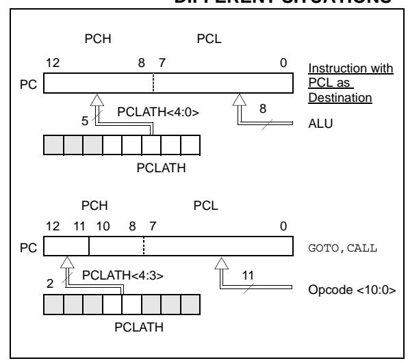

### <span id="page-31-5"></span>2.3.1 COMPUTED GOTO

A computed GOTO is accomplished by adding an offset to the program counter (ADDWF PCL). When doing a table read using a computed GOTO method, care should be exercised if the table location crosses a PCL memory boundary (each 256-byte block). Refer to the application note, *AN556, "Implementing a Table Read"* (DS00556).

### <span id="page-31-11"></span><span id="page-31-3"></span>2.3.2 STACK

The PIC16F87XA family has an 8-level deep x 13-bit wide hardware stack. The stack space is not part of either program or data space and the stack pointer is not readable or writable. The PC is PUSHed onto the stack when a CALL instruction is executed, or an interrupt causes a branch. The stack is POP'ed in the event of a RETURN, RETLW or a RETFIE instruction execution. PCLATH is not affected by a PUSH or POP operation.

The stack operates as a circular buffer. This means that after the stack has been PUSHed eight times, the ninth push overwrites the value that was stored from the first push. The tenth push overwrites the second push (and so on).

- <span id="page-31-13"></span><span id="page-31-12"></span><span id="page-31-10"></span>**Note 1:** There are no status bits to indicate stack overflow or stack underflow conditions.
  - **2:** There are no instructions/mnemonics called PUSH or POP. These are actions that occur from the execution of the CALL, RETURN, RETLW and RETFIE instructions or the vectoring to an interrupt address.

## <span id="page-31-7"></span>**2.4 Program Memory Paging**

All PIC16F87XA devices are capable of addressing a continuous 8K word block of program memory. The CALL and GOTO instructions provide only 11 bits of address to allow branching within any 2K program memory page. When doing a CALL or GOTO instruction, the upper 2 bits of the address are provided by PCLATH<4:3>. When doing a CALL or GOTO instruction, the user must ensure that the page select bits are programmed so that the desired program memory page is addressed. If a return from a CALL instruction (or interrupt) is executed, the entire 13-bit PC is popped off the stack. Therefore, manipulation of the PCLATH<4:3> bits is not required for the RETURN instructions (which POPs the address from the stack).

**Note:** The contents of the PCLATH register are unchanged after a RETURN or RETFIE instruction is executed. The user must rewrite the contents of the PCLATH register for any subsequent subroutine calls or GOTO instructions.

[Example 2-1](#page-31-2) shows the calling of a subroutine in page 1 of the program memory. This example assumes that PCLATH is saved and restored by the Interrupt Service Routine (if interrupts are used).

### <span id="page-31-4"></span><span id="page-31-2"></span>**EXAMPLE 2-1: CALL OF A SUBROUTINE IN PAGE 1 FROM PAGE 0**

```
ORG 0x500
       BCF PCLATH,4
       BSF PCLATH,3 ;Select page 1
                    ;(800h-FFFh)
       CALL SUB1_P1 ;Call subroutine in
       : ;page 1 (800h-FFFh)
       :
       ORG 0x900 ;page 1 (800h-FFFh)
SUB1_P1
       : ;called subroutine
                    ;page 1 (800h-FFFh)
       :
       RETURN ;return to 
                    ;Call subroutine
              ;in page 0
                    ;(000h-7FFh)
```

## <span id="page-32-5"></span><span id="page-32-0"></span>**2.5 Indirect Addressing, INDF and FSR Registers**

The INDF register is not a physical register. Addressing the INDF register will cause indirect addressing.

Indirect addressing is possible by using the INDF register. Any instruction using the INDF register actually accesses the register pointed to by the File Select Register, FSR. Reading the INDF register itself, indirectly (FSR = 0) will read 00h. Writing to the INDF register indirectly results in a no operation (although status bits may be affected). An effective 9-bit address is obtained by concatenating the 8-bit FSR register and the IRP bit (Status<7>) as shown in [Figure 2-6.](#page-32-1)

A simple program to clear RAM locations 20h-2Fh using indirect addressing is shown in [Example 2-2](#page-32-2).

### <span id="page-32-3"></span><span id="page-32-2"></span>**EXAMPLE 2-2: INDIRECT ADDRESSING**

|          | MOVLW 0x20 |             | ;initialize pointer  |
|----------|------------|-------------|----------------------|
|          | MOVWF FSR  |             | ;to RAM              |
| NEXT     | CLRF       | INDF        | ;clear INDF register |
|          | INCF       | FSR,F       | ;inc pointer         |
|          |            | BTFSS FSR,4 | ;all done?           |
|          | GOTO       | NEXT        | ;no clear next       |
| CONTINUE |            |             |                      |
|          | :          |             | ;yes continue        |
|          |            |             |                      |

<span id="page-32-4"></span><span id="page-32-1"></span>**FIGURE 2-6: DIRECT/INDIRECT ADDRESSING**

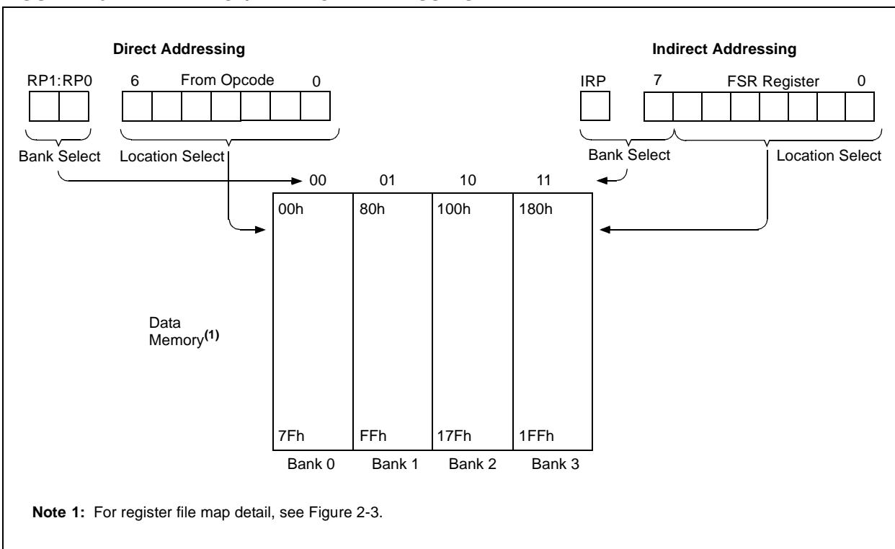

**NOTES:**

## <span id="page-34-13"></span><span id="page-34-1"></span><span id="page-34-0"></span>**3.0 DATA EEPROM AND FLASH PROGRAM MEMORY**

The data EEPROM and Flash program memory is readable and writable during normal operation (over the full VDD range). This memory is not directly mapped in the register file space. Instead, it is indirectly addressed through the Special Function Registers. There are six SFRs used to read and write this memory:

- <span id="page-34-5"></span><span id="page-34-4"></span>• EECON1
- <span id="page-34-6"></span>• EECON2
- EEDATA
- <span id="page-34-7"></span><span id="page-34-2"></span>• EEDATH
- <span id="page-34-3"></span>• EEADR
- EEADRH

When interfacing to the data memory block, EEDATA holds the 8-bit data for read/write and EEADR holds the address of the EEPROM location being accessed. These devices have 128 or 256 bytes of data EEPROM (depending on the device), with an address range from 00h to FFh. On devices with 128 bytes, addresses from 80h to FFh are unimplemented and will wraparound to the beginning of data EEPROM memory. When writing to unimplemented locations, the on-chip charge pump will be turned off.

When interfacing the program memory block, the EEDATA and EEDATH registers form a two-byte word that holds the 14-bit data for read/write and the EEADR and EEADRH registers form a two-byte word that holds the 13-bit address of the program memory location being accessed. These devices have 4 or 8K words of program Flash, with an address range from 0000h to 0FFFh for the PIC16F873A/874A and 0000h to 1FFFh for the PIC16F876A/877A. Addresses above the range of the respective device will wraparound to the beginning of program memory.

The EEPROM data memory allows single-byte read and write. The Flash program memory allows single-word reads and four-word block writes. Program memory write operations automatically perform an erase-beforewrite on blocks of four words. A byte write in data EEPROM memory automatically erases the location and writes the new data (erase-before-write).

The write time is controlled by an on-chip timer. The write/erase voltages are generated by an on-chip charge pump, rated to operate over the voltage range of the device for byte or word operations.

When the device is code-protected, the CPU may continue to read and write the data EEPROM memory. Depending on the settings of the write-protect bits, the device may or may not be able to write certain blocks of the program memory; however, reads of the program memory are allowed. When code-protected, the device programmer can no longer access data or program memory; this does NOT inhibit internal reads or writes.

### <span id="page-34-14"></span><span id="page-34-9"></span><span id="page-34-8"></span>**3.1 EEADR and EEADRH**

The EEADRH:EEADR register pair can address up to a maximum of 256 bytes of data EEPROM or up to a maximum of 8K words of program EEPROM. When selecting a data address value, only the LSByte of the address is written to the EEADR register. When selecting a program address value, the MSByte of the address is written to the EEADRH register and the LSByte is written to the EEADR register.

If the device contains less memory than the full address reach of the address register pair, the Most Significant bits of the registers are not implemented. For example, if the device has 128 bytes of data EEPROM, the Most Significant bit of EEADR is not implemented on access to data EEPROM.

### <span id="page-34-11"></span><span id="page-34-10"></span>**3.2 EECON1 and EECON2 Registers**

EECON1 is the control register for memory accesses.

Control bit, EEPGD, determines if the access will be a program or data memory access. When clear, as it is when reset, any subsequent operations will operate on the data memory. When set, any subsequent operations will operate on the program memory.

Control bits, RD and WR, initiate read and write or erase, respectively. These bits cannot be cleared, only set, in software. They are cleared in hardware at completion of the read or write operation. The inability to clear the WR bit in software prevents the accidental, premature termination of a write operation.

The WREN bit, when set, will allow a write or erase operation. On power-up, the WREN bit is clear. The WRERR bit is set when a write (or erase) operation is interrupted by a MCLR or a WDT Time-out Reset during normal operation. In these situations, following Reset, the user can check the WRERR bit and rewrite the location. The data and address will be unchanged in the EEDATA and EEADR registers.

<span id="page-34-12"></span>Interrupt flag bit, EEIF in the PIR2 register, is set when the write is complete. It must be cleared in software.

EECON2 is not a physical register. Reading EECON2 will read all '0's. The EECON2 register is used exclusively in the EEPROM write sequence.

**Note:** The self-programming mechanism for Flash program memory has been changed. On previous PIC16F87X devices, Flash programming was done in single-word erase/ write cycles. The newer PIC18F87XA devices use a four-word erase/write cycle. See **[Section 3.6 "Writing to Flash](#page-38-0) [Program Memory"](#page-38-0)** for more information.

### **REGISTER 3-1: EECON1 REGISTER (ADDRESS 18Ch)**

<span id="page-35-1"></span><span id="page-35-0"></span>

| R/W-x | U-0 | U-0 | U-0 | R/W-x | R/W-0 | R/S-0 | R/S-0 |
|-------|-----|-----|-----|-------|-------|-------|-------|
| EEPGD | —   | —   | —   | WRERR | WREN  | WR    | RD    |
| bit 7 |     |     |     |       |       |       | bit 0 |

bit 7 **EEPGD**: Program/Data EEPROM Select bit

1 = Accesses program memory

0 = Accesses data memory

Reads '0' after a POR; this bit cannot be changed while a write operation is in progress.

bit 6-4 **Unimplemented:** Read as '0'

bit 3 **WRERR:** EEPROM Error Flag bit

1 = A write operation is prematurely terminated (any MCLR or any WDT Reset during normal operation)

0 = The write operation completed

bit 2 **WREN:** EEPROM Write Enable bit

1 = Allows write cycles

0 = Inhibits write to the EEPROM

bit 1 **WR:** Write Control bit

1 = Initiates a write cycle. The bit is cleared by hardware once write is complete. The WR bit can only be set (not cleared) in software.

0 = Write cycle to the EEPROM is complete

bit 0 **RD:** Read Control bit

1 = Initiates an EEPROM read; RD is cleared in hardware. The RD bit can only be set (not cleared) in software.

0 = Does not initiate an EEPROM read

**Legend:**

R = Readable bit W = Writable bit U = Unimplemented bit, read as '0' - n = Value at POR '1' = Bit is set '0' = Bit is cleared x = Bit is unknown

### <span id="page-36-4"></span>**3.3 Reading Data EEPROM Memory**

To read a data memory location, the user must write the address to the EEADR register, clear the EEPGD control bit (EECON1<7>) and then set control bit RD (EECON1<0>). The data is available in the very next cycle in the EEDATA register; therefore, it can be read in the next instruction (see [Example 3-1](#page-36-0)). EEDATA will hold this value until another read or until it is written to by the user (during a write operation).

The steps to reading the EEPROM data memory are:

- 1. Write the address to EEADR. Make sure that the address is not larger than the memory size of the device.
- 2. Clear the EEPGD bit to point to EEPROM data memory.
- 3. Set the RD bit to start the read operation.
- 4. Read the data from the EEDATA register.

### <span id="page-36-2"></span><span id="page-36-0"></span>**EXAMPLE 3-1: DATA EEPROM READ**

```
BSF STATUS,RP1 ; 
BCF STATUS,RP0 ; Bank 2
MOVF DATA_EE_ADDR,W ; Data Memory 
MOVWF EEADR ; Address to read
BSF STATUS,RP0 ; Bank 3
BCF EECON1,EEPGD ; Point to Data
                  ; memory
BSF EECON1,RD ; EE Read
BCF STATUS,RP0 ; Bank 2 
MOVF EEDATA,W ; W = EEDATA
```

### <span id="page-36-5"></span>**3.4 Writing to Data EEPROM Memory**

To write an EEPROM data location, the user must first write the address to the EEADR register and the data to the EEDATA register. Then the user must follow a specific write sequence to initiate the write for each byte.

The write will not initiate if the write sequence is not exactly followed (write 55h to EECON2, write AAh to EECON2, then set WR bit) for each byte. We strongly recommend that interrupts be disabled during this code segment (see [Example 3-2](#page-36-1)).

Additionally, the WREN bit in EECON1 must be set to enable write. This mechanism prevents accidental writes to data EEPROM due to errant (unexpected) code execution (i.e., lost programs). The user should keep the WREN bit clear at all times, except when updating EEPROM. The WREN bit is not cleared by hardware

After a write sequence has been initiated, clearing the WREN bit will not affect this write cycle. The WR bit will be inhibited from being set unless the WREN bit is set. At the completion of the write cycle, the WR bit is cleared in hardware and the EE Write Complete Interrupt Flag bit (EEIF) is set. The user can either enable this interrupt or poll this bit. EEIF must be cleared by software.

The steps to write to EEPROM data memory are:

- 1. If step 10 is not implemented, check the WR bit to see if a write is in progress.
- 2. Write the address to EEADR. Make sure that the address is not larger than the memory size of the device.
- 3. Write the 8-bit data value to be programmed in the EEDATA register.
- 4. Clear the EEPGD bit to point to EEPROM data memory.
- 5. Set the WREN bit to enable program operations.
- 6. Disable interrupts (if enabled).
- 7. Execute the special five instruction sequence:
  - Write 55h to EECON2 in two steps (first to W, then to EECON2)
  - Write AAh to EECON2 in two steps (first to W, then to EECON2)
  - Set the WR bit
- 8. Enable interrupts (if using interrupts).
- 9. Clear the WREN bit to disable program operations.
- 10. At the completion of the write cycle, the WR bit is cleared and the EEIF interrupt flag bit is set. (EEIF must be cleared by firmware.) If step 1 is not implemented, then firmware should check for EEIF to be set, or WR to clear, to indicate the end of the program cycle.

### <span id="page-36-3"></span><span id="page-36-1"></span>**EXAMPLE 3-2: DATA EEPROM WRITE**

|                      | BSF   | STATUS,RP1                  | ;                                 |
|----------------------|-------|-----------------------------|-----------------------------------|
|                      | BSF   | STATUS,RP0                  |                                   |
|                      | BTFSC | EECON1,WR                   | ;Wait for write                   |
|                      | GOTO  | \$-1                        | ;to complete                      |
|                      | BCF   | STATUS,<br>RP0              | ;Bank 2                           |
|                      | MOVF  | DATA_EE_ADDR,W ;Data Memory |                                   |
|                      | MOVWF | EEADR                       | ;Address to write                 |
|                      | MOVF  |                             | DATA_EE_DATA,W ;Data Memory Value |
|                      | MOVWF | EEDATA                      | ;to write                         |
|                      | BSF   | STATUS,RP0                  | ;Bank 3                           |
|                      | BCF   | EECON1,EEPGD                | ;Point to DATA                    |
|                      |       |                             | ;memory                           |
|                      | BSF   | EECON1,WREN                 | ;Enable writes                    |
|                      |       |                             |                                   |
|                      | BCF   | INTCON,GIE                  | ;Disable INTs.                    |
|                      | MOVLW | 55h                         | ;                                 |
|                      | MOVWF | EECON2                      | ;Write 55h                        |
| Sequence<br>Required | MOVLW | AAh                         | ;                                 |
|                      | MOVWF | EECON2                      | ;Write AAh                        |
|                      | BSF   | EECON1,WR                   | ;Set WR bit to                    |
|                      |       |                             | ;begin write                      |
|                      | BSF   | INTCON,GIE                  | ;Enable INTs.                     |
|                      | BCF   | EECON1,WREN                 | ;Disable writes                   |
|                      |       |                             |                                   |

## <span id="page-37-1"></span>**3.5 Reading Flash Program Memory**

To read a program memory location, the user must write two bytes of the address to the EEADR and EEADRH registers, set the EEPGD control bit (EECON1<7>) and then set control bit RD (EECON1<0>). Once the read control bit is set, the program memory Flash controller will use the next two instruction cycles to read the data. This causes these two instructions immediately following the "BSF EECON1,RD" instruction to be ignored. The data is available in the very next cycle in the EEDATA and EEDATH registers; therefore, it can be read as two bytes in the following instructions. EEDATA and EEDATH registers will hold this value until another read or until it is written to by the user (during a write operation).

### <span id="page-37-0"></span>**EXAMPLE 3-3: FLASH PROGRAM READ**

```
 BSF STATUS, RP1 ; 
   BCF STATUS, RP0 ; Bank 2
   MOVLW MS_PROG_EE_ADDR ; 
   MOVWF EEADRH ; MS Byte of Program Address to read
   MOVLW LS_PROG_EE_ADDR ; 
   MOVWF EEADR ; LS Byte of Program Address to read
   BSF STATUS, RP0 ; Bank 3
   BSF EECON1, EEPGD ; Point to PROGRAM memory
   BSF EECON1, RD ; EE Read
  ;
   NOP
   NOP ; Any instructions here are ignored as program
   ; memory is read in second cycle after BSF EECON1,RD
  ;
   BCF STATUS, RP0 ; Bank 2
   MOVF EEDATA, W ; W = LS Byte of Program EEDATA
   MOVWF DATAL ;
   MOVF EEDATH, W ; W = MS Byte of Program EEDATA
   MOVWF DATAH ;
Required
 Sequence
```

### <span id="page-38-2"></span><span id="page-38-0"></span>**3.6 Writing to Flash Program Memory**

Flash program memory may only be written to if the destination address is in a segment of memory that is not write-protected, as defined in bits WRT1:WRT0 of the device configuration word ([Register 14-1\)](#page-145-0). Flash program memory must be written in four-word blocks. A block consists of four words with sequential addresses, with a lower boundary defined by an address, where EEADR<1:0> = 00. At the same time, all block writes to program memory are done as erase and write operations. The write operation is edge-aligned and cannot occur across boundaries.

To write program data, it must first be loaded into the buffer registers (see [Figure 3-1\)](#page-38-1). This is accomplished by first writing the destination address to EEADR and EEADRH and then writing the data to EEDATA and EEDATH. After the address and data have been set up, then the following sequence of events must be executed:

- 1. Set the EEPGD control bit (EECON1<7>).
- 2. Write 55h, then AAh, to EECON2 (Flash programming sequence).
- 3. Set the WR control bit (EECON1<1>).

All four buffer register locations **MUST** be written to with correct data. If only one, two or three words are being written to in the block of four words, then a read from the program memory location(s) not being written to must be performed. This takes the data from the program location(s) not being written and loads it into the EEDATA and EEDATH registers. Then the sequence of events to transfer data to the buffer registers must be executed.

To transfer data from the buffer registers to the program memory, the EEADR and EEADRH must point to the last location in the four-word block (EEADR<1:0> = 11). Then the following sequence of events must be executed:

- 1. Set the EEPGD control bit (EECON1<7>).
- 2. Write 55h, then AAh, to EECON2 (Flash programming sequence).
- 3. Set control bit WR (EECON1<1>) to begin the write operation.

The user must follow the same specific sequence to initiate the write for each word in the program block, writing each program word in sequence (00,01,10,11). When the write is performed on the last word (EEADR<1:0> = 11), the block of four words are automatically erased and the contents of the buffer registers are written into the program memory.

After the "BSF EECON1,WR" instruction, the processor requires two cycles to set up the erase/write operation. The user must place two NOP instructions after the WR bit is set. Since data is being written to buffer registers, the writing of the first three words of the block appears to occur immediately. The processor will halt internal operations for the typical 4 ms, only during the cycle in which the erase takes place (i.e., the last word of the four-word block). This is not Sleep mode as the clocks and peripherals will continue to run. After the write cycle, the processor will resume operation with the third instruction after the EECON1 write instruction. If the sequence is performed to any other location, the action is ignored.


<span id="page-38-1"></span>**FIGURE 3-1: BLOCK WRITES TO FLASH PROGRAM MEMORY** 

An example of the complete four-word write sequence is shown in [Example 3-4](#page-39-0). The initial address is loaded into the EEADRH:EEADR register pair; the four words of data are loaded using indirect addressing.

### <span id="page-39-1"></span><span id="page-39-0"></span>**EXAMPLE 3-4: WRITING TO FLASH PROGRAM MEMORY**

```
; This write routine assumes the following:
;
; 1. A valid starting address (the least significant bits = '00')is loaded in ADDRH:ADDRL
; 2. The 8 bytes of data are loaded, starting at the address in DATADDR
; 3. ADDRH, ADDRL and DATADDR are all located in shared data memory 0x70 - 0x7f
;
     BSF STATUS,RP1 ;
     BCF STATUS,RP0 ; Bank 2
     MOVF ADDRH,W ; Load initial address
     MOVWF EEADRH ; 
     MOVF ADDRL,W ; 
     MOVWF EEADR ; 
     MOVF DATAADDR,W ; Load initial data address
     MOVWF FSR ; 
LOOP MOVF INDF,W ; Load first data byte into lower
     MOVWF EEDATA ;
     INCF FSR,F ; Next byte
     MOVF INDF,W ; Load second data byte into upper
     MOVWF EEDATH ;
     INCF FSR,F ;
     BSF STATUS,RP0 ; Bank 3
     BSF EECON1,EEPGD ; Point to program memory
     BSF EECON1,WREN ; Enable writes
     BCF INTCON,GIE ; Disable interrupts (if using)
     MOVLW 55h ; Start of required write sequence:
     MOVWF EECON2 ; Write 55h
     MOVLW AAh ; 
     MOVWF EECON2 ; Write AAh
     BSF EECON1,WR ; Set WR bit to begin write
     NOP ; Any instructions here are ignored as processor
                          ; halts to begin write sequence
     NOP ; processor will stop here and wait for write complete 
                          ; after write processor continues with 3rd instruction
     BCF EECON1,WREN ; Disable writes
     BSF INTCON,GIE ; Enable interrupts (if using)
     BCF STATUS,RP0 ; Bank 2
     INCF EEADR,F ; Increment address
     MOVF EEADR,W ; Check if lower two bits of address are '00'
     ANDLW 0x03 ; Indicates when four words have been programmed 
     XORLW 0x03 ;
     BTFSC STATUS,Z ; Exit if more than four words,
     GOTO LOOP ; Continue if less than four words
  Required
   Sequence
```

## <span id="page-40-3"></span>**3.7 Protection Against Spurious Write**

There are conditions when the device should not write to the data EEPROM or Flash program memory. To protect against spurious writes, various mechanisms have been built-in. On power-up, WREN is cleared. Also, the Power-up Timer (72 ms duration) prevents an EEPROM write.

The write initiate sequence and the WREN bit together help prevent an accidental write during brown-out, power glitch or software malfunction.

### <span id="page-40-2"></span>**3.8 Operation During Code-Protect**

When the data EEPROM is code-protected, the microcontroller can read and write to the EEPROM normally. However, all external access to the EEPROM is disabled. External write access to the program memory is also disabled.

<span id="page-40-1"></span>When program memory is code-protected, the microcontroller can read and write to program memory normally, as well as execute instructions. Writes by the device may be selectively inhibited to regions of the memory depending on the setting of bits WR1:WR0 of the configuration word (see **[Section 14.1 "Configuration Bits"](#page-144-1)** for additional information). External access to the memory is also disabled.

<span id="page-40-0"></span>**TABLE 3-1: REGISTERS/BITS ASSOCIATED WITH DATA EEPROM AND FLASH PROGRAM MEMORIES** 

| Address | Name   | Bit 7                               | Bit 6 | Bit 5 | Bit 4                                  | Bit 3                                               | Bit 2     | Bit 1                                   | Bit 0  | Value on<br>Power-on<br>Reset | Value on<br>all other<br>Resets |
|---------|--------|-------------------------------------|-------|-------|----------------------------------------|-----------------------------------------------------|-----------|-----------------------------------------|--------|-------------------------------|---------------------------------|
| 10Ch    | EEDATA | EEPROM/Flash Data Register Low Byte |       |       |                                        | xxxx xxxx                                           | uuuu uuuu |                                         |        |                               |                                 |
| 10Dh    | EEADR  |                                     |       |       | EEPROM/Flash Address Register Low Byte |                                                     |           |                                         |        | xxxx xxxx                     | uuuu uuuu                       |
| 10Eh    | EEDATH | —                                   | —     |       |                                        | EEPROM/Flash Data Register High Byte                |           |                                         |        | xxxx xxxx                     | 0 q000                          |
| 10Fh    | EEADRH | —                                   | —     | —     |                                        |                                                     |           | EEPROM/Flash Address Register High Byte |        | xxxx xxxx                     |                                 |
| 18Ch    | EECON1 | EEPGD                               | —     | —     | —                                      | WRERR                                               | WREN      | WR                                      | RD     | x x000                        | 0 q000                          |
| 18Dh    | EECON2 |                                     |       |       |                                        | EEPROM Control Register 2 (not a physical register) |           |                                         |        |                               |                                 |
| 0Dh     | PIR2   | —                                   | CMIF  | —     | EEIF<br>BCLIF<br>—<br>—<br>CCP2IF      |                                                     |           |                                         |        | -0-0 00                       | -0-0 00                         |
| 8Dh     | PIE2   | —                                   | CMIE  | —     | EEIE                                   | BCLIE                                               | —         | —                                       | CCP2IE | -0-0 00                       | -0-0 00                         |

**Legend:** x = unknown, u = unchanged, - = unimplemented, read as '0', q = value depends upon condition. Shaded cells are not used by data EEPROM or Flash program memory.

**NOTES:**

## <span id="page-42-3"></span><span id="page-42-0"></span>**4.0 I/O PORTS**

Some pins for these I/O ports are multiplexed with an alternate function for the peripheral features on the device. In general, when a peripheral is enabled, that pin may not be used as a general purpose I/O pin.

Additional information on I/O ports may be found in the PICmicro™ Mid-Range Reference Manual (DS33023).

### <span id="page-42-5"></span><span id="page-42-4"></span>**4.1 PORTA and the TRISA Register**

PORTA is a 6-bit wide, bidirectional port. The corresponding data direction register is TRISA. Setting a TRISA bit (= 1) will make the corresponding PORTA pin an input (i.e., put the corresponding output driver in a High-Impedance mode). Clearing a TRISA bit (= 0) will make the corresponding PORTA pin an output (i.e., put the contents of the output latch on the selected pin).

Reading the PORTA register reads the status of the pins, whereas writing to it will write to the port latch. All write operations are read-modify-write operations. Therefore, a write to a port implies that the port pins are read, the value is modified and then written to the port data latch.

Pin RA4 is multiplexed with the Timer0 module clock input to become the RA4/T0CKI pin. The RA4/T0CKI pin is a Schmitt Trigger input and an open-drain output. All other PORTA pins have TTL input levels and full CMOS output drivers.

Other PORTA pins are multiplexed with analog inputs and the analog VREF input for both the A/D converters and the comparators. The operation of each pin is selected by clearing/setting the appropriate control bits in the ADCON1 and/or CMCON registers.

**Note:** On a Power-on Reset, these pins are configured as analog inputs and read as '0'. The comparators are in the off (digital) state.

The TRISA register controls the direction of the port pins even when they are being used as analog inputs. The user must ensure the bits in the TRISA register are maintained set when using them as analog inputs.

### <span id="page-42-2"></span>**EXAMPLE 4-1: INITIALIZING PORTA**

| BCF   | STATUS, RP0 | ; |                         |
|-------|-------------|---|-------------------------|
| BCF   | STATUS, RP1 |   | ; Bank0                 |
| CLRF  | PORTA       |   | ; Initialize PORTA by   |
|       |             |   | ; clearing output       |
|       |             |   | ; data latches          |
| BSF   | STATUS, RP0 |   | ; Select Bank 1         |
| MOVLW | 0x06        |   | ; Configure all pins    |
| MOVWF | ADCON1      |   | ; as digital inputs     |
| MOVLW | 0xCF        |   | ; Value used to         |
|       |             |   | ; initialize data       |
|       |             |   | ; direction             |
| MOVWF | TRISA       |   | ; Set RA<3:0> as inputs |
|       |             |   | ; RA<5:4> as outputs    |
|       |             |   | ; TRISA<7:6>are always  |
|       |             |   | ; read as '0'.          |
|       |             |   |                         |

### <span id="page-42-1"></span>**FIGURE 4-1: BLOCK DIAGRAM OF RA3:RA0 PINS**

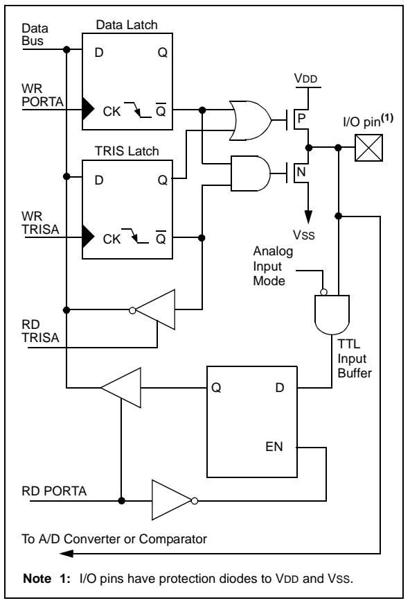

<span id="page-43-0"></span>**FIGURE 4-2: BLOCK DIAGRAM OF RA4/T0CKI PIN** 

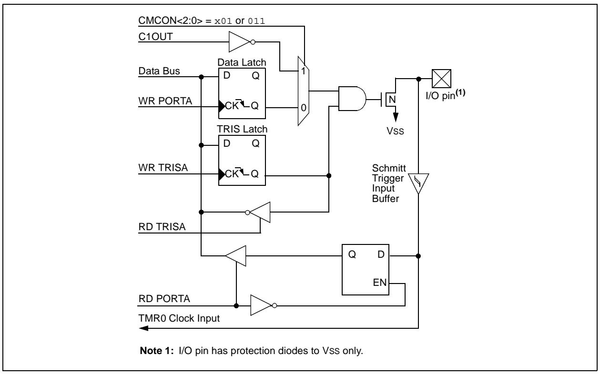

### <span id="page-43-1"></span>**FIGURE 4-3: BLOCK DIAGRAM OF RA5 PIN**

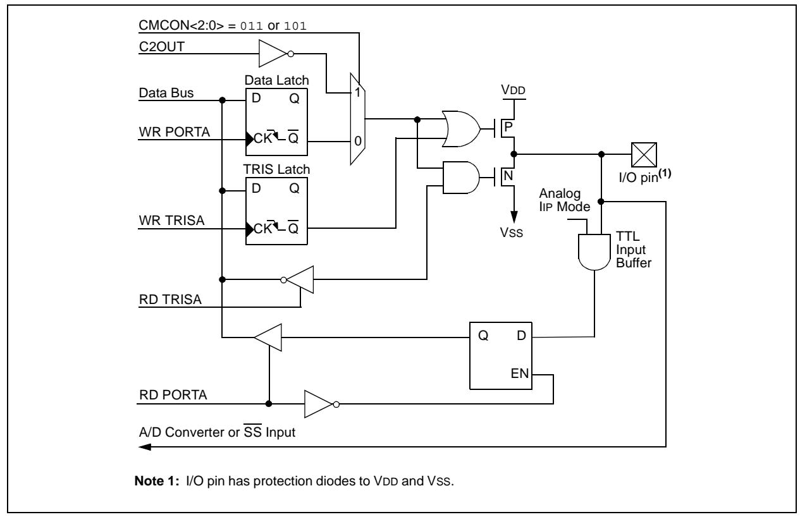

<span id="page-44-2"></span>**TABLE 4-1: PORTA FUNCTIONS**

| Name                | Bit#  | Buffer | Function                                                                                                |
|---------------------|-------|--------|---------------------------------------------------------------------------------------------------------|
| RA0/AN0             | bit 0 | TTL    | Input/output or analog input.                                                                           |
| RA1/AN1             | bit 1 | TTL    | Input/output or analog input.                                                                           |
| RA2/AN2/VREF-/CVREF | bit 2 | TTL    | Input/output or analog input or VREF- or CVREF.                                                         |
| RA3/AN3/VREF+       | bit 3 | TTL    | Input/output or analog input or VREF+.                                                                  |
| RA4/T0CKI/C1OUT     | bit 4 | ST     | Input/output or external clock input for Timer0 or comparator output.<br>Output is open-drain type.     |
| RA5/AN4/SS/C2OUT    | bit 5 | TTL    | Input/output or analog input or slave select input for synchronous serial<br>port or comparator output. |

<span id="page-44-1"></span>**Legend:** TTL = TTL input, ST = Schmitt Trigger input

<span id="page-44-0"></span>**TABLE 4-2: SUMMARY OF REGISTERS ASSOCIATED WITH PORTA**

| Address | Name   | Bit 7 | Bit 6 | Bit 5<br>Bit 4<br>Bit 3<br>Bit 2<br>Bit 1<br>Bit 0 |                               | Value on:<br>POR, BOR | Value on<br>all other<br>Resets |           |           |           |           |
|---------|--------|-------|-------|----------------------------------------------------|-------------------------------|-----------------------|---------------------------------|-----------|-----------|-----------|-----------|
| 05h     | PORTA  | —     | —     | RA5<br>RA4<br>RA3<br>RA2<br>RA1<br>RA0             |                               |                       |                                 | 0x 0000   | 0u 0000   |           |           |
| 85h     | TRISA  | —     | —     |                                                    | PORTA Data Direction Register |                       | 11 1111                         | 11 1111   |           |           |           |
| 9Ch     | CMCON  | C2OUT | C1OUT | C2INV                                              | C1INV<br>CIS<br>CM2<br>CM1    |                       | CM0                             | 0000 0111 | 0000 0111 |           |           |
| 9Dh     | CVRCON | CVREN | CVROE | CVRR                                               | —                             | CVR3                  | CVR2                            | CVR1      | CVR0      | 000- 0000 | 000- 0000 |
| 9Fh     | ADCON1 | ADFM  | ADCS2 | —                                                  | —                             | PCFG3                 | PCFG2                           | PCFG1     | PCFG0     | 00 0000   | 00 0000   |

**Legend:** x = unknown, u = unchanged, - = unimplemented locations read as '0'. Shaded cells are not used by PORTA.

**Note:** When using the SSP module in SPI Slave mode and SS enabled, the A/D converter must be set to one of the following modes, where PCFG3:PCFG0 = 0100, 0101, 011x, 1101, 1110, 1111.

### <span id="page-45-7"></span><span id="page-45-6"></span><span id="page-45-0"></span>**4.2 PORTB and the TRISB Register**

PORTB is an 8-bit wide, bidirectional port. The corresponding data direction register is TRISB. Setting a TRISB bit (= 1) will make the corresponding PORTB pin an input (i.e., put the corresponding output driver in a High-Impedance mode). Clearing a TRISB bit (= 0) will make the corresponding PORTB pin an output (i.e., put the contents of the output latch on the selected pin).

Three pins of PORTB are multiplexed with the In-Circuit Debugger and Low-Voltage Programming function: RB3/PGM, RB6/PGC and RB7/PGD. The alternate functions of these pins are described in **[Section 14.0](#page-144-2) ["Special Features of the CPU"](#page-144-2)**.

Each of the PORTB pins has a weak internal pull-up. A single control bit can turn on all the pull-ups. This is performed by clearing bit RBPU (OPTION\_REG<7>). The weak pull-up is automatically turned off when the port pin is configured as an output. The pull-ups are disabled on a Power-on Reset.

<span id="page-45-2"></span>**FIGURE 4-4: BLOCK DIAGRAM OF RB3:RB0 PINS** 


Four of the PORTB pins, RB7:RB4, have an interrupton-change feature. Only pins configured as inputs can cause this interrupt to occur (i.e., any RB7:RB4 pin configured as an output is excluded from the interrupton-change comparison). The input pins (of RB7:RB4) are compared with the old value latched on the last read of PORTB. The "mismatch" outputs of RB7:RB4 are OR'ed together to generate the RB port change interrupt with flag bit RBIF (INTCON<0>).

This interrupt can wake the device from Sleep. The user, in the Interrupt Service Routine, can clear the interrupt in the following manner:

- a) Any read or write of PORTB. This will end the mismatch condition.
- b) Clear flag bit RBIF.

<span id="page-45-4"></span>A mismatch condition will continue to set flag bit RBIF. Reading PORTB will end the mismatch condition and allow flag bit RBIF to be cleared.

The interrupt-on-change feature is recommended for wake-up on key depression operation and operations where PORTB is only used for the interrupt-on-change feature. Polling of PORTB is not recommended while using the interrupt-on-change feature.

This interrupt-on-mismatch feature, together with software configurable pull-ups on these four pins, allow easy interface to a keypad and make it possible for wake-up on key depression. Refer to the application note, *AN552, "Implementing Wake-up on Key Stroke"* (DS00552).

<span id="page-45-1"></span>RB0/INT is an external interrupt input pin and is configured using the INTEDG bit (OPTION\_REG<6>).

RB0/INT is discussed in detail in **[Section 14.11.1 "INT](#page-155-0) [Interrupt"](#page-155-0)**.

<span id="page-45-3"></span>**FIGURE 4-5: BLOCK DIAGRAM OF RB7:RB4 PINS** 

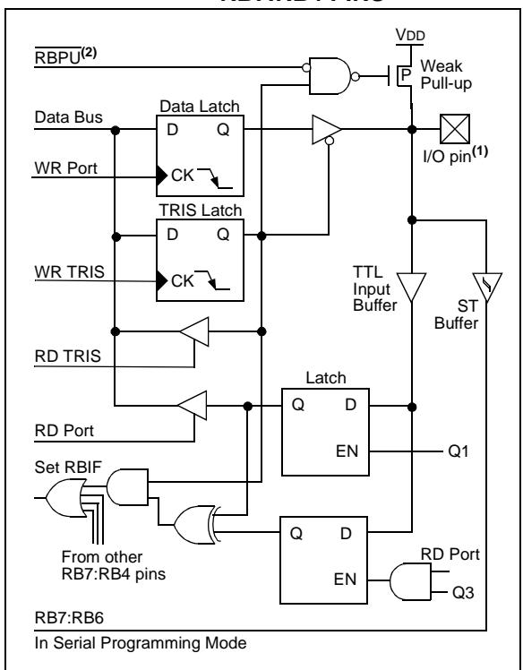

<span id="page-45-5"></span>**Note 1:** I/O pins have diode protection to VDD and VSS.

**2:** To enable weak pull-ups, set the appropriate TRIS bit(s) and clear the RBPU bit (OPTION\_REG<7>).

<span id="page-46-2"></span>**TABLE 4-3: PORTB FUNCTIONS**

| Name       | Bit#  | Buffer    | Function                                                                                                                                          |
|------------|-------|-----------|---------------------------------------------------------------------------------------------------------------------------------------------------|
| RB0/INT    | bit 0 | TTL/ST(1) | Input/output pin or external interrupt input. Internal software programmable<br>weak pull-up.                                                     |
| RB1        | bit 1 | TTL       | Input/output pin. Internal software programmable weak pull-up.                                                                                    |
| RB2        | bit 2 | TTL       | Input/output pin. Internal software programmable weak pull-up.                                                                                    |
| RB3/PGM(3) | bit 3 | TTL       | Input/output pin or programming pin in LVP mode. Internal software<br>programmable weak pull-up.                                                  |
| RB4        | bit 4 | TTL       | Input/output pin (with interrupt-on-change). Internal software programmable<br>weak pull-up.                                                      |
| RB5        | bit 5 | TTL       | Input/output pin (with interrupt-on-change). Internal software programmable<br>weak pull-up.                                                      |
| RB6/PGC    | bit 6 | TTL/ST(2) | Input/output pin (with interrupt-on-change) or in-circuit debugger pin.<br>Internal software programmable weak pull-up. Serial programming clock. |
| RB7/PGD    | bit 7 | TTL/ST(2) | Input/output pin (with interrupt-on-change) or in-circuit debugger pin.<br>Internal software programmable weak pull-up. Serial programming data.  |

**Legend:** TTL = TTL input, ST = Schmitt Trigger input

- **Note 1:** This buffer is a Schmitt Trigger input when configured as the external interrupt.
  - **2:** This buffer is a Schmitt Trigger input when used in Serial Programming mode or in-circuit debugger.
  - **3:** Low-Voltage ICSP Programming (LVP) is enabled by default which disables the RB3 I/O function. LVP must be disabled to enable RB3 as an I/O pin and allow maximum compatibility to the other 28-pin and 40-pin mid-range devices.

<span id="page-46-1"></span><span id="page-46-0"></span>**TABLE 4-4: SUMMARY OF REGISTERS ASSOCIATED WITH PORTB**

| Address         | Name                 | Bit 7 | Bit 6<br>Bit 5<br>Bit 4<br>Bit 3 |      |      |     | Bit 2 | Bit 1 | Bit 0 |  | Value on:<br>POR, BOR |                     | Value on<br>all other<br>Resets |
|-----------------|----------------------|-------|----------------------------------|------|------|-----|-------|-------|-------|--|-----------------------|---------------------|---------------------------------|
| 06h, 106h PORTB |                      | RB7   | RB6                              | RB5  | RB4  | RB3 | RB2   | RB1   | RB0   |  | xxxx xxxx uuuu uuuu   |                     |                                 |
| 86h, 186h TRISB |                      |       | PORTB Data Direction Register    |      |      |     |       |       |       |  |                       | 1111 1111 1111 1111 |                                 |
|                 | 81h, 181h OPTION_REG | RBPU  | INTEDG                           | T0CS | T0SE | PSA | PS2   | PS1   | PS0   |  | 1111 1111 1111 1111   |                     |                                 |

**Legend:** x = unknown, u = unchanged. Shaded cells are not used by PORTB.

## <span id="page-47-4"></span><span id="page-47-3"></span><span id="page-47-0"></span>**4.3 PORTC and the TRISC Register**

PORTC is an 8-bit wide, bidirectional port. The corresponding data direction register is TRISC. Setting a TRISC bit (= 1) will make the corresponding PORTC pin an input (i.e., put the corresponding output driver in a High-Impedance mode). Clearing a TRISC bit (= 0) will make the corresponding PORTC pin an output (i.e., put the contents of the output latch on the selected pin).

PORTC is multiplexed with several peripheral functions ([Table 4-5\)](#page-48-1). PORTC pins have Schmitt Trigger input buffers.

When the I2C module is enabled, the PORTC<4:3> pins can be configured with normal I2C levels, or with SMBus levels, by using the CKE bit (SSPSTAT<6>).

When enabling peripheral functions, care should be taken in defining TRIS bits for each PORTC pin. Some peripherals override the TRIS bit to make a pin an output, while other peripherals override the TRIS bit to make a pin an input. Since the TRIS bit override is in effect while the peripheral is enabled, read-modifywrite instructions (BSF, BCF, XORWF) with TRISC as the destination, should be avoided. The user should refer to the corresponding peripheral section for the correct TRIS bit settings.

<span id="page-47-1"></span>**FIGURE 4-6: PORTC BLOCK DIAGRAM (PERIPHERAL OUTPUT OVERRIDE) RC<2:0>,** 

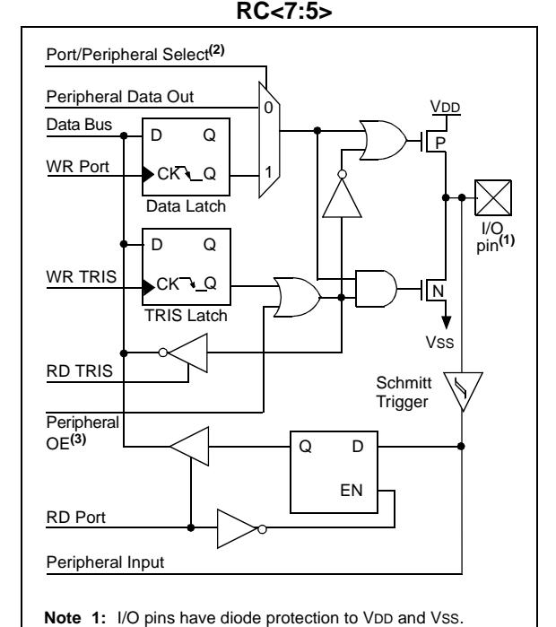

**2:** Port/Peripheral Select signal selects between port

**3:** Peripheral OE (Output Enable) is only activated if

data and peripheral output.

Peripheral Select is active.

<span id="page-47-2"></span>**FIGURE 4-7: PORTC BLOCK DIAGRAM (PERIPHERAL OUTPUT OVERRIDE) RC<4:3>**


**Note 1:** I/O pins have diode protection to VDD and VSS.

- **2:** Port/Peripheral Select signal selects between port data and peripheral output.
- **3:** Peripheral OE (Output Enable) is only activated if Peripheral Select is active.

<span id="page-48-3"></span><span id="page-48-1"></span>**TABLE 4-5: PORTC FUNCTIONS** 

| Name            | Bit#  | Buffer Type | Function                                                                                            |
|-----------------|-------|-------------|-----------------------------------------------------------------------------------------------------|
| RC0/T1OSO/T1CKI | bit 0 | ST          | Input/output port pin or Timer1 oscillator output/Timer1 clock input.                               |
| RC1/T1OSI/CCP2  | bit 1 | ST          | Input/output port pin or Timer1 oscillator input or Capture2 input/<br>Compare2 output/PWM2 output. |
| RC2/CCP1        | bit 2 | ST          | Input/output port pin or Capture1 input/Compare1 output/<br>PWM1 output.                            |
| RC3/SCK/SCL     | bit 3 | ST          | RC3 can also be the synchronous serial clock for both SPI and<br>2C modes.<br>I                     |
| RC4/SDI/SDA     | bit 4 | ST          | RC4 can also be the SPI data in (SPI mode) or data I/O (I2C mode).                                  |
| RC5/SDO         | bit 5 | ST          | Input/output port pin or Synchronous Serial Port data output.                                       |
| RC6/TX/CK       | bit 6 | ST          | Input/output port pin or USART asynchronous transmit or<br>synchronous clock.                       |
| RC7/RX/DT       | bit 7 | ST          | Input/output port pin or USART asynchronous receive or<br>synchronous data.                         |

**Legend:** ST = Schmitt Trigger input

<span id="page-48-2"></span><span id="page-48-0"></span>**TABLE 4-6: SUMMARY OF REGISTERS ASSOCIATED WITH PORTC**

| Address | Name  | Bit 7 | Bit 6                         | Bit 5 | Bit 4 | Bit 3     | Bit 2     | Bit 1 | Bit 0 | Value on:<br>POR, BOR | Value on<br>all other<br>Resets |  |
|---------|-------|-------|-------------------------------|-------|-------|-----------|-----------|-------|-------|-----------------------|---------------------------------|--|
| 07h     | PORTC | RC7   | RC6                           | RC5   | RC4   | RC3       | RC2       | RC1   | RC0   | xxxx xxxx             | uuuu uuuu                       |  |
| 87h     | TRISC |       | PORTC Data Direction Register |       |       | 1111 1111 | 1111 1111 |       |       |                       |                                 |  |

**Legend:** x = unknown, u = unchanged

## <span id="page-49-6"></span>**4.4 PORTD and TRISD Registers**

<span id="page-49-7"></span>**Note:** PORTD and TRISD are not implemented on the 28-pin devices. Data

PORTD is an 8-bit port with Schmitt Trigger input buffers. Each pin is individually configurable as an input or output.

<span id="page-49-3"></span><span id="page-49-2"></span>PORTD can be configured as an 8-bit wide microprocessor port (Parallel Slave Port) by setting control bit, PSPMODE (TRISE<4>). In this mode, the input buffers are TTL.

<span id="page-49-1"></span>**FIGURE 4-8: PORTD BLOCK DIAGRAM (IN I/O PORT MODE)** 


<span id="page-49-5"></span>**TABLE 4-7: PORTD FUNCTIONS**

| Name     | Bit#  | Buffer Type | Function                                            |
|----------|-------|-------------|-----------------------------------------------------|
| RD0/PSP0 | bit 0 | ST/TTL(1)   | Input/output port pin or Parallel Slave Port bit 0. |
| RD1/PSP1 | bit 1 | ST/TTL(1)   | Input/output port pin or Parallel Slave Port bit 1. |
| RD2/PSP2 | bit2  | ST/TTL(1)   | Input/output port pin or Parallel Slave Port bit 2. |
| RD3/PSP3 | bit 3 | ST/TTL(1)   | Input/output port pin or Parallel Slave Port bit 3. |
| RD4/PSP4 | bit 4 | ST/TTL(1)   | Input/output port pin or Parallel Slave Port bit 4. |
| RD5/PSP5 | bit 5 | ST/TTL(1)   | Input/output port pin or Parallel Slave Port bit 5. |
| RD6/PSP6 | bit 6 | ST/TTL(1)   | Input/output port pin or Parallel Slave Port bit 6. |
| RD7/PSP7 | bit 7 | ST/TTL(1)   | Input/output port pin or Parallel Slave Port bit 7. |

**Legend:** ST = Schmitt Trigger input, TTL = TTL input

<span id="page-49-4"></span>**Note 1:** Input buffers are Schmitt Triggers when in I/O mode and TTL buffers when in Parallel Slave Port mode.

<span id="page-49-0"></span>**TABLE 4-8: SUMMARY OF REGISTERS ASSOCIATED WITH PORTD**

| Address | Name  | Bit 7 | Bit 6 | Bit 5 | Bit 4                         | Bit 3 | Bit 2 | Bit 1                                         | Bit 0 | Value on:<br>POR, BOR | Value on<br>all other<br>Resets |
|---------|-------|-------|-------|-------|-------------------------------|-------|-------|-----------------------------------------------|-------|-----------------------|---------------------------------|
| 08h     | PORTD | RD7   | RD6   | RD5   | RD4                           | RD3   | RD2   | RD1                                           | RD0   | xxxx xxxx uuuu uuuu   |                                 |
| 88h     | TRISD |       |       |       | PORTD Data Direction Register |       |       |                                               |       | 1111 1111 1111 1111   |                                 |
| 89h     | TRISE | IBF   | OBF   | IBOV  | PSPMODE                       | —     |       | PORTE Data Direction Bits 0000 -111 0000 -111 |       |                       |                                 |

**Legend:** x = unknown, u = unchanged, - = unimplemented, read as '0'. Shaded cells are not used by PORTD.

### <span id="page-50-0"></span>**4.5 PORTE and TRISE Register**

<span id="page-50-8"></span><span id="page-50-7"></span>**Note:** PORTE and TRISE are not implemented on the 28-pin devices.

PORTE has three pins (RE0/RD/AN5, RE1/WR/AN6 and RE2/CS/AN7) which are individually configurable as inputs or outputs. These pins have Schmitt Trigger input buffers.

<span id="page-50-5"></span>The PORTE pins become the I/O control inputs for the microprocessor port when bit PSPMODE (TRISE<4>) is set. In this mode, the user must make certain that the TRISE<2:0> bits are set and that the pins are configured as digital inputs. Also, ensure that ADCON1 is configured for digital I/O. In this mode, the input buffers are TTL.

[Register 4-1](#page-51-1) shows the TRISE register which also controls the Parallel Slave Port operation.

PORTE pins are multiplexed with analog inputs. When selected for analog input, these pins will read as '0's.

TRISE controls the direction of the RE pins, even when they are being used as analog inputs. The user must make sure to keep the pins configured as inputs when using them as analog inputs.

<span id="page-50-6"></span>**Note:** On a Power-on Reset, these pins are configured as analog inputs and read as '0'.

### <span id="page-50-2"></span>**FIGURE 4-9: PORTE BLOCK DIAGRAM (IN I/O PORT MODE)**


**TABLE 4-9: PORTE FUNCTIONS**

<span id="page-50-1"></span>

| Name       | Bit#  | Buffer Type | Function                                                                                                                                                                                                 |
|------------|-------|-------------|----------------------------------------------------------------------------------------------------------------------------------------------------------------------------------------------------------|
| RE0/RD/AN5 | bit 0 | ST/TTL(1)   | I/O port pin or read control input in Parallel Slave Port mode or analog input:<br>RD<br>1 = Idle<br>0 = Read operation. Contents of PORTD register are output to PORTD<br>I/O pins (if chip selected).  |
| RE1/WR/AN6 | bit 1 | ST/TTL(1)   | I/O port pin or write control input in Parallel Slave Port mode or analog input:<br>WR<br>1 = Idle<br>0 = Write operation. Value of PORTD I/O pins is latched into PORTD<br>register (if chip selected). |
| RE2/CS/AN7 | bit 2 | ST/TTL(1)   | I/O port pin or chip select control input in Parallel Slave Port mode or analog input:<br>CS<br>1 = Device is not selected<br>0 = Device is selected                                                     |

<span id="page-50-4"></span><span id="page-50-3"></span>**Legend:** ST = Schmitt Trigger input, TTL = TTL input

**Note 1:** Input buffers are Schmitt Triggers when in I/O mode and TTL buffers when in Parallel Slave Port mode.

### <span id="page-51-3"></span><span id="page-51-0"></span>**TABLE 4-10: SUMMARY OF REGISTERS ASSOCIATED WITH PORTE**

| Address | Name   | Bit 7 | Bit 6 | Bit 5 | Bit 4   | Bit 3 | Bit 2 | Bit 1                     | Bit 0 | Value on:<br>POR, BOR | Value on<br>all other<br>Resets |
|---------|--------|-------|-------|-------|---------|-------|-------|---------------------------|-------|-----------------------|---------------------------------|
| 09h     | PORTE  | —     | —     | —     | —       | —     | RE2   | RE1                       | RE0   | xxx                   | uuu                             |
| 89h     | TRISE  | IBF   | OBF   | IBOV  | PSPMODE | —     |       | PORTE Data Direction bits |       | 0000 -111             | 0000 -111                       |
| 9Fh     | ADCON1 | ADFM  | ADCS2 | —     | —       | PCFG3 | PCFG2 | PCFG1                     | PCFG0 | 00 0000               | 00 0000                         |

**Legend:** x = unknown, u = unchanged, - = unimplemented, read as '0'. Shaded cells are not used by PORTE.

### <span id="page-51-1"></span>**REGISTER 4-1: TRISE REGISTER (ADDRESS 89h)**

<span id="page-51-7"></span>

| R-0   | R-0 | R/W-0 | R/W-0   | U-0 | R/W-1 | R/W-1 | R/W-1 |
|-------|-----|-------|---------|-----|-------|-------|-------|
| IBF   | OBF | IBOV  | PSPMODE | —   | Bit 2 | Bit 1 | Bit 0 |
| bit 7 |     |       |         |     |       |       | bit 0 |

#### <span id="page-51-4"></span>**Parallel Slave Port Status/Control Bits:**

bit 7 **IBF:** Input Buffer Full Status bit

1 = A word has been received and is waiting to be read by the CPU

<span id="page-51-6"></span>0 = No word has been received

bit 6 **OBF**: Output Buffer Full Status bit

1 = The output buffer still holds a previously written word

<span id="page-51-5"></span>0 = The output buffer has been read

bit 5 **IBOV**: Input Buffer Overflow Detect bit (in Microprocessor mode)

1 = A write occurred when a previously input word has not been read (must be cleared in

software)

<span id="page-51-2"></span>0 = No overflow occurred

bit 4 **PSPMODE**: Parallel Slave Port Mode Select bit

1 = PORTD functions in Parallel Slave Port mode

0 = PORTD functions in general purpose I/O mode

bit 3 **Unimplemented**: Read as '0'

**PORTE Data Direction Bits:**

bit 2 **Bit 2**: Direction Control bit for pin RE2/CS/AN7

1 = Input

0 = Output

bit 1 **Bit 1**: Direction Control bit for pin RE1/WR/AN6

1 = Input

0 = Output

bit 0 **Bit 0**: Direction Control bit for pin RE0/RD/AN5

1 = Input

0 = Output

**Legend:**

R = Readable bit W = Writable bit U = Unimplemented bit, read as '0' - n = Value at POR '1' = Bit is set '0' = Bit is cleared x = Bit is unknown

### <span id="page-52-2"></span>**4.6 Parallel Slave Port**

The Parallel Slave Port (PSP) is not implemented on the PIC16F873A or PIC16F876A.

<span id="page-52-6"></span>PORTD operates as an 8-bit wide Parallel Slave Port, or microprocessor port, when control bit PSPMODE (TRISE<4>) is set. In Slave mode, it is asynchronously readable and writable by the external world through RD control input pin, RE0/RD/AN5, and WR control input pin, RE1/WR/AN6.

<span id="page-52-4"></span>The PSP can directly interface to an 8-bit microprocessor data bus. The external microprocessor can read or write the PORTD latch as an 8-bit latch. Setting bit PSPMODE enables port pin RE0/RD/AN5 to be the RD input, RE1/WR/AN6 to be the WR input and RE2/CS/AN7 to be the CS (Chip Select) input. For this functionality, the corresponding data direction bits of the TRISE register (TRISE<2:0>) must be configured as inputs (set). The A/D port configuration bits, PCFG3:PCFG0 (ADCON1<3:0>), must be set to configure pins RE2:RE0 as digital I/O.

There are actually two 8-bit latches: one for data output and one for data input. The user writes 8-bit data to the PORTD data latch and reads data from the port pin latch (note that they have the same address). In this mode, the TRISD register is ignored since the external device is controlling the direction of data flow.

A write to the PSP occurs when both the CS and WR lines are first detected low. When either the CS or WR lines become high (level triggered), the Input Buffer Full (IBF) status flag bit (TRISE<7>) is set on the Q4 clock cycle, following the next Q2 cycle, to signal the write is complete ([Figure 4-11\)](#page-53-0). The interrupt flag bit, PSPIF (PIR1<7>), is also set on the same Q4 clock cycle. IBF can only be cleared by reading the PORTD input latch. The Input Buffer Overflow (IBOV) status flag bit (TRISE<5>) is set if a second write to the PSP is attempted when the previous byte has not been read out of the buffer.

A read from the PSP occurs when both the CS and RD lines are first detected low. The Output Buffer Full (OBF) status flag bit (TRISE<6>) is cleared immediately [\(Figure 4-12](#page-53-1)), indicating that the PORTD latch is waiting to be read by the external bus. When either the CS or RD pin becomes high (level triggered), the interrupt flag bit PSPIF is set on the Q4 clock cycle, following the next Q2 cycle, indicating that the read is complete. OBF remains low until data is written to PORTD by the user firmware.

When not in PSP mode, the IBF and OBF bits are held clear. However, if flag bit IBOV was previously set, it must be cleared in firmware.

<span id="page-52-5"></span>An interrupt is generated and latched into flag bit PSPIF when a read or write operation is completed. PSPIF must be cleared by the user in firmware and the interrupt can be disabled by clearing the interrupt enable bit PSPIE (PIE1<7>).

<span id="page-52-3"></span><span id="page-52-1"></span><span id="page-52-0"></span>**FIGURE 4-10: PORTD AND PORTE BLOCK DIAGRAM (PARALLEL SLAVE PORT)** 


<span id="page-53-4"></span><span id="page-53-0"></span>**FIGURE 4-11: PARALLEL SLAVE PORT WRITE WAVEFORMS** 


<span id="page-53-3"></span><span id="page-53-1"></span>**FIGURE 4-12: PARALLEL SLAVE PORT READ WAVEFORMS** 


<span id="page-53-2"></span>**TABLE 4-11: REGISTERS ASSOCIATED WITH PARALLEL SLAVE PORT**

| Address | Name   | Bit 7    | Bit 6 | Bit 5 | Bit 4                                             | Bit 3 | Bit 2  | Bit 1                     | Bit 0  | Value on:<br>POR, BOR | Value on<br>all other<br>Resets |
|---------|--------|----------|-------|-------|---------------------------------------------------|-------|--------|---------------------------|--------|-----------------------|---------------------------------|
| 08h     | PORTD  |          |       |       | Port Data Latch when written; Port pins when read |       |        |                           |        | xxxx xxxx             | uuuu uuuu                       |
| 09h     | PORTE  | —        | —     | —     | —                                                 | —     | RE2    | RE1                       | RE0    | xxx                   | uuu                             |
| 89h     | TRISE  | IBF      | OBF   | IBOV  | PSPMODE                                           | —     |        | PORTE Data Direction bits |        | 0000 -111             | 0000 -111                       |
| 0Ch     | PIR1   | PSPIF(1) | ADIF  | RCIF  | TXIF                                              | SSPIF | CCP1IF | TMR2IF                    | TMR1IF | 0000 0000             | 0000 0000                       |
| 8Ch     | PIE1   | PSPIE(1) | ADIE  | RCIE  | TXIE                                              | SSPIE | CCP1IE | TMR2IE                    | TMR1IE | 0000 0000             | 0000 0000                       |
| 9Fh     | ADCON1 | ADFM     | ADCS2 | —     | —                                                 | PCFG3 | PCFG2  | PCFG1                     | PCFG0  | 00 0000 00 0000       |                                 |

**Legend:** x = unknown, u = unchanged, - = unimplemented, read as '0'. Shaded cells are not used by the Parallel Slave Port.

**Note 1:** Bits PSPIE and PSPIF are reserved on the PIC16F873A/876A; always maintain these bits clear.

## <span id="page-54-2"></span><span id="page-54-0"></span>**5.0 TIMER0 MODULE**

The Timer0 module timer/counter has the following features:

- 8-bit timer/counter
- Readable and writable
- 8-bit software programmable prescaler
- Internal or external clock select
- Interrupt on overflow from FFh to 00h
- Edge select for external clock

[Figure 5-1](#page-54-1) is a block diagram of the Timer0 module and the prescaler shared with the WDT.

Additional information on the Timer0 module is available in the PICmicro® Mid-Range MCU Family Reference Manual (DS33023).

Timer mode is selected by clearing bit T0CS (OPTION\_REG<5>). In Timer mode, the Timer0 module will increment every instruction cycle (without prescaler). If the TMR0 register is written, the increment is inhibited for the following two instruction cycles. The user can work around this by writing an adjusted value to the TMR0 register.

Counter mode is selected by setting bit T0CS (OPTION\_REG<5>). In Counter mode, Timer0 will increment either on every rising or falling edge of pin RA4/T0CKI. The incrementing edge is determined by the Timer0 Source Edge Select bit, T0SE (OPTION\_REG<4>). Clearing bit T0SE selects the rising edge. Restrictions on the external clock input are discussed in detail in **[Section 5.2 "Using Timer0 with](#page-55-0) [an External Clock"](#page-55-0)**.

The prescaler is mutually exclusively shared between the Timer0 module and the Watchdog Timer. The prescaler is not readable or writable. **[Section 5.3](#page-55-1) ["Prescaler"](#page-55-1)** details the operation of the prescaler.

### <span id="page-54-5"></span>**5.1 Timer0 Interrupt**

<span id="page-54-4"></span>The TMR0 interrupt is generated when the TMR0 register overflows from FFh to 00h. This overflow sets bit TMR0IF (INTCON<2>). The interrupt can be masked by clearing bit TMR0IE (INTCON<5>). Bit TMR0IF must be cleared in software by the Timer0 module Interrupt Service Routine before re-enabling this interrupt. The TMR0 interrupt cannot awaken the processor from Sleep since the timer is shut-off during Sleep.

<span id="page-54-3"></span><span id="page-54-1"></span>**FIGURE 5-1: BLOCK DIAGRAM OF THE TIMER0/WDT PRESCALER** 


## <span id="page-55-0"></span>**5.2 Using Timer0 with an External Clock**

<span id="page-55-5"></span>When no prescaler is used, the external clock input is the same as the prescaler output. The synchronization of T0CKI with the internal phase clocks is accomplished by sampling the prescaler output on the Q2 and Q4 cycles of the internal phase clocks. Therefore, it is necessary for T0CKI to be high for at least 2 TOSC (and a small RC delay of 20 ns) and low for at least 2 TOSC (and a small RC delay of 20 ns). Refer to the electrical specification of the desired device.

### <span id="page-55-4"></span><span id="page-55-1"></span>**5.3 Prescaler**

There is only one prescaler available which is mutually exclusively shared between the Timer0 module and the Watchdog Timer. A prescaler assignment for the <span id="page-55-3"></span>Timer0 module means that there is no prescaler for the Watchdog Timer and vice versa. This prescaler is not readable or writable (see [Figure 5-1](#page-54-1)).

The PSA and PS2:PS0 bits (OPTION\_REG<3:0>) determine the prescaler assignment and prescale ratio.

When assigned to the Timer0 module, all instructions writing to the TMR0 register (e.g., CLRF 1, MOVWF 1, BSF 1,x....etc.) will clear the prescaler. When assigned to WDT, a CLRWDT instruction will clear the prescaler along with the Watchdog Timer. The prescaler is not readable or writable.

| Note: | Writing to TMR0 when the prescaler is       |
|-------|---------------------------------------------|
|       | assigned to Timer0 will clear the prescaler |
|       | count, but will not change the prescaler    |
|       | assignment.                                 |

### **REGISTER 5-1: OPTION\_REG REGISTER**

<span id="page-55-2"></span>

| R/W-1 | R/W-1  | R/W-1 | R/W-1 | R/W-1 | R/W-1 | R/W-1 | R/W-1 |
|-------|--------|-------|-------|-------|-------|-------|-------|
| RBPU  | INTEDG | T0CS  | T0SE  | PSA   | PS2   | PS1   | PS0   |
| bit 7 |        |       |       |       |       |       | bit 0 |

bit 7 **RBPU**

bit 6 **INTEDG**

bit 5 **T0CS**: TMR0 Clock Source Select bit

1 = Transition on T0CKI pin

0 = Internal instruction cycle clock (CLKO)

bit 4 **T0SE**: TMR0 Source Edge Select bit

1 = Increment on high-to-low transition on T0CKI pin

0 = Increment on low-to-high transition on T0CKI pin

bit 3 **PSA**: Prescaler Assignment bit

1 = Prescaler is assigned to the WDT

0 = Prescaler is assigned to the Timer0 module

bit 2-0 **PS2:PS0**: Prescaler Rate Select bits

| Bit Value | TMR0 Rate WDT Rate |         |
|-----------|--------------------|---------|
| 000       | 1 : 2              | 1 : 1   |
| 001       | 1 : 4              | 1 : 2   |
| 010       | 1 : 8              | 1 : 4   |
| 011       | 1 : 16             | 1 : 8   |
| 100       | 1 : 32             | 1 : 16  |
| 101       | 1 : 64             | 1 : 32  |
| 110       | 1 : 128            | 1 : 64  |
| 111       | 1 : 256            | 1 : 128 |

### **Legend:**

R = Readable bit W = Writable bit U = Unimplemented bit, read as '0' - n = Value at POR '1' = Bit is set '0' = Bit is cleared x = Bit is unknown

**Note:** To avoid an unintended device Reset, the instruction sequence shown in the PICmicro® Mid-Range MCU Family Reference Manual (DS33023) must be executed when changing the prescaler assignment from Timer0 to the WDT. This sequence must be followed even if the WDT is disabled.

### <span id="page-56-0"></span>**TABLE 5-1: REGISTERS ASSOCIATED WITH TIMER0**

| Address               | Name       | Bit 7 | Bit 6                  | Bit 5  | Bit 4 | Bit 3 | Bit 2  | Bit 1 | Bit 0 | POR, BOR | Value on: |                     | Value on<br>all other<br>Resets |
|-----------------------|------------|-------|------------------------|--------|-------|-------|--------|-------|-------|----------|-----------|---------------------|---------------------------------|
| 01h,101h              | TMR0       |       | Timer0 Module Register |        |       |       |        |       |       |          |           | xxxx xxxx uuuu uuuu |                                 |
| 0Bh,8Bh,<br>10Bh,18Bh | INTCON     | GIE   | PEIE                   | TMR0IE | INTE  | RBIE  | TMR0IF | INTF  | RBIF  |          |           | 0000 000x 0000 000u |                                 |
| 81h,181h              | OPTION_REG | RBPU  | INTEDG                 | T0CS   | T0SE  | PSA   | PS2    | PS1   | PS0   |          |           | 1111 1111 1111 1111 |                                 |

**Legend:** x = unknown, u = unchanged, - = unimplemented locations read as '0'. Shaded cells are not used by Timer0.

**NOTES:**

## <span id="page-58-4"></span><span id="page-58-0"></span>**6.0 TIMER1 MODULE**

The Timer1 module is a 16-bit timer/counter consisting of two 8-bit registers (TMR1H and TMR1L) which are readable and writable. The TMR1 register pair (TMR1H:TMR1L) increments from 0000h to FFFFh and rolls over to 0000h. The TMR1 interrupt, if enabled, is generated on overflow which is latched in interrupt flag bit, TMR1IF (PIR1<0>). This interrupt can be enabled/disabled by setting/clearing TMR1 interrupt enable bit, TMR1IE (PIE1<0>).

Timer1 can operate in one of two modes:

- As a Timer
- As a Counter

The operating mode is determined by the clock select bit, TMR1CS (T1CON<1>).

In Timer mode, Timer1 increments every instruction cycle. In Counter mode, it increments on every rising edge of the external clock input.

Timer1 can be enabled/disabled by setting/clearing control bit, TMR1ON (T1CON<0>).

Timer1 also has an internal "Reset input". This Reset can be generated by either of the two CCP modules (**[Section 8.0 "Capture/Compare/PWM Modules"](#page-64-1)**). [Register 6-1](#page-58-2) shows the Timer1 Control register.

When the Timer1 oscillator is enabled (T1OSCEN is set), the RC1/T1OSI/CCP2 and RC0/T1OSO/T1CKI pins become inputs. That is, the TRISC<1:0> value is ignored and these pins read as '0'.

<span id="page-58-3"></span>Additional information on timer modules is available in the PICmicro® Mid-Range MCU Family Reference Manual (DS33023).

### <span id="page-58-2"></span>**REGISTER 6-1: T1CON: TIMER1 CONTROL REGISTER (ADDRESS 10h)**

<span id="page-58-1"></span>

| U-0   | U-0 | R/W-0   | R/W-0   | R/W-0   | R/W-0  | R/W-0  | R/W-0  |
|-------|-----|---------|---------|---------|--------|--------|--------|
| —     | —   | T1CKPS1 | T1CKPS0 | T1OSCEN | T1SYNC | TMR1CS | TMR1ON |
| bit 7 |     |         |         |         |        |        | bit 0  |

- bit 7-6 **Unimplemented:** Read as '0'
- bit 5-4 **T1CKPS1:T1CKPS0:** Timer1 Input Clock Prescale Select bits

11 = 1:8 prescale value

10 = 1:4 prescale value

01 = 1:2 prescale value

00 = 1:1 prescale value

- bit 3 **T1OSCEN**: Timer1 Oscillator Enable Control bit
  - 1 = Oscillator is enabled
  - 0 = Oscillator is shut-off (the oscillator inverter is turned off to eliminate power drain)
- bit 2 **T1SYNC**: Timer1 External Clock Input Synchronization Control bit

### When TMR1CS = 1:

- 1 = Do not synchronize external clock input
- 0 = Synchronize external clock input

#### When TMR1CS = 0:

This bit is ignored. Timer1 uses the internal clock when TMR1CS = 0.

- bit 1 **TMR1CS**: Timer1 Clock Source Select bit
  - 1 = External clock from pin RC0/T1OSO/T1CKI (on the rising edge)
  - 0 = Internal clock (FOSC/4)
- bit 0 **TMR1ON**: Timer1 On bit
  - 1 = Enables Timer1
  - 0 = Stops Timer1

| Legend: |  |
|---------|--|
|         |  |

R = Readable bit W = Writable bit U = Unimplemented bit, read as '0' - n = Value at POR '1' = Bit is set '0' = Bit is cleared x = Bit is unknown

### <span id="page-59-2"></span>**6.1 Timer1 Operation in Timer Mode**

Timer mode is selected by clearing the TMR1CS (T1CON<1>) bit. In this mode, the input clock to the timer is FOSC/4. The synchronize control bit, T1SYNC (T1CON<2>), has no effect since the internal clock is always in sync.

### <span id="page-59-1"></span>**6.2 Timer1 Counter Operation**

Timer1 may operate in either a Synchronous, or an Asynchronous mode, depending on the setting of the TMR1CS bit.

When Timer1 is being incremented via an external source, increments occur on a rising edge. After Timer1 is enabled in Counter mode, the module must first have a falling edge before the counter begins to increment.

**FIGURE 6-1: TIMER1 INCREMENTING EDGE** 


## **6.3 Timer1 Operation in Synchronized Counter Mode**

Counter mode is selected by setting bit TMR1CS. In this mode, the timer increments on every rising edge of clock input on pin RC1/T1OSI/CCP2 when bit T1OSCEN is set, or on pin RC0/T1OSO/T1CKI when bit T1OSCEN is cleared.

<span id="page-59-3"></span>If T1SYNC is cleared, then the external clock input is synchronized with internal phase clocks. The synchronization is done after the prescaler stage. The prescaler stage is an asynchronous ripple counter.

In this configuration, during Sleep mode, Timer1 will not increment even if the external clock is present since the synchronization circuit is shut-off. The prescaler, however, will continue to increment.

<span id="page-59-0"></span>**FIGURE 6-2: TIMER1 BLOCK DIAGRAM**

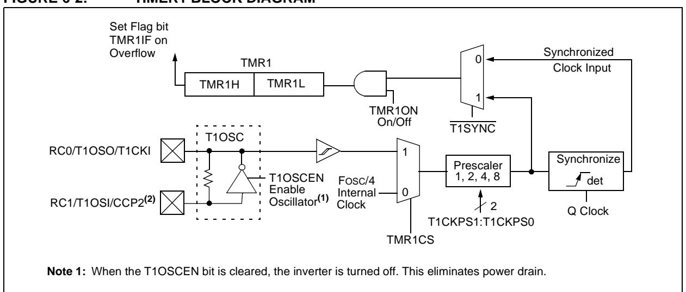

## <span id="page-60-1"></span>**6.4 Timer1 Operation in Asynchronous Counter Mode**

If control bit T1SYNC (T1CON<2>) is set, the external clock input is not synchronized. The timer continues to increment asynchronous to the internal phase clocks. The timer will continue to run during Sleep and can generate an interrupt-on-overflow which will wake-up the processor. However, special precautions in software are needed to read/write the timer.

In Asynchronous Counter mode, Timer1 cannot be used as a time base for capture or compare operations.

### <span id="page-60-2"></span>6.4.1 READING AND WRITING TIMER1 IN ASYNCHRONOUS COUNTER MODE

Reading TMR1H or TMR1L while the timer is running from an external asynchronous clock will ensure a valid read (taken care of in hardware). However, the user should keep in mind that reading the 16-bit timer in two 8-bit values itself, poses certain problems, since the timer may overflow between the reads.

For writes, it is recommended that the user simply stop the timer and write the desired values. A write contention may occur by writing to the timer registers while the register is incrementing. This may produce an unpredictable value in the timer register.

Reading the 16-bit value requires some care. Examples 12-2 and 12-3 in the PICmicro® Mid-Range MCU Family Reference Manual (DS33023) show how to read and write Timer1 when it is running in Asynchronous mode.

### <span id="page-60-3"></span>**6.5 Timer1 Oscillator**

A crystal oscillator circuit is built-in between pins T1OSI (input) and T1OSO (amplifier output). It is enabled by setting control bit, T1OSCEN (T1CON<3>). The oscillator is a low-power oscillator, rated up to 200 kHz. It will continue to run during Sleep. It is primarily intended for use with a 32 kHz crystal. [Table 6-1](#page-60-0) shows the capacitor selection for the Timer1 oscillator.

The Timer1 oscillator is identical to the LP oscillator. The user must provide a software time delay to ensure proper oscillator start-up.

<span id="page-60-4"></span><span id="page-60-0"></span>**TABLE 6-1: CAPACITOR SELECTION FOR THE TIMER1 OSCILLATOR** 

| Osc Type   | Freq.                             | C2                                         |          |  |  |
|------------|-----------------------------------|--------------------------------------------|----------|--|--|
| LP         | 32 kHz                            | 33 pF                                      | 33 pF    |  |  |
|            | 100 kHz                           | 15 pF                                      | 15 pF    |  |  |
|            | 200 kHz                           | 15 pF                                      | 15 pF    |  |  |
|            |                                   | These values are for design guidance only. |          |  |  |
|            |                                   | Crystals Tested:                           |          |  |  |
| 32.768 kHz |                                   | Epson C-001R32.768K-A                      | ± 20 PPM |  |  |
| 100 kHz    | Epson C-2 100.00 KC-P<br>± 20 PPM |                                            |          |  |  |
| 200 kHz    | STD XTL 200.000 kHz<br>± 20 PPM   |                                            |          |  |  |

- **Note 1:** Higher capacitance increases the stability of oscillator but also increases the start-up time.
  - **2:** Since each resonator/crystal has its own characteristics, the user should consult the resonator/crystal manufacturer for appropriate values of external components.

## <span id="page-60-5"></span>**6.6 Resetting Timer1 Using a CCP Trigger Output**

If the CCP1 or CCP2 module is configured in Compare mode to generate a "special event trigger" (CCP1M3:CCP1M0 = 1011), this signal will reset Timer1.

| Note: | The special event triggers from the CCP1 |
|-------|------------------------------------------|
|       | and CCP2 modules will not set interrupt  |
|       | flag bit, TMR1IF (PIR1<0>).              |

Timer1 must be configured for either Timer or Synchronized Counter mode to take advantage of this feature. If Timer1 is running in Asynchronous Counter mode, this Reset operation may not work.

In the event that a write to Timer1 coincides with a special event trigger from CCP1 or CCP2, the write will take precedence.

In this mode of operation, the CCPRxH:CCPRxL register pair effectively becomes the period register for Timer1.

## <span id="page-61-2"></span>**6.7 Resetting of Timer1 Register Pair (TMR1H, TMR1L)**

TMR1H and TMR1L registers are not reset to 00h on a POR, or any other Reset, except by the CCP1 and CCP2 special event triggers.

T1CON register is reset to 00h on a Power-on Reset, or a Brown-out Reset, which shuts off the timer and leaves a 1:1 prescale. In all other Resets, the register is unaffected.

### <span id="page-61-1"></span>**6.8 Timer1 Prescaler**

The prescaler counter is cleared on writes to the TMR1H or TMR1L registers.

<span id="page-61-0"></span>**TABLE 6-2: REGISTERS ASSOCIATED WITH TIMER1 AS A TIMER/COUNTER** 

| Address                | Name   | Bit 7    | Bit 6                                                                                             | Bit 5  | Bit 4 | Bit 3                                                                       | Bit 2  | Bit 1  | Bit 0                       | Value on:<br>POR, BOR | Value on<br>Resets  | all other |
|------------------------|--------|----------|---------------------------------------------------------------------------------------------------|--------|-------|-----------------------------------------------------------------------------|--------|--------|-----------------------------|-----------------------|---------------------|-----------|
| 0Bh,8Bh,<br>10Bh, 18Bh | INTCON | GIE      | PEIE                                                                                              | TMR0IE | INTE  | RBIE                                                                        | TMR0IF | INTF   | RBIF                        |                       | 0000 000x 0000 000u |           |
| 0Ch                    | PIR1   | PSPIF(1) | ADIF                                                                                              | RCIF   | TXIF  | SSPIF                                                                       | CCP1IF | TMR2IF | TMR1IF                      |                       | 0000 0000 0000 0000 |           |
| 8Ch                    | PIE1   | PSPIE(1) | ADIE                                                                                              | RCIE   | TXIE  | SSPIE                                                                       | CCP1IE | TMR2IE | TMR1IE                      |                       | 0000 0000 0000 0000 |           |
| 0Eh                    | TMR1L  |          |                                                                                                   |        |       | Holding Register for the Least Significant Byte of the 16-bit TMR1 Register |        |        |                             |                       | xxxx xxxx uuuu uuuu |           |
| 0Fh                    | TMR1H  |          | Holding Register for the Most Significant Byte of the 16-bit TMR1 Register<br>xxxx xxxx uuuu uuuu |        |       |                                                                             |        |        |                             |                       |                     |           |
| 10h                    | T1CON  | —        | —                                                                                                 |        |       | T1CKPS1 T1CKPS0 T1OSCEN T1SYNC                                              |        |        | TMR1CS TMR1ON00 0000uu uuuu |                       |                     |           |

**Legend:** x = unknown, u = unchanged, - = unimplemented, read as '0'. Shaded cells are not used by the Timer1 module.

**Note 1:** Bits PSPIE and PSPIF are reserved on the 28-pin devices; always maintain these bits clear.

### <span id="page-62-6"></span><span id="page-62-0"></span>7.0 TIMER2 MODULE

Timer2 is an 8-bit timer with a prescaler and a postscaler. It can be used as the PWM time base for the PWM mode of the CCP module(s). The TMR2 register is readable and writable and is cleared on any device Reset.

The input clock (Fosc/4) has a prescale option of 1:1, 1:4 or 1:16, selected by control bits T2CKPS1:T2CKPS0 (T2CON<1:0>).

<span id="page-62-4"></span>The Timer2 module has an 8-bit period register, PR2. Timer2 increments from 00h until it matches PR2 and then resets to 00h on the next increment cycle. PR2 is a readable and writable register. The PR2 register is initialized to FFh upon Reset.

<span id="page-62-7"></span>The match output of TMR2 goes through a 4-bit postscaler (which gives a 1:1 to 1:16 scaling inclusive) to generate a TMR2 interrupt (latched in flag bit, TMR2IF (PIR1<1>)).

Timer2 can be shut-off by clearing control bit, TMR2ON (T2CON<2>), to minimize power consumption.

Register 7-1 shows the Timer2 Control register.

Additional information on timer modules is available in the PICmicro<sup>®</sup> Mid-Range MCU Family Reference Manual (DS33023).

#### <span id="page-62-3"></span>FIGURE 7-1: TIMER2 BLOCK DIAGRAM

<span id="page-62-8"></span>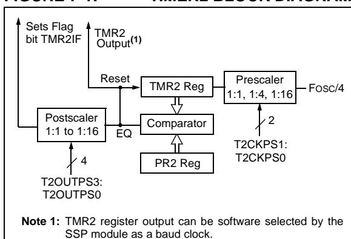

## <span id="page-62-2"></span>REGISTER 7-1: T2CON: TIMER2 CONTROL REGISTER (ADDRESS 12h)

<span id="page-62-5"></span><span id="page-62-1"></span>

| U-0   | R/W-0   | R/W-0   | R/W-0   | R/W-0   | R/W-0  | R/W-0   | R/W-0   |
|-------|---------|---------|---------|---------|--------|---------|---------|
| _     | TOUTPS3 | TOUTPS2 | TOUTPS1 | TOUTPS0 | TMR2ON | T2CKPS1 | T2CKPS0 |
| bit 7 |         |         |         |         |        |         | bit 0   |

bit 7 Unimplemented: Read as '0'

bit 6-3 **TOUTPS3:TOUTPS0**: Timer2 Output Postscale Select bits

0000 = 1:1 postscale 0001 = 1:2 postscale 0010 = 1:3 postscale

•

1111 = 1:16 postscale

bit 2 TMR2ON: Timer2 On bit

1 = Timer2 is on 0 = Timer2 is off

bit 1-0 T2CKPS1:T2CKPS0: Timer2 Clock Prescale Select bits

00 =Prescaler is 1 01 =Prescaler is 4 1x =Prescaler is 16

Legend:

R = Readable bit W = Writable bit U = Unimplemented bit, read as '0'
- n = Value at POR '1' = Bit is set '0' = Bit is cleared x = Bit is unknown

### <span id="page-63-4"></span><span id="page-63-1"></span>**7.1 Timer2 Prescaler and Postscaler**

The prescaler and postscaler counters are cleared when any of the following occurs:

- a write to the TMR2 register
- a write to the T2CON register
- any device Reset (POR, MCLR Reset, WDT Reset or BOR)

TMR2 is not cleared when T2CON is written.

### <span id="page-63-3"></span>**7.2 Output of TMR2**

<span id="page-63-2"></span>The output of TMR2 (before the postscaler) is fed to the SSP module, which optionally uses it to generate the shift clock.

## <span id="page-63-0"></span>**TABLE 7-1: REGISTERS ASSOCIATED WITH TIMER2 AS A TIMER/COUNTER**

| Address                 | Name   | Bit 7    | Bit 6                    | Bit 5  | Bit 4 | Bit 3                                                                      | Bit 2  | Bit 1  | Bit 0  | Value on:<br>POR, BOR | Value on<br>all other<br>Resets |  |
|-------------------------|--------|----------|--------------------------|--------|-------|----------------------------------------------------------------------------|--------|--------|--------|-----------------------|---------------------------------|--|
| 0Bh, 8Bh,<br>10Bh, 18Bh | INTCON | GIE      | PEIE                     | TMR0IE | INTE  | RBIE                                                                       | TMR0IF | INTF   | RBIF   |                       | 0000 000x 0000 000u             |  |
| 0Ch                     | PIR1   | PSPIF(1) | ADIF                     | RCIF   | TXIF  | SSPIF                                                                      | CCP1IF | TMR2IF | TMR1IF |                       | 0000 0000 0000 0000             |  |
| 8Ch                     | PIE1   | PSPIE(1) | ADIE                     | RCIE   | TXIE  | SSPIE                                                                      | CCP1IE | TMR2IE | TMR1IE |                       | 0000 0000 0000 0000             |  |
| 11h                     | TMR2   |          | Timer2 Module's Register |        |       |                                                                            |        |        |        |                       | 0000 0000 0000 0000             |  |
| 12h                     | T2CON  | —        |                          |        |       | TOUTPS3 TOUTPS2 TOUTPS1 TOUTPS0 TMR2ON T2CKPS1 T2CKPS0 -000 0000 -000 0000 |        |        |        |                       |                                 |  |
| 92h                     | PR2    |          | Timer2 Period Register   |        |       |                                                                            |        |        |        |                       | 1111 1111 1111 1111             |  |

**Legend:** x = unknown, u = unchanged, - = unimplemented, read as '0'. Shaded cells are not used by the Timer2 module.

**Note 1:** Bits PSPIE and PSPIF are reserved on 28-pin devices; always maintain these bits clear.

## <span id="page-64-4"></span><span id="page-64-1"></span><span id="page-64-0"></span>**8.0 CAPTURE/COMPARE/PWM MODULES**

Each Capture/Compare/PWM (CCP) module contains a 16-bit register which can operate as a:

- 16-bit Capture register
- 16-bit Compare register
- PWM Master/Slave Duty Cycle register

Both the CCP1 and CCP2 modules are identical in operation, with the exception being the operation of the special event trigger. [Table 8-1](#page-64-2) and [Table 8-2](#page-64-3) show the resources and interactions of the CCP module(s). In the following sections, the operation of a CCP module is described with respect to CCP1. CCP2 operates the same as CCP1 except where noted.

#### CCP1 Module:

<span id="page-64-7"></span>Capture/Compare/PWM Register 1 (CCPR1) is comprised of two 8-bit registers: CCPR1L (low byte) and CCPR1H (high byte). The CCP1CON register controls the operation of CCP1. The special event trigger is generated by a compare match and will reset Timer1.

#### <span id="page-64-8"></span>CCP2 Module:

Capture/Compare/PWM Register 2 (CCPR2) is comprised of two 8-bit registers: CCPR2L (low byte) and CCPR2H (high byte). The CCP2CON register controls the operation of CCP2. The special event trigger is generated by a compare match and will reset Timer1 and start an A/D conversion (if the A/D module is enabled).

Additional information on CCP modules is available in the PICmicro® Mid-Range MCU Family Reference Manual (DS33023) and in application note *AN594, "Using the CCP Module(s)"* (DS00594).

<span id="page-64-5"></span><span id="page-64-2"></span>**TABLE 8-1: CCP MODE – TIMER RESOURCES REQUIRED**

<span id="page-64-6"></span>

| CCP Mode       | Timer Resource   |  |  |  |  |
|----------------|------------------|--|--|--|--|
| Capture        | Timer1           |  |  |  |  |
| Compare<br>PWM | Timer1<br>Timer2 |  |  |  |  |

<span id="page-64-3"></span>**TABLE 8-2: INTERACTION OF TWO CCP MODULES**

|         | CCPx Mode CCPy Mode | Interaction                                                                         |
|---------|---------------------|-------------------------------------------------------------------------------------|
| Capture | Capture             | Same TMR1 time base                                                                 |
| Capture | Compare             | The compare should be configured for the special event trigger which clears TMR1    |
| Compare | Compare             | The compare(s) should be configured for the special event trigger which clears TMR1 |
| PWM     | PWM                 | The PWMs will have the same frequency and update rate (TMR2 interrupt)              |
| PWM     | Capture             | None                                                                                |
| PWM     | Compare             | None                                                                                |

### **REGISTER 8-1: CCP1CON REGISTER/CCP2CON REGISTER (ADDRESS 17h/1Dh)**

<span id="page-65-1"></span><span id="page-65-0"></span>

| U-0   | U-0 | R/W-0 | R/W-0 | R/W-0  | R/W-0  | R/W-0  | R/W-0  |  |
|-------|-----|-------|-------|--------|--------|--------|--------|--|
| —     | —   | CCPxX | CCPxY | CCPxM3 | CCPxM2 | CCPxM1 | CCPxM0 |  |
| bit 7 |     |       |       |        |        |        | bit 0  |  |

bit 7-6 **Unimplemented:** Read as '0'

bit 5-4 **CCPxX:CCPxY**: PWM Least Significant bits

Capture mode: Unused.

Compare mode:

Unused.

PWM mode:

These bits are the two LSbs of the PWM duty cycle. The eight MSbs are found in CCPRxL.

bit 3-0 **CCPxM3:CCPxM0**: CCPx Mode Select bits

0000 = Capture/Compare/PWM disabled (resets CCPx module)

0100 = Capture mode, every falling edge

0101 = Capture mode, every rising edge

0110 = Capture mode, every 4th rising edge

0111 = Capture mode, every 16th rising edge

1000 = Compare mode, set output on match (CCPxIF bit is set)

1001 = Compare mode, clear output on match (CCPxIF bit is set)

1010 = Compare mode, generate software interrupt on match (CCPxIF bit is set, CCPx pin is unaffected)

1011 = Compare mode, trigger special event (CCPxIF bit is set, CCPx pin is unaffected); CCP1 resets TMR1; CCP2 resets TMR1 and starts an A/D conversion (if A/D module is enabled)

11xx = PWM mode

**Legend:**

R = Readable bit W = Writable bit U = Unimplemented bit, read as '0' - n = Value at POR '1' = Bit is set '0' = Bit is cleared x = Bit is unknown

### <span id="page-66-2"></span>**8.1 Capture Mode**

In Capture mode, CCPR1H:CCPR1L captures the 16-bit value of the TMR1 register when an event occurs on pin RC2/CCP1. An event is defined as one of the following:

- Every falling edge
- Every rising edge
- Every 4th rising edge
- Every 16th rising edge

The type of event is configured by control bits, CCP1M3:CCP1M0 (CCPxCON<3:0>). When a capture is made, the interrupt request flag bit, CCP1IF (PIR1<2>), is set. The interrupt flag must be cleared in software. If another capture occurs before the value in register CCPR1 is read, the old captured value is overwritten by the new value.

### 8.1.1 CCP PIN CONFIGURATION

In Capture mode, the RC2/CCP1 pin should be configured as an input by setting the TRISC<2> bit.

**Note:** If the RC2/CCP1 pin is configured as an output, a write to the port can cause a Capture condition.

### <span id="page-66-1"></span>**FIGURE 8-1: CAPTURE MODE OPERATION BLOCK DIAGRAM**


### 8.1.2 TIMER1 MODE SELECTION

Timer1 must be running in Timer mode, or Synchronized Counter mode, for the CCP module to use the capture feature. In Asynchronous Counter mode, the capture operation may not work.

### 8.1.3 SOFTWARE INTERRUPT

<span id="page-66-3"></span>When the Capture mode is changed, a false capture interrupt may be generated. The user should keep bit CCP1IE (PIE1<2>) clear to avoid false interrupts and should clear the flag bit, CCP1IF, following any such change in operating mode.

### <span id="page-66-4"></span>8.1.4 CCP PRESCALER

There are four prescaler settings, specified by bits CCP1M3:CCP1M0. Whenever the CCP module is turned off, or the CCP module is not in Capture mode, the prescaler counter is cleared. Any Reset will clear the prescaler counter.

Switching from one capture prescaler to another may generate an interrupt. Also, the prescaler counter will not be cleared, therefore, the first capture may be from a non-zero prescaler. [Example 8-1](#page-66-0) shows the recommended method for switching between capture prescalers. This example also clears the prescaler counter and will not generate the "false" interrupt.

## <span id="page-66-0"></span>**EXAMPLE 8-1: CHANGING BETWEEN CAPTURE PRESCALERS**

```
CLRF CCP1CON ; Turn CCP module off
MOVLW NEW_CAPT_PS ; Load the W reg with
                  ; the new prescaler
                  ; move value and CCP ON
MOVWF CCP1CON ; Load CCP1CON with this
                  ; value
```

### <span id="page-67-3"></span>**8.2 Compare Mode**

In Compare mode, the 16-bit CCPR1 register value is constantly compared against the TMR1 register pair value. When a match occurs, the RC2/CCP1 pin is:

- Driven high
- Driven low
- Remains unchanged

The action on the pin is based on the value of control bits, CCP1M3:CCP1M0 (CCP1CON<3:0>). At the same time, interrupt flag bit CCP1IF is set.

### <span id="page-67-0"></span>**FIGURE 8-2: COMPARE MODE OPERATION BLOCK DIAGRAM**


### 8.2.1 CCP PIN CONFIGURATION

The user must configure the RC2/CCP1 pin as an output by clearing the TRISC<2> bit.

**Note:** Clearing the CCP1CON register will force the RC2/CCP1 compare output latch to the default low level. This is not the PORTC I/O data latch.

### 8.2.2 TIMER1 MODE SELECTION

Timer1 must be running in Timer mode, or Synchronized Counter mode, if the CCP module is using the compare feature. In Asynchronous Counter mode, the compare operation may not work.

### <span id="page-67-4"></span>8.2.3 SOFTWARE INTERRUPT MODE

When Generate Software Interrupt mode is chosen, the CCP1 pin is not affected. The CCPIF bit is set, causing a CCP interrupt (if enabled).

### <span id="page-67-5"></span>8.2.4 SPECIAL EVENT TRIGGER

In this mode, an internal hardware trigger is generated which may be used to initiate an action.

<span id="page-67-1"></span>The special event trigger output of CCP1 resets the TMR1 register pair. This allows the CCPR1 register to effectively be a 16-bit programmable period register for Timer1.

<span id="page-67-2"></span>The special event trigger output of CCP2 resets the TMR1 register pair and starts an A/D conversion (if the A/D module is enabled).

**Note:** The special event trigger from the CCP1 and CCP2 modules will not set interrupt flag bit TMR1IF (PIR1<0>).

### <span id="page-68-3"></span>8.3 PWM Mode (PWM)

In Pulse Width Modulation mode, the CCPx pin produces up to a 10-bit resolution PWM output. Since the CCP1 pin is multiplexed with the PORTC data latch, the TRISC<2> bit must be cleared to make the CCP1 pin an output.

Note: Clearing the CCP1CON register will force the CCP1 PWM output latch to the default low level. This is not the PORTC I/O data latch.

Figure 8-3 shows a simplified block diagram of the CCP module in PWM mode.

For a step-by-step procedure on how to set up the CCP module for PWM operation, see **Section 8.3.3** "**Setup for PWM Operation**".

# <span id="page-68-2"></span><span id="page-68-0"></span>FIGURE 8-3: SIMPLIFIED PWM BLOCK DIAGRAM

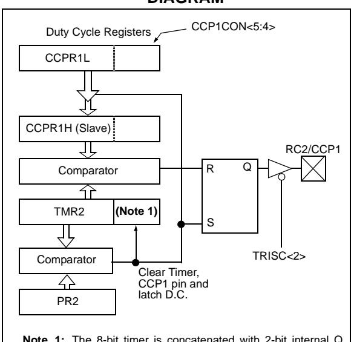

A PWM output (Figure 8-4) has a time base (period) and a time that the output stays high (duty cycle). The frequency of the PWM is the inverse of the period (1/period).

clock, or 2 bits of the prescaler, to create 10-bit time

#### <span id="page-68-1"></span>FIGURE 8-4: PWM OUTPUT


#### <span id="page-68-5"></span>8.3.1 PWM PERIOD

The PWM period is specified by writing to the PR2 register. The PWM period can be calculated using the following formula:

PWM frequency is defined as 1/[PWM period].

When TMR2 is equal to PR2, the following three events occur on the next increment cycle:

- · TMR2 is cleared
- The CCP1 pin is set (exception: if PWM duty cycle = 0%, the CCP1 pin will not be set)
- The PWM duty cycle is latched from CCPR1L into CCPR1H

Note: The Timer2 postscaler (see Section 7.1 "Timer2 Prescaler and Postscaler") is not used in the determination of the PWM frequency. The postscaler could be used to have a servo update rate at a different frequency than the PWM output.

#### <span id="page-68-4"></span>8.3.2 PWM DUTY CYCLE

The PWM duty cycle is specified by writing to the CCPR1L register and to the CCP1CON<5:4> bits. Up to 10-bit resolution is available. The CCPR1L contains the eight MSbs and the CCP1CON<5:4> contains the two LSbs. This 10-bit value is represented by CCPR1L:CCP1CON<5:4>. The following equation is used to calculate the PWM duty cycle in time:

CCPR1L and CCP1CON<5:4> can be written to at any time, but the duty cycle value is not latched into CCPR1H until after a match between PR2 and TMR2 occurs (i.e., the period is complete). In PWM mode, CCPR1H is a read-only register.

The CCPR1H register and a 2-bit internal latch are used to double-buffer the PWM duty cycle. This double-buffering is essential for glitch-free PWM operation.

When the CCPR1H and 2-bit latch match TMR2, concatenated with an internal 2-bit Q clock or 2 bits of the TMR2 prescaler, the CCP1 pin is cleared.

The maximum PWM resolution (bits) for a given PWM frequency is given by the following formula.

### **EQUATION 8-1:**

Resolution = 
$$\frac{\log(\frac{FOSC}{FPWM})}{\log(2)}$$
 bits

**Note:** If the PWM duty cycle value is longer than the PWM period, the CCP1 pin will not be cleared.

### <span id="page-69-0"></span>8.3.3 SETUP FOR PWM OPERATION

The following steps should be taken when configuring the CCP module for PWM operation:

- 1. Set the PWM period by writing to the PR2 register.
- 2. Set the PWM duty cycle by writing to the CCPR1L register and CCP1CON<5:4> bits.
- 3. Make the CCP1 pin an output by clearing the TRISC<2> bit.
- 4. Set the TMR2 prescale value and enable Timer2 by writing to T2CON.
- 5. Configure the CCP1 module for PWM operation.

<span id="page-69-2"></span>**TABLE 8-3: EXAMPLE PWM FREQUENCIES AND RESOLUTIONS AT 20 MHz** 

| PWM Frequency              | 1.22 kHz | 4.88 kHz | 19.53 kHz | 78.12kHz | 156.3 kHz | 208.3 kHz |
|----------------------------|----------|----------|-----------|----------|-----------|-----------|
| Timer Prescaler (1, 4, 16) | 16       | 4        | 1         | 1        | 1         | 1         |
| PR2 Value                  | 0xFFh    | 0xFFh    | 0xFFh     | 0x3Fh    | 0x1Fh     | 0x17h     |
| Maximum Resolution (bits)  | 10       | 10       | 10        | 8        | 7         | 5.5       |

<span id="page-69-1"></span>**TABLE 8-4: REGISTERS ASSOCIATED WITH CAPTURE, COMPARE AND TIMER1**

| Address                | Name    | Bit 7                                                       | Bit 6                                                                                              | Bit 5                                | Bit 4 | Bit 3                                                                      | Bit 2  | Bit 1                              | Bit 0                      | Value on:<br>POR, BOR |  | Value on<br>all other<br>Resets |
|------------------------|---------|-------------------------------------------------------------|----------------------------------------------------------------------------------------------------|--------------------------------------|-------|----------------------------------------------------------------------------|--------|------------------------------------|----------------------------|-----------------------|--|---------------------------------|
| 0Bh,8Bh,<br>10Bh, 18Bh | INTCON  | GIE                                                         | PEIE                                                                                               | TMR0IE                               | INTE  | RBIE                                                                       | TMR0IF | INTF                               | RBIF                       | 0000 000x 0000 000u   |  |                                 |
| 0Ch                    | PIR1    | PSPIF(1)                                                    | ADIF                                                                                               | RCIF                                 | TXIF  | SSPIF                                                                      | CCP1IF | TMR2IF                             | TMR1IF                     | 0000 0000 0000 0000   |  |                                 |
| 0Dh                    | PIR2    | —                                                           | —                                                                                                  | —                                    | —     | —                                                                          | —      | —                                  | CCP2IF                     | 00                    |  |                                 |
| 8Ch                    | PIE1    | PSPIE(1)                                                    | ADIE                                                                                               | RCIE                                 | TXIE  | SSPIE                                                                      | CCP1IE | TMR2IE                             | TMR1IE 0000 0000 0000 0000 |                       |  |                                 |
| 8Dh                    | PIE2    | —                                                           | —                                                                                                  | —                                    | —     | —                                                                          | —      | —                                  | CCP2IE                     | 00                    |  |                                 |
| 87h                    | TRISC   |                                                             | PORTC Data Direction Register<br>1111 1111 1111 1111                                               |                                      |       |                                                                            |        |                                    |                            |                       |  |                                 |
| 0Eh                    | TMR1L   |                                                             | Holding Register for the Least Significant Byte of the 16-bit TMR1 Register<br>xxxx xxxx uuuu uuuu |                                      |       |                                                                            |        |                                    |                            |                       |  |                                 |
| 0Fh                    | TMR1H   |                                                             |                                                                                                    |                                      |       | Holding Register for the Most Significant Byte of the 16-bit TMR1 Register |        |                                    |                            | xxxx xxxx uuuu uuuu   |  |                                 |
| 10h                    | T1CON   | —                                                           | —                                                                                                  |                                      |       | T1CKPS1 T1CKPS0 T1OSCEN T1SYNC TMR1CS TMR1ON00 0000uu uuuu                 |        |                                    |                            |                       |  |                                 |
| 15h                    | CCPR1L  |                                                             |                                                                                                    | Capture/Compare/PWM Register 1 (LSB) |       |                                                                            |        |                                    |                            | xxxx xxxx uuuu uuuu   |  |                                 |
| 16h                    | CCPR1H  |                                                             |                                                                                                    | Capture/Compare/PWM Register 1 (MSB) |       |                                                                            |        |                                    |                            | xxxx xxxx uuuu uuuu   |  |                                 |
| 17h                    | CCP1CON | —                                                           | —                                                                                                  | CCP1X                                | CCP1Y | CCP1M3                                                                     |        | CCP1M2 CCP1M1 CCP1M000 000000 0000 |                            |                       |  |                                 |
| 1Bh                    | CCPR2L  | Capture/Compare/PWM Register 2 (LSB)<br>xxxx xxxx uuuu uuuu |                                                                                                    |                                      |       |                                                                            |        |                                    |                            |                       |  |                                 |
| 1Ch                    | CCPR2H  |                                                             | Capture/Compare/PWM Register 2 (MSB)<br>xxxx xxxx uuuu uuuu                                        |                                      |       |                                                                            |        |                                    |                            |                       |  |                                 |
| 1Dh                    | CCP2CON | —                                                           | —                                                                                                  | CCP2X                                | CCP2Y | CCP2M3                                                                     |        | CCP2M2 CCP2M1 CCP2M000 000000 0000 |                            |                       |  |                                 |

**Legend:** x = unknown, u = unchanged, - = unimplemented, read as '0'. Shaded cells are not used by Capture and Timer1.

**Note 1:** The PSP is not implemented on 28-pin devices; always maintain these bits clear.

<span id="page-70-0"></span>**TABLE 8-5: REGISTERS ASSOCIATED WITH PWM AND TIMER2**

| Address                | Name    | Bit 7                                | Bit 6                                | Bit 5  | Bit 4 | Bit 3  | Bit 2                                                                      | Bit 1  | Bit 0                      |  | Value on:<br>POR, BOR | Value on<br>all other<br>Resets |
|------------------------|---------|--------------------------------------|--------------------------------------|--------|-------|--------|----------------------------------------------------------------------------|--------|----------------------------|--|-----------------------|---------------------------------|
| 0Bh,8Bh,<br>10Bh, 18Bh | INTCON  | GIE                                  | PEIE                                 | TMR0IE | INTE  | RBIE   | TMR0IF                                                                     | INTF   | RBIF                       |  | 0000 000x 0000 000u   |                                 |
| 0Ch                    | PIR1    | PSPIF(1)                             | ADIF                                 | RCIF   | TXIF  | SSPIF  | CCP1IF                                                                     | TMR2IF | TMR1IF                     |  | 0000 0000 0000 0000   |                                 |
| 0Dh                    | PIR2    | —                                    | —                                    | —      | —     | —      | —                                                                          | —      | CCP2IF                     |  | 00                    |                                 |
| 8Ch                    | PIE1    | PSPIE(1)                             | ADIE                                 | RCIE   | TXIE  | SSPIE  | CCP1IE                                                                     | TMR2IE | TMR1IE 0000 0000 0000 0000 |  |                       |                                 |
| 8Dh                    | PIE2    | —                                    | —                                    | —      | —     | —      | —                                                                          | —      | CCP2IE                     |  | 00                    |                                 |
| 87h                    | TRISC   |                                      | PORTC Data Direction Register        |        |       |        |                                                                            |        |                            |  | 1111 1111 1111 1111   |                                 |
| 11h                    | TMR2    |                                      | Timer2 Module's Register             |        |       |        |                                                                            |        |                            |  | 0000 0000 0000 0000   |                                 |
| 92h                    | PR2     |                                      | Timer2 Module's Period Register      |        |       |        |                                                                            |        |                            |  | 1111 1111 1111 1111   |                                 |
| 12h                    | T2CON   | —                                    |                                      |        |       |        | TOUTPS3 TOUTPS2 TOUTPS1 TOUTPS0 TMR2ON T2CKPS1 T2CKPS0 -000 0000 -000 0000 |        |                            |  |                       |                                 |
| 15h                    | CCPR1L  |                                      | Capture/Compare/PWM Register 1 (LSB) |        |       |        |                                                                            |        |                            |  | xxxx xxxx uuuu uuuu   |                                 |
| 16h                    | CCPR1H  |                                      | Capture/Compare/PWM Register 1 (MSB) |        |       |        |                                                                            |        |                            |  | xxxx xxxx uuuu uuuu   |                                 |
| 17h                    | CCP1CON | —                                    | —                                    | CCP1X  | CCP1Y | CCP1M3 | CCP1M2                                                                     | CCP1M1 | CCP1M000 000000 0000       |  |                       |                                 |
| 1Bh                    | CCPR2L  | Capture/Compare/PWM Register 2 (LSB) |                                      |        |       |        |                                                                            |        |                            |  | xxxx xxxx uuuu uuuu   |                                 |
| 1Ch                    | CCPR2H  | Capture/Compare/PWM Register 2 (MSB) |                                      |        |       |        |                                                                            |        |                            |  | xxxx xxxx uuuu uuuu   |                                 |
| 1Dh                    | CCP2CON | —                                    | —                                    | CCP2X  | CCP2Y | CCP2M3 | CCP2M2                                                                     | CCP2M1 | CCP2M000 000000 0000       |  |                       |                                 |

**Legend:** x = unknown, u = unchanged, - = unimplemented, read as '0'. Shaded cells are not used by PWM and Timer2.

**Note 1:** Bits PSPIE and PSPIF are reserved on 28-pin devices; always maintain these bits clear.

**NOTES:**

## <span id="page-72-4"></span><span id="page-72-0"></span>9.0 MASTER SYNCHRONOUS SERIAL PORT (MSSP) MODULE

### 9.1 Master SSP (MSSP) Module Overview

The Master Synchronous Serial Port (MSSP) module is a serial interface, useful for communicating with other peripheral or microcontroller devices. These peripheral devices may be serial EEPROMs, shift registers, display drivers, A/D converters, etc. The MSSP module can operate in one of two modes:

- <span id="page-72-6"></span><span id="page-72-3"></span>• Serial Peripheral Interface (SPI)
- Inter-Integrated Circuit (I<sup>2</sup>C)
  - Full Master mode
  - Slave mode (with general address call)

The I<sup>2</sup>C interface supports the following modes in hardware:

- Master mode
- Multi-Master mode
- · Slave mode

### <span id="page-72-7"></span>9.2 Control Registers

The MSSP module has three associated registers. These include a status register (SSPSTAT) and two control registers (SSPCON and SSPCON2). The use of these registers and their individual configuration bits differ significantly, depending on whether the MSSP module is operated in SPI or I<sup>2</sup>C mode.

Additional details are provided under the individual sections.

#### <span id="page-72-5"></span>9.3 SPI Mode

The SPI mode allows 8 bits of data to be synchronously transmitted and received simultaneously. All four modes of SPI are supported. To accomplish communication, typically three pins are used:

- <span id="page-72-11"></span>• Serial Data Out (SDO) – RC5/SDO
- <span id="page-72-10"></span><span id="page-72-9"></span>• Serial Data In (SDI) - RC4/SDI/SDA
- Serial Clock (SCK) RC3/SCK/SCL

Additionally, a fourth pin may be used when in a Slave mode of operation:

<span id="page-72-12"></span>• Slave Select (SS) - RA5/AN4/SS/C2OUT

Figure 9-1 shows the block diagram of the MSSP module when operating in SPI mode.

<span id="page-72-2"></span><span id="page-72-1"></span>FIGURE 9-1: MSSP BLOCK DIAGRAM (SPI MODE)

<span id="page-72-8"></span>

When the SPI is in Slave mode with \$\overline{SS}\$ pin control enabled (SSPCON<3:0> = 0100), the state of the \$\overline{SS}\$ pin can affect the state read back from the TRISC<5> bit. The Peripheral OE signal from the SSP module in PORTC controls the state that is read back from the TRISC<5> bit (see Section 4.3 "PORTC and the TRISC Register" for information on PORTC). If Read-Modify-Write instructions, such as BSF, are performed on the TRISC register while the \$\overline{SS}\$ pin is high, this will cause the TRISC<5> bit to be set, thus disabling the SDO output.

### 9.3.1 REGISTERS

The MSSP module has four registers for SPI mode operation. These are:

- MSSP Control Register (SSPCON)
- MSSP Status Register (SSPSTAT)
- Serial Receive/Transmit Buffer Register (SSPBUF)
- MSSP Shift Register (SSPSR) Not directly accessible

SSPCON and SSPSTAT are the control and status registers in SPI mode operation. The SSPCON register is readable and writable. The lower six bits of the SSPSTAT are read-only. The upper two bits of the SSPSTAT are read/write.

SSPSR is the shift register used for shifting data in or out. SSPBUF is the buffer register to which data bytes are written to or read from.

In receive operations, SSPSR and SSPBUF together create a double-buffered receiver. When SSPSR receives a complete byte, it is transferred to SSPBUF and the SSPIF interrupt is set.

During transmission, the SSPBUF is not doublebuffered. A write to SSPBUF will write to both SSPBUF and SSPSR.

### **REGISTER 9-1: SSPSTAT: MSSP STATUS REGISTER (SPI MODE) (ADDRESS 94h)**

<span id="page-73-0"></span>

| R/W-0 | R/W-0 | R-0 | R-0 | R-0 | R-0 | R-0 | R-0   |  |
|-------|-------|-----|-----|-----|-----|-----|-------|--|
| SMP   | CKE   | D/A | P   | S   | R/W | UA  | BF    |  |
| bit 7 |       |     |     |     |     |     | bit 0 |  |

bit 7 **SMP:** Sample bit

SPI Master mode:

1 = Input data sampled at end of data output time

0 = Input data sampled at middle of data output time

SPI Slave mode:

SMP must be cleared when SPI is used in Slave mode.

bit 6 **CKE:** SPI Clock Select bit

1 = Transmit occurs on transition from active to Idle clock state

0 = Transmit occurs on transition from Idle to active clock state

**Note:** Polarity of clock state is set by the CKP bit (SSPCON1<4>).

bit 5 **D/A:** Data/Address bit

Used in I2C mode only.

bit 4 **P:** Stop bit

Used in I2C mode only. This bit is cleared when the MSSP module is disabled, SSPEN is cleared.

bit 3 **S:** Start bit

Used in I2C mode only.

bit 2 **R/W:** Read/Write bit information

Used in I2C mode only.

bit 1 **UA:** Update Address bit

Used in I2C mode only.

bit 0 **BF:** Buffer Full Status bit (Receive mode only)

1 = Receive complete, SSPBUF is full

0 = Receive not complete, SSPBUF is empty

R = Readable bit W = Writable bit U = Unimplemented bit, read as '0' - n = Value at POR '1' = Bit is set '0' = Bit is cleared x = Bit is unknown

### REGISTER 9-2: SSPCON1: MSSP CONTROL REGISTER 1 (SPI MODE) (ADDRESS 14h)

<span id="page-74-0"></span>

| R/W-0 | R/W-0 | R/W-0 | R/W-0 | R/W-0 | R/W-0 | R/W-0 | R/W-0 |  |
|-------|-------|-------|-------|-------|-------|-------|-------|--|
| WCOL  | SSPOV | SSPEN | CKP   | SSPM3 | SSPM2 | SSPM1 | SSPM0 |  |

bit 7 bit 0

- bit 7 **WCOL:** Write Collision Detect bit (Transmit mode only)
  - 1 = The SSPBUF register is written while it is still transmitting the previous word. (Must be cleared in software.)
  - 0 = No collision
- bit 6 SSPOV: Receive Overflow Indicator bit

#### SPI Slave mode:

- 1 = A new byte is received while the SSPBUF register is still holding the previous data. In case of overflow, the data in SSPSR is lost. Overflow can only occur in Slave mode. The user must read the SSPBUF, even if only transmitting data, to avoid setting overflow. (Must be cleared in software.)
- 0 = No overflow

**Note:** In Master mode, the overflow bit is not set, since each new reception (and transmission) is initiated by writing to the SSPBUF register.

- bit 5 SSPEN: Synchronous Serial Port Enable bit
  - 1 = Enables serial port and configures SCK, SDO, SDI, and  $\overline{SS}$  as serial port pins
  - 0 = Disables serial port and configures these pins as I/O port pins

**Note:** When enabled, these pins must be properly configured as input or output.

- bit 4 **CKP:** Clock Polarity Select bit
  - 1 = Idle state for clock is a high level
  - 0 = Idle state for clock is a low level
- bit 3-0 SSPM3:SSPM0: Synchronous Serial Port Mode Select bits
  - 0101 = SPI Slave mode, clock = SCK pin.  $\overline{SS}$  pin control disabled.  $\overline{SS}$  can be used as I/O pin.
  - 0100 = SPI Slave mode, clock = SCK pin. SS pin control enabled.
  - 0011 = SPI Master mode, clock = TMR2 output/2
  - 0010 = SPI Master mode, clock = Fosc/64
  - 0001 = SPI Master mode, clock = Fosc/16
  - 0000 = SPI Master mode, clock = Fosc/4

**Note:** Bit combinations not specifically listed here are either reserved or implemented in I<sup>2</sup>C mode only.

### Legend:

R = Readable bit W = Writable bit U = Unimplemented bit, read as '0' - n = Value at POR '1' = Bit is set '0' = Bit is cleared x = Bit is unknown

### 9.3.2 OPERATION

When initializing the SPI, several options need to be specified. This is done by programming the appropriate control bits (SSPCON<5:0> and SSPSTAT<7:6>). These control bits allow the following to be specified:

- Master mode (SCK is the clock output)
- Slave mode (SCK is the clock input)
- Clock Polarity (Idle state of SCK)
- Data Input Sample Phase (middle or end of data output time)
- Clock Edge (output data on rising/falling edge of SCK)
- Clock Rate (Master mode only)
- Slave Select mode (Slave mode only)

The MSSP consists of a transmit/receive shift register (SSPSR) and a buffer register (SSPBUF). The SSPSR shifts the data in and out of the device, MSb first. The SSPBUF holds the data that was written to the SSPSR until the received data is ready. Once the eight bits of data have been received, that byte is moved to the SSPBUF register. Then, the Buffer Full detect bit, BF (SSPSTAT<0>), and the interrupt flag bit, SSPIF, are set. This double-buffering of the received data (SSPBUF) allows the next byte to start reception before reading the data that was just received. Any write to the

SSPBUF register during transmission/reception of data will be ignored and the write collision detect bit, WCOL (SSPCON<7>), will be set. User software must clear the WCOL bit so that it can be determined if the following write(s) to the SSPBUF register completed successfully.

When the application software is expecting to receive valid data, the SSPBUF should be read before the next byte of data to transfer is written to the SSPBUF. Buffer Full bit, BF (SSPSTAT<0>), indicates when SSPBUF has been loaded with the received data (transmission is complete). When the SSPBUF is read, the BF bit is cleared. This data may be irrelevant if the SPI is only a transmitter. Generally, the MSSP interrupt is used to determine when the transmission/reception has completed. The SSPBUF must be read and/or written. If the interrupt method is not going to be used, then software polling can be done to ensure that a write collision does not occur. [Example 9-1](#page-75-0) shows the loading of the SSPBUF (SSPSR) for data transmission.

The SSPSR is not directly readable or writable and can only be accessed by addressing the SSPBUF register. Additionally, the MSSP Status register (SSPSTAT) indicates the various status conditions.

### <span id="page-75-1"></span><span id="page-75-0"></span>**EXAMPLE 9-1: LOADING THE SSPBUF (SSPSR) REGISTER**

| BRA<br>MOVF | LOOP BTFSS SSPSTAT, BF<br>LOOP<br>SSPBUF, W | ;Has data been received(transmit complete)?<br>;No<br>;WREG reg = contents of SSPBUF |
|-------------|---------------------------------------------|--------------------------------------------------------------------------------------|
|             | MOVWF RXDATA                                | ;Save in user RAM, if data is meaningful                                             |
| MOVF        | TXDATA, W<br>MOVWF SSPBUF                   | ;W reg = contents of TXDATA<br>;New data to xmit                                     |

### 9.3.3 ENABLING SPI I/O

To enable the serial port, SSP Enable bit, SSPEN (SSPCON<5>), must be set. To reset or reconfigure SPI mode, clear the SSPEN bit, re-initialize the SSPCON registers and then set the SSPEN bit. This configures the SDI, SDO, SCK and SS pins as serial port pins. For the pins to behave as the serial port function, some must have their data direction bits (in the TRIS register) appropriately programmed. That is:

- SDI is automatically controlled by the SPI module
- SDO must have TRISC<5> bit cleared
- SCK (Master mode) must have TRISC<3> bit cleared
- SCK (Slave mode) must have TRISC<3> bit set
- SS must have TRISC<4> bit set

Any serial port function that is not desired may be overridden by programming the corresponding data direction (TRIS) register to the opposite value.

### <span id="page-76-3"></span><span id="page-76-1"></span>9.3.4 TYPICAL CONNECTION

[Figure 9-2](#page-76-0) shows a typical connection between two microcontrollers. The master controller (Processor 1) initiates the data transfer by sending the SCK signal. Data is shifted out of both shift registers on their programmed clock edge and latched on the opposite edge of the clock. Both processors should be programmed to the same Clock Polarity (CKP), then both controllers would send and receive data at the same time. Whether the data is meaningful (or dummy data) depends on the application software. This leads to three scenarios for data transmission:

- Master sends data Slave sends dummy data
- Master sends data Slave sends data
- Master sends dummy data Slave sends data

<span id="page-76-2"></span><span id="page-76-0"></span>**FIGURE 9-2: SPI MASTER/SLAVE CONNECTION** 


#### <span id="page-77-1"></span>9.3.5 MASTER MODE

The master can initiate the data transfer at any time because it controls the SCK. The master determines when the slave (Processor 2, Figure 9-2) is to broadcast data by the software protocol.

In Master mode, the data is transmitted/received as soon as the SSPBUF register is written to. If the SPI is only going to receive, the SDO output could be disabled (programmed as an input). The SSPSR register will continue to shift in the signal present on the SDI pin at the programmed clock rate. As each byte is received, it will be loaded into the SSPBUF register as if a normal received byte (interrupts and status bits appropriately set). This could be useful in receiver applications as a "Line Activity Monitor" mode.

The clock polarity is selected by appropriately programming the CKP bit (SSPCON<4>). This then, would give waveforms for SPI communication as shown in

<span id="page-77-5"></span><span id="page-77-4"></span>Figure 9-3, Figure 9-5 and Figure 9-6, where the MSB is transmitted first. In Master mode, the SPI clock rate (bit rate) is user programmable to be one of the following:

- Fosc/4 (or Tcy)
- Fosc/16 (or 4 Tcy)
- Fosc/64 (or 16 Tcy)
- <span id="page-77-3"></span>• Timer2 output/2

This allows a maximum data rate (at 40 MHz) of 10.00 Mbps.

<span id="page-77-6"></span><span id="page-77-2"></span>Figure 9-3 shows the waveforms for Master mode. When the CKE bit is set, the SDO data is valid before there is a clock edge on SCK. The change of the input sample is shown based on the state of the SMP bit. The time when the SSPBUF is loaded with the received data is shown.

<span id="page-77-0"></span>FIGURE 9-3: SPI MODE WAVEFORM (MASTER MODE)


#### <span id="page-78-0"></span>9.3.6 SLAVE MODE

In Slave mode, the data is transmitted and received as the external clock pulses appear on SCK. When the last bit is latched, the SSPIF interrupt flag bit is set.

While in Slave mode, the external clock is supplied by the external clock source on the SCK pin. This external clock must meet the minimum high and low times as specified in the electrical specifications.

While in Sleep mode, the slave can transmit/receive data. When a byte is received, the device will wake-up from Sleep.

# <span id="page-78-1"></span>9.3.7 SLAVE SELECT SYNCHRONIZATION

The  $\overline{SS}$  pin allows a Synchronous Slave mode. The SPI must be in Slave mode with  $\overline{SS}$  pin control enabled (SSPCON<3:0> = 04h). The pin must not be driven low for the  $\overline{SS}$  pin to function as an input. The data latch must be high. When the  $\overline{SS}$  pin is low, transmission and reception are enabled and the SDO pin is driven. When

the  $\overline{SS}$  pin goes high, the SDO pin is no longer driven even if in the middle of a transmitted byte and becomes a floating output. External pull-up/pull-down resistors may be desirable, depending on the application.

- Note 1: When the SPI is in Slave mode with SS pin control enabled (SSPCON<3:0> = 0100), the SPI module will reset if the SS pin is set to VDD.
  - 2: If the SPI is used in Slave Mode with CKE set, then the SS pin control must be enabled.

When the SPI module resets, the bit counter is forced to '0'. This can be done by either forcing the  $\overline{SS}$  pin to a high level or clearing the SSPEN bit.

To emulate two-wire communication, the SDO pin can be connected to the SDI pin. When the SPI needs to operate as a receiver, the SDO pin can be configured as an input. This disables transmissions from the SDO. The SDI can always be left as an input (SDI function) since it cannot create a bus conflict.

<span id="page-78-2"></span>

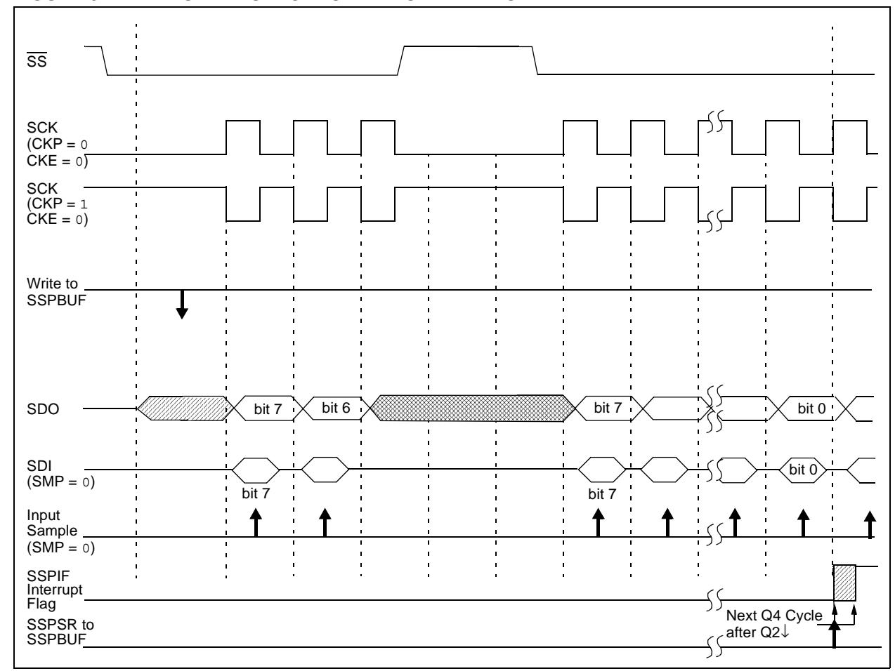

<span id="page-79-2"></span><span id="page-79-0"></span>FIGURE 9-5: SPI MODE WAVEFORM (SLAVE MODE WITH CKE = 0)


<span id="page-79-3"></span><span id="page-79-1"></span>FIGURE 9-6: SPI MODE WAVEFORM (SLAVE MODE WITH CKE = 1)


### <span id="page-80-4"></span>9.3.8 SLEEP OPERATION

In Master mode, all module clocks are halted and the transmission/reception will remain in that state until the device wakes from Sleep. After the device returns to normal mode, the module will continue to transmit/ receive data.

In Slave mode, the SPI Transmit/Receive Shift register operates asynchronously to the device. This allows the device to be placed in Sleep mode and data to be shifted into the SPI Transmit/Receive Shift register. When all 8 bits have been received, the MSSP interrupt flag bit will be set and if enabled, will wake the device from Sleep.

### <span id="page-80-3"></span>9.3.9 EFFECTS OF A RESET

A Reset disables the MSSP module and terminates the current transfer.

### <span id="page-80-2"></span>9.3.10 BUS MODE COMPATIBILITY

[Table 9-1](#page-80-1) shows the compatibility between the standard SPI modes and the states of the CKP and CKE control bits.

<span id="page-80-1"></span>**TABLE 9-1: SPI BUS MODES** 

| Standard SPI Mode | Control Bits State |     |  |  |  |  |
|-------------------|--------------------|-----|--|--|--|--|
| Terminology       | CKP                | CKE |  |  |  |  |
| 0, 0              | 0                  | 1   |  |  |  |  |
| 0, 1              | 0                  | 0   |  |  |  |  |
| 1, 0              | 1                  | 1   |  |  |  |  |
| 1, 1              | 1                  | 0   |  |  |  |  |

There is also a SMP bit which controls when the data is sampled.

<span id="page-80-0"></span>**TABLE 9-2: REGISTERS ASSOCIATED WITH SPI OPERATION** 

| Name    | Bit 7        | Bit 6                         | Bit 5                         | Bit 4  | Bit 3                                                    | Bit 2  | Bit 1  | Bit 0                      | Value on<br>POR, BOR |                     | Value on<br>all other<br>Resets |
|---------|--------------|-------------------------------|-------------------------------|--------|----------------------------------------------------------|--------|--------|----------------------------|----------------------|---------------------|---------------------------------|
| INTCON  | GIE/<br>GIEH | PEIE/<br>GIEL                 | TMR0IE                        | INT0IE | RBIE                                                     | TMR0IF | INT0IF | RBIF                       |                      | 0000 000x 0000 000u |                                 |
| PIR1    | PSPIF(1)     | ADIF                          | RCIF                          | TXIF   | SSPIF                                                    | CCP1IF | TMR2IF | TMR1IF 0000 0000 0000 0000 |                      |                     |                                 |
| PIE1    | PSPIE(1)     | ADIE                          | RCIE                          | TXIE   | SSPIE                                                    | CCP1IE | TMR2IE | TMR1IE 0000 0000 0000 0000 |                      |                     |                                 |
| TRISC   |              |                               | PORTC Data Direction Register |        |                                                          |        |        |                            |                      | 1111 1111 1111 1111 |                                 |
| SSPBUF  |              |                               |                               |        | Synchronous Serial Port Receive Buffer/Transmit Register |        |        |                            |                      | xxxx xxxx uuuu uuuu |                                 |
| SSPCON  | WCOL         | SSPOV                         | SSPEN                         | CKP    | SSPM3                                                    | SSPM2  | SSPM1  | SSPM0                      |                      | 0000 0000 0000 0000 |                                 |
| TRISA   | —            | PORTA Data Direction Register |                               |        |                                                          |        |        |                            |                      | 11 111111 1111      |                                 |
| SSPSTAT | SMP          | CKE                           | D/A                           | P      | S                                                        | R/W    | UA     | BF                         |                      | 0000 0000 0000 0000 |                                 |

**Legend:** x = unknown, u = unchanged, - = unimplemented, read as '0'. Shaded cells are not used by the MSSP in SPI mode.

**Note 1:** The PSPIF, PSPIE and PSPIP bits are reserved on 28-pin devices; always maintain these bits clear.

## <span id="page-81-2"></span>**9.4 I2C Mode**

The MSSP module in I2C mode fully implements all master and slave functions (including general call support) and provides interrupts on Start and Stop bits in hardware to determine a free bus (multi-master function). The MSSP module implements the standard mode specifications, as well as 7-bit and 10-bit addressing.

Two pins are used for data transfer:

- Serial clock (SCL) RC3/SCK/SCL
- Serial data (SDA) RC4/SDI/SDA

The user must configure these pins as inputs or outputs through the TRISC<4:3> bits.

<span id="page-81-0"></span>**FIGURE 9-7: MSSP BLOCK DIAGRAM (I2C MODE)** 


### <span id="page-81-1"></span>9.4.1 REGISTERS

The MSSP module has six registers for I2C operation. These are:

- MSSP Control Register (SSPCON)
- MSSP Control Register 2 (SSPCON2)
- MSSP Status Register (SSPSTAT)
- Serial Receive/Transmit Buffer Register (SSPBUF)
- MSSP Shift Register (SSPSR) Not directly accessible
- MSSP Address Register (SSPADD)

SSPCON, SSPCON2 and SSPSTAT are the control and status registers in I2C mode operation. The SSPCON and SSPCON2 registers are readable and writable. The lower six bits of the SSPSTAT are read-only. The upper two bits of the SSPSTAT are read/write.

SSPSR is the shift register used for shifting data in or out. SSPBUF is the buffer register to which data bytes are written to or read from.

SSPADD register holds the slave device address when the SSP is configured in I2C Slave mode. When the SSP is configured in Master mode, the lower seven bits of SSPADD act as the baud rate generator reload value.

In receive operations, SSPSR and SSPBUF together create a double-buffered receiver. When SSPSR receives a complete byte, it is transferred to SSPBUF and the SSPIF interrupt is set.

During transmission, the SSPBUF is not doublebuffered. A write to SSPBUF will write to both SSPBUF and SSPSR.

## **REGISTER 9-3: SSPSTAT: MSSP STATUS REGISTER (I2C MODE) (ADDRESS 94h)**

<span id="page-82-0"></span>

| R/W-0 | R/W-0 | R-0 | R-0 | R-0 | R-0 | R-0 | R-0   |
|-------|-------|-----|-----|-----|-----|-----|-------|
| SMP   | CKE   | D/A | P   | S   | R/W | UA  | BF    |
| bit 7 |       |     |     |     |     |     | bit 0 |

In Master or Slave mode:

- 1 = Slew rate control disabled for standard speed mode (100 kHz and 1 MHz)
- 0 = Slew rate control enabled for high-speed mode (400 kHz)
- bit 6 **CKE:** SMBus Select bit

bit 7 **SMP:** Slew Rate Control bit

### In Master or Slave mode:

- 1 = Enable SMBus specific inputs
- 0 = Disable SMBus specific inputs
- bit 5 **D/A:** Data/Address bit

#### In Master mode:

Reserved.

# In Slave mode:

- 1 = Indicates that the last byte received or transmitted was data
- 0 = Indicates that the last byte received or transmitted was address
- bit 4 **P:** Stop bit
  - 1 = Indicates that a Stop bit has been detected last
  - 0 = Stop bit was not detected last

**Note:** This bit is cleared on Reset and when SSPEN is cleared.

- bit 3 **S:** Start bit
  - 1 = Indicates that a Start bit has been detected last
  - 0 = Start bit was not detected last

**Note:** This bit is cleared on Reset and when SSPEN is cleared.

bit 2 **R/W:** Read/Write bit information (I2C mode only)

#### In Slave mode:

- 1 = Read
- 0 = Write

**Note:** This bit holds the R/W bit information following the last address match. This bit is only valid from the address match to the next Start bit, Stop bit or not ACK bit.

### In Master mode:

- 1 = Transmit is in progress
- 0 = Transmit is not in progress

**Note:** ORing this bit with SEN, RSEN, PEN, RCEN or ACKEN will indicate if the MSSP is in Idle mode.

- bit 1 **UA:** Update Address (10-bit Slave mode only)
  - 1 = Indicates that the user needs to update the address in the SSPADD register
  - 0 = Address does not need to be updated
- bit 0 **BF:** Buffer Full Status bit

#### In Transmit mode:

- 1 = Receive complete, SSPBUF is full
- 0 = Receive not complete, SSPBUF is empty

### In Receive mode:

- 1 = Data Transmit in progress (does not include the ACK and Stop bits), SSPBUF is full
- 0 = Data Transmit complete (does not include the ACK and Stop bits), SSPBUF is empty

**Legend:**

R = Readable bit W = Writable bit U = Unimplemented bit, read as '0' - n = Value at POR '1' = Bit is set '0' = Bit is cleared x = Bit is unknown

## REGISTER 9-4: SSPCON1: MSSP CONTROL REGISTER 1 (I<sup>2</sup>C MODE) (ADDRESS 14h)

<span id="page-83-0"></span>

| R/W-0 | R/W-0 | R/W-0 | R/W-0 | R/W-0 | R/W-0 | R/W-0 | R/W-0 |
|-------|-------|-------|-------|-------|-------|-------|-------|
| WCOL  | SSPOV | SSPEN | CKP   | SSPM3 | SSPM2 | SSPM1 | SSPM0 |

bit 7 bit 0

#### bit 7 WCOL: Write Collision Detect bit

#### In Master Transmit mode:

- 1 = A write to the SSPBUF register was attempted while the I<sup>2</sup>C conditions were not valid for a transmission to be started. (Must be cleared in software.)
- 0 = No collision

#### In Slave Transmit mode:

- 1 = The SSPBUF register is written while it is still transmitting the previous word. (Must be cleared in software.)
- 0 = No collision

#### In Receive mode (Master or Slave modes):

This is a "don't care" bit.

#### bit 6 SSPOV: Receive Overflow Indicator bit

#### In Receive mode:

- 1 = A byte is received while the SSPBUF register is still holding the previous byte. (Must be cleared in software.)
- 0 = No overflow

#### In Transmit mode:

This is a "don't care" bit in Transmit mode.

- bit 5 SSPEN: Synchronous Serial Port Enable bit
  - 1 = Enables the serial port and configures the SDA and SCL pins as the serial port pins
  - 0 = Disables the serial port and configures these pins as I/O port pins

Note: When enabled, the SDA and SCL pins must be properly configured as input or output.

## bit 4 **CKP:** SCK Release Control bit

### In Slave mode:

- 1 = Release clock
- 0 = Holds clock low (clock stretch). (Used to ensure data setup time.)

#### In Master mode:

Unused in this mode.

#### bit 3-0 SSPM3:SSPM0: Synchronous Serial Port Mode Select bits

- $1111 = I^2C$  Slave mode, 10-bit address with Start and Stop bit interrupts enabled
- $1110 = I^2C$  Slave mode, 7-bit address with Start and Stop bit interrupts enabled
- 1011 = I<sup>2</sup>C Firmware Controlled Master mode (Slave Idle)
- 1000 =  $I^2C$  Master mode, clock = Fosc/(4 \* (SSPADD + 1))
- $0111 = I^2C$  Slave mode, 10-bit address
- $0110 = I^2C$  Slave mode, 7-bit address

**Note:** Bit combinations not specifically listed here are either reserved or implemented in SPI mode only.

### Legend:

R = Readable bit W = Writable bit U = Unimplemented bit, read as '0' - n = Value at POR '1' = Bit is set '0' = Bit is cleared X = Bit is unknown

## **REGISTER 9-5: SSPCON2: MSSP CONTROL REGISTER 2 (I2C MODE) (ADDRESS 91h)**

<span id="page-84-0"></span>

| R/W-0 | R/W-0   | R/W-0 | R/W-0 | R/W-0 | R/W-0 | R/W-0 | R/W-0 |
|-------|---------|-------|-------|-------|-------|-------|-------|
| GCEN  | ACKSTAT | ACKDT | ACKEN | RCEN  | PEN   | RSEN  | SEN   |

<span id="page-84-1"></span>bit 7 bit 0

- bit 7 **GCEN:** General Call Enable bit (Slave mode only)
  - 1 = Enable interrupt when a general call address (0000h) is received in the SSPSR
  - 0 = General call address disabled
- bit 6 **ACKSTAT:** Acknowledge Status bit (Master Transmit mode only)
  - 1 = Acknowledge was not received from slave
  - 0 = Acknowledge was received from slave
- bit 5 **ACKDT:** Acknowledge Data bit (Master Receive mode only)
  - 1 = Not Acknowledge
  - 0 = Acknowledge

**Note:** Value that will be transmitted when the user initiates an Acknowledge sequence at the end of a receive.

- bit 4 **ACKEN:** Acknowledge Sequence Enable bit (Master Receive mode only)
  - 1 = Initiate Acknowledge sequence on SDA and SCL pins and transmit ACKDT data bit. Automatically cleared by hardware.
  - 0 = Acknowledge sequence Idle
- bit 3 **RCEN:** Receive Enable bit (Master mode only)
  - 1 = Enables Receive mode for I2C
  - 0 = Receive Idle
- bit 2 **PEN:** Stop Condition Enable bit (Master mode only)
  - 1 = Initiate Stop condition on SDA and SCL pins. Automatically cleared by hardware.
  - 0 = Stop condition Idle
- bit 1 **RSEN:** Repeated Start Condition Enabled bit (Master mode only)
  - 1 = Initiate Repeated Start condition on SDA and SCL pins. Automatically cleared by hardware.
  - 0 = Repeated Start condition Idle
- bit 0 **SEN:** Start Condition Enabled/Stretch Enabled bit

### In Master mode:

- 1 = Initiate Start condition on SDA and SCL pins. Automatically cleared by hardware.
- 0 = Start condition Idle

#### In Slave mode:

- 1 = Clock stretching is enabled for both slave transmit and slave receive (stretch enabled)
- 0 = Clock stretching is enabled for slave transmit only (PIC16F87X compatibility)

### **Legend:**

R = Readable bit W = Writable bit U = Unimplemented bit, read as '0' - n = Value at POR '1' = Bit is set '0' = Bit is cleared x = Bit is unknown

**Note:** For bits ACKEN, RCEN, PEN, RSEN, SEN: If the I2C module is not in the Idle mode, this bit may not be set (no spooling) and the SSPBUF may not be written (or writes to the SSPBUF are disabled).

### <span id="page-85-4"></span>9.4.2 OPERATION

The MSSP module functions are enabled by setting MSSP Enable bit, SSPEN (SSPCON<5>).

The SSPCON register allows control of the I2C operation. Four mode selection bits (SSPCON<3:0>) allow one of the following I2C modes to be selected:

- I2C Master mode, clock = OSC/4 (SSPADD + 1)
- I2C Slave mode (7-bit address)
- I2C Slave mode (10-bit address)
- I2C Slave mode (7-bit address) with Start and Stop bit interrupts enabled
- I2C Slave mode (10-bit address) with Start and Stop bit interrupts enabled
- I2C Firmware Controlled Master mode, slave is Idle

Selection of any I2C mode, with the SSPEN bit set, forces the SCL and SDA pins to be open-drain, provided these pins are programmed to inputs by setting the appropriate TRISC bits. To ensure proper operation of the module, pull-up resistors must be provided externally to the SCL and SDA pins.

### <span id="page-85-2"></span>9.4.3 SLAVE MODE

In Slave mode, the SCL and SDA pins must be configured as inputs (TRISC<4:3> set). The MSSP module will override the input state with the output data when required (slave-transmitter).

The I2C Slave mode hardware will always generate an interrupt on an address match. Through the mode select bits, the user can also choose to interrupt on Start and Stop bits

When an address is matched, or the data transfer after an address match is received, the hardware automatically will generate the Acknowledge (ACK) pulse and load the SSPBUF register with the received value currently in the SSPSR register.

Any combination of the following conditions will cause the MSSP module not to give this ACK pulse:

- The buffer full bit, BF (SSPSTAT<0>), was set before the transfer was received.
- The overflow bit, SSPOV (SSPCON<6>), was set before the transfer was received.

In this case, the SSPSR register value is not loaded into the SSPBUF, but bit SSPIF (PIR1<3>) is set. The BF bit is cleared by reading the SSPBUF register, while bit SSPOV is cleared through software.

The SCL clock input must have a minimum high and low for proper operation. The high and low times of the I 2C specification, as well as the requirement of the MSSP module, are shown in timing parameter #100 and parameter #101.

### <span id="page-85-3"></span>9.4.3.1 Addressing

Once the MSSP module has been enabled, it waits for a Start condition to occur. Following the Start condition, the 8 bits are shifted into the SSPSR register. All incoming bits are sampled with the rising edge of the clock (SCL) line. The value of register SSPSR<7:1> is compared to the value of the SSPADD register. The address is compared on the falling edge of the eighth clock (SCL) pulse. If the addresses match, and the BF and SSPOV bits are clear, the following events occur:

- 1. The SSPSR register value is loaded into the SSPBUF register.
- 2. The Buffer Full bit, BF, is set.
- 3. An ACK pulse is generated.
- 4. MSSP Interrupt Flag bit, SSPIF (PIR1<3>), is set (interrupt is generated if enabled) on the falling edge of the ninth SCL pulse.

<span id="page-85-1"></span>In 10-bit Address mode, two address bytes need to be received by the slave. The five Most Significant bits (MSbs) of the first address byte specify if this is a 10-bit address. Bit R/W (SSPSTAT<2>) must specify a write so the slave device will receive the second address byte. For a 10-bit address, the first byte would equal '11110 A9 A8 0', where 'A9' and 'A8' are the two MSbs of the address. The sequence of events for 10-bit address is as follows, with steps 7 through 9 for the slave-transmitter:

- 1. Receive first (high) byte of address (bits SSPIF, BF and bit UA (SSPSTAT<1>) are set).
- 2. Update the SSPADD register with second (low) byte of address (clears bit UA and releases the SCL line).
- 3. Read the SSPBUF register (clears bit BF) and clear flag bit SSPIF.
- 4. Receive second (low) byte of address (bits SSPIF, BF and UA are set).
- <span id="page-85-0"></span>5. Update the SSPADD register with the first (high) byte of address. If match releases SCL line, this will clear bit UA.
- 6. Read the SSPBUF register (clears bit BF) and clear flag bit SSPIF.
- 7. Receive Repeated Start condition.
- 8. Receive first (high) byte of address (bits SSPIF and BF are set).
- 9. Read the SSPBUF register (clears bit BF) and clear flag bit SSPIF.

### <span id="page-86-3"></span><span id="page-86-1"></span>9.4.3.2 Reception

When the R/W bit of the address byte is clear and an address match occurs, the R/W bit of the SSPSTAT register is cleared. The received address is loaded into the SSPBUF register and the SDA line is held low (ACK).

<span id="page-86-0"></span>When the address byte overflow condition exists, then the No Acknowledge (ACK) pulse is given. An overflow condition is defined as either bit BF (SSPSTAT<0>) is set or bit SSPOV (SSPCON<6>) is set.

An MSSP interrupt is generated for each data transfer byte. Flag bit SSPIF (PIR1<3>) must be cleared in software. The SSPSTAT register is used to determine the status of the byte.

If SEN is enabled (SSPCON<0> = 1), RC3/SCK/SCL will be held low (clock stretch) following each data transfer. The clock must be released by setting bit CKP (SSPCON<4>). See **[Section 9.4.4 "Clock Stretching"](#page-91-0)** for more detail.

### <span id="page-86-4"></span>9.4.3.3 Transmission

<span id="page-86-2"></span>When the R/W bit of the incoming address byte is set and an address match occurs, the R/W bit of the SSPSTAT register is set. The received address is loaded into the SSPBUF register. The ACK pulse will be sent on the ninth bit and pin RC3/SCK/SCL is held low regardless of SEN (see **[Section 9.4.4 "Clock Stretching"](#page-91-0)** for more detail). By stretching the clock, the master will be unable to assert another clock pulse until the slave is done preparing the transmit data. The transmit data must be loaded into the SSPBUF register, which also loads the SSPSR register. Then pin RC3/SCK/SCL should be enabled by setting bit CKP (SSPCON<4>). The eight data bits are shifted out on the falling edge of the SCL input. This ensures that the SDA signal is valid during the SCL high time [\(Figure 9-9](#page-88-0)).

The ACK pulse from the master-receiver is latched on the rising edge of the ninth SCL input pulse. If the SDA line is high (not ACK), then the data transfer is complete. In this case, when the ACK is latched by the slave, the slave logic is reset (resets SSPSTAT register) and the slave monitors for another occurrence of the Start bit. If the SDA line was low (ACK), the next transmit data must be loaded into the SSPBUF register. Again, pin RC3/SCK/SCL must be enabled by setting bit CKP.

An MSSP interrupt is generated for each data transfer byte. The SSPIF bit must be cleared in software and the SSPSTAT register is used to determine the status of the byte. The SSPIF bit is set on the falling edge of the ninth clock pulse.

<span id="page-87-0"></span>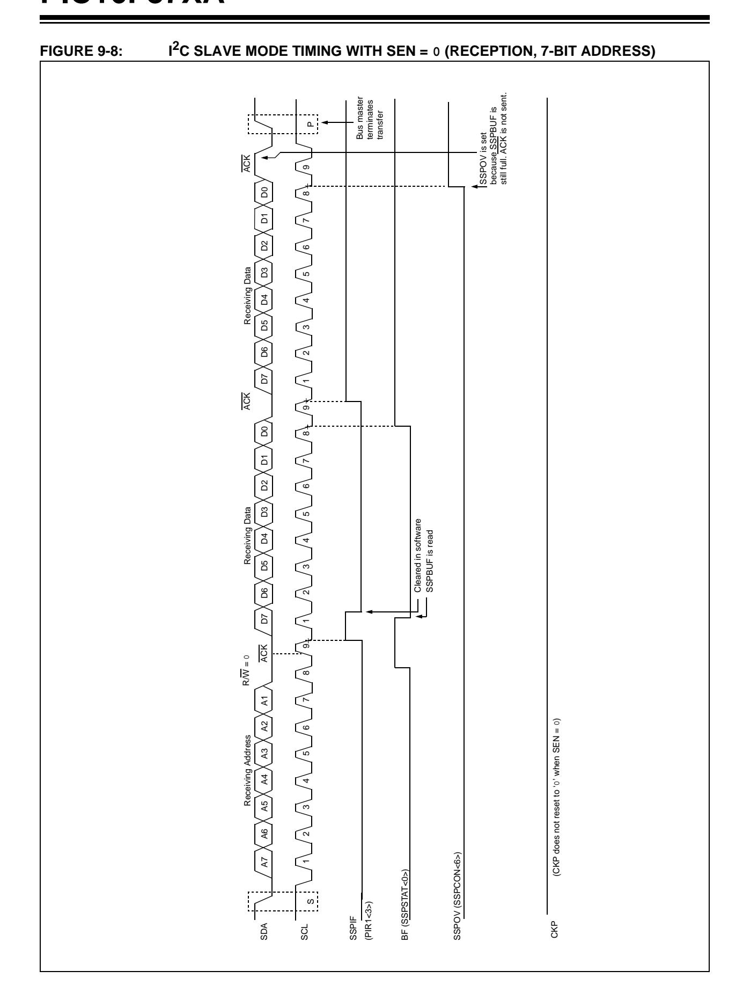

<span id="page-88-1"></span><span id="page-88-0"></span>

<span id="page-89-0"></span>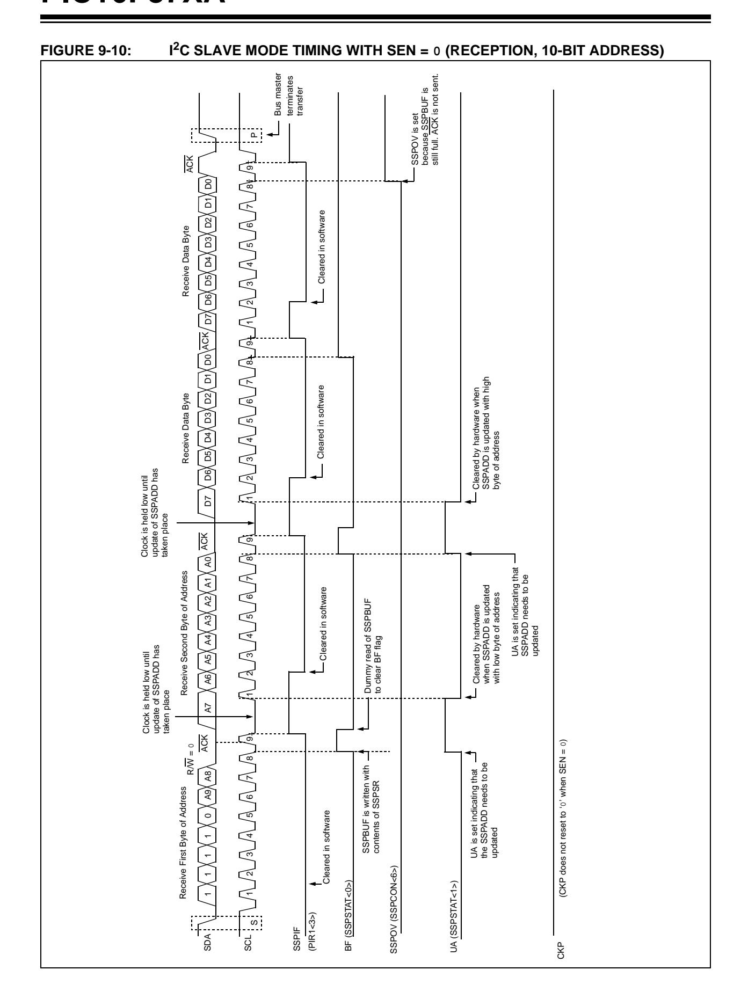

<span id="page-90-1"></span><span id="page-90-0"></span>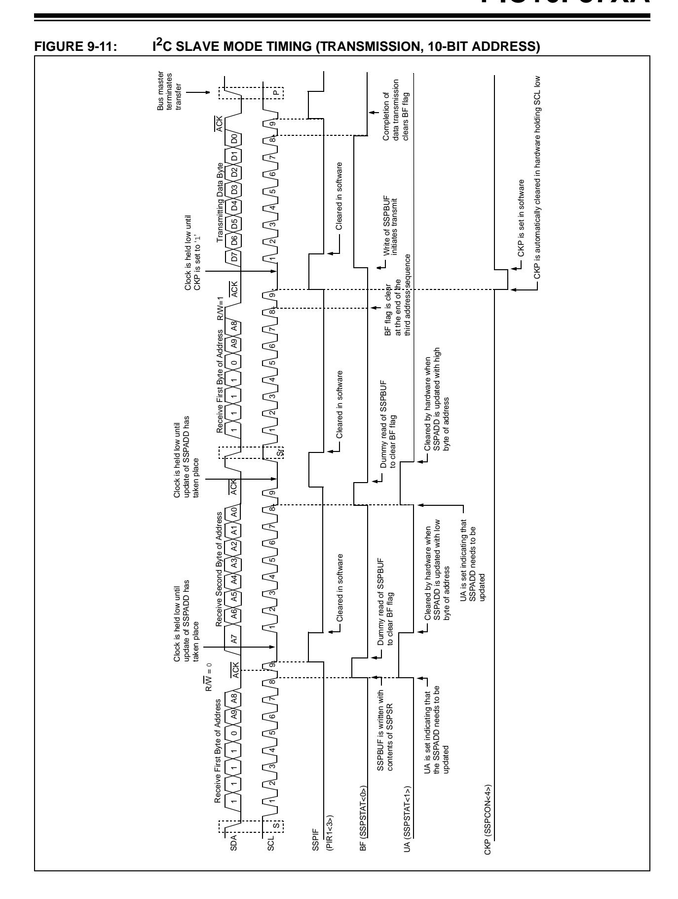

### <span id="page-91-0"></span>9.4.4 CLOCK STRETCHING

Both 7 and 10-bit Slave modes implement automatic clock stretching during a transmit sequence.

The SEN bit (SSPCON2<0>) allows clock stretching to be enabled during receives. Setting SEN will cause the SCL pin to be held low at the end of each data receive sequence.

### 9.4.4.1 Clock Stretching for 7-bit Slave Receive Mode (SEN = 1)

In 7-bit Slave Receive mode, on the falling edge of the ninth clock at the end of the ACK sequence, if the BF bit is set, the CKP bit in the SSPCON register is automatically cleared, forcing the SCL output to be held low. The CKP bit being cleared to '0' will assert the SCL line low. The CKP bit must be set in the user's ISR before reception is allowed to continue. By holding the SCL line low, the user has time to service the ISR and read the contents of the SSPBUF before the master device can initiate another receive sequence. This will prevent buffer overruns from occurring (see [Figure 9-13\)](#page-93-0).

- **Note 1:** If the user reads the contents of the SSPBUF before the falling edge of the ninth clock, thus clearing the BF bit, the CKP bit will not be cleared and clock stretching will not occur.
  - **2:** The CKP bit can be set in software regardless of the state of the BF bit. The user should be careful to clear the BF bit in the ISR before the next receive sequence in order to prevent an overflow condition.

### 9.4.4.2 Clock Stretching for 10-bit Slave Receive Mode (SEN = 1)

In 10-bit Slave Receive mode, during the address sequence, clock stretching automatically takes place but CKP is not cleared. During this time, if the UA bit is set after the ninth clock, clock stretching is initiated. The UA bit is set after receiving the upper byte of the 10-bit address and following the receive of the second byte of the 10-bit address, with the R/W bit cleared to '0'. The release of the clock line occurs upon updating SSPADD. Clock stretching will occur on each data receive sequence as described in 7-bit mode.

**Note:** If the user polls the UA bit and clears it by updating the SSPADD register before the falling edge of the ninth clock occurs and if the user hasn't cleared the BF bit by reading the SSPBUF register before that time, then the CKP bit will still NOT be asserted low. Clock stretching, on the basis of the state of the BF bit, only occurs during a data sequence, not an address sequence.

### <span id="page-91-1"></span>9.4.4.3 Clock Stretching for 7-bit Slave Transmit Mode

7-bit Slave Transmit mode implements clock stretching by clearing the CKP bit after the falling edge of the ninth clock, if the BF bit is clear. This occurs regardless of the state of the SEN bit.

The user's ISR must set the CKP bit before transmission is allowed to continue. By holding the SCL line low, the user has time to service the ISR and load the contents of the SSPBUF before the master device can initiate another transmit sequence (see [Figure 9-9](#page-88-0)).

- **Note 1:** If the user loads the contents of SSPBUF, setting the BF bit before the falling edge of the ninth clock, the CKP bit will not be cleared and clock stretching will not occur.
  - **2:** The CKP bit can be set in software regardless of the state of the BF bit.

### 9.4.4.4 Clock Stretching for 10-bit Slave Transmit Mode

In 10-bit Slave Transmit mode, clock stretching is controlled during the first two address sequences by the state of the UA bit, just as it is in 10-bit Slave Receive mode. The first two addresses are followed by a third address sequence, which contains the high order bits of the 10-bit address and the R/W bit set to '1'. After the third address sequence is performed, the UA bit is not set, the module is now configured in Transmit mode and clock stretching is controlled by the BF flag as in 7-bit Slave Transmit mode (see [Figure 9-11\)](#page-90-0).

### <span id="page-92-1"></span>9.4.4.5 Clock Synchronization and the CKP Bit

When the CKP bit is cleared, the SCL output is forced to '0'; however, setting the CKP bit will not assert the SCL output low until the SCL output is already sampled low. Therefore, the CKP bit will not assert the SCL line until an external I2C master device has already asserted the SCL line. The SCL output will remain low until the CKP bit is set and all other devices on the I2C bus have deasserted SCL. This ensures that a write to the CKP bit will not violate the minimum high time requirement for SCL (see [Figure 9-12](#page-92-0)).

<span id="page-92-0"></span>**FIGURE 9-12: CLOCK SYNCHRONIZATION TIMING**

<span id="page-92-2"></span>

<span id="page-93-1"></span><span id="page-93-0"></span>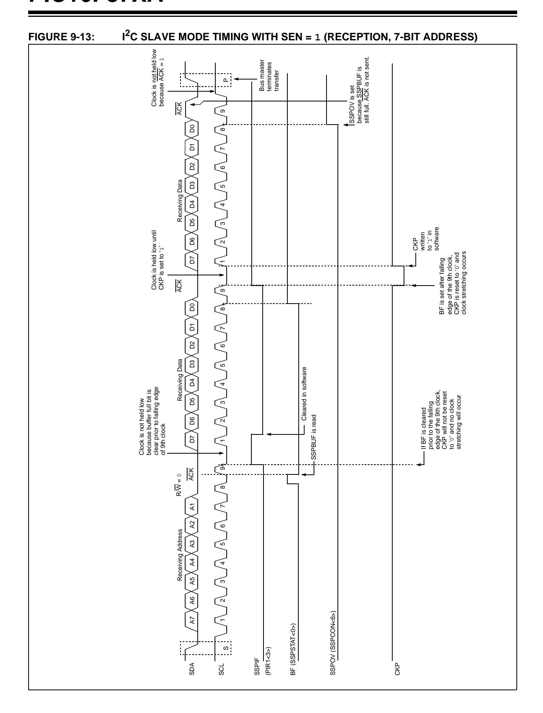

<span id="page-94-0"></span>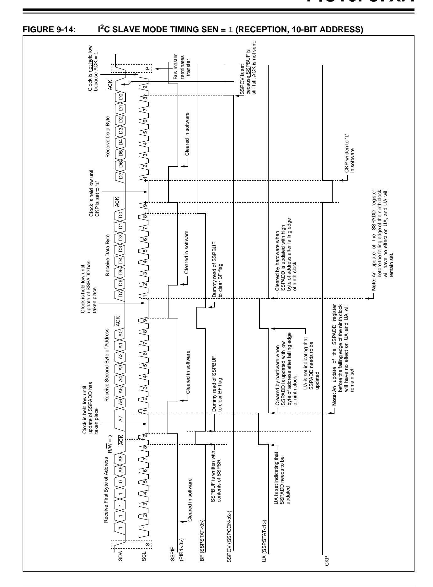

### <span id="page-95-1"></span>9.4.5 GENERAL CALL ADDRESS SUPPORT

The addressing procedure for the I2C bus is such that the first byte after the Start condition usually determines which device will be the slave addressed by the master. The exception is the general call address which can address all devices. When this address is used, all devices should, in theory, respond with an Acknowledge.

The general call address is one of eight addresses reserved for specific purposes by the I2C protocol. It consists of all '0's with R/W = 0.

The general call address is recognized when the General Call Enable bit (GCEN) is enabled (SSPCON2<7> set). Following a Start bit detect, 8 bits are shifted into the SSPSR and the address is compared against the SSPADD. It is also compared to the general call address and fixed in hardware.

If the general call address matches, the SSPSR is transferred to the SSPBUF, the BF flag bit is set (eighth bit) and on the falling edge of the ninth bit (ACK bit), the SSPIF interrupt flag bit is set.

When the interrupt is serviced, the source for the interrupt can be checked by reading the contents of the SSPBUF. The value can be used to determine if the address was device specific or a general call address.

<span id="page-95-2"></span>In 10-bit mode, the SSPADD is required to be updated for the second half of the address to match and the UA bit is set (SSPSTAT<1>). If the general call address is sampled when the GCEN bit is set, while the slave is configured in 10-bit Address mode, then the second half of the address is not necessary, the UA bit will not be set and the slave will begin receiving data after the Acknowledge ([Figure 9-15\)](#page-95-0).

<span id="page-95-0"></span>**FIGURE 9-15: SLAVE MODE GENERAL CALL ADDRESS SEQUENCE (7 OR 10-BIT ADDRESS MODE)** 

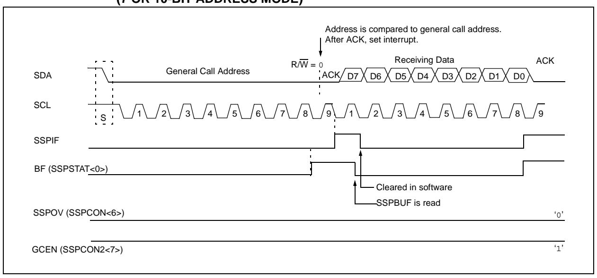

#### <span id="page-96-0"></span>9.4.6 MASTER MODE

Master mode is enabled by setting and clearing the appropriate SSPM bits in SSPCON and by setting the SSPEN bit. In Master mode, the SCL and SDA lines are manipulated by the MSSP hardware.

Master mode of operation is supported by interrupt generation on the detection of the Start and Stop conditions. The Stop (P) and Start (S) bits are cleared from a Reset or when the MSSP module is disabled. Control of the  $I^2C$  bus may be taken when the P bit is set or the bus is Idle, with both the S and P bits clear.

In Firmware Controlled Master mode, user code conducts all I<sup>2</sup>C bus operations based on Start and Stop bit conditions.

Once Master mode is enabled, the user has six options.

- 1. Assert a Start condition on SDA and SCL.
- Assert a Repeated Start condition on SDA and SCL.
- 3. Write to the SSPBUF register, initiating transmission of data/address.
- 4. Configure the I<sup>2</sup>C port to receive data.
- 5. Generate an Acknowledge condition at the end of a received byte of data.
- 6. Generate a Stop condition on SDA and SCL.

Note: The MSSP module, when configured in I<sup>2</sup>C Master mode, does not allow queueing of events. For instance, the user is not allowed to initiate a Start condition and immediately write the SSPBUF register to initiate transmission before the Start condition is complete. In this case, the SSPBUF will not be written to and the WCOL bit will be set, indicating that a write to the SSPBUF did not occur.

The following events will cause SSP Interrupt Flag bit, SSPIF, to be set (SSP interrupt if enabled):

- · Start condition
- Stop condition
- · Data transfer byte transmitted/received
- · Acknowledge transmit
- Repeated Start

FIGURE 9-16: MSSP BLOCK DIAGRAM (I<sup>2</sup>C MASTER MODE)

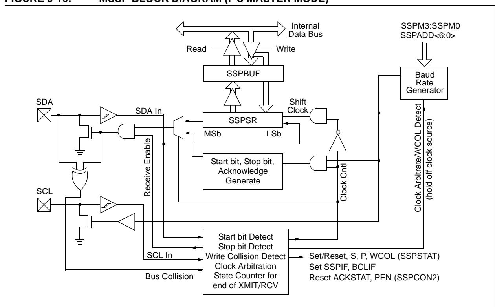

## <span id="page-97-0"></span>9.4.6.1 I2C Master Mode Operation

The master device generates all of the serial clock pulses and the Start and Stop conditions. A transfer is ended with a Stop condition or with a Repeated Start condition. Since the Repeated Start condition is also the beginning of the next serial transfer, the I2C bus will not be released.

In Master Transmitter mode, serial data is output through SDA while SCL outputs the serial clock. The first byte transmitted contains the slave address of the receiving device (7 bits) and the Read/Write (R/W) bit. In this case, the R/W bit will be logic '0'. Serial data is transmitted 8 bits at a time. After each byte is transmitted, an Acknowledge bit is received. Start and Stop conditions are output to indicate the beginning and the end of a serial transfer.

In Master Receive mode, the first byte transmitted contains the slave address of the transmitting device (7 bits) and the R/W bit. In this case, the R/W bit will be logic '1'. Thus, the first byte transmitted is a 7-bit slave address followed by a '1' to indicate the receive bit. Serial data is received via SDA while SCL outputs the serial clock. Serial data is received 8 bits at a time. After each byte is received, an Acknowledge bit is transmitted. Start and Stop conditions indicate the beginning and end of transmission.

The baud rate generator used for the SPI mode operation is used to set the SCL clock frequency for either 100 kHz, 400 kHz or 1 MHz I2C operation. See **[Section 9.4.7 "Baud Rate Generator"](#page-98-0)** for more detail.

A typical transmit sequence would go as follows:

- 1. The user generates a Start condition by setting the Start Enable bit, SEN (SSPCON2<0>).
- 2. SSPIF is set. The MSSP module will wait the required Start time before any other operation takes place.
- 3. The user loads the SSPBUF with the slave address to transmit.
- 4. Address is shifted out the SDA pin until all 8 bits are transmitted.
- 5. The MSSP module shifts in the ACK bit from the slave device and writes its value into the SSPCON2 register (SSPCON2<6>).
- 6. The MSSP module generates an interrupt at the end of the ninth clock cycle by setting the SSPIF bit.
- 7. The user loads the SSPBUF with eight bits of data.
- 8. Data is shifted out the SDA pin until all 8 bits are transmitted.
- 9. The MSSP module shifts in the ACK bit from the slave device and writes its value into the SSPCON2 register (SSPCON2<6>).
- 10. The MSSP module generates an interrupt at the end of the ninth clock cycle by setting the SSPIF bit.
- 11. The user generates a Stop condition by setting the Stop Enable bit, PEN (SSPCON2<2>).
- 12. Interrupt is generated once the Stop condition is complete.

### <span id="page-98-3"></span><span id="page-98-0"></span>9.4.7 BAUD RATE GENERATOR

In I2C Master mode, the Baud Rate Generator (BRG) reload value is placed in the lower 7 bits of the SSPADD register [\(Figure 9-17](#page-98-1)). When a write occurs to SSPBUF, the Baud Rate Generator will automatically begin counting. The BRG counts down to 0 and stops until another reload has taken place. The BRG count is decremented twice per instruction cycle (TCY) on the Q2 and Q4 clocks. In I2C Master mode, the BRG is reloaded automatically.

Once the given operation is complete (i.e., transmission of the last data bit is followed by ACK), the internal clock will automatically stop counting and the SCL pin will remain in its last state.

<span id="page-98-4"></span>[Table 9-3](#page-98-2) demonstrates clock rates based on instruction cycles and the BRG value loaded into SSPADD.

<span id="page-98-1"></span>**FIGURE 9-17: BAUD RATE GENERATOR BLOCK DIAGRAM** 


<span id="page-98-2"></span>**TABLE 9-3: I2C CLOCK RATE W/BRG**

| FCY    | FCY*2  | BRG Value | FSCL<br>(2 Rollovers of BRG) |
|--------|--------|-----------|------------------------------|
| 10 MHz | 20 MHz | 19h       | 400 kHz(1)                   |
| 10 MHz | 20 MHz | 20h       | 312.5 kHz                    |
| 10 MHz | 20 MHz | 3Fh       | 100 kHz                      |
| 4 MHz  | 8 MHz  | 0Ah       | 400 kHz(1)                   |
| 4 MHz  | 8 MHz  | 0Dh       | 308 kHz                      |
| 4 MHz  | 8 MHz  | 28h       | 100 kHz                      |
| 1 MHz  | 2 MHz  | 03h       | 333 kHz(1)                   |
| 1 MHz  | 2 MHz  | 0Ah       | 100 kHz                      |
| 1 MHz  | 2 MHz  | 00h       | 1 MHz(1)                     |

**Note 1:** The I2C interface does not conform to the 400 kHz I2C specification (which applies to rates greater than 100 kHz) in all details, but may be used with care where higher rates are required by the application.

### <span id="page-99-0"></span>9.4.7.1 Clock Arbitration

Clock arbitration occurs when the master, during any receive, transmit or Repeated Start/Stop condition, deasserts the SCL pin (SCL allowed to float high). When the SCL pin is allowed to float high, the Baud Rate Generator (BRG) is suspended from counting until the SCL pin is actually sampled high. When the

<span id="page-99-1"></span>SCL pin is sampled high, the Baud Rate Generator is reloaded with the contents of SSPADD<6:0> and begins counting. This ensures that the SCL high time will always be at least one BRG rollover count, in the event that the clock is held low by an external device ([Figure 9-17\)](#page-98-1).

### **FIGURE 9-18: BAUD RATE GENERATOR TIMING WITH CLOCK ARBITRATION**

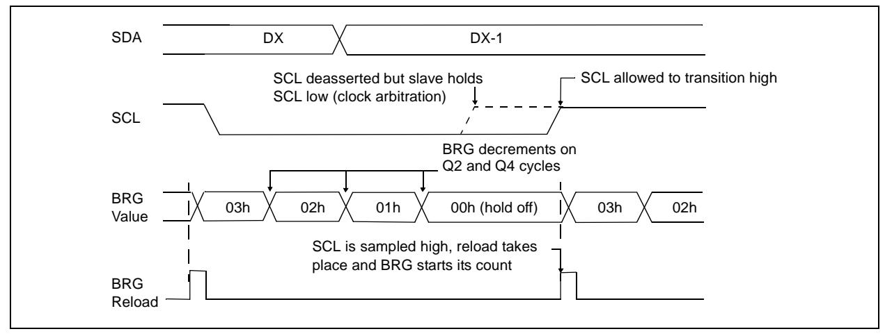

# <span id="page-100-0"></span>9.4.8 I<sup>2</sup>C MASTER MODE START CONDITION TIMING

To initiate a Start condition, the user sets the Start condition enable bit, SEN (SSPCON2<0>). If the SDA and SCL pins are sampled high, the Baud Rate Generator is reloaded with the contents of SSPADD<6:0> and starts its count. If SCL and SDA are both sampled high when the Baud Rate Generator times out (TBRG), the SDA pin is driven low. The action of the SDA being driven low, while SCL is high, is the Start condition and causes the S bit (SSPSTAT<3>) to be set. Following this, the Baud Rate Generator is reloaded with the contents of SSPADD<6:0> and resumes its count. When the Baud Rate Generator times out (TBRG), the SEN bit (SSPCON2<0>) will be automatically cleared by hardware, the Baud Rate Generator is suspended, leaving the SDA line held low and the Start condition is complete.

Note:

If at the beginning of the Start condition, the SDA and SCL pins are already sampled low, or if during the Start condition, the SCL line is sampled low before the SDA line is driven low, a bus collision occurs, the Bus Collision Interrupt Flag (BCLIF) is set, the Start condition is aborted and the I<sup>2</sup>C module is reset into its Idle state.

### <span id="page-100-2"></span>9.4.8.1 WCOL Status Flag

If the user writes the SSPBUF when a Start sequence is in progress, the WCOL is set and the contents of the buffer are unchanged (the write doesn't occur).

Note: Because queueing of events is not allowed, writing to the lower 5 bits of SSPCON2 is disabled until the Start condition is complete.

### <span id="page-100-1"></span>FIGURE 9-19: FIRST START BIT TIMING

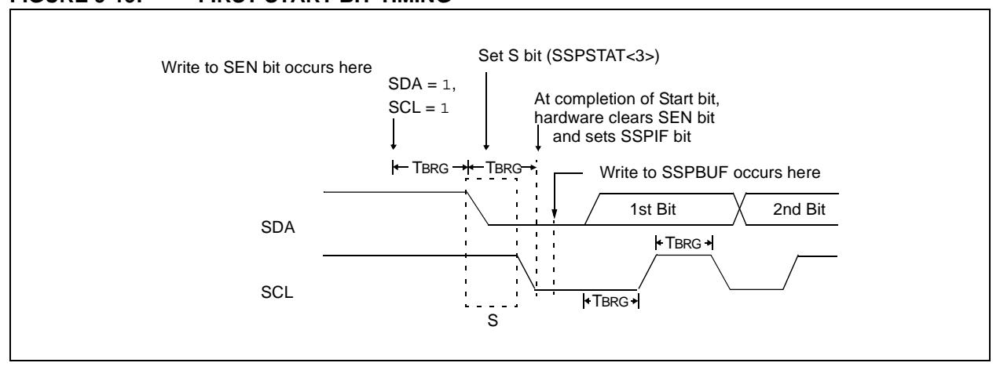

# 9.4.9 I<sup>2</sup>C MASTER MODE REPEATED START CONDITION TIMING

A Repeated Start condition occurs when the RSEN bit (SSPCON2<1>) is programmed high and the I<sup>2</sup>C logic module is in the Idle state. When the RSEN bit is set, the SCL pin is asserted low. When the SCL pin is sampled low, the Baud Rate Generator is loaded with the contents of SSPADD<5:0> and begins counting. The SDA pin is released (brought high) for one Baud Rate Generator count (TBRG). When the Baud Rate Generator times out, if SDA is sampled high, the SCL pin will be deasserted (brought high). When SCL is sampled high, the Baud Rate Generator is reloaded with the contents of SSPADD<6:0> and begins counting. SDA and SCL must be sampled high for one TBRG. This action is then followed by assertion of the SDA pin (SDA = 0) for one TBRG while SCL is high. Following this, the RSEN bit (SSPCON2<1>) will be automatically cleared and the Baud Rate Generator will not be reloaded, leaving the SDA pin held low. As soon as a Start condition is detected on the SDA and SCL pins, the S bit (SSPSTAT<3>) will be set. The SSPIF bit will not be set until the Baud Rate Generator has timed out.

- **Note 1:** If RSEN is programmed while any other event is in progress, it will not take effect.
  - **2:** A bus collision during the Repeated Start condition occurs if:
    - SDA is sampled low when SCL goes from low to high.
    - SCL goes low before SDA is asserted low. This may indicate that another master is attempting to transmit a data '1'.

<span id="page-101-0"></span>Immediately following the SSPIF bit getting set, the user may write the SSPBUF with the 7-bit address in 7-bit mode or the default first address in 10-bit mode. After the first eight bits are transmitted and an ACK is received, the user may then transmit an additional eight bits of address (10-bit mode) or eight bits of data (7-bit mode).

#### 9.4.9.1 WCOL Status Flag

If the user writes the SSPBUF when a Repeated Start sequence is in progress, the WCOL is set and the contents of the buffer are unchanged (the write doesn't occur).

Note: Because queueing of events is not allowed, writing of the lower 5 bits of SSPCON2 is disabled until the Repeated Start condition is complete.

<span id="page-101-1"></span>FIGURE 9-20: REPEAT START CONDITION WAVEFORM

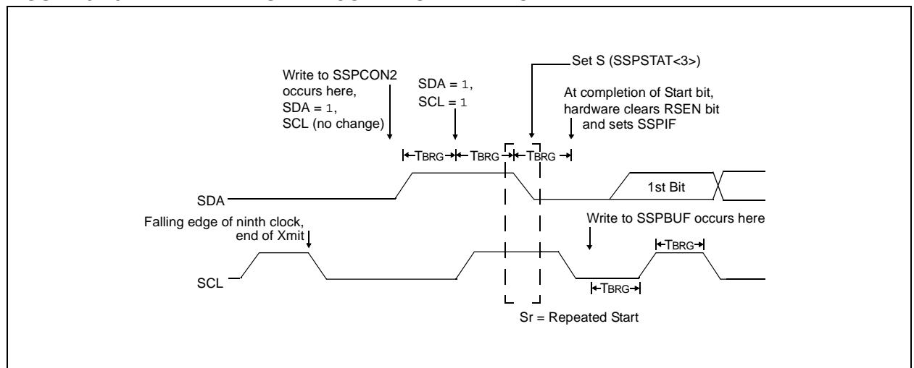

## <span id="page-102-3"></span>9.4.10 I2C MASTER MODE TRANSMISSION

Transmission of a data byte, a 7-bit address or the other half of a 10-bit address is accomplished by simply writing a value to the SSPBUF register. This action will set the Buffer Full flag bit, BF, and allow the Baud Rate Generator to begin counting and start the next transmission. Each bit of address/data will be shifted out onto the SDA pin after the falling edge of SCL is asserted (see data hold time specification, parameter #106). SCL is held low for one Baud Rate Generator rollover count (TBRG). Data should be valid before SCL is released high (see data setup time specification, parameter #107). When the SCL pin is released high, it is held that way for TBRG. The data on the SDA pin must remain stable for that duration and some hold time after the next falling edge of SCL. After the eighth bit is shifted out (the falling edge of the eighth clock), the BF flag is cleared and the master releases SDA. This allows the slave device being addressed to respond with an ACK bit during the ninth bit time, if an address match occurred or if data was received properly. The status of ACK is written into the ACKDT bit on the falling edge of the ninth clock. If the master receives an Acknowledge, the Acknowledge Status bit, ACKSTAT, is cleared. If not, the bit is set. After the ninth clock, the SSPIF bit is set and the master clock (Baud Rate Generator) is suspended until the next data byte is loaded into the SSPBUF, leaving SCL low and SDA unchanged ([Figure 9-21\)](#page-103-0).

After the write to the SSPBUF, each bit of address will be shifted out on the falling edge of SCL, until all seven address bits and the R/W bit are completed. On the falling edge of the eighth clock, the master will deassert the SDA pin, allowing the slave to respond with an Acknowledge. On the falling edge of the ninth clock, the master will sample the SDA pin to see if the address was recognized by a slave. The status of the ACK bit is loaded into the ACKSTAT status bit (SSPCON2<6>). Following the falling edge of the ninth clock transmission of the address, the SSPIF is set, the BF flag is cleared and the Baud Rate Generator is turned off until another write to the SSPBUF takes place, holding SCL low and allowing SDA to float.

### <span id="page-102-1"></span>9.4.10.1 BF Status Flag

In Transmit mode, the BF bit (SSPSTAT<0>) is set when the CPU writes to SSPBUF and is cleared when all eight bits are shifted out.

### <span id="page-102-5"></span>9.4.10.2 WCOL Status Flag

If the user writes the SSPBUF when a transmit is already in progress (i.e., SSPSR is still shifting out a data byte), the WCOL is set and the contents of the buffer are unchanged (the write doesn't occur).

WCOL must be cleared in software.

### <span id="page-102-0"></span>9.4.10.3 ACKSTAT Status Flag

In Transmit mode, the ACKSTAT bit (SSPCON2<6>) is cleared when the slave has sent an Acknowledge (ACK = 0) and is set when the slave does Not Acknowledge (ACK = 1). A slave sends an Acknowledge when it has recognized its address (including a general call) or when the slave has properly received its data.

## 9.4.11 I2C MASTER MODE RECEPTION

Master mode reception is enabled by programming the Receive Enable bit, RCEN (SSPCON2<3>).

<span id="page-102-2"></span>**Note:** The MSSP module must be in an Idle state before the RCEN bit is set or the RCEN bit will be disregarded.

The Baud Rate Generator begins counting and on each rollover, the state of the SCL pin changes (high to low/ low to high) and data is shifted into the SSPSR. After the falling edge of the eighth clock, the receive enable flag is automatically cleared, the contents of the SSPSR are loaded into the SSPBUF, the BF flag bit is set, the SSPIF flag bit is set and the Baud Rate Generator is suspended from counting, holding SCL low. The MSSP is now in Idle state, awaiting the next command. When the buffer is read by the CPU, the BF flag bit is automatically cleared. The user can then send an Acknowledge bit at the end of reception by setting the Acknowledge Sequence Enable bit, ACKEN (SSPCON2<4>).

### 9.4.11.1 BF Status Flag

In receive operation, the BF bit is set when an address or data byte is loaded into SSPBUF from SSPSR. It is cleared when the SSPBUF register is read.

### <span id="page-102-4"></span>9.4.11.2 SSPOV Status Flag

In receive operation, the SSPOV bit is set when 8 bits are received into the SSPSR and the BF flag bit is already set from a previous reception.

### 9.4.11.3 WCOL Status Flag

If the user writes the SSPBUF when a receive is already in progress (i.e., SSPSR is still shifting in a data byte), the WCOL bit is set and the contents of the buffer are unchanged (the write doesn't occur).

<span id="page-103-1"></span><span id="page-103-0"></span>

<span id="page-104-0"></span>

# <span id="page-105-2"></span>9.4.12 ACKNOWLEDGE SEQUENCE TIMING

An Acknowledge sequence is enabled by setting the Acknowledge Sequence Enable bit. **ACKEN** (SSPCON2<4>). When this bit is set, the SCL pin is pulled low and the contents of the Acknowledge data bit are presented on the SDA pin. If the user wishes to generate an Acknowledge, then the ACKDT bit should be cleared. If not, the user should set the ACKDT bit before starting an Acknowledge sequence. The Baud Rate Generator then counts for one rollover period (TBRG) and the SCL pin is deasserted (pulled high). When the SCL pin is sampled high (clock arbitration), the Baud Rate Generator counts for TBRG. The SCL pin is then pulled low. Following this, the ACKEN bit is automatically cleared, the baud rate generator is turned off and the MSSP module then goes into Idle mode (Figure 9-23).

#### <span id="page-105-6"></span>9.4.12.1 WCOL Status Flag

If the user writes the SSPBUF when an Acknowledge sequence is in progress, then WCOL is set and the contents of the buffer are unchanged (the write doesn't occur).

#### <span id="page-105-3"></span>9.4.13 STOP CONDITION TIMING

A Stop bit is asserted on the SDA pin at the end of a receive/transmit by setting the Stop Sequence Enable bit, PEN (SSPCON2<2>). At the end of a receive/transmit, the SCL line is held low after the falling edge of the ninth clock. When the PEN bit is set, the master will assert the SDA line low. When the SDA line is sampled low, the Baud Rate Generator is reloaded and counts down to 0. When the Baud Rate Generator times out, the SCL pin will be brought high and one TBRG (Baud Rate Generator rollover count) later, the SDA pin will be deasserted. When the SDA pin is sampled high while SCL is high, the P bit (SSPSTAT<4>) is set. A TBRG later, the PEN bit is cleared and the SSPIF bit is set (Figure 9-24).

### 9.4.13.1 WCOL Status Flag

<span id="page-105-4"></span>If the user writes the SSPBUF when a Stop sequence is in progress, then the WCOL bit is set and the contents of the buffer are unchanged (the write doesn't occur).

#### <span id="page-105-0"></span>FIGURE 9-23: ACKNOWLEDGE SEQUENCE WAVEFORM


#### <span id="page-105-5"></span><span id="page-105-1"></span>FIGURE 9-24: STOP CONDITION RECEIVE OR TRANSMIT MODE

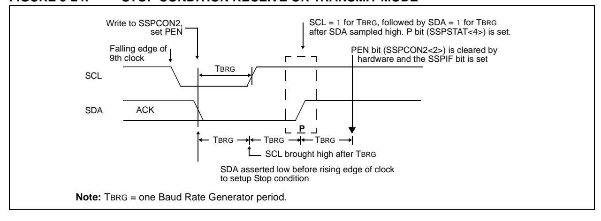

#### <span id="page-106-4"></span>9.4.14 SLEEP OPERATION

While in Sleep mode, the I<sup>2</sup>C module can receive addresses or data and when an address match or complete byte transfer occurs, wake the processor from Sleep (if the MSSP interrupt is enabled).

#### <span id="page-106-1"></span>9.4.15 EFFECT OF A RESET

A Reset disables the MSSP module and terminates the current transfer.

#### <span id="page-106-3"></span>9.4.16 MULTI-MASTER MODE

In Multi-Master mode, the interrupt generation on the detection of the Start and Stop conditions allows the determination of when the bus is free. The Stop (P) and Start (S) bits are cleared from a Reset or when the MSSP module is disabled. Control of the I<sup>2</sup>C bus may be taken when the P bit (SSPSTAT<4>) is set, or the bus is Idle, with both the S and P bits clear. When the bus is busy, enabling the SSP interrupt will generate the interrupt when the Stop condition occurs.

In multi-master operation, the SDA line must be monitored for arbitration to see if the signal level is at the expected output level. This check is performed in hardware with the result placed in the BCLIF bit.

The states where arbitration can be lost are:

- · Address Transfer
- Data Transfer
- · A Start Condition
- · A Repeated Start Condition
- An Acknowledge Condition

### <span id="page-106-2"></span>9.4.17 MULTI -MASTER COMMUNICATION, BUS COLLISION AND BUS ARBITRATION

Multi-Master mode support is achieved by bus arbitration. When the master outputs address/data bits onto the SDA pin, arbitration takes place when the master outputs a '1' on SDA by letting SDA float high and another master asserts a '0'. When the SCL pin floats high, data should be stable. If the expected data on SDA is a '1' and the data sampled on the SDA pin = 0, then a bus collision has taken place. The master will set the Bus Collision Interrupt Flag, BCLIF, and reset the  $I^2$ C port to its Idle state (Figure 9-25).

If a transmit was in progress when the bus collision occurred, the transmission is halted, the BF flag is cleared, the SDA and SCL lines are deasserted and the SSPBUF can be written to. When the user services the bus collision Interrupt Service Routine and if the I<sup>2</sup>C bus is free, the user can resume communication by asserting a Start condition.

If a Start, Repeated Start, Stop or Acknowledge condition was in progress when the bus collision occurred, the condition is aborted, the SDA and SCL lines are deasserted and the respective control bits in the SSPCON2 register are cleared. When the user services the bus collision Interrupt Service Routine and if the  $\rm I^2C$  bus is free, the user can resume communication by asserting a Start condition.

The Master will continue to monitor the SDA and SCL pins. If a Stop condition occurs, the SSPIF bit will be set.

A write to the SSPBUF will start the transmission of data at the first data bit regardless of where the transmitter left off when the bus collision occurred.

<span id="page-106-5"></span>In Multi-Master mode, the interrupt generation on the detection of Start and Stop conditions allows the determination of when the bus is free. Control of the I<sup>2</sup>C bus can be taken when the P bit is set in the SSPSTAT register or the bus is Idle and the S and P bits are cleared.

<span id="page-106-0"></span>

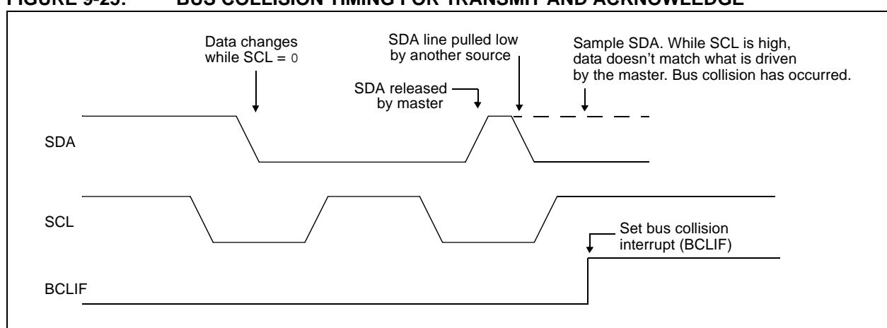

### <span id="page-107-1"></span>9.4.17.1 Bus Collision During a Start Condition

During a Start condition, a bus collision occurs if:

- a) SDA or SCL are sampled low at the beginning of the Start condition [\(Figure 9-26](#page-107-0)).
- b) SCL is sampled low before SDA is asserted low ([Figure 9-27\)](#page-108-0).

During a Start condition, both the SDA and the SCL pins are monitored.

If the SDA pin is already low, or the SCL pin is already low, then all of the following occur:

- the Start condition is aborted,
- the BCLIF flag is set and
- the MSSP module is reset to its Idle state ([Figure 9-26\)](#page-107-0).

The Start condition begins with the SDA and SCL pins deasserted. When the SDA pin is sampled high, the Baud Rate Generator is loaded from SSPADD<6:0> and counts down to 0. If the SCL pin is sampled low while SDA is high, a bus collision occurs because it is assumed that another master is attempting to drive a data '1' during the Start condition.

If the SDA pin is sampled low during this count, the BRG is reset and the SDA line is asserted early ([Figure 9-28\)](#page-108-1). If, however, a '1' is sampled on the SDA pin, the SDA pin is asserted low at the end of the BRG count. The Baud Rate Generator is then reloaded and counts down to 0 and during this time, if the SCL pin is sampled as '0', a bus collision does not occur. At the end of the BRG count, the SCL pin is asserted low.

**Note:** The reason that bus collision is not a factor during a Start condition is that no two bus masters can assert a Start condition at the exact same time. Therefore, one master will always assert SDA before the other. This condition does not cause a bus collision because the two masters must be allowed to arbitrate the first address following the Start condition. If the address is the same, arbitration must be allowed to continue into the data portion, Repeated Start or Stop conditions.

<span id="page-107-2"></span><span id="page-107-0"></span>


<span id="page-108-3"></span><span id="page-108-0"></span>


### <span id="page-108-2"></span><span id="page-108-1"></span>**FIGURE 9-28: BRG RESET DUE TO SDA ARBITRATION DURING START CONDITION**


### <span id="page-109-2"></span>9.4.17.2 Bus Collision During a Repeated Start Condition

During a Repeated Start condition, a bus collision occurs if:

- a) A low level is sampled on SDA when SCL goes from low level to high level.
- b) SCL goes low before SDA is asserted low, indicating that another master is attempting to transmit a data '1'.

When the user deasserts SDA and the pin is allowed to float high, the BRG is loaded with SSPADD<6:0> and counts down to 0. The SCL pin is then deasserted and when sampled high, the SDA pin is sampled.

If SDA is low, a bus collision has occurred (i.e., another master is attempting to transmit a data '0', see [Figure 9-29\)](#page-109-0). If SDA is sampled high, the BRG is reloaded and begins counting. If SDA goes from high to low before the BRG times out, no bus collision occurs because no two masters can assert SDA at exactly the same time.

If SCL goes from high to low before the BRG times out and SDA has not already been asserted, a bus collision occurs. In this case, another master is attempting to transmit a data '1' during the Repeated Start condition ([Figure 9-30\)](#page-109-1).

<span id="page-109-3"></span>If at the end of the BRG time-out, both SCL and SDA are still high, the SDA pin is driven low and the BRG is reloaded and begins counting. At the end of the count, regardless of the status of the SCL pin, the SCL pin is driven low and the Repeated Start condition is complete.

<span id="page-109-0"></span>**FIGURE 9-29: BUS COLLISION DURING A REPEATED START CONDITION (CASE 1)** 


<span id="page-109-4"></span><span id="page-109-1"></span>**FIGURE 9-30: BUS COLLISION DURING REPEATED START CONDITION (CASE 2)** 


### <span id="page-110-2"></span>9.4.17.3 Bus Collision During a Stop Condition

Bus collision occurs during a Stop condition if:

- a) After the SDA pin has been deasserted and allowed to float high, SDA is sampled low after the BRG has timed out.
- b) After the SCL pin is deasserted, SCL is sampled low before SDA goes high.

<span id="page-110-3"></span>The Stop condition begins with SDA asserted low. When SDA is sampled low, the SCL pin is allowed to float. When the pin is sampled high (clock arbitration), the Baud Rate Generator is loaded with SSPADD<6:0> and counts down to 0. After the BRG times out, SDA is sampled. If SDA is sampled low, a bus collision has occurred. This is due to another master attempting to drive a data '0' [\(Figure 9-31](#page-110-0)). If the SCL pin is sampled low before SDA is allowed to float high, a bus collision occurs. This is another case of another master attempting to drive a data '0' ([Figure 9-32\)](#page-110-1).

<span id="page-110-0"></span>**FIGURE 9-31: BUS COLLISION DURING A STOP CONDITION (CASE 1)** 

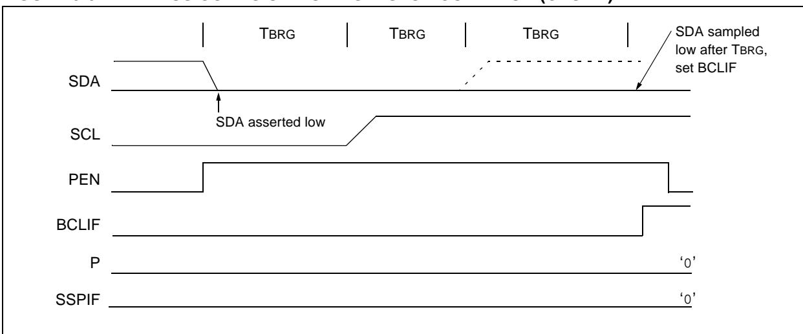

<span id="page-110-4"></span><span id="page-110-1"></span>**FIGURE 9-32: BUS COLLISION DURING A STOP CONDITION (CASE 2)** 

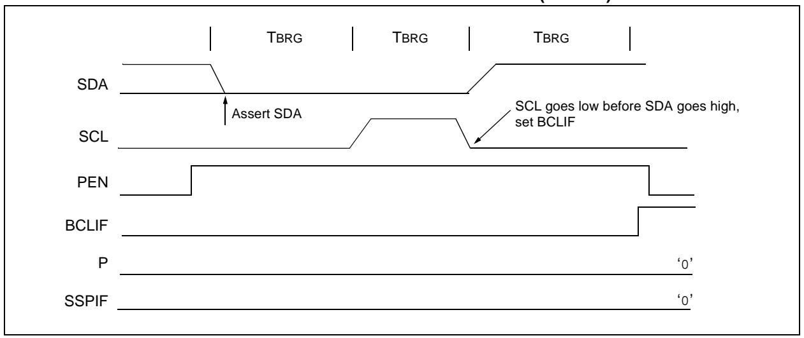

**NOTES:**

## <span id="page-112-3"></span><span id="page-112-0"></span>**10.0 ADDRESSABLE UNIVERSAL SYNCHRONOUS ASYNCHRONOUS RECEIVER TRANSMITTER (USART)**

The Universal Synchronous Asynchronous Receiver Transmitter (USART) module is one of the two serial I/O modules. (USART is also known as a Serial Communications Interface or SCI.) The USART can be configured as a full-duplex asynchronous system that can communicate with peripheral devices, such as CRT terminals and personal computers, or it can be configured as a half-duplex synchronous system that can communicate with peripheral devices, such as A/D or D/A integrated circuits, serial EEPROMs, etc.

The USART can be configured in the following modes:

- <span id="page-112-2"></span>• Asynchronous (full-duplex)
- Synchronous Master (half-duplex)
- <span id="page-112-4"></span>• Synchronous – Slave (half-duplex)

<span id="page-112-5"></span>Bit SPEN (RCSTA<7>) and bits TRISC<7:6> have to be set in order to configure pins RC6/TX/CK and RC7/RX/DT as the Universal Synchronous Asynchronous Receiver Transmitter.

<span id="page-112-6"></span><span id="page-112-1"></span>The USART module also has a multi-processor communication capability using 9-bit address detection.

### **REGISTER 10-1: TXSTA: TRANSMIT STATUS AND CONTROL REGISTER (ADDRESS 98h)**

| R/W-0 | R/W-0 | R/W-0 | R/W-0 | U-0 | R/W-0 | R-1  | R/W-0 |
|-------|-------|-------|-------|-----|-------|------|-------|
| CSRC  | TX9   | TXEN  | SYNC  | —   | BRGH  | TRMT | TX9D  |
| bit 7 |       |       |       |     |       |      | bit 0 |

bit 7 **CSRC:** Clock Source Select bit

<span id="page-112-8"></span>Asynchronous mode:

Don't care.

Synchronous mode:

- 1 = Master mode (clock generated internally from BRG)
- <span id="page-112-13"></span><span id="page-112-11"></span>0 = Slave mode (clock from external source)
- bit 6 **TX9**: 9-bit Transmit Enable bit
  - 1 = Selects 9-bit transmission
  - 0 = Selects 8-bit transmission
- bit 5 **TXEN**: Transmit Enable bit
  - 1 = Transmit enabled
  - 0 = Transmit disabled

<span id="page-112-9"></span>**Note:** SREN/CREN overrides TXEN in Sync mode.

- bit 4 **SYNC**: USART Mode Select bit
  - 1 = Synchronous mode
  - 0 = Asynchronous mode
- bit 3 **Unimplemented:** Read as '0'
- bit 2 **BRGH**: High Baud Rate Select bit

<span id="page-112-7"></span>Asynchronous mode:

- 1 = High speed
- 0 = Low speed

Synchronous mode:

<span id="page-112-10"></span>Unused in this mode.

- bit 1 **TRMT**: Transmit Shift Register Status bit
  - 1 = TSR empty
  - 0 = TSR full
- bit 0 **TX9D:** 9th bit of Transmit Data, can be Parity bit

<span id="page-112-12"></span>

R = Readable bit W = Writable bit U = Unimplemented bit, read as '0' - n = Value at POR '1' = Bit is set '0' = Bit is cleared x = Bit is unknown

### **REGISTER 10-2: RCSTA: RECEIVE STATUS AND CONTROL REGISTER (ADDRESS 18h)**

<span id="page-113-0"></span>

| R/W-0 | R/W-0 | R/W-0 | R/W-0 | R/W-0 | R-0  | R-0  | R-x  |
|-------|-------|-------|-------|-------|------|------|------|
| SPEN  | RX9   | SREN  | CREN  | ADDEN | FERR | OERR | RX9D |

<span id="page-113-11"></span>bit 7 bit 0

bit 7 **SPEN:** Serial Port Enable bit

<span id="page-113-9"></span><span id="page-113-2"></span><span id="page-113-1"></span>1 = Serial port enabled (configures RC7/RX/DT and RC6/TX/CK pins as serial port pins)

<span id="page-113-7"></span>0 = Serial port disabled

bit 6 **RX9**: 9-bit Receive Enable bit

1 = Selects 9-bit reception

<span id="page-113-10"></span>0 = Selects 8-bit reception

bit 5 **SREN**: Single Receive Enable bit

Asynchronous mode:

Don't care.

Synchronous mode – Master:

1 = Enables single receive

0 = Disables single receive

This bit is cleared after reception is complete.

Synchronous mode – Slave:

<span id="page-113-4"></span>Don't care.

bit 4 **CREN**: Continuous Receive Enable bit

Asynchronous mode:

1 = Enables continuous receive

0 = Disables continuous receive

Synchronous mode:

1 = Enables continuous receive until enable bit CREN is cleared (CREN overrides SREN)

<span id="page-113-3"></span>0 = Disables continuous receive

bit 3 **ADDEN:** Address Detect Enable bit

Asynchronous mode 9-bit (RX9 = 1):

1 = Enables address detection, enables interrupt and load of the receive buffer when RSR<8> is set

<span id="page-113-5"></span>0 = Disables address detection, all bytes are received and ninth bit can be used as parity bit

bit 2 **FERR**: Framing Error bit

1 = Framing error (can be updated by reading RCREG register and receive next valid byte)

<span id="page-113-6"></span>0 = No framing error

bit 1 **OERR**: Overrun Error bit

1 = Overrun error (can be cleared by clearing bit CREN)

<span id="page-113-8"></span>0 = No overrun error

bit 0 **RX9D:** 9th bit of Received Data (can be parity bit but must be calculated by user firmware)

**Legend:**

R = Readable bit W = Writable bit U = Unimplemented bit, read as '0'

- n = Value at POR '1' = Bit is set '0' = Bit is cleared x = Bit is unknown

## <span id="page-114-6"></span><span id="page-114-2"></span>**10.1 USART Baud Rate Generator (BRG)**

<span id="page-114-4"></span>The BRG supports both the Asynchronous and Synchronous modes of the USART. It is a dedicated 8-bit baud rate generator. The SPBRG register controls the period of a free running 8-bit timer. In Asynchronous mode, bit BRGH (TXSTA<2>) also controls the baud rate. In Synchronous mode, bit BRGH is ignored. [Table 10-1](#page-114-1) shows the formula for computation of the baud rate for different USART modes which only apply in Master mode (internal clock).

Given the desired baud rate and FOSC, the nearest integer value for the SPBRG register can be calculated using the formula in [Table 10-1.](#page-114-1) From this, the error in baud rate can be determined.

It may be advantageous to use the high baud rate (BRGH = 1) even for slower baud clocks. This is because the FOSC/(16 (X + 1)) equation can reduce the baud rate error in some cases.

Writing a new value to the SPBRG register causes the BRG timer to be reset (or cleared). This ensures the BRG does not wait for a timer overflow before outputting the new baud rate.

## <span id="page-114-8"></span><span id="page-114-5"></span>10.1.1 SAMPLING

<span id="page-114-3"></span>The data on the RC7/RX/DT pin is sampled three times by a majority detect circuit to determine if a high or a low level is present at the RX pin.

<span id="page-114-7"></span><span id="page-114-1"></span>**TABLE 10-1: BAUD RATE FORMULA**

| SYNC | BRGH = 0 (Low Speed)                         | BRGH = 1 (High Speed)         |
|------|----------------------------------------------|-------------------------------|
| 0    | (Asynchronous) Baud Rate = FOSC/(64 (X + 1)) | Baud Rate = FOSC/(16 (X + 1)) |
| 1    | (Synchronous) Baud Rate = FOSC/(4 (X + 1))   | N/A                           |

<span id="page-114-0"></span>**Legend:** X = value in SPBRG (0 to 255)

**TABLE 10-2: REGISTERS ASSOCIATED WITH BAUD RATE GENERATOR**

| Address | Name  | Bit 7 | Bit 6                        | Bit 5 | Bit 4 | Bit 3 | Bit 2 | Bit 1 | Bit 0 | POR, BOR | Value on: | Resets                   | Value on<br>all other |
|---------|-------|-------|------------------------------|-------|-------|-------|-------|-------|-------|----------|-----------|--------------------------|-----------------------|
| 98h     | TXSTA | CSRC  | TX9                          | TXEN  | SYNC  | —     | BRGH  | TRMT  | TX9D  |          |           | 0000 -010 0000 -010      |                       |
| 18h     | RCSTA | SPEN  | RX9                          | SREN  | CREN  | ADDEN | FERR  | OERR  |       |          |           | RX9D 0000 000x 0000 000x |                       |
| 99h     | SPBRG |       | Baud Rate Generator Register |       |       |       |       |       |       |          |           | 0000 0000 0000 0000      |                       |

**Legend:** x = unknown, - = unimplemented, read as '0'. Shaded cells are not used by the BRG.

<span id="page-115-0"></span>**TABLE 10-3: BAUD RATES FOR ASYNCHRONOUS MODE (BRGH = 0)**

|                     |         | FOSC = 20 MHz |                             |         | FOSC = 16 MHz |                             |         | FOSC = 10 MHz |                             |  |
|---------------------|---------|---------------|-----------------------------|---------|---------------|-----------------------------|---------|---------------|-----------------------------|--|
| BAUD<br>RATE<br>(K) | KBAUD   | %<br>ERROR    | SPBRG<br>value<br>(decimal) | KBAUD   | %<br>ERROR    | SPBRG<br>value<br>(decimal) | KBAUD   | %<br>ERROR    | SPBRG<br>value<br>(decimal) |  |
| 0.3                 | -       | -             | -                           | -       | -             | -                           | -       | -             | -                           |  |
| 1.2                 | 1.221   | 1.75          | 255                         | 1.202   | 0.17          | 207                         | 1.202   | 0.17          | 129                         |  |
| 2.4                 | 2.404   | 0.17          | 129                         | 2.404   | 0.17          | 103                         | 2.404   | 0.17          | 64                          |  |
| 9.6                 | 9.766   | 1.73          | 31                          | 9.615   | 0.16          | 25                          | 9.766   | 1.73          | 15                          |  |
| 19.2                | 19.531  | 1.72          | 15                          | 19.231  | 0.16          | 12                          | 19.531  | 1.72          | 7                           |  |
| 28.8                | 31.250  | 8.51          | 9                           | 27.778  | 3.55          | 8                           | 31.250  | 8.51          | 4                           |  |
| 33.6                | 34.722  | 3.34          | 8                           | 35.714  | 6.29          | 6                           | 31.250  | 6.99          | 4                           |  |
| 57.6                | 62.500  | 8.51          | 4                           | 62.500  | 8.51          | 3                           | 52.083  | 9.58          | 2                           |  |
| HIGH                | 1.221   | -             | 255                         | 0.977   | -             | 255                         | 0.610   | -             | 255                         |  |
| LOW                 | 312.500 | -             | 0                           | 250.000 | -             | 0                           | 156.250 | -             | 0                           |  |

|                     |        | FOSC = 4 MHz |                             | FOSC = 3.6864 MHz |            |                             |  |  |
|---------------------|--------|--------------|-----------------------------|-------------------|------------|-----------------------------|--|--|
| BAUD<br>RATE<br>(K) | KBAUD  | %<br>ERROR   | SPBRG<br>value<br>(decimal) | KBAUD             | %<br>ERROR | SPBRG<br>value<br>(decimal) |  |  |
| 0.3                 | 0.300  | 0            | 207                         | 0.3               | 0          | 191                         |  |  |
| 1.2                 | 1.202  | 0.17         | 51                          | 1.2               | 0          | 47                          |  |  |
| 2.4                 | 2.404  | 0.17         | 25                          | 2.4               | 0          | 23                          |  |  |
| 9.6                 | 8.929  | 6.99         | 6                           | 9.6               | 0          | 5                           |  |  |
| 19.2                | 20.833 | 8.51         | 2                           | 19.2              | 0          | 2                           |  |  |
| 28.8                | 31.250 | 8.51         | 1                           | 28.8              | 0          | 1                           |  |  |
| 33.6                | -      | -            | -                           | -                 | -          | -                           |  |  |
| 57.6                | 62.500 | 8.51         | 0                           | 57.6              | 0          | 0                           |  |  |
| HIGH                | 0.244  | -            | 255                         | 0.225             | -          | 255                         |  |  |
| LOW                 | 62.500 | -            | 0                           | 57.6              | -          | 0                           |  |  |

<span id="page-115-1"></span>**TABLE 10-4: BAUD RATES FOR ASYNCHRONOUS MODE (BRGH = 1)**

|                     |          | FOSC = 20 MHz |                             | FOSC = 16 MHz |            |                             |         | FOSC = 10 MHz |                             |  |
|---------------------|----------|---------------|-----------------------------|---------------|------------|-----------------------------|---------|---------------|-----------------------------|--|
| BAUD<br>RATE<br>(K) | KBAUD    | %<br>ERROR    | SPBRG<br>value<br>(decimal) | KBAUD         | %<br>ERROR | SPBRG<br>value<br>(decimal) | KBAUD   | %<br>ERROR    | SPBRG<br>value<br>(decimal) |  |
| 0.3                 | -        | -             | -                           | -             | -          | -                           | -       | -             | -                           |  |
| 1.2                 | -        | -             | -                           | -             | -          | -                           | -       | -             | -                           |  |
| 2.4                 | -        | -             | -                           | -             | -          | -                           | 2.441   | 1.71          | 255                         |  |
| 9.6                 | 9.615    | 0.16          | 129                         | 9.615         | 0.16       | 103                         | 9.615   | 0.16          | 64                          |  |
| 19.2                | 19.231   | 0.16          | 64                          | 19.231        | 0.16       | 51                          | 19.531  | 1.72          | 31                          |  |
| 28.8                | 29.070   | 0.94          | 42                          | 29.412        | 2.13       | 33                          | 28.409  | 1.36          | 21                          |  |
| 33.6                | 33.784   | 0.55          | 36                          | 33.333        | 0.79       | 29                          | 32.895  | 2.10          | 18                          |  |
| 57.6                | 59.524   | 3.34          | 20                          | 58.824        | 2.13       | 16                          | 56.818  | 1.36          | 10                          |  |
| HIGH                | 4.883    | -             | 255                         | 3.906         | -          | 255                         | 2.441   | -             | 255                         |  |
| LOW                 | 1250.000 | -             | 0                           | 1000.000      |            | 0                           | 625.000 | -             | 0                           |  |

|                     |         | FOSC = 4 MHz |                             |       | FOSC = 3.6864 MHz |                             |
|---------------------|---------|--------------|-----------------------------|-------|-------------------|-----------------------------|
| BAUD<br>RATE<br>(K) | KBAUD   | %<br>ERROR   | SPBRG<br>value<br>(decimal) | KBAUD | %<br>ERROR        | SPBRG<br>value<br>(decimal) |
| 0.3                 | -       | -            | -                           | -     | -                 | -                           |
| 1.2                 | 1.202   | 0.17         | 207                         | 1.2   | 0                 | 191                         |
| 2.4                 | 2.404   | 0.17         | 103                         | 2.4   | 0                 | 95                          |
| 9.6                 | 9.615   | 0.16         | 25                          | 9.6   | 0                 | 23                          |
| 19.2                | 19.231  | 0.16         | 12                          | 19.2  | 0                 | 11                          |
| 28.8                | 27.798  | 3.55         | 8                           | 28.8  | 0                 | 7                           |
| 33.6                | 35.714  | 6.29         | 6                           | 32.9  | 2.04              | 6                           |
| 57.6                | 62.500  | 8.51         | 3                           | 57.6  | 0                 | 3                           |
| HIGH                | 0.977   | -            | 255                         | 0.9   | -                 | 255                         |
| LOW                 | 250.000 | -            | 0                           | 230.4 | -                 | 0                           |

### <span id="page-116-2"></span>**10.2 USART Asynchronous Mode**

In this mode, the USART uses standard Non-Returnto-Zero (NRZ) format (one Start bit, eight or nine data bits and one Stop bit). The most common data format is 8 bits. An on-chip, dedicated, 8-bit Baud Rate Generator can be used to derive standard baud rate frequencies from the oscillator. The USART transmits and receives the LSb first. The transmitter and receiver are functionally independent but use the same data format and baud rate. The baud rate generator produces a clock, either x16 or x64 of the bit shift rate, depending on bit BRGH (TXSTA<2>). Parity is not supported by the hardware but can be implemented in software (and stored as the ninth data bit). Asynchronous mode is stopped during Sleep.

Asynchronous mode is selected by clearing bit SYNC (TXSTA<4>).

The USART Asynchronous module consists of the following important elements:

- Baud Rate Generator
- Sampling Circuit
- Asynchronous Transmitter
- Asynchronous Receiver

### 10.2.1 USART ASYNCHRONOUS TRANSMITTER

The USART transmitter block diagram is shown in [Figure 10-1.](#page-116-0) The heart of the transmitter is the Transmit (Serial) Shift Register (TSR). The shift register obtains its data from the Read/Write Transmit Buffer, TXREG. The TXREG register is loaded with data in software. The TSR register is not loaded until the Stop bit has been transmitted from the previous load. As soon as the Stop bit is transmitted, the TSR is loaded with new data from the TXREG register (if available). Once the TXREG register transfers the data to the TSR register (occurs in one TCY), the TXREG register is empty and flag bit, TXIF (PIR1<4>), is set. This interrupt can be

enabled/disabled by setting/clearing enable bit, TXIE (PIE1<4>). Flag bit TXIF will be set regardless of the state of enable bit TXIE and cannot be cleared in software. It will reset only when new data is loaded into the TXREG register. While flag bit TXIF indicates the status of the TXREG register, another bit, TRMT (TXSTA<1>), shows the status of the TSR register. Status bit TRMT is a read-only bit which is set when the TSR register is empty. No interrupt logic is tied to this bit so the user has to poll this bit in order to determine if the TSR register is empty.

- **Note 1:** The TSR register is not mapped in data memory so it is not available to the user.
  - **2:** Flag bit TXIF is set when enable bit TXEN is set. TXIF is cleared by loading TXREG.

Transmission is enabled by setting enable bit, TXEN (TXSTA<5>). The actual transmission will not occur until the TXREG register has been loaded with data and the Baud Rate Generator (BRG) has produced a shift clock ([Figure 10-2\)](#page-117-0). The transmission can also be started by first loading the TXREG register and then setting enable bit TXEN. Normally, when transmission is first started, the TSR register is empty. At that point, transfer to the TXREG register will result in an immediate transfer to TSR, resulting in an empty TXREG. A back-to-back transfer is thus possible ([Figure 10-3](#page-117-1)). Clearing enable bit TXEN during a transmission will cause the transmission to be aborted and will reset the transmitter. As a result, the RC6/TX/CK pin will revert to high-impedance.

<span id="page-116-3"></span><span id="page-116-1"></span>In order to select 9-bit transmission, transmit bit TX9 (TXSTA<6>) should be set and the ninth bit should be written to TX9D (TXSTA<0>). The ninth bit must be written before writing the 8-bit data to the TXREG register. This is because a data write to the TXREG register can result in an immediate transfer of the data to the TSR register (if the TSR is empty). In such a case, an incorrect ninth data bit may be loaded in the TSR register.

<span id="page-116-0"></span>**FIGURE 10-1: USART TRANSMIT BLOCK DIAGRAM**

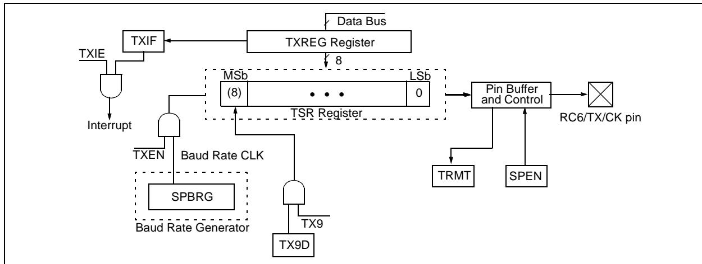

When setting up an Asynchronous Transmission, follow these steps:

- Initialize the SPBRG register for the appropriate baud rate. If a high-speed baud rate is desired, set bit BRGH (Section 10.1 "USART Baud Rate Generator (BRG)").
- Enable the asynchronous serial port by clearing bit SYNC and setting bit SPEN.
- 3. If interrupts are desired, then set enable bit TXIE.
- If 9-bit transmission is desired, then set transmit bit TX9.

- Enable the transmission by setting bit TXEN, which will also set bit TXIF.
- If 9-bit transmission is selected, the ninth bit should be loaded in bit TX9D.
- 7. Load data to the TXREG register (starts transmission).
- <span id="page-117-3"></span>8. If using interrupts, ensure that GIE and PEIE (bits 7 and 6) of the INTCON register are set.

#### <span id="page-117-0"></span>FIGURE 10-2: ASYNCHRONOUS MASTER TRANSMISSION

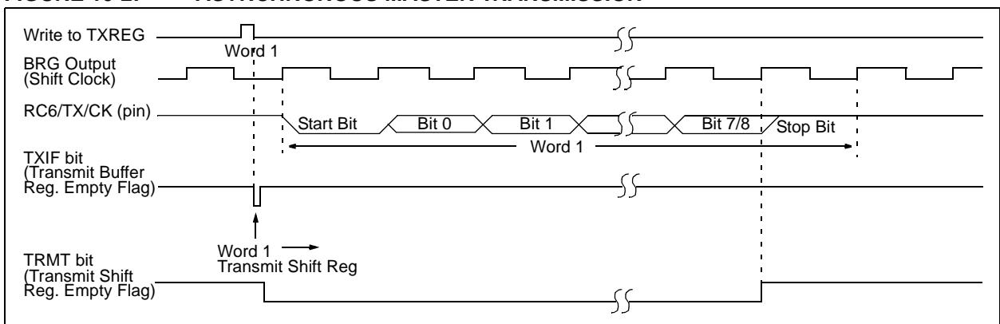

### <span id="page-117-4"></span><span id="page-117-1"></span>FIGURE 10-3: ASYNCHRONOUS MASTER TRANSMISSION (BACK TO BACK)

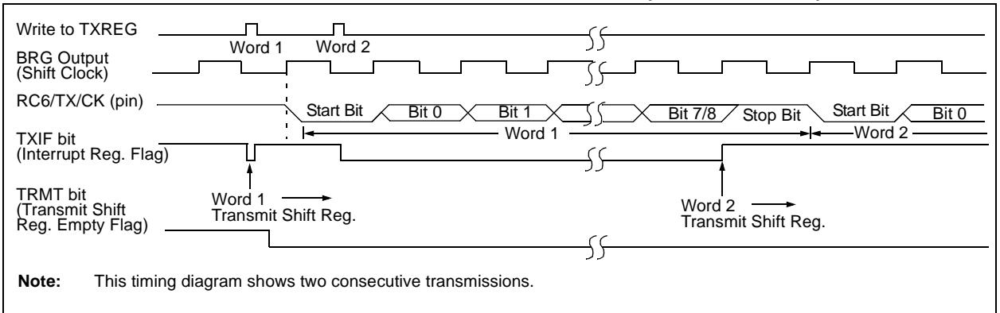

### <span id="page-117-2"></span>TABLE 10-5: REGISTERS ASSOCIATED WITH ASYNCHRONOUS TRANSMISSION

| Address                | Name   | Bit 7                | Bit 6    | Bit 5      | Bit 4 | Bit 3 | Bit 2  | Bit 1  | Bit 0  | Value on:<br>POR, BOR | Value on<br>all other<br>Resets |
|------------------------|--------|----------------------|----------|------------|-------|-------|--------|--------|--------|-----------------------|---------------------------------|
| 0Bh, 8Bh,<br>10Bh,18Bh | INTCON | GIE                  | PEIE     | TMR0IE     | INTE  | RBIE  | TMR0IF | INTF   | R0IF   | 0000 000x             | 0000 000u                       |
| 0Ch                    | PIR1   | PSPIF <sup>(1)</sup> | ADIF     | RCIF       | TXIF  | SSPIF | CCP1IF | TMR2IF | TMR1IF | 0000 0000             | 0000 0000                       |
| 18h                    | RCSTA  | SPEN                 | RX9      | SREN       | CREN  | _     | FERR   | OERR   | RX9D   | 0000 -00x             | 0000 -00x                       |
| 19h                    | TXREG  | USART Tra            | nsmit Re | gister     |       |       |        |        |        | 0000 0000             | 0000 0000                       |
| 8Ch                    | PIE1   | PSPIE <sup>(1)</sup> | ADIE     | RCIE       | TXIE  | SSPIE | CCP1IE | TMR2IE | TMR1IE | 0000 0000             | 0000 0000                       |
| 98h                    | TXSTA  | CSRC                 | TX9      | TXEN       | SYNC  | _     | BRGH   | TRMT   | TX9D   | 0000 -010             | 0000 -010                       |
| 99h                    | SPBRG  | Baud Rate            | Generato | r Register | •     |       |        |        |        | 0000 0000             | 0000 0000                       |

**Legend:** x = unknown, - = unimplemented locations read as '0'. Shaded cells are not used for asynchronous transmission.

Note 1: Bits PSPIE and PSPIF are reserved on 28-pin devices; always maintain these bits clear.

# <span id="page-118-2"></span>10.2.2 USART ASYNCHRONOUS RECEIVER

The receiver block diagram is shown in Figure 10-4. The data is received on the RC7/RX/DT pin and drives the data recovery block. The data recovery block is actually a high-speed shifter, operating at x16 times the baud rate; whereas the main receive serial shifter operates at the bit rate or at Fosc.

Once Asynchronous mode is selected, reception is enabled by setting bit CREN (RCSTA<4>).

The heart of the receiver is the Receive (Serial) Shift Register (RSR). After sampling the Stop bit, the received data in the RSR is transferred to the RCREG register (if it is empty). If the transfer is complete, flag bit, RCIF (PIR1<5>), is set. The actual interrupt can be enabled/disabled by setting/clearing enable bit, RCIE (PIE1<5>). Flag bit RCIF is a read-only bit which is cleared by the hardware. It is cleared when the RCREG register has been read and is empty. The RCREG is a double-buffered register (i.e., it is a two-deep FIFO). It

is possible for two bytes of data to be received and transferred to the RCREG FIFO and a third byte to begin shifting to the RSR register. On the detection of the Stop bit of the third byte, if the RCREG register is still full, the Overrun Error bit, OERR (RCSTA<1>), will be set. The word in the RSR will be lost. The RCREG register can be read twice to retrieve the two bytes in the FIFO. Overrun bit OERR has to be cleared in software. This is done by resetting the receive logic (CREN is cleared and then set). If bit OERR is set, transfers from the RSR register to the RCREG register are inhibited and no further data will be received. It is, therefore, essential to clear error bit OERR if it is set. Framing error bit, FERR (RCSTA<2>), is set if a Stop bit is detected as clear. Bit FERR and the 9th receive bit are buffered the same way as the receive data. Reading the RCREG will load bits RX9D and FERR with new values, therefore, it is essential for the user to read the RCSTA register before reading the RCREG register in order not to lose the old FERR and RX9D information.

<span id="page-118-1"></span><span id="page-118-0"></span>FIGURE 10-4: USART RECEIVE BLOCK DIAGRAM


<span id="page-119-1"></span>

<span id="page-119-2"></span>When setting up an Asynchronous Reception, follow these steps:

- Initialize the SPBRG register for the appropriate baud rate. If a high-speed baud rate is desired, set bit BRGH (Section 10.1 "USART Baud Rate Generator (BRG)").
- Enable the asynchronous serial port by clearing bit SYNC and setting bit SPEN.
- If interrupts are desired, then set enable bit RCIE.
- 4. If 9-bit reception is desired, then set bit RX9.
- 5. Enable the reception by setting bit CREN.

- Flag bit RCIF will be set when reception is complete and an interrupt will be generated if enable bit RCIE is set.
- Read the RCSTA register to get the ninth bit (if enabled) and determine if any error occurred during reception.
- 8. Read the 8-bit received data by reading the RCREG register.
- If any error occurred, clear the error by clearing enable bit CREN.
- 10. If using interrupts, ensure that GIE and PEIE (bits 7 and 6) of the INTCON register are set.

### <span id="page-119-0"></span>TABLE 10-6: REGISTERS ASSOCIATED WITH ASYNCHRONOUS RECEPTION

| Address                | Name   | Bit 7                | Bit 6      | Bit 5      | Bit 4 | Bit 3 | Bit 2  | Bit 1  | Bit 0  | Value on:<br>POR, BOR | Value on<br>all other<br>Resets |
|------------------------|--------|----------------------|------------|------------|-------|-------|--------|--------|--------|-----------------------|---------------------------------|
| 0Bh, 8Bh,<br>10Bh,18Bh | INTCON | GIE                  | PEIE       | TMR0IE     | INTE  | RBIE  | TMR0IF | INTF   | R0IF   | 0000 000x             | 0000 000u                       |
| 0Ch                    | PIR1   | PSPIF <sup>(1)</sup> | ADIF       | RCIF       | TXIF  | SSPIF | CCP1IF | TMR2IF | TMR1IF | 0000 0000             | 0000 0000                       |
| 18h                    | RCSTA  | SPEN                 | RX9        | SREN       | CREN  | _     | FERR   | OERR   | RX9D   | 0000 -00x             | 0000 -00x                       |
| 1Ah                    | RCREG  | USART R              | eceive Reg | jister     |       |       |        |        |        | 0000 0000             | 0000 0000                       |
| 8Ch                    | PIE1   | PSPIE <sup>(1)</sup> | ADIE       | RCIE       | TXIE  | SSPIE | CCP1IE | TMR2IE | TMR1IE | 0000 0000             | 0000 0000                       |
| 98h                    | TXSTA  | CSRC                 | TX9        | TXEN       | SYNC  | _     | BRGH   | TRMT   | TX9D   | 0000 -010             | 0000 -010                       |
| 99h                    | SPBRG  | Baud Rat             | e Generato | r Register |       |       |        |        |        | 0000 0000             | 0000 0000                       |

**Legend:** x = unknown, - = unimplemented locations read as '0'. Shaded cells are not used for asynchronous reception.

Note 1: Bits PSPIE and PSPIF are reserved on 28-pin devices; always maintain these bits clear.

### <span id="page-120-2"></span>10.2.3 SETTING UP 9-BIT MODE WITH ADDRESS DETECT

When setting up an Asynchronous Reception with address detect enabled:

- Initialize the SPBRG register for the appropriate baud rate. If a high-speed baud rate is desired, set bit BRGH.
- Enable the asynchronous serial port by clearing bit SYNC and setting bit SPEN.
- If interrupts are desired, then set enable bit RCIE.
- Set bit RX9 to enable 9-bit reception.
- Set ADDEN to enable address detect.
- Enable the reception by setting enable bit CREN.

- Flag bit RCIF will be set when reception is complete, and an interrupt will be generated if enable bit RCIE was set.
- Read the RCSTA register to get the ninth bit and determine if any error occurred during reception.
- Read the 8-bit received data by reading the RCREG register to determine if the device is being addressed.
- If any error occurred, clear the error by clearing enable bit CREN.
- <span id="page-120-1"></span>• If the device has been addressed, clear the ADDEN bit to allow data bytes and address bytes to be read into the receive buffer and interrupt the CPU.

<span id="page-120-0"></span>**FIGURE 10-6: USART RECEIVE BLOCK DIAGRAM**


### <span id="page-121-2"></span>FIGURE 10-7: ASYNCHRONOUS RECEPTION WITH ADDRESS DETECT


<span id="page-121-1"></span>**Note:** This timing diagram shows a data byte followed by an address byte. The data byte is not read into the RCREG (Receive Buffer) because ADDEN = 1.

### FIGURE 10-8: ASYNCHRONOUS RECEPTION WITH ADDRESS BYTE FIRST


<span id="page-121-0"></span>Note: This timing diagram shows a data byte followed by an address byte. The data byte is not read into the RCREG (Receive Buffer) because ADDEN was not updated and still = 0.

#### TABLE 10-7: REGISTERS ASSOCIATED WITH ASYNCHRONOUS RECEPTION

| Address                | Name   | Bit 7                | Bit 6                       | Bit 5  | Bit 4 | Bit 3 | Bit 2  | Bit 1  | Bit 0  | Value on:<br>POR, BOR | Value on<br>all other<br>Resets |
|------------------------|--------|----------------------|-----------------------------|--------|-------|-------|--------|--------|--------|-----------------------|---------------------------------|
| 0Bh, 8Bh,<br>10Bh,18Bh | INTCON | GIE                  | PEIE                        | TMR0IE | INTE  | RBIE  | TMR0IF | INTF   | R0IF   | 0000 000x             | 0000 000u                       |
| 0Ch                    | PIR1   | PSPIF <sup>(1)</sup> | ADIF                        | RCIF   | TXIF  | SSPIF | CCP1IF | TMR2IF | TMR1IF | 0000 0000             | 0000 0000                       |
| 18h                    | RCSTA  | SPEN                 | RX9                         | SREN   | CREN  | ADDEN | FERR   | OERR   | RX9D   | 0000 000x             | 0000 000x                       |
| 1Ah                    | RCREG  | USART Red            | ceive Re                    | gister |       |       |        |        |        | 0000 0000             | 0000 0000                       |
| 8Ch                    | PIE1   | PSPIE <sup>(1)</sup> | ADIE                        | RCIE   | TXIE  | SSPIE | CCP1IE | TMR2IE | TMR1IE | 0000 0000             | 0000 0000                       |
| 98h                    | TXSTA  | CSRC                 | TX9                         | TXEN   | SYNC  | _     | BRGH   | TRMT   | TX9D   | 0000 -010             | 0000 -010                       |
| 99h                    | SPBRG  | Baud Rate            | aud Rate Generator Register |        |       |       |        |        |        | 0000 0000             | 0000 0000                       |

**Legend:** x = unknown, - = unimplemented locations read as '0'. Shaded cells are not used for asynchronous reception.

Note 1: Bits PSPIE and PSPIF are reserved on 28-pin devices; always maintain these bits clear.

## <span id="page-122-0"></span>**10.3 USART Synchronous Master Mode**

In Synchronous Master mode, the data is transmitted in a half-duplex manner (i.e., transmission and reception do not occur at the same time). When transmitting data, the reception is inhibited and vice versa. Synchronous mode is entered by setting bit, SYNC (TXSTA<4>). In addition, enable bit, SPEN (RCSTA<7>), is set in order to configure the RC6/TX/CK and RC7/RX/DT I/O pins to CK (clock) and DT (data) lines, respectively. The Master mode indicates that the processor transmits the master clock on the CK line. The Master mode is entered by setting bit, CSRC (TXSTA<7>).

### 10.3.1 USART SYNCHRONOUS MASTER TRANSMISSION

The USART transmitter block diagram is shown in [Figure 10-6.](#page-120-0) The heart of the transmitter is the Transmit (Serial) Shift Register (TSR). The shift register obtains its data from the Read/Write Transmit Buffer register, TXREG. The TXREG register is loaded with data in software. The TSR register is not loaded until the last bit has been transmitted from the previous load. As soon as the last bit is transmitted, the TSR is loaded with new data from the TXREG (if available). Once the TXREG register transfers the data to the TSR register (occurs in one TCYCLE), the TXREG is empty and interrupt bit, TXIF (PIR1<4>), is set. The interrupt can be enabled/disabled by setting/clearing enable bit TXIE (PIE1<4>). Flag bit TXIF will be set regardless of the state of enable bit TXIE and cannot be cleared in software. It will reset only when new data is loaded into the TXREG register. While flag bit TXIF indicates the status of the TXREG register, another bit, TRMT (TXSTA<1>), shows the status of the TSR register. TRMT is a readonly bit which is set when the TSR is empty. No interrupt logic is tied to this bit so the user has to poll this bit in order to determine if the TSR register is empty. The TSR is not mapped in data memory so it is not available to the user.

Transmission is enabled by setting enable bit, TXEN (TXSTA<5>). The actual transmission will not occur until the TXREG register has been loaded with data. The first data bit will be shifted out on the next available rising edge of the clock on the CK line. Data out is stable around the falling edge of the synchronous clock ([Figure 10-9\)](#page-123-0). The transmission can also be started by first loading the TXREG register and then setting bit TXEN [\(Figure 10-10](#page-123-1)). This is advantageous when slow baud rates are selected since the BRG is kept in Reset when bits TXEN, CREN and SREN are clear. Setting enable bit TXEN will start the BRG, creating a shift clock immediately. Normally, when transmission is first started, the TSR register is empty so a transfer to the TXREG register will result in an immediate transfer to TSR, resulting in an empty TXREG. Back-to-back transfers are possible.

Clearing enable bit TXEN during a transmission will cause the transmission to be aborted and will reset the transmitter. The DT and CK pins will revert to highimpedance. If either bit CREN or bit SREN is set during a transmission, the transmission is aborted and the DT pin reverts to a high-impedance state (for a reception). The CK pin will remain an output if bit CSRC is set (internal clock). The transmitter logic, however, is not reset, although it is disconnected from the pins. In order to reset the transmitter, the user has to clear bit TXEN. If bit SREN is set (to interrupt an on-going transmission and receive a single word), then after the single word is received, bit SREN will be cleared and the serial port will revert back to transmitting since bit TXEN is still set. The DT line will immediately switch from High-Impedance Receive mode to transmit and start driving. To avoid this, bit TXEN should be cleared.

<span id="page-122-1"></span>In order to select 9-bit transmission, the TX9 (TXSTA<6>) bit should be set and the ninth bit should be written to bit TX9D (TXSTA<0>). The ninth bit must be written before writing the 8-bit data to the TXREG register. This is because a data write to the TXREG can result in an immediate transfer of the data to the TSR register (if the TSR is empty). If the TSR was empty and the TXREG was written before writing the "new" TX9D, the "present" value of bit TX9D is loaded.

Steps to follow when setting up a Synchronous Master Transmission:

- 1. Initialize the SPBRG register for the appropriate baud rate (**[Section 10.1 "USART Baud Rate](#page-114-2) [Generator \(BRG\)"](#page-114-2)**).
- 2. Enable the synchronous master serial port by setting bits SYNC, SPEN and CSRC.
- 3. If interrupts are desired, set enable bit TXIE.
- 4. If 9-bit transmission is desired, set bit TX9.
- 5. Enable the transmission by setting bit TXEN.
- 6. If 9-bit transmission is selected, the ninth bit should be loaded in bit TX9D.
- 7. Start transmission by loading data to the TXREG register.
- 8. If using interrupts, ensure that GIE and PEIE (bits 7 and 6) of the INTCON register are set.

<span id="page-123-2"></span>TABLE 10-8: REGISTERS ASSOCIATED WITH SYNCHRONOUS MASTER TRANSMISSION

| Address                | Name   | Bit 7                | Bit 6                       | Bit 5  | Bit 4 | Bit 3 | Bit 2  | Bit 1  | Bit 0  | Value on:<br>POR, BOF | l all other |
|------------------------|--------|----------------------|-----------------------------|--------|-------|-------|--------|--------|--------|-----------------------|-------------|
| 0Bh, 8Bh,<br>10Bh,18Bh | INTCON | GIE                  | PEIE                        | TMR0IE | INTE  | RBIE  | TMR0IF | INTF   | R0IF   | 0000 000              | c 0000 000u |
| 0Ch                    | PIR1   | PSPIF <sup>(1)</sup> | ADIF                        | RCIF   | TXIF  | SSPIF | CCP1IF | TMR2IF | TMR1IF | 0000 000              | 0000 0000   |
| 18h                    | RCSTA  | SPEN                 | RX9                         | SREN   | CREN  | 1     | FERR   | OERR   | RX9D   | 0000 -00              | 0000 -00x   |
| 19h                    | TXREG  | USART Tr             | ansmit Re                   | gister |       |       |        |        |        | 0000 000              | 0000 0000   |
| 8Ch                    | PIE1   | PSPIE <sup>(1)</sup> | ADIE                        | RCIE   | TXIE  | SSPIE | CCP1IE | TMR2IE | TMR1IE | 0000 000              | 0000 0000   |
| 98h                    | TXSTA  | CSRC                 | TX9                         | TXEN   | SYNC  | _     | BRGH   | TRMT   | TX9D   | 0000 -01              | 0 0000 -010 |
| 99h                    | SPBRG  | Baud Rate            | aud Rate Generator Register |        |       |       |        |        |        | 0000 000              | 0000 0000   |

**Legend:** x = unknown, - = unimplemented, read as '0'. Shaded cells are not used for synchronous master transmission.

Note 1: Bits PSPIE and PSPIF are reserved on 28-pin devices; always maintain these bits clear.

<span id="page-123-0"></span>FIGURE 10-9: SYNCHRONOUS TRANSMISSION

<span id="page-123-3"></span>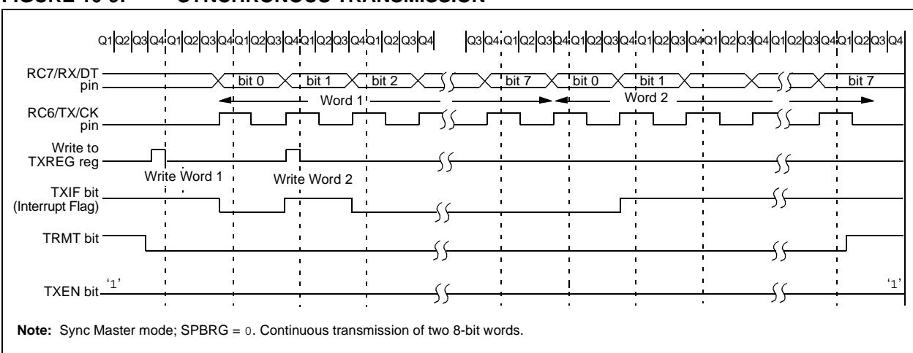

<span id="page-123-4"></span><span id="page-123-1"></span>FIGURE 10-10: SYNCHRONOUS TRANSMISSION (THROUGH TXEN)

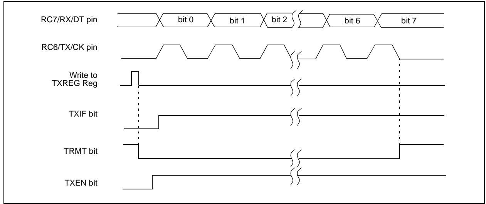

### 10.3.2 USART SYNCHRONOUS MASTER RECEPTION

Once Synchronous mode is selected, reception is enabled by setting either enable bit, SREN (RCSTA<5>), or enable bit, CREN (RCSTA<4>). Data is sampled on the RC7/RX/DT pin on the falling edge of the clock. If enable bit SREN is set, then only a single word is received. If enable bit CREN is set, the reception is continuous until CREN is cleared. If both bits are set, CREN takes precedence. After clocking the last bit, the received data in the Receive Shift Register (RSR) is transferred to the RCREG register (if it is empty). When the transfer is complete, interrupt flag bit, RCIF (PIR1<5>), is set. The actual interrupt can be enabled/ disabled by setting/clearing enable bit, RCIE (PIE1<5>). Flag bit RCIF is a read-only bit which is reset by the hardware. In this case, it is reset when the RCREG register has been read and is empty. The RCREG is a double-buffered register (i.e., it is a twodeep FIFO). It is possible for two bytes of data to be received and transferred to the RCREG FIFO and a third byte to begin shifting into the RSR register. On the clocking of the last bit of the third byte, if the RCREG register is still full, then Overrun Error bit, OERR (RCSTA<1>), is set. The word in the RSR will be lost. The RCREG register can be read twice to retrieve the two bytes in the FIFO. Bit OERR has to be cleared in software (by clearing bit CREN). If bit OERR is set, transfers from the RSR to the RCREG are inhibited so it is essential to clear bit OERR if it is set. The ninth receive bit is buffered the same way as the receive

<span id="page-124-1"></span>data. Reading the RCREG register will load bit RX9D with a new value, therefore, it is essential for the user to read the RCSTA register before reading RCREG in order not to lose the old RX9D information.

When setting up a Synchronous Master Reception:

- 1. Initialize the SPBRG register for the appropriate baud rate (**[Section 10.1 "USART Baud Rate](#page-114-2) [Generator \(BRG\)"](#page-114-2)**).
- 2. Enable the synchronous master serial port by setting bits SYNC, SPEN and CSRC.
- 3. Ensure bits CREN and SREN are clear.
- 4. If interrupts are desired, then set enable bit RCIE.
- 5. If 9-bit reception is desired, then set bit RX9.
- 6. If a single reception is required, set bit SREN. For continuous reception, set bit CREN.
- 7. Interrupt flag bit RCIF will be set when reception is complete and an interrupt will be generated if enable bit RCIE was set.
- 8. Read the RCSTA register to get the ninth bit (if enabled) and determine if any error occurred during reception.
- 9. Read the 8-bit received data by reading the RCREG register.
- 10. If any error occurred, clear the error by clearing bit CREN.
- 11. If using interrupts, ensure that GIE and PEIE (bits 7 and 6) of the INTCON register are set.

<span id="page-124-0"></span>**TABLE 10-9: REGISTERS ASSOCIATED WITH SYNCHRONOUS MASTER RECEPTION**

| Address                | Name   | Bit 7                  | Bit 6                        | Bit 5  | Bit 4 | Bit 3 | Bit 2  | Bit 1  | Bit 0  | Value on:<br>POR, BOR | Value on<br>all other<br>Resets |
|------------------------|--------|------------------------|------------------------------|--------|-------|-------|--------|--------|--------|-----------------------|---------------------------------|
| 0Bh, 8Bh,<br>10Bh,18Bh | INTCON | GIE                    | PEIE                         | TMR0IE | INTE  | RBIE  | TMR0IF | INTF   | R0IF   | 0000 000x             | 0000 000u                       |
| 0Ch                    | PIR1   | PSPIF(1)               | ADIF                         | RCIF   | TXIF  | SSPIF | CCP1IF | TMR2IF | TMR1IF | 0000 0000             | 0000 0000                       |
| 18h                    | RCSTA  | SPEN                   | RX9                          | SREN   | CREN  | —     | FERR   | OERR   | RX9D   | 0000 -00x             | 0000 -00x                       |
| 1Ah                    | RCREG  | USART Receive Register |                              |        |       |       |        |        |        | 0000 0000             | 0000 0000                       |
| 8Ch                    | PIE1   | PSPIE(1)               | ADIE                         | RCIE   | TXIE  | SSPIE | CCP1IE | TMR2IE | TMR1IE | 0000 0000             | 0000 0000                       |
| 98h                    | TXSTA  | CSRC                   | TX9                          | TXEN   | SYNC  | —     | BRGH   | TRMT   | TX9D   | 0000 -010             | 0000 -010                       |
| 99h                    | SPBRG  |                        | Baud Rate Generator Register |        |       |       |        |        |        | 0000 0000             | 0000 0000                       |

**Legend:** x = unknown, - = unimplemented, read as '0'. Shaded cells are not used for synchronous master reception.

**Note 1:** Bits PSPIE and PSPIF are reserved on 28-pin devices; always maintain these bits clear.

<span id="page-125-0"></span>

<span id="page-125-1"></span>**10.4 USART Synchronous Slave Mode**

Synchronous Slave mode differs from the Master mode in the fact that the shift clock is supplied externally at the RC6/TX/CK pin (instead of being supplied internally in Master mode). This allows the device to transfer or receive data while in Sleep mode. Slave mode is entered by clearing bit, CSRC (TXSTA<7>).

### <span id="page-125-2"></span>10.4.1 USART SYNCHRONOUS SLAVE TRANSMIT

The operation of the Synchronous Master and Slave modes is identical, except in the case of the Sleep mode.

If two words are written to the TXREG and then the SLEEP instruction is executed, the following will occur:

- a) The first word will immediately transfer to the TSR register and transmit.
- b) The second word will remain in TXREG register.
- c) Flag bit TXIF will not be set.
- d) When the first word has been shifted out of TSR, the TXREG register will transfer the second word to the TSR and flag bit TXIF will now be set.
- e) If enable bit TXIE is set, the interrupt will wake the chip from Sleep and if the global interrupt is enabled, the program will branch to the interrupt vector (0004h).

When setting up a Synchronous Slave Transmission, follow these steps:

- 1. Enable the synchronous slave serial port by setting bits SYNC and SPEN and clearing bit CSRC.
- 2. Clear bits CREN and SREN.
- 3. If interrupts are desired, then set enable bit TXIE.
- 4. If 9-bit transmission is desired, then set bit TX9.
- 5. Enable the transmission by setting enable bit TXEN.
- 6. If 9-bit transmission is selected, the ninth bit should be loaded in bit TX9D.
- 7. Start transmission by loading data to the TXREG register.
- 8. If using interrupts, ensure that GIE and PEIE (bits 7 and 6) of the INTCON register are set.

<span id="page-126-1"></span>**TABLE 10-10: REGISTERS ASSOCIATED WITH SYNCHRONOUS SLAVE TRANSMISSION**

| Address                | Name   | Bit 7                   | Bit 6                        | Bit 5  | Bit 4 | Bit 3 | Bit 2  | Bit 1  | Bit 0  | Value on:<br>POR, BOR | Value on<br>all other<br>Resets |
|------------------------|--------|-------------------------|------------------------------|--------|-------|-------|--------|--------|--------|-----------------------|---------------------------------|
| 0Bh, 8Bh,<br>10Bh,18Bh | INTCON | GIE                     | PEIE                         | TMR0IE | INTE  | RBIE  | TMR0IF | INTF   | R0IF   | 0000 000x             | 0000 000u                       |
| 0Ch                    | PIR1   | PSPIF(1)                | ADIF                         | RCIF   | TXIF  | SSPIF | CCP1IF | TMR2IF | TMR1IF | 0000 0000             | 0000 0000                       |
| 18h                    | RCSTA  | SPEN                    | RX9                          | SREN   | CREN  | ADDEN | FERR   | OERR   | RX9D   | 0000 000x             | 0000 000x                       |
| 19h                    | TXREG  | USART Transmit Register |                              |        |       |       |        |        |        | 0000 0000             | 0000 0000                       |
| 8Ch                    | PIE1   | PSPIE(1)                | ADIE                         | RCIE   | TXIE  | SSPIE | CCP1IE | TMR2IE | TMR1IE | 0000 0000             | 0000 0000                       |
| 98h                    | TXSTA  | CSRC                    | TX9                          | TXEN   | SYNC  | —     | BRGH   | TRMT   | TX9D   | 0000 -010             | 0000 -010                       |
| 99h                    | SPBRG  |                         | Baud Rate Generator Register |        |       |       |        |        |        | 0000 0000             | 0000 0000                       |

**Legend:** x = unknown, - = unimplemented, read as '0'. Shaded cells are not used for synchronous slave transmission.

<span id="page-126-2"></span>**Note 1:** Bits PSPIE and PSPIF are reserved on 28-pin devices; always maintain these bits clear.

### 10.4.2 USART SYNCHRONOUS SLAVE RECEPTION

The operation of the Synchronous Master and Slave modes is identical, except in the case of the Sleep mode. Bit SREN is a "don't care" in Slave mode.

If receive is enabled by setting bit CREN prior to the SLEEP instruction, then a word may be received during Sleep. On completely receiving the word, the RSR register will transfer the data to the RCREG register and if enable bit RCIE bit is set, the interrupt generated will wake the chip from Sleep. If the global interrupt is enabled, the program will branch to the interrupt vector (0004h).

When setting up a Synchronous Slave Reception, follow these steps:

- 1. Enable the synchronous master serial port by setting bits SYNC and SPEN and clearing bit CSRC.
- 2. If interrupts are desired, set enable bit RCIE.
- 3. If 9-bit reception is desired, set bit RX9.
- 4. To enable reception, set enable bit CREN.
- 5. Flag bit RCIF will be set when reception is complete and an interrupt will be generated if enable bit RCIE was set.
- 6. Read the RCSTA register to get the ninth bit (if enabled) and determine if any error occurred during reception.
- 7. Read the 8-bit received data by reading the RCREG register.
- 8. If any error occurred, clear the error by clearing bit CREN.
- 9. If using interrupts, ensure that GIE and PEIE (bits 7 and 6) of the INTCON register are set.

<span id="page-126-0"></span>**TABLE 10-11: REGISTERS ASSOCIATED WITH SYNCHRONOUS SLAVE RECEPTION**

| Address                | Name   | Bit 7                  | Bit 6                        | Bit 5  | Bit 4 | Bit 3 | Bit 2  | Bit 1  | Bit 0  | Value on:<br>POR, BOR | Value on<br>all other<br>Resets |
|------------------------|--------|------------------------|------------------------------|--------|-------|-------|--------|--------|--------|-----------------------|---------------------------------|
| 0Bh, 8Bh,<br>10Bh,18Bh | INTCON | GIE                    | PEIE                         | TMR0IE | INTE  | RBIE  | TMR0IF | INTF   | R0IF   | 0000 000x             | 0000 000u                       |
| 0Ch                    | PIR1   | PSPIF(1)               | ADIF                         | RCIF   | TXIF  | SSPIF | CCP1IF | TMR2IF | TMR1IF |                       | 0000 0000 0000 0000             |
| 18h                    | RCSTA  | SPEN                   | RX9                          | SREN   | CREN  | ADDEN | FERR   | OERR   | RX9D   |                       | 0000 000x 0000 000x             |
| 1Ah                    | RCREG  | USART Receive Register |                              |        |       |       |        |        |        |                       | 0000 0000 0000 0000             |
| 8Ch                    | PIE1   | PSPIE(1)               | ADIE                         | RCIE   | TXIE  | SSPIE | CCP1IE | TMR2IE | TMR1IE |                       | 0000 0000 0000 0000             |
| 98h                    | TXSTA  | CSRC                   | TX9                          | TXEN   | SYNC  | —     | BRGH   | TRMT   | TX9D   |                       | 0000 -010 0000 -010             |
| 99h                    | SPBRG  |                        | Baud Rate Generator Register |        |       |       |        |        |        |                       | 0000 0000 0000 0000             |

**Legend:** x = unknown, - = unimplemented, read as '0'. Shaded cells are not used for synchronous slave reception.

**Note 1:** Bits PSPIE and PSPIF are reserved on 28-pin devices, always maintain these bits clear.

**NOTES:**

## <span id="page-128-3"></span><span id="page-128-0"></span>**11.0 ANALOG-TO-DIGITAL CONVERTER (A/D) MODULE**

The Analog-to-Digital (A/D) Converter module has five inputs for the 28-pin devices and eight for the 40/44-pin devices.

The conversion of an analog input signal results in a corresponding 10-bit digital number. The A/D module has high and low-voltage reference input that is software selectable to some combination of VDD, VSS, RA2 or RA3.

The A/D converter has a unique feature of being able to operate while the device is in Sleep mode. To operate in Sleep, the A/D clock must be derived from the A/D's internal RC oscillator.

The A/D module has four registers. These registers are:

- <span id="page-128-7"></span><span id="page-128-6"></span>• A/D Result High Register (ADRESH)
- <span id="page-128-5"></span><span id="page-128-4"></span>• A/D Result Low Register (ADRESL)
- A/D Control Register 0 (ADCON0)
- A/D Control Register 1 (ADCON1)

The ADCON0 register, shown in [Register 11-1,](#page-128-2) controls the operation of the A/D module. The ADCON1 register, shown in [Register 11-2,](#page-129-1) configures the functions of the port pins. The port pins can be configured as analog inputs (RA3 can also be the voltage reference) or as digital I/O.

Additional information on using the A/D module can be found in the PICmicro® Mid-Range MCU Family Reference Manual (DS33023).

### <span id="page-128-2"></span>**REGISTER 11-1: ADCON0 REGISTER (ADDRESS 1Fh)**

<span id="page-128-8"></span><span id="page-128-1"></span>

| R/W-0 | R/W-0 | R/W-0 | R/W-0 | R/W-0 | R/W-0   | U-0 | R/W-0 |
|-------|-------|-------|-------|-------|---------|-----|-------|
| ADCS1 | ADCS0 | CHS2  | CHS1  | CHS0  | GO/DONE | —   | ADON  |
| bit 7 |       |       |       |       |         |     | bit 0 |

### bit 7-6 **ADCS1:ADCS0:** A/D Conversion Clock Select bits (ADCON0 bits in **bold**)

| ADCON1<br><adcs2></adcs2> | ADCON0<br><adcs1:adcs0></adcs1:adcs0> | Clock Conversion                                        |
|---------------------------|---------------------------------------|---------------------------------------------------------|
| 0                         | 00                                    | FOSC/2                                                  |
| 0                         | 01                                    | FOSC/8                                                  |
| 0                         | 10                                    | FOSC/32                                                 |
| 0                         | 11                                    | FRC (clock derived from the internal A/D RC oscillator) |
| 1                         | 00                                    | FOSC/4                                                  |
| 1                         | 01                                    | FOSC/16                                                 |
| 1                         | 10                                    | FOSC/64                                                 |
| 1                         | 11                                    | FRC (clock derived from the internal A/D RC oscillator) |

### bit 5-3 **CHS2:CHS0:** Analog Channel Select bits

- 000 = Channel 0 (AN0)
- 001 = Channel 1 (AN1)
- 010 = Channel 2 (AN2)
- 011 = Channel 3 (AN3)
- 100 = Channel 4 (AN4)
- 101 = Channel 5 (AN5)
- 110 = Channel 6 (AN6)
- 111 = Channel 7 (AN7)

**Note:** The PIC16F873A/876A devices only implement A/D channels 0 through 4; the unimplemented selections are reserved. Do not select any unimplemented channels with these devices.

bit 2 **GO/DONE:** A/D Conversion Status bit

#### When ADON = 1:

- 1 = A/D conversion in progress (setting this bit starts the A/D conversion which is automatically cleared by hardware when the A/D conversion is complete)
- 0 = A/D conversion not in progress
- bit 1 **Unimplemented:** Read as '0'
- bit 0 **ADON:** A/D On bit
  - 1 = A/D converter module is powered up
  - 0 = A/D converter module is shut-off and consumes no operating current

| Legend:            |                  |                                    |                    |
|--------------------|------------------|------------------------------------|--------------------|
| R = Readable bit   | W = Writable bit | U = Unimplemented bit, read as '0' |                    |
| - n = Value at POR | '1' = Bit is set | '0' = Bit is cleared               | x = Bit is unknown |

### <span id="page-129-1"></span>**REGISTER 11-2: ADCON1 REGISTER (ADDRESS 9Fh)**

<span id="page-129-2"></span><span id="page-129-0"></span>

| R/W-0 | R/W-0 | U-0 | U-0 | R/W-0 | R/W-0 | R/W-0 | R/W-0 |
|-------|-------|-----|-----|-------|-------|-------|-------|
| ADFM  | ADCS2 | —   | —   | PCFG3 | PCFG2 | PCFG1 | PCFG0 |

bit 7 bit 0

bit 7 **ADFM:** A/D Result Format Select bit

1 = Right justified. Six (6) Most Significant bits of ADRESH are read as '0'.

0 = Left justified. Six (6) Least Significant bits of ADRESL are read as '0'.

bit 6 **ADCS2:** A/D Conversion Clock Select bit (ADCON1 bits in shaded area and in **bold**)

| ADCON1<br><adcs2></adcs2> | ADCON0<br><adcs1:adcs0></adcs1:adcs0> | Clock Conversion                                        |
|---------------------------|---------------------------------------|---------------------------------------------------------|
| 0                         | 00                                    | FOSC/2                                                  |
| 0                         | 01                                    | FOSC/8                                                  |
| 0                         | 10                                    | FOSC/32                                                 |
| 0                         | 11                                    | FRC (clock derived from the internal A/D RC oscillator) |
| 1                         | 00                                    | FOSC/4                                                  |
| 1                         | 01                                    | FOSC/16                                                 |
| 1                         | 10                                    | FOSC/64                                                 |
| 1                         | 11                                    | FRC (clock derived from the internal A/D RC oscillator) |

bit 5-4 **Unimplemented:** Read as '0'

bit 3-0 **PCFG3:PCFG0:** A/D Port Configuration Control bits

| PCFG<br><3:0> | AN7 | AN6 | AN5 | AN4 | AN3   | AN2   | AN1 | AN0 | VREF+ | VREF- | C/R |
|---------------|-----|-----|-----|-----|-------|-------|-----|-----|-------|-------|-----|
| 0000          | A   | A   | A   | A   | A     | A     | A   | A   | VDD   | VSS   | 8/0 |
| 0001          | A   | A   | A   | A   | VREF+ | A     | A   | A   | AN3   | VSS   | 7/1 |
| 0010          | D   | D   | D   | A   | A     | A     | A   | A   | VDD   | VSS   | 5/0 |
| 0011          | D   | D   | D   | A   | VREF+ | A     | A   | A   | AN3   | VSS   | 4/1 |
| 0100          | D   | D   | D   | D   | A     | D     | A   | A   | VDD   | VSS   | 3/0 |
| 0101          | D   | D   | D   | D   | VREF+ | D     | A   | A   | AN3   | VSS   | 2/1 |
| 011x          | D   | D   | D   | D   | D     | D     | D   | D   | —     | —     | 0/0 |
| 1000          | A   | A   | A   | A   | VREF+ | VREF- | A   | A   | AN3   | AN2   | 6/2 |
| 1001          | D   | D   | A   | A   | A     | A     | A   | A   | VDD   | VSS   | 6/0 |
| 1010          | D   | D   | A   | A   | VREF+ | A     | A   | A   | AN3   | VSS   | 5/1 |
| 1011          | D   | D   | A   | A   | VREF+ | VREF- | A   | A   | AN3   | AN2   | 4/2 |
| 1100          | D   | D   | D   | A   | VREF+ | VREF- | A   | A   | AN3   | AN2   | 3/2 |
| 1101          | D   | D   | D   | D   | VREF+ | VREF- | A   | A   | AN3   | AN2   | 2/2 |
| 1110          | D   | D   | D   | D   | D     | D     | D   | A   | VDD   | VSS   | 1/0 |
| 1111          | D   | D   | D   | D   | VREF+ | VREF- | D   | A   | AN3   | AN2   | 1/2 |

A = Analog input D = Digital I/O

C/R = # of analog input channels/# of A/D voltage references

**Legend:**

R = Readable bit W = Writable bit U = Unimplemented bit, read as '0' - n = Value at POR '1' = Bit is set '0' = Bit is cleared x = Bit is unknown

**Note:** On any device Reset, the port pins that are multiplexed with analog functions (ANx) are forced to be an analog input.

<span id="page-130-4"></span>The ADRESH:ADRESL registers contain the 10-bit result of the A/D conversion. When the A/D conversion is complete, the result is loaded into this A/D Result register pair, the GO/DONE bit (ADCON0<2>) is cleared and the A/D interrupt flag bit ADIF is set. The block diagram of the A/D module is shown in [Figure 11-1](#page-130-0).

<span id="page-130-1"></span>After the A/D module has been configured as desired, the selected channel must be acquired before the conversion is started. The analog input channels must have their corresponding TRIS bits selected as inputs.

To determine sample time, see **[Section 11.1 "A/D](#page-131-0) [Acquisition Requirements"](#page-131-0)**. After this acquisition time has elapsed, the A/D conversion can be started.

To do an A/D Conversion, follow these steps:

- <span id="page-130-3"></span>1. Configure the A/D module:
  - Configure analog pins/voltage reference and digital I/O (ADCON1)
  - Select A/D input channel (ADCON0)
  - Select A/D conversion clock (ADCON0)
  - Turn on A/D module (ADCON0)

- <span id="page-130-2"></span>2. Configure A/D interrupt (if desired):
  - Clear ADIF bit
  - Set ADIE bit
  - Set PEIE bit
  - Set GIE bit
- 3. Wait the required acquisition time.
- 4. Start conversion:
  - Set GO/DONE bit (ADCON0)
- 5. Wait for A/D conversion to complete by either:
  - Polling for the GO/DONE bit to be cleared (interrupts disabled); OR
  - Waiting for the A/D interrupt
- 6. Read A/D Result register pair (ADRESH:ADRESL), clear bit ADIF if required.
- 7. For the next conversion, go to step 1 or step 2 as required. The A/D conversion time per bit is defined as TAD.

<span id="page-130-5"></span><span id="page-130-0"></span>**FIGURE 11-1: A/D BLOCK DIAGRAM** 

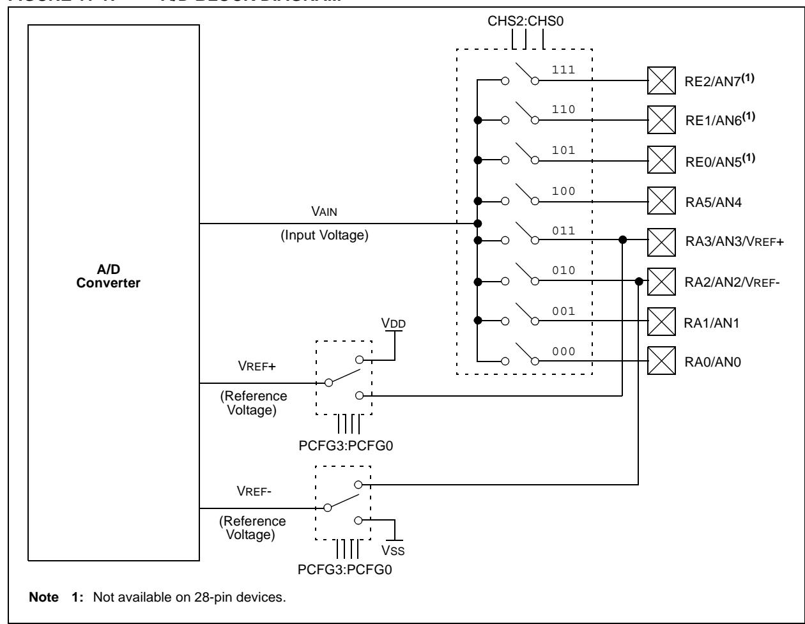

### <span id="page-131-3"></span><span id="page-131-0"></span>11.1 A/D Acquisition Requirements

<span id="page-131-8"></span>For the A/D converter to meet its specified accuracy, the charge holding capacitor (CHOLD) must be allowed to fully charge to the input channel voltage level. The analog input model is shown in Figure 11-2. The source impedance (Rs) and the internal sampling switch impedance (Rss) directly affect the time required to charge the capacitor CHOLD. The sampling switch (Rss) impedance varies over the device voltage (VDD); see Figure 11-2. The maximum recommended impedance for analog sources is 2.5 k $\Omega$ . As the impedance is decreased, the acquisition time may be

decreased. After the analog input channel is selected (changed), this acquisition must be done before the conversion can be started.

<span id="page-131-6"></span><span id="page-131-5"></span>To calculate the minimum acquisition time, Equation 11-1 may be used. This equation assumes that 1/2 LSb error is used (1024 steps for the A/D). The 1/2 LSb error is the maximum error allowed for the A/D to meet its specified resolution.

<span id="page-131-4"></span>To calculate the minimum acquisition time, TACQ, see the PICmicro® Mid-Range MCU Family Reference Manual (DS33023).

#### <span id="page-131-2"></span>**EQUATION 11-1: ACQUISITION TIME**

```
Tacq = Amplifier Settling Time + Hold Capacitor Charging Time + Temperature Coefficient  = \text{TAMP} + \text{TC} + \text{TCOFF} 
 = 2 \, \mu \text{s} + \text{TC} + [(\text{Temperature} - 25^{\circ}\text{C})(0.05 \, \mu \text{s}/^{\circ}\text{C})] 
Tc = Chold (Ric + Rss + Rs) In(1/2047)
 = -120 \, \text{pF} (1 \, \text{k}\Omega + 7 \, \text{k}\Omega + 10 \, \text{k}\Omega) \, \text{In}(0.0004885) 
 = 16.47 \, \mu \text{s} 
Tacq = 2 \, \mu \text{s} + 16.47 \, \mu \text{s} + [(50^{\circ}\text{C} - 25^{\circ}\text{C})(0.05 \, \mu \text{s}/^{\circ}\text{C}) 
 = 19.72 \, \mu \text{s}
```

- Note 1: The reference voltage (VREF) has no effect on the equation since it cancels itself out.
  - 2: The charge holding capacitor (CHOLD) is not discharged after each conversion.
  - 3: The maximum recommended impedance for analog sources is 2.5 k $\Omega$ . This is required to meet the pin leakage specification.

### <span id="page-131-7"></span><span id="page-131-1"></span>FIGURE 11-2: ANALOG INPUT MODEL

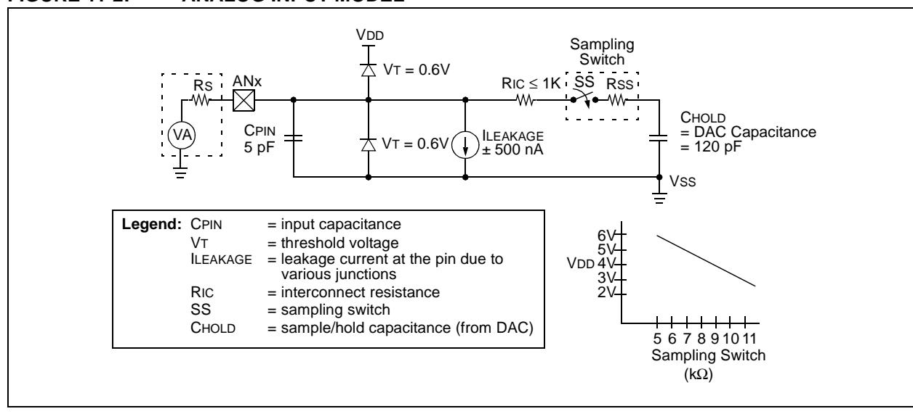

## <span id="page-132-2"></span>**11.2 Selecting the A/D Conversion Clock**

The A/D conversion time per bit is defined as TAD. The A/D conversion requires a minimum 12 TAD per 10-bit conversion. The source of the A/D conversion clock is software selected. The seven possible options for TAD are:

- 2 TOSC
- 4 TOSC
- 8 TOSC
- 16 TOSC
- 32 TOSC
- 64 TOSC
- Internal A/D module RC oscillator (2-6 µs)

For correct A/D conversions, the A/D conversion clock (TAD) must be selected to ensure a minimum TAD time of 1.6 µs.

[Table 11-1](#page-132-0) shows the resultant TAD times derived from the device operating frequencies and the A/D clock source selected.

## <span id="page-132-1"></span>**11.3 Configuring Analog Port Pins**

<span id="page-132-3"></span>The ADCON1 and TRIS registers control the operation of the A/D port pins. The port pins that are desired as analog inputs must have their corresponding TRIS bits set (input). If the TRIS bit is cleared (output), the digital output level (VOH or VOL) will be converted.

The A/D operation is independent of the state of the CHS2:CHS0 bits and the TRIS bits.

- **Note 1:** When reading the port register, any pin configured as an analog input channel will read as cleared (a low level). Pins configured as digital inputs will convert an analog input. Analog levels on a digitally configured input will not affect the conversion accuracy.
  - **2:** Analog levels on any pin that is defined as a digital input (including the AN7:AN0 pins) may cause the input buffer to consume current that is out of the device specifications.

<span id="page-132-0"></span>**TABLE 11-1: TAD vs. MAXIMUM DEVICE OPERATING FREQUENCIES (STANDARD DEVICES (F))** 

|             | AD Clock Source (TAD) |                          |  |  |
|-------------|-----------------------|--------------------------|--|--|
| Operation   | ADCS2:ADCS1:ADCS0     | Maximum Device Frequency |  |  |
| 2 TOSC      | 000                   | 1.25 MHz                 |  |  |
| 4 TOSC      | 100                   | 2.5 MHz                  |  |  |
| 8 TOSC      | 001                   | 5 MHz                    |  |  |
| 16 TOSC     | 101                   | 10 MHz                   |  |  |
| 32 TOSC     | 010                   | 20 MHz                   |  |  |
| 64 TOSC     | 110                   | 20 MHz                   |  |  |
| RC(1, 2, 3) | x11                   | (Note 1)                 |  |  |

- **Note 1:** The RC source has a typical TAD time of 4 µs but can vary between 2-6 µs.
  - **2:** When the device frequencies are greater than 1 MHz, the RC A/D conversion clock source is only recommended for Sleep operation.
  - **3:** For extended voltage devices (LF), please refer to **[Section 17.0 "Electrical Characteristics"](#page-174-1)**.

## <span id="page-133-2"></span>**11.4 A/D Conversions**

Clearing the GO/DONE bit during a conversion will abort the current conversion. The A/D Result register pair will NOT be updated with the partially completed A/D conversion sample. That is, the ADRESH:ADRESL registers will continue to contain the value of the last completed conversion (or the last value written to the ADRESH:ADRESL registers). After the A/D conversion is aborted, the next acquisition on the selected channel is automatically started. The GO/DONE bit can then be set to start the conversion.

In [Figure 11-3](#page-133-0), after the GO bit is set, the first time segment has a minimum of TCY and a maximum of TAD.

**Note:** The GO/DONE bit should **NOT** be set in the same instruction that turns on the A/D.

### <span id="page-133-0"></span>**FIGURE 11-3: A/D CONVERSION TAD CYCLES**

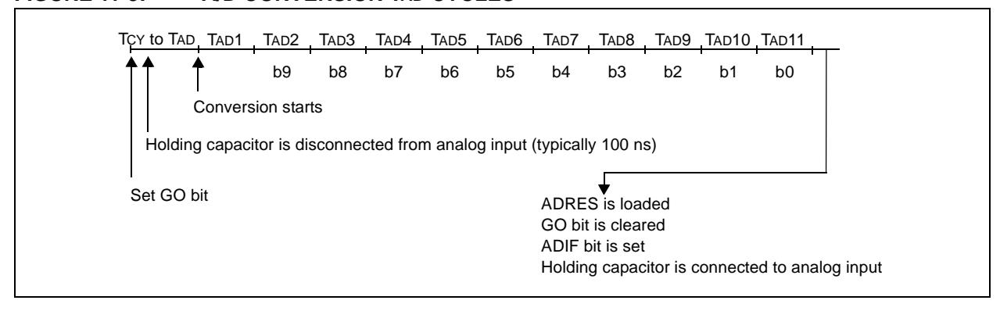

### <span id="page-133-3"></span>11.4.1 A/D RESULT REGISTERS

The ADRESH:ADRESL register pair is the location where the 10-bit A/D result is loaded at the completion of the A/D conversion. This register pair is 16 bits wide. The A/D module gives the flexibility to left or right justify the 10-bit result in the 16-bit result register. The A/D Format Select bit (ADFM) controls this justification. [Figure 11-4](#page-133-1) shows the operation of the A/D result justification. The extra bits are loaded with '0's. When an A/D result will not overwrite these locations (A/D disable), these registers may be used as two general purpose 8-bit registers.

<span id="page-133-1"></span>**FIGURE 11-4: A/D RESULT JUSTIFICATION** 

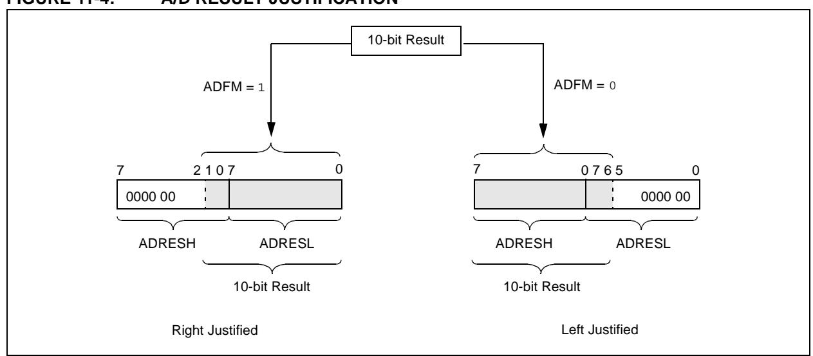

## <span id="page-134-3"></span>**11.5 A/D Operation During Sleep**

The A/D module can operate during Sleep mode. This requires that the A/D clock source be set to RC (ADCS1:ADCS0 = 11). When the RC clock source is selected, the A/D module waits one instruction cycle before starting the conversion. This allows the SLEEP instruction to be executed which eliminates all digital switching noise from the conversion. When the conversion is completed, the GO/DONE bit will be cleared and the result loaded into the ADRES register. If the A/D interrupt is enabled, the device will wake-up from Sleep. If the A/D interrupt is not enabled, the A/D module will then be turned off, although the ADON bit will remain set.

When the A/D clock source is another clock option (not RC), a SLEEP instruction will cause the present conversion to be aborted and the A/D module to be turned off, though the ADON bit will remain set.

Turning off the A/D places the A/D module in its lowest current consumption state.

**Note:** For the A/D module to operate in Sleep, the A/D clock source must be set to RC (ADCS1:ADCS0 = 11). To allow the conversion to occur during Sleep, ensure the SLEEP instruction immediately follows the instruction that sets the GO/DONE bit.

## <span id="page-134-2"></span>**11.6 Effects of a Reset**

A device Reset forces all registers to their Reset state. This forces the A/D module to be turned off and any conversion is aborted. All A/D input pins are configured as analog inputs.

<span id="page-134-1"></span>The value that is in the ADRESH:ADRESL registers is not modified for a Power-on Reset. The ADRESH:ADRESL registers will contain unknown data after a Power-on Reset.

<span id="page-134-0"></span>**TABLE 11-2: REGISTERS/BITS ASSOCIATED WITH A/D** 

| Address               | Name   | Bit 7    | Bit 6 | Bit 5                         | Bit 4                                               | Bit 3 | Bit 2                     | Bit 1  | Bit 0  | POR, BOR  | Value on | MCLR, WDT       | Value on |
|-----------------------|--------|----------|-------|-------------------------------|-----------------------------------------------------|-------|---------------------------|--------|--------|-----------|----------|-----------------|----------|
| 0Bh,8Bh,<br>10Bh,18Bh | INTCON | GIE      | PEIE  | TMR0IE                        | INTE                                                | RBIE  | TMR0IF                    | INTF   | RBIF   | 0000 000x |          | 0000 000u       |          |
| 0Ch                   | PIR1   | PSPIF(1) | ADIF  | RCIF                          | TXIF                                                | SSPIF | CCP1IF                    | TMR2IF | TMR1IF | 0000 0000 |          | 0000 0000       |          |
| 8Ch                   | PIE1   | PSPIE(1) | ADIE  | RCIE                          | TXIE                                                | SSPIE | CCP1IE                    | TMR2IE | TMR1IE | 0000 0000 |          | 0000 0000       |          |
| 1Eh                   | ADRESH |          |       | A/D Result Register High Byte |                                                     |       |                           |        |        | xxxx xxxx |          | uuuu uuuu       |          |
| 9Eh                   | ADRESL |          |       | A/D Result Register Low Byte  |                                                     |       |                           |        |        | xxxx xxxx |          | uuuu uuuu       |          |
| 1Fh                   | ADCON0 | ADCS1    | ADCS0 | CHS2                          | CHS1                                                | CHS0  | GO/DONE                   | —      | ADON   | 0000 00-0 |          | 0000 00-0       |          |
| 9Fh                   | ADCON1 | ADFM     | ADCS2 | —                             | —                                                   | PCFG3 | PCFG2                     | PCFG1  | PCFG0  |           |          | 00 0000 00 0000 |          |
| 85h                   | TRISA  | —        | —     |                               | PORTA Data Direction Register                       |       |                           |        |        | 11 1111   |          | 11 1111         |          |
| 05h                   | PORTA  | —        | —     |                               | PORTA Data Latch when written: PORTA pins when read |       |                           |        |        | 0x 0000   |          | 0u 0000         |          |
| 89h(1)                | TRISE  | IBF      | OBF   | IBOV                          | PSPMODE                                             | —     | PORTE Data Direction bits |        |        | 0000 -111 |          | 0000 -111       |          |
| 09h(1)                | PORTE  | —        | —     | —                             | —                                                   | —     | RE2                       | RE1    | RE0    | xxx       |          | uuu             |          |

**Legend:** x = unknown, u = unchanged, - = unimplemented, read as '0'. Shaded cells are not used for A/D conversion.

**Note 1:** These registers are not available on 28-pin devices.

**NOTES:**

## <span id="page-136-3"></span><span id="page-136-0"></span>**12.0 COMPARATOR MODULE**

The comparator module contains two analog comparators. The inputs to the comparators are multiplexed with I/O port pins RA0 through RA3, while the outputs are multiplexed to pins RA4 and RA5. The on-chip voltage reference (**[Section 13.0 "Comparator Voltage](#page-142-2) [Reference Module"](#page-142-2)**) can also be an input to the comparators.

The CMCON register ([Register 12-1\)](#page-136-2) controls the comparator input and output multiplexers. A block diagram of the various comparator configurations is shown in [Figure 12-1.](#page-137-0)

### <span id="page-136-2"></span>**REGISTER 12-1: CMCON REGISTER**

<span id="page-136-4"></span><span id="page-136-1"></span>

| R-0   | R-0   | R/W-0 | R/W-0 | R/W-0 | R/W-1 | R/W-1 | R/W-1 |
|-------|-------|-------|-------|-------|-------|-------|-------|
| C2OUT | C1OUT | C2INV | C1INV | CIS   | CM2   | CM1   | CM0   |
| bit 7 |       |       |       |       |       |       | bit 0 |

bit 7 **C2OUT**: Comparator 2 Output bit

When C2INV = 0:

1 = C2 VIN+ > C2 VIN-

0 = C2 VIN+ < C2 VIN-

When C2INV = 1:

1 = C2 VIN+ < C2 VIN-

0 = C2 VIN+ > C2 VIN-

bit 6 **C1OUT**: Comparator 1 Output bit

When C1INV = 0:

1 = C1 VIN+ > C1 VIN-

0 = C1 VIN+ < C1 VIN-

When C1INV = 1:

1 = C1 VIN+ < C1 VIN-

0 = C1 VIN+ > C1 VIN-

bit 5 **C2INV**: Comparator 2 Output Inversion bit

1 = C2 output inverted

0 = C2 output not inverted

bit 4 **C1INV**: Comparator 1 Output Inversion bit

1 = C1 output inverted

0 = C1 output not inverted

bit 3 **CIS**: Comparator Input Switch bit

When CM2:CM0 = 110:

1 = C1 VIN- connects to RA3/AN3

C2 VIN- connects to RA2/AN2

0 = C1 VIN- connects to RA0/AN0

C2 VIN- connects to RA1/AN1

bit 2 **CM2:CM0**: Comparator Mode bits

[Figure 12-1](#page-137-0) shows the Comparator modes and CM2:CM0 bit settings.

### **Legend:**

R = Readable bit W = Writable bit U = Unimplemented bit, read as '0' - n = Value at POR '1' = Bit is set '0' = Bit is cleared x = Bit is unknown

### <span id="page-137-2"></span>12.1 Comparator Configuration

There are eight modes of operation for the comparators. The CMCON register is used to select these modes. Figure 12-1 shows the eight possible modes. The TRISA register controls the data direction of the comparator pins for each mode. If the Comparator mode is changed, the comparator output level may not be valid for the specified mode change delay shown in **Section 17.0** "Electrical Characteristics".

<span id="page-137-1"></span>Note: Comparator interrupts should be disabled during a Comparator mode change. Otherwise, a false interrupt may occur.

### <span id="page-137-0"></span>FIGURE 12-1: COMPARATOR I/O OPERATING MODES


### <span id="page-138-1"></span>**12.2 Comparator Operation**

A single comparator is shown in [Figure 12-2](#page-138-0) along with the relationship between the analog input levels and the digital output. When the analog input at VIN+ is less than the analog input VIN-, the output of the comparator is a digital low level. When the analog input at VIN+ is greater than the analog input VIN-, the output of the comparator is a digital high level. The shaded areas of the output of the comparator in [Figure 12-2](#page-138-0) represent the uncertainty due to input offsets and response time.

## <span id="page-138-3"></span>**12.3 Comparator Reference**

An external or internal reference signal may be used depending on the comparator operating mode. The analog signal present at VIN- is compared to the signal at VIN+ and the digital output of the comparator is adjusted accordingly [\(Figure 12-2](#page-138-0)).

<span id="page-138-0"></span>**FIGURE 12-2: SINGLE COMPARATOR** 


### 12.3.1 EXTERNAL REFERENCE SIGNAL

When external voltage references are used, the comparator module can be configured to have the comparators operate from the same or different reference sources. However, threshold detector applications may require the same reference. The reference signal must be between VSS and VDD and can be applied to either pin of the comparator(s).

### <span id="page-138-6"></span>12.3.2 INTERNAL REFERENCE SIGNAL

The comparator module also allows the selection of an internally generated voltage reference for the comparators. **[Section 13.0 "Comparator Voltage Reference](#page-142-2) [Module"](#page-142-2)** contains a detailed description of the Comparator Voltage Reference module that provides this signal. The internal reference signal is used when comparators are in mode, CM<2:0> = 110 ([Figure 12-1\)](#page-137-0). In this mode, the internal voltage reference is applied to the VIN+ pin of both comparators.

## <span id="page-138-4"></span>**12.4 Comparator Response Time**

Response time is the minimum time, after selecting a new reference voltage or input source, before the comparator output has a valid level. If the internal reference is changed, the maximum delay of the internal voltage reference must be considered when using the comparator outputs. Otherwise, the maximum delay of the comparators should be used (**[Section 17.0 "Electrical](#page-174-1) [Characteristics"](#page-174-1)**).

### <span id="page-138-2"></span>**12.5 Comparator Outputs**

The comparator outputs are read through the CMCON register. These bits are read-only. The comparator outputs may also be directly output to the RA4 and RA5 I/O pins. When enabled, multiplexors in the output path of the RA4 and RA5 pins will switch and the output of each pin will be the unsynchronized output of the comparator. The uncertainty of each of the comparators is related to the input offset voltage and the response time given in the specifications. [Figure 12-3](#page-139-0) shows the comparator output block diagram.

The TRISA bits will still function as an output enable/ disable for the RA4 and RA5 pins while in this mode.

<span id="page-138-5"></span>The polarity of the comparator outputs can be changed using the C2INV and C1INV bits (CMCON<4:5>).

- **Note 1:** When reading the Port register, all pins configured as analog inputs will read as a '0'. Pins configured as digital inputs will convert an analog input according to the Schmitt Trigger input specification.
  - **2:** Analog levels on any pin defined as a digital input may cause the input buffer to consume more current than is specified.
  - **3:** RA4 is an open collector I/O pin. When used as an output, a pull-up resistor is required.

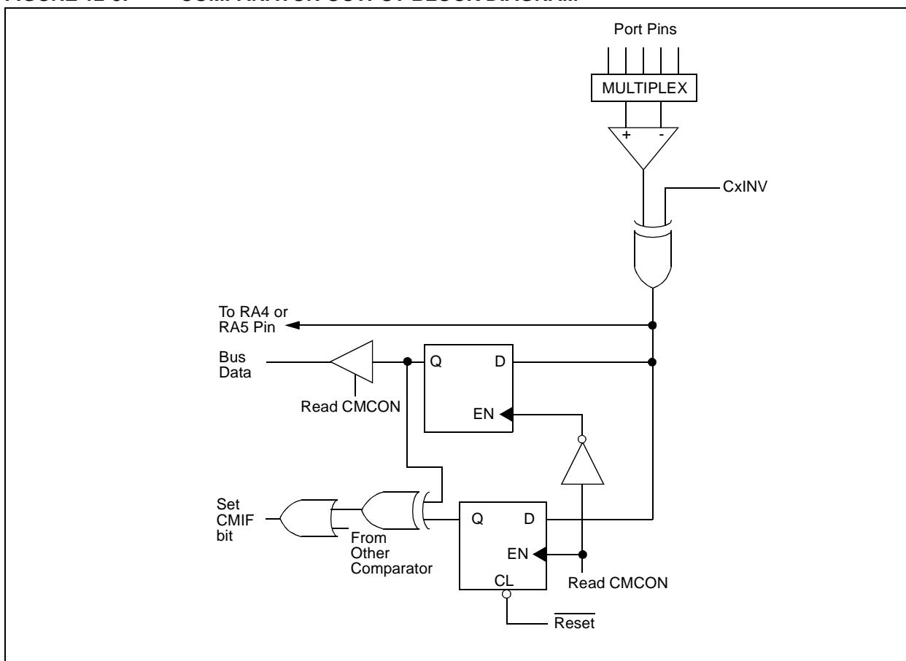

<span id="page-139-1"></span><span id="page-139-0"></span>**FIGURE 12-3: COMPARATOR OUTPUT BLOCK DIAGRAM** 

### <span id="page-139-2"></span>**12.6 Comparator Interrupts**

The comparator interrupt flag is set whenever there is a change in the output value of either comparator. Software will need to maintain information about the status of the output bits, as read from CMCON<7:6>, to determine the actual change that occurred. The CMIF bit (PIR registers) is the Comparator Interrupt Flag. The CMIF bit must be reset by clearing it ('0'). Since it is also possible to write a '1' to this register, a simulated interrupt may be initiated.

The CMIE bit (PIE registers) and the PEIE bit (INTCON register) must be set to enable the interrupt. In addition, the GIE bit must also be set. If any of these bits are clear, the interrupt is not enabled, though the CMIF bit will still be set if an interrupt condition occurs.

**Note:** If a change in the CMCON register (C1OUT or C2OUT) should occur when a read operation is being executed (start of the Q2 cycle), then the CMIF (PIR registers) interrupt flag may not get set.

The user, in the Interrupt Service Routine, can clear the interrupt in the following manner:

- a) Any read or write of CMCON will end the mismatch condition.
- b) Clear flag bit CMIF.

A mismatch condition will continue to set flag bit CMIF. Reading CMCON will end the mismatch condition and allow flag bit CMIF to be cleared.

## <span id="page-140-4"></span>**12.7 Comparator Operation During Sleep**

When a comparator is active and the device is placed in Sleep mode, the comparator remains active and the interrupt is functional if enabled. This interrupt will wake-up the device from Sleep mode when enabled. While the comparator is powered up, higher Sleep currents than shown in the power-down current specification will occur. Each operational comparator will consume additional current as shown in the comparator specifications. To minimize power consumption while in Sleep mode, turn off the comparators, CM<2:0> = 111, before entering Sleep. If the device wakes up from Sleep, the contents of the CMCON register are not affected.

### <span id="page-140-3"></span>**12.8 Effects of a Reset**

A device Reset forces the CMCON register to its Reset state, causing the comparator module to be in the Comparator Off mode, CM<2:0> = 111. This ensures compatibility to the PIC16F87X devices.

## <span id="page-140-2"></span>**12.9 Analog Input Connection Considerations**

A simplified circuit for an analog input is shown in [Figure 12-4.](#page-140-0) Since the analog pins are connected to a digital output, they have reverse biased diodes to VDD and VSS. The analog input, therefore, must be between VSS and VDD. If the input voltage deviates from this range by more than 0.6V in either direction, one of the diodes is forward biased and a latch-up condition may occur. A maximum source impedance of 10 kΩ is recommended for the analog sources. Any external component connected to an analog input pin, such as a capacitor or a Zener diode, should have very little leakage current.

<span id="page-140-1"></span><span id="page-140-0"></span>**FIGURE 12-4: ANALOG INPUT MODEL** 


<span id="page-141-0"></span>**TABLE 12-1: REGISTERS ASSOCIATED WITH COMPARATOR MODULE** 

| Address                | Name   | Bit 7        | Bit 6         | Bit 5  | Bit 4 | Bit 3                         | Bit 2  | Bit 1  | Bit 0  | Value on<br>POR | Value on<br>all other<br>Resets |
|------------------------|--------|--------------|---------------|--------|-------|-------------------------------|--------|--------|--------|-----------------|---------------------------------|
| 9Ch                    | CMCON  | C2OUT        | C1OUT         | C2INV  | C1INV | CIS                           | CM2    | CM1    | CM0    | 0000 0111       | 0000 0111                       |
| 9Dh                    | CVRCON | CVREN        | CVROE         | CVRR   | —     | CVR3                          | CVR2   | CVR1   | CVR0   | 000- 0000       | 000- 0000                       |
| 0Bh, 8Bh,<br>10Bh,18Bh | INTCON | GIE/<br>GIEH | PEIE/<br>GIEL | TMR0IE | INTIE | RBIE                          | TMR0IF | INTIF  | RBIF   | 0000 000x       | 0000 000u                       |
| 0Dh                    | PIR2   | —            | CMIF          | —      | —     | BCLIF                         | LVDIF  | TMR3IF | CCP2IF | -0 0000         | -0 0000                         |
| 8Dh                    | PIE2   | —            | CMIE          | —      | —     | BCLIE                         | LVDIE  | TMR3IE | CCP2IE | -0 0000         | -0 0000                         |
| 05h                    | PORTA  | —            | —             | RA5    | RA4   | RA3                           | RA2    | RA1    | RA0    | 0x 0000         | 0u 0000                         |
| 85h                    | TRISA  | —            | —             |        |       | PORTA Data Direction Register |        |        |        | 11 1111         | 11 1111                         |

**Legend:** x = unknown, u = unchanged, - = unimplemented, read as '0'. Shaded cells are unused by the comparator module.

## <span id="page-142-4"></span><span id="page-142-2"></span><span id="page-142-0"></span>**13.0 COMPARATOR VOLTAGE REFERENCE MODULE**

The Comparator Voltage Reference Generator is a 16-tap resistor ladder network that provides a fixed voltage reference when the comparators are in mode '110'. A programmable register controls the function of the reference generator. [Register 13-1](#page-142-3) lists the bit functions of the CVRCON register.

As shown in [Figure 13-1,](#page-143-0) the resistor ladder is segmented to provide two ranges of CVREF values and has a power-down function to conserve power when the reference is not being used. The comparator reference supply voltage (also referred to as CVRSRC) comes directly from VDD. It should be noted, however, that the voltage at the top of the ladder is CVRSRC – VSAT, where VSAT is the saturation voltage of the power switch transistor. This reference will only be as accurate as the values of CVRSRC and VSAT.

The output of the reference generator may be connected to the RA2/AN2/VREF-/CVREF pin. This can be used as a simple D/A function by the user if a very highimpedance load is used. The primary purpose of this function is to provide a test path for testing the reference generator function.

### <span id="page-142-3"></span>**REGISTER 13-1: CVRCON CONTROL REGISTER (ADDRESS 9Dh)**

<span id="page-142-5"></span><span id="page-142-1"></span>

| R/W-0 | R/W-0 | R/W-0 | U-0 | R/W-0 | R/W-0 | R/W-0 | R/W-0 |
|-------|-------|-------|-----|-------|-------|-------|-------|
| CVREN | CVROE | CVRR  | —   | CVR3  | CVR2  | CVR1  | CVR0  |
|       |       |       |     |       |       |       |       |

bit 7 bit 0

bit 7 **CVREN**: Comparator Voltage Reference Enable bit

1 = CVREF circuit powered on 0 = CVREF circuit powered down

bit 6 **CVROE:** Comparator VREF Output Enable bit

1 = CVREF voltage level is output on RA2/AN2/VREF-/CVREF pin

0 = CVREF voltage level is disconnected from RA2/AN2/VREF-/CVREF pin

bit 5 **CVRR**: Comparator VREF Range Selection bit

1 = 0 to 0.75 CVRSRC, with CVRSRC/24 step size

0 = 0.25 CVRSRC to 0.75 CVRSRC, with CVRSRC/32 step size

bit 4 **Unimplemented:** Read as '0'

bit 3-0 **CVR3:CVR0:** Comparator VREF Value Selection bits 0 ≤ VR3:VR0 ≤ 15

When CVRR = 1:

CVREF = (VR<3:0>/ 24) • (CVRSRC)

When CVRR = 0:

CVREF = 1/4 • (CVRSRC) + (VR3:VR0/ 32) • (CVRSRC)

#### **Legend:**

R = Readable bit W = Writable bit U = Unimplemented bit, read as '0' -n = Value at POR '1' = Bit is set '0' = Bit is cleared x = Bit is unknown

8R CVRR CVR3 CVR0 16:1 Analog MUX 8R <sup>R</sup> <sup>R</sup> <sup>R</sup> <sup>R</sup> CVREN CVREF 16 Stages Input to Comparator CVROE RA2/AN2/VREF-/CVREF VDD CVR2 CVR1

<span id="page-143-1"></span><span id="page-143-0"></span>**FIGURE 13-1: COMPARATOR VOLTAGE REFERENCE BLOCK DIAGRAM** 

<span id="page-143-2"></span>**TABLE 13-1: REGISTERS ASSOCIATED WITH COMPARATOR VOLTAGE REFERENCE** 

| Address | Name               | Bit 7 | Bit 6 | Bit 5 | Bit 4 | Bit 3 | Bit 2 | Bit 1 | Bit 0 | Value on<br>POR | Value on<br>all other<br>Resets |
|---------|--------------------|-------|-------|-------|-------|-------|-------|-------|-------|-----------------|---------------------------------|
| 9Dh     | CVRCON CVREN CVROE |       |       | CVRR  | —     | CVR3  | CVR2  | CVR1  | CVR0  |                 | 000- 0000 000- 0000             |
| 9Ch     | CMCON              | C2OUT | C1OUT | C2INV | C1INV | CIS   | CM2   | CM1   | CM0   |                 | 0000 0111 0000 0111             |

**Legend:** x = unknown, u = unchanged, - = unimplemented, read as '0'. Shaded cells are not used with the comparator voltage reference.

## <span id="page-144-2"></span><span id="page-144-0"></span>**14.0 SPECIAL FEATURES OF THE CPU**

All PIC16F87XA devices have a host of features intended to maximize system reliability, minimize cost through elimination of external components, provide power saving operating modes and offer code protection. These are:

- <span id="page-144-18"></span><span id="page-144-13"></span>• Oscillator Selection
- <span id="page-144-17"></span><span id="page-144-16"></span><span id="page-144-15"></span><span id="page-144-14"></span>• Reset
  - Power-on Reset (POR)
  - Power-up Timer (PWRT)
  - Oscillator Start-up Timer (OST)
  - Brown-out Reset (BOR)
- <span id="page-144-21"></span><span id="page-144-11"></span><span id="page-144-5"></span><span id="page-144-4"></span>• Interrupts
- <span id="page-144-19"></span>• Watchdog Timer (WDT)
- <span id="page-144-6"></span>• Sleep
- <span id="page-144-8"></span>• Code Protection
- <span id="page-144-10"></span>• ID Locations
- <span id="page-144-12"></span>• In-Circuit Serial Programming
- <span id="page-144-9"></span>• Low-Voltage In-Circuit Serial Programming
- In-Circuit Debugger

PIC16F87XA devices have a Watchdog Timer which can be shut-off only through configuration bits. It runs off its own RC oscillator for added reliability.

There are two timers that offer necessary delays on power-up. One is the Oscillator Start-up Timer (OST), intended to keep the chip in Reset until the crystal oscillator is stable. The other is the Power-up Timer (PWRT), which provides a fixed delay of 72 ms (nominal) on power-up only. It is designed to keep the part in Reset while the power supply stabilizes. With these two timers on-chip, most applications need no external Reset circuitry.

<span id="page-144-20"></span>Sleep mode is designed to offer a very low current power-down mode. The user can wake-up from Sleep through external Reset, Watchdog Timer wake-up or through an interrupt.

Several oscillator options are also made available to allow the part to fit the application. The RC oscillator option saves system cost while the LP crystal option saves power. A set of configuration bits is used to select various options.

Additional information on special features is available in the PICmicro® Mid-Range MCU Family Reference Manual (DS33023).

### <span id="page-144-7"></span><span id="page-144-3"></span><span id="page-144-1"></span>**14.1 Configuration Bits**

The configuration bits can be programmed (read as '0'), or left unprogrammed (read as '1') to select various device configurations. The erased or unprogrammed value of the Configuration Word register is 3FFFh. These bits are mapped in program memory location 2007h.

It is important to note that address 2007h is beyond the user program memory space which can be accessed only during programming.

<span id="page-145-1"></span><span id="page-145-0"></span>

| REGISTER 14-1: | CONFIGURATION WORD (ADDRESS 2007h)(1) |  |
|----------------|---------------------------------------|--|
|                |                                       |  |

| R/P-1  | U-0 | R/P-1 | R/P-1 | R/P-1 | R/P-1 | R/P-1 | R/P-1 | U-0 | U-0 | R/P-1        | R/P-1 | R/P-1 | R/P-1 |
|--------|-----|-------|-------|-------|-------|-------|-------|-----|-----|--------------|-------|-------|-------|
| CP     | —   | DEBUG | WRT1  | WRT0  | CPD   | LVP   | BOREN | —   | —   | PWRTEN WDTEN |       | FOSC1 | FOSC0 |
| bit 13 |     |       |       |       |       |       |       |     |     |              |       |       | bit0  |

bit 13 **CP:** Flash Program Memory Code Protection bit

<span id="page-145-2"></span>1 = Code protection off

0 = All program memory code-protected

bit 12 **Unimplemented:** Read as '1'

bit 11 **DEBUG:** In-Circuit Debugger Mode bit

1 = In-Circuit Debugger disabled, RB6 and RB7 are general purpose I/O pins 0 = In-Circuit Debugger enabled, RB6 and RB7 are dedicated to the debugger

bit 10-9 **WRT1:WRT0** Flash Program Memory Write Enable bits

#### For PIC16F876A/877A:

11 = Write protection off; all program memory may be written to by EECON control

10 = 0000h to 00FFh write-protected; 0100h to 1FFFh may be written to by EECON control

01 = 0000h to 07FFh write-protected; 0800h to 1FFFh may be written to by EECON control

00 = 0000h to 0FFFh write-protected; 1000h to 1FFFh may be written to by EECON control

#### For PIC16F873A/874A:

11 = Write protection off; all program memory may be written to by EECON control

10 = 0000h to 00FFh write-protected; 0100h to 0FFFh may be written to by EECON control

01 = 0000h to 03FFh write-protected; 0400h to 0FFFh may be written to by EECON control

00 = 0000h to 07FFh write-protected; 0800h to 0FFFh may be written to by EECON control

bit 8 **CPD:** Data EEPROM Memory Code Protection bit

1 = Data EEPROM code protection off

0 = Data EEPROM code-protected

bit 7 **LVP**: Low-Voltage (Single-Supply) In-Circuit Serial Programming Enable bit

1 = RB3/PGM pin has PGM function; low-voltage programming enabled

0 = RB3 is digital I/O, HV on MCLR must be used for programming

bit 6 **BOREN**: Brown-out Reset Enable bit

1 = BOR enabled

0 = BOR disabled

bit 5-4 **Unimplemented:** Read as '1'

bit 3 **PWRTEN**: Power-up Timer Enable bit

1 = PWRT disabled 0 = PWRT enabled

bit 2 **WDTEN**: Watchdog Timer Enable bit

1 = WDT enabled

0 = WDT disabled

bit 1-0 **FOSC1:FOSC0**: Oscillator Selection bits

11 = RC oscillator

10 = HS oscillator

01 = XT oscillator

00 = LP oscillator

### **Legend:**

R = Readable bit P = Programmable bit U = Unimplemented bit, read as '0' - n = Value when device is unprogrammed u = Unchanged from programmed state

**Note 1:** The erased (unprogrammed) value of the Configuration Word is 3FFFh.

### **14.2 Oscillator Configurations**

## 14.2.1 OSCILLATOR TYPES

The PIC16F87XA can be operated in four different oscillator modes. The user can program two configuration bits (FOSC1 and FOSC0) to select one of these four modes:

- <span id="page-146-8"></span><span id="page-146-6"></span>• LP Low-Power Crystal • XT Crystal/Resonator
- <span id="page-146-5"></span>• HS High-Speed Crystal/Resonator
- <span id="page-146-7"></span>• RC Resistor/Capacitor

### <span id="page-146-10"></span>14.2.2 CRYSTAL OSCILLATOR/CERAMIC RESONATORS

In XT, LP or HS modes, a crystal or ceramic resonator is connected to the OSC1/CLKI and OSC2/CLKO pins to establish oscillation ([Figure 14-1\)](#page-146-0). The PIC16F87XA oscillator design requires the use of a parallel cut crystal. Use of a series cut crystal may give a frequency out of the crystal manufacturer's specifications. When in XT, LP or HS modes, the device can have an external clock source to drive the OSC1/CLKI pin ([Figure 14-2](#page-146-1)).

<span id="page-146-0"></span>**FIGURE 14-1: CRYSTAL/CERAMIC RESONATOR OPERATION (HS, XT OR LP OSC CONFIGURATION)**


- **Note 1:** See [Table 14-1](#page-146-2) and [Table 14-2](#page-147-0) for recommended values of C1 and C2.
  - **2:** A series resistor (*Rs*) may be required for AT strip cut crystals.
  - **3:** RF varies with the crystal chosen.

<span id="page-146-4"></span><span id="page-146-1"></span>**FIGURE 14-2: EXTERNAL CLOCK INPUT OPERATION (HS, XT OR LP OSC CONFIGURATION)**


**TABLE 14-1: CERAMIC RESONATORS** 

<span id="page-146-9"></span><span id="page-146-2"></span>

|      | Ranges Tested:        |           |           |  |  |  |  |  |  |  |
|------|-----------------------|-----------|-----------|--|--|--|--|--|--|--|
| Mode | Freq.<br>OSC1<br>OSC2 |           |           |  |  |  |  |  |  |  |
| XT   | 455 kHz               | 68-100 pF | 68-100 pF |  |  |  |  |  |  |  |
|      | 2.0 MHz               | 15-68 pF  | 15-68 pF  |  |  |  |  |  |  |  |
|      | 4.0 MHz               | 15-68 pF  | 15-68 pF  |  |  |  |  |  |  |  |
| HS   | 8.0 MHz               | 10-68 pF  | 10-68 pF  |  |  |  |  |  |  |  |
|      | 16.0 MHz              | 10-22 pF  | 10-22 pF  |  |  |  |  |  |  |  |

**These values are for design guidance only.** See notes following [Table 14-2](#page-147-0).

<span id="page-146-3"></span>

|                                                       | Resonators Used:                |        |  |  |  |  |  |  |
|-------------------------------------------------------|---------------------------------|--------|--|--|--|--|--|--|
| 2.0 MHz<br>Murata Erie CSA2.00MG<br>± 0.5%            |                                 |        |  |  |  |  |  |  |
| 4.0 MHz                                               | Murata Erie CSA4.00MG<br>± 0.5% |        |  |  |  |  |  |  |
| 8.0 MHz                                               | Murata Erie CSA8.00MT           | ± 0.5% |  |  |  |  |  |  |
| 16.0 MHz<br>Murata Erie CSA16.00MX<br>± 0.5%          |                                 |        |  |  |  |  |  |  |
| All resonators used did not have built-in capacitors. |                                 |        |  |  |  |  |  |  |

<span id="page-147-0"></span>**TABLE 14-2: CAPACITOR SELECTION FOR CRYSTAL OSCILLATOR** 

| Osc Type | Crystal<br>Freq. | Cap. Range<br>C1 | Cap. Range<br>C2 |
|----------|------------------|------------------|------------------|
| LP       | 32 kHz           | 33 pF            | 33 pF            |
|          | 200 kHz          | 15 pF            | 15 pF            |
| XT       | 200 kHz          | 47-68 pF         | 47-68 pF         |
|          | 1 MHz            | 15 pF            | 15 pF            |
|          | 4 MHz            | 15 pF            | 15 pF            |
| HS       | 4 MHz            | 15 pF            | 15 pF            |
|          | 8 MHz            | 15-33 pF         | 15-33 pF         |
|          | 20 MHz           | 15-33 pF         | 15-33 pF         |

**These values are for design guidance only.** See notes following this table.

| Crystals Used |                        |          |  |  |  |  |  |
|---------------|------------------------|----------|--|--|--|--|--|
| 32 kHz        | Epson C-001R32.768K-A  | ± 20 PPM |  |  |  |  |  |
| 200 kHz       | STD XTL 200.000KHz     | ± 20 PPM |  |  |  |  |  |
| 1 MHz         | ECS ECS-10-13-1        | ± 50 PPM |  |  |  |  |  |
| 4 MHz         | ECS ECS-40-20-1        | ± 50 PPM |  |  |  |  |  |
| 8 MHz         | EPSON CA-301 8.000M-C  | ± 30 PPM |  |  |  |  |  |
| 20 MHz        | EPSON CA-301 20.000M-C | ± 30 PPM |  |  |  |  |  |

- **Note 1:** Higher capacitance increases the stability of oscillator but also increases the start-up time.
  - **2:** Since each resonator/crystal has its own characteristics, the user should consult the resonator/crystal manufacturer for appropriate values of external components.
  - **3:** *Rs* may be required in HS mode, as well as XT mode, to avoid overdriving crystals with low drive level specification.
  - **4:** When migrating from other PICmicro® devices, oscillator performance should be verified.

### <span id="page-147-4"></span><span id="page-147-3"></span>14.2.3 RC OSCILLATOR

For timing insensitive applications, the "RC" device option offers additional cost savings. The RC oscillator frequency is a function of the supply voltage, the resistor (REXT) and capacitor (CEXT) values and the operating temperature. In addition to this, the oscillator frequency will vary from unit to unit due to normal process parameter variation. Furthermore, the difference in lead frame capacitance between package types will also affect the oscillation frequency, especially for low CEXT values. The user also needs to take into account variation due to tolerance of external R and C components used. [Figure 14-3](#page-147-1) shows how the R/C combination is connected to the PIC16F87XA.

<span id="page-147-2"></span><span id="page-147-1"></span>**FIGURE 14-3: RC OSCILLATOR MODE**

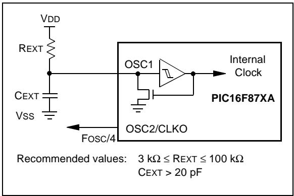

### <span id="page-148-8"></span>**14.3 Reset**

The PIC16F87XA differentiates between various kinds of Reset:

- <span id="page-148-11"></span><span id="page-148-10"></span><span id="page-148-5"></span><span id="page-148-3"></span>• Power-on Reset (POR)
- <span id="page-148-4"></span>• MCLR Reset during normal operation
- <span id="page-148-14"></span><span id="page-148-13"></span><span id="page-148-12"></span>• MCLR Reset during Sleep
- <span id="page-148-15"></span>• WDT Reset (during normal operation)
- <span id="page-148-2"></span>• WDT Wake-up (during Sleep)
- <span id="page-148-9"></span>• Brown-out Reset (BOR)

Some registers are not affected in any Reset condition. Their status is unknown on POR and unchanged in any other Reset. Most other registers are reset to a "Reset

<span id="page-148-7"></span><span id="page-148-6"></span>state" on Power-on Reset (POR), on the MCLR and WDT Reset, on MCLR Reset during Sleep and Brownout Reset (BOR). They are not affected by a WDT wake-up which is viewed as the resumption of normal operation. The TO and PD bits are set or cleared differently in different Reset situations as indicated in [Table 14-4](#page-150-0). These bits are used in software to determine the nature of the Reset. See [Table 14-6](#page-151-35) for a full description of Reset states of all registers.

<span id="page-148-1"></span>A simplified block diagram of the on-chip Reset circuit is shown in [Figure 14-4.](#page-148-0)

### <span id="page-148-0"></span>**FIGURE 14-4: SIMPLIFIED BLOCK DIAGRAM OF ON-CHIP RESET CIRCUIT**

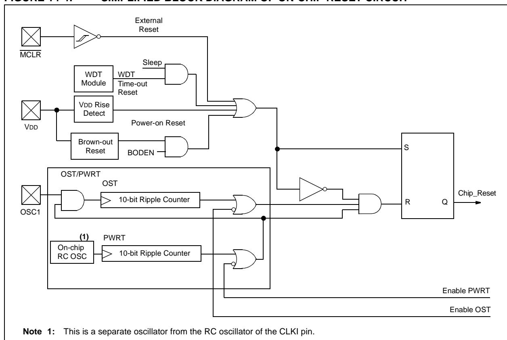

## <span id="page-149-5"></span><span id="page-149-1"></span>**14.4 MCLR**

PIC16F87XA devices have a noise filter in the MCLR Reset path. The filter will detect and ignore small pulses.

It should be noted that a WDT Reset does not drive MCLR pin low.

The behavior of the ESD protection on the MCLR pin differs from previous devices of this family. Voltages applied to the pin that exceed its specification can result in both Resets and current consumption outside of device specification during the Reset event. For this reason, Microchip recommends that the MCLR pin no longer be tied directly to VDD. The use of an RCR network, as shown in [Figure 14-5](#page-149-0), is suggested.

## <span id="page-149-0"></span>**FIGURE 14-5: RECOMMENDED MCLR CIRCUIT**


- **Note 1:** R1 < 40 kΩ is recommended to make sure that the voltage drop across R does not violate the device's electrical specification.
  - **2:** R2 > than 1K will limit any current flowing into MCLR from the external capacitor C, in the event of MCLR/VPP breakdown due to Electrostatic Discharge (ESD) or Electrical Overstress (EOS).

### <span id="page-149-2"></span>**14.5 Power-on Reset (POR)**

A Power-on Reset pulse is generated on-chip when VDD rise is detected (in the range of 1.2V-1.7V). To take advantage of the POR, tie the MCLR pin to VDD through an RC network, as described in **[Section 14.4](#page-149-1) ["MCLR"](#page-149-1)**. A maximum rise time for VDD is specified. See **[Section 17.0 "Electrical Characteristics"](#page-174-1)** for details.

When the device starts normal operation (exits the Reset condition), device operating parameters (voltage, frequency, temperature, etc.) must be met to ensure operation. If these conditions are not met, the device must be held in Reset until the operating conditions are met. Brown-out Reset may be used to meet the start-up conditions. For additional information, refer to application note, *AN607,* "*Power-up Trouble Shooting*" (DS00607).

## <span id="page-149-7"></span>**14.6 Power-up Timer (PWRT)**

The Power-up Timer provides a fixed 72 ms nominal time-out on power-up only from the POR. The Powerup Timer operates on an internal RC oscillator. The chip is kept in Reset as long as the PWRT is active. The PWRT's time delay allows VDD to rise to an acceptable level. A configuration bit is provided to enable or disable the PWRT.

The power-up time delay will vary from chip to chip due to VDD, temperature and process variation. See **[Section 17.0 "Electrical Characteristics"](#page-174-1)** for details (TPWRT, parameter #33).

## <span id="page-149-6"></span>**14.7 Oscillator Start-up Timer (OST)**

<span id="page-149-3"></span>The Oscillator Start-up Timer (OST) provides a delay of 1024 oscillator cycles (from OSC1 input) after the PWRT delay is over (if PWRT is enabled). This helps to ensure that the crystal oscillator or resonator has started and stabilized.

The OST time-out is invoked only for XT, LP and HS modes and only on Power-on Reset or wake-up from Sleep.

### <span id="page-149-4"></span>**14.8 Brown-out Reset (BOR)**

The configuration bit, BODEN, can enable or disable the Brown-out Reset circuit. If VDD falls below VBOR (parameter D005, about 4V) for longer than TBOR (parameter #35, about 100 µS), the brown-out situation will reset the device. If VDD falls below VBOR for less than TBOR, a Reset may not occur.

Once the brown-out occurs, the device will remain in Brown-out Reset until VDD rises above VBOR. The Power-up Timer then keeps the device in Reset for TPWRT (parameter #33, about 72 mS). If VDD should fall below VBOR during TPWRT, the Brown-out Reset process will restart when VDD rises above VBOR with the Power-up Timer Reset. The Power-up Timer is always enabled when the Brown-out Reset circuit is enabled, regardless of the state of the PWRT configuration bit.

### <span id="page-149-8"></span>**14.9 Time-out Sequence**

On power-up, the time-out sequence is as follows: the PWRT delay starts (if enabled) when a POR Reset occurs. Then, OST starts counting 1024 oscillator cycles when PWRT ends (LP, XT, HS). When the OST ends, the device comes out of Reset.

If MCLR is kept low long enough, the time-outs will expire. Bringing MCLR high will begin execution immediately. This is useful for testing purposes or to synchronize more than one PIC16F87XA device operating in parallel.

[Table 14-5](#page-150-1) shows the Reset conditions for the Status, PCON and PC registers, while [Table 14-6](#page-151-35) shows the Reset conditions for all the registers.

## <span id="page-150-9"></span>**14.10 Power Control/Status Register (PCON)**

The Power Control/Status Register, PCON, has up to two bits depending upon the device.

Bit 0 is the Brown-out Reset Status bit, BOR. The BOR bit is unknown on a Power-on Reset. It must then be set by the user and checked on subsequent Resets to see if it has been cleared, indicating that a BOR has occurred. When the Brown-out Reset is disabled, the state of the BOR bit is unpredictable and is, therefore, not valid at any time.

Bit 1 is the Power-on Reset Status bit, POR. It is cleared on a Power-on Reset and unaffected otherwise. The user must set this bit following a Power-on Reset.

**TABLE 14-3: TIME-OUT IN VARIOUS SITUATIONS** 

<span id="page-150-8"></span><span id="page-150-6"></span><span id="page-150-5"></span>

|                          | Power-up               |           |                   | Wake-up from |  |
|--------------------------|------------------------|-----------|-------------------|--------------|--|
| Oscillator Configuration | PWRTE = 0<br>PWRTE = 1 |           | Brown-out         | Sleep        |  |
| XT, HS, LP               | 72 ms + 1024 TOSC      | 1024 TOSC | 72 ms + 1024 TOSC | 1024 TOSC    |  |
| RC                       | 72 ms                  | —         | 72 ms             | —            |  |

<span id="page-150-7"></span><span id="page-150-0"></span>**TABLE 14-4: STATUS BITS AND THEIR SIGNIFICANCE** 

| POR | BOR | TO | PD | Condition                                               |
|-----|-----|----|----|---------------------------------------------------------|
| 0   | x   | 1  | 1  | Power-on Reset                                          |
| 0   | x   | 0  | x  | Illegal, TO is set on POR                               |
| 0   | x   | x  | 0  | Illegal, PD is set on POR                               |
| 1   | 0   | 1  | 1  | Brown-out Reset                                         |
| 1   | 1   | 0  | 1  | WDT Reset                                               |
| 1   | 1   | 0  | 0  | WDT Wake-up                                             |
| 1   | 1   | u  | u  | MCLR Reset during normal operation                      |
| 1   | 1   | 1  | 0  | MCLR Reset during Sleep or Interrupt Wake-up from Sleep |

<span id="page-150-13"></span><span id="page-150-12"></span>**Legend:** x = don't care, u = unchanged

<span id="page-150-11"></span><span id="page-150-1"></span>**TABLE 14-5: RESET CONDITIONS FOR SPECIAL REGISTERS** 

<span id="page-150-10"></span><span id="page-150-4"></span><span id="page-150-3"></span>

| Condition                          | Program<br>Counter | Status<br>Register | PCON<br>Register |
|------------------------------------|--------------------|--------------------|------------------|
| Power-on Reset                     | 000h               | 0001 1xxx          | 0x               |
| MCLR Reset during normal operation | 000h               | 000u uuuu          | uu               |
| MCLR Reset during Sleep            | 000h               | 0001 0uuu          | uu               |
| WDT Reset                          | 000h               | 0000 1uuu          | uu               |
| WDT Wake-up                        | PC + 1             | uuu0 0uuu          | uu               |
| Brown-out Reset                    | 000h               | 0001 1uuu          | u0               |
| Interrupt Wake-up from Sleep       | PC + 1(1)          | uuu1 0uuu          | uu               |

<span id="page-150-16"></span><span id="page-150-15"></span><span id="page-150-14"></span><span id="page-150-2"></span>**Legend:** u = unchanged, x = unknown, - = unimplemented bit, read as '0'

**Note 1:** When the wake-up is due to an interrupt and the GIE bit is set, the PC is loaded with the interrupt vector (0004h).

<span id="page-151-41"></span><span id="page-151-40"></span><span id="page-151-39"></span><span id="page-151-38"></span><span id="page-151-37"></span><span id="page-151-36"></span><span id="page-151-35"></span>**TABLE 14-6: INITIALIZATION CONDITIONS FOR ALL REGISTERS**

<span id="page-151-15"></span><span id="page-151-14"></span><span id="page-151-13"></span><span id="page-151-12"></span><span id="page-151-11"></span><span id="page-151-10"></span><span id="page-151-9"></span><span id="page-151-8"></span><span id="page-151-7"></span><span id="page-151-6"></span><span id="page-151-5"></span><span id="page-151-4"></span><span id="page-151-3"></span><span id="page-151-2"></span><span id="page-151-1"></span><span id="page-151-0"></span>

| Register   |     |     | Devices |     | Power-on Reset,<br>Brown-out Reset | MCLR Resets,<br>WDT Reset | Wake-up via WDT or<br>Interrupt |
|------------|-----|-----|---------|-----|------------------------------------|---------------------------|---------------------------------|
| W          | 73A | 74A | 76A     | 77A | xxxx xxxx                          | uuuu uuuu                 | uuuu uuuu                       |
| INDF       | 73A | 74A | 76A     | 77A | N/A                                | N/A                       | N/A                             |
| TMR0       | 73A | 74A | 76A     | 77A | xxxx xxxx                          | uuuu uuuu                 | uuuu uuuu                       |
| PCL        | 73A | 74A | 76A     | 77A | 0000 0000                          | 0000 0000                 | PC + 1(2)                       |
| STATUS     | 73A | 74A | 76A     | 77A | 0001 1xxx                          | 000q quuu(3)              | uuuq quuu(3)                    |
| FSR        | 73A | 74A | 76A     | 77A | xxxx xxxx                          | uuuu uuuu                 | uuuu uuuu                       |
| PORTA      | 73A | 74A | 76A     | 77A | 0x 0000                            | 0u 0000                   | uu uuuu                         |
| PORTB      | 73A | 74A | 76A     | 77A | xxxx xxxx                          | uuuu uuuu                 | uuuu uuuu                       |
| PORTC      | 73A | 74A | 76A     | 77A | xxxx xxxx                          | uuuu uuuu                 | uuuu uuuu                       |
| PORTD      | 73A | 74A | 76A     | 77A | xxxx xxxx                          | uuuu uuuu                 | uuuu uuuu                       |
| PORTE      | 73A | 74A | 76A     | 77A | xxx                                | uuu                       | uuu                             |
| PCLATH     | 73A | 74A | 76A     | 77A | 0 0000                             | 0 0000                    | u uuuu                          |
| INTCON     | 73A | 74A | 76A     | 77A | 0000 000x                          | 0000 000u                 | uuuu uuuu(1)                    |
|            | 73A | 74A | 76A     | 77A | r000 0000                          | r000 0000                 | ruuu uuuu(1)                    |
| PIR1       | 73A | 74A | 76A     | 77A | 0000 0000                          | 0000 0000                 | uuuu uuuu(1)                    |
| PIR2       | 73A | 74A | 76A     | 77A | -0-0 00                            | -0-0 00                   | -u-u uu(1)                      |
| TMR1L      | 73A | 74A | 76A     | 77A | xxxx xxxx                          | uuuu uuuu                 | uuuu uuuu                       |
| TMR1H      | 73A | 74A | 76A     | 77A | xxxx xxxx                          | uuuu uuuu                 | uuuu uuuu                       |
| T1CON      | 73A | 74A | 76A     | 77A | 00 0000                            | uu uuuu                   | uu uuuu                         |
| TMR2       | 73A | 74A | 76A     | 77A | 0000 0000                          | 0000 0000                 | uuuu uuuu                       |
| T2CON      | 73A | 74A | 76A     | 77A | -000 0000                          | -000 0000                 | -uuu uuuu                       |
| SSPBUF     | 73A | 74A | 76A     | 77A | xxxx xxxx                          | uuuu uuuu                 | uuuu uuuu                       |
| SSPCON     | 73A | 74A | 76A     | 77A | 0000 0000                          | 0000 0000                 | uuuu uuuu                       |
| CCPR1L     | 73A | 74A | 76A     | 77A | xxxx xxxx                          | uuuu uuuu                 | uuuu uuuu                       |
| CCPR1H     | 73A | 74A | 76A     | 77A | xxxx xxxx                          | uuuu uuuu                 | uuuu uuuu                       |
| CCP1CON    | 73A | 74A | 76A     | 77A | 00 0000                            | 00 0000                   | uu uuuu                         |
| RCSTA      | 73A | 74A | 76A     | 77A | 0000 000x                          | 0000 000x                 | uuuu uuuu                       |
| TXREG      | 73A | 74A | 76A     | 77A | 0000 0000                          | 0000 0000                 | uuuu uuuu                       |
| RCREG      | 73A | 74A | 76A     | 77A | 0000 0000                          | 0000 0000                 | uuuu uuuu                       |
| CCPR2L     | 73A | 74A | 76A     | 77A | xxxx xxxx                          | uuuu uuuu                 | uuuu uuuu                       |
| CCPR2H     | 73A | 74A | 76A     | 77A | xxxx xxxx                          | uuuu uuuu                 | uuuu uuuu                       |
| CCP2CON    | 73A | 74A | 76A     | 77A | 0000 0000                          | 0000 0000                 | uuuu uuuu                       |
| ADRESH     | 73A | 74A | 76A     | 77A | xxxx xxxx                          | uuuu uuuu                 | uuuu uuuu                       |
| ADCON0     | 73A | 74A | 76A     | 77A | 0000 00-0                          | 0000 00-0                 | uuuu uu-u                       |
| OPTION_REG | 73A | 74A | 76A     | 77A | 1111 1111                          | 1111 1111                 | uuuu uuuu                       |
| TRISA      | 73A | 74A | 76A     | 77A | 11 1111                            | 11 1111                   | uu uuuu                         |
| TRISB      | 73A | 74A | 76A     | 77A | 1111 1111                          | 1111 1111                 | uuuu uuuu                       |
| TRISC      | 73A | 74A | 76A     | 77A | 1111 1111                          | 1111 1111                 | uuuu uuuu                       |
|            |     |     |         |     |                                    |                           |                                 |

<span id="page-151-34"></span><span id="page-151-33"></span><span id="page-151-32"></span><span id="page-151-31"></span><span id="page-151-30"></span><span id="page-151-29"></span><span id="page-151-28"></span><span id="page-151-27"></span><span id="page-151-26"></span><span id="page-151-25"></span><span id="page-151-24"></span><span id="page-151-23"></span><span id="page-151-22"></span><span id="page-151-21"></span><span id="page-151-20"></span><span id="page-151-19"></span><span id="page-151-18"></span><span id="page-151-17"></span><span id="page-151-16"></span>**Legend:** u = unchanged, x = unknown, - = unimplemented bit, read as '0', q = value depends on condition, r = reserved, maintain clear. Shaded cells indicate conditions do not apply for the designated device.

**Note 1:** One or more bits in INTCON, PIR1 and/or PIR2 will be affected (to cause wake-up).

**<sup>2:</sup>** When the wake-up is due to an interrupt and the GIE bit is set, the PC is loaded with the interrupt vector (0004h).

**<sup>3:</sup>** See [Table 14-5](#page-150-1) for Reset value for specific condition.

TABLE 14-6: INITIALIZATION CONDITIONS FOR ALL REGISTERS (CONTINUED)

<span id="page-152-9"></span><span id="page-152-8"></span><span id="page-152-7"></span><span id="page-152-6"></span><span id="page-152-5"></span><span id="page-152-4"></span><span id="page-152-3"></span><span id="page-152-2"></span><span id="page-152-1"></span><span id="page-152-0"></span>

| Register |     | Dev | ices |     | Power-on Reset,<br>Brown-out Reset | MCLR Resets,<br>WDT Reset | Wake-up via WDT or<br>Interrupt |
|----------|-----|-----|------|-----|------------------------------------|---------------------------|---------------------------------|
| TRISD    | 73A | 74A | 76A  | 77A | 1111 1111                          | 1111 1111                 | uuuu uuuu                       |
| TRISE    | 73A | 74A | 76A  | 77A | 0000 -111                          | 0000 -111                 | uuuu -uuu                       |
| PIE1     | 73A | 74A | 76A  | 77A | r000 0000                          | r000 0000                 | ruuu uuuu                       |
| PIET     | 73A | 74A | 76A  | 77A | 0000 0000                          | 0000 0000                 | uuuu uuuu                       |
| PIE2     | 73A | 74A | 76A  | 77A | -0-0 00                            | -0-0 00                   | -u-u uu                         |
| PCON     | 73A | 74A | 76A  | 77A | dd                                 | uu                        | uu                              |
| SSPCON2  | 73A | 74A | 76A  | 77A | 0000 0000                          | 0000 0000                 | uuuu uuuu                       |
| PR2      | 73A | 74A | 76A  | 77A | 1111 1111                          | 1111 1111                 | 1111 1111                       |
| SSPADD   | 73A | 74A | 76A  | 77A | 0000 0000                          | 0000 0000                 | uuuu uuuu                       |
| SSPSTAT  | 73A | 74A | 76A  | 77A | 00 0000                            | 00 0000                   | uu uuuu                         |
| TXSTA    | 73A | 74A | 76A  | 77A | 0000 -010                          | 0000 -010                 | uuuu -uuu                       |
| SPBRG    | 73A | 74A | 76A  | 77A | 0000 0000                          | 0000 0000                 | uuuu uuuu                       |
| CMCON    | 73A | 974 | 76A  | 77A | 0000 0111                          | 0000 0111                 | uuuu uuuu                       |
| CVRCON   | 73A | 74A | 76A  | 77A | 000- 0000                          | 000- 0000                 | uuu- uuuu                       |
| ADRESL   | 73A | 74A | 76A  | 77A | xxxx xxxx                          | uuuu uuuu                 | uuuu uuuu                       |
| ADCON1   | 73A | 74A | 76A  | 77A | 00 0000                            | 00 0000                   | uu uuuu                         |
| EEDATA   | 73A | 74A | 76A  | 77A | xxxx xxxx                          | uuuu uuuu                 | uuuu uuuu                       |
| EEADR    | 73A | 74A | 76A  | 77A | xxxx xxxx                          | uuuu uuuu                 | uuuu uuuu                       |
| EEDATH   | 73A | 74A | 76A  | 77A | xxxx xxxx                          | uuuu uuuu                 | uuuu uuuu                       |
| EEADRH   | 73A | 74A | 76A  | 77A | xxxx xxxx                          | uuuu uuuu                 | uuuu uuuu                       |
| EECON1   | 73A | 74A | 76A  | 77A | x x000                             | u u000                    | u uuuu                          |
| EECON2   | 73A | 74A | 76A  | 77A |                                    |                           |                                 |

<span id="page-152-20"></span><span id="page-152-19"></span><span id="page-152-18"></span><span id="page-152-17"></span><span id="page-152-16"></span><span id="page-152-15"></span><span id="page-152-14"></span><span id="page-152-13"></span><span id="page-152-12"></span><span id="page-152-11"></span><span id="page-152-10"></span> $\begin{array}{ll} \textbf{Legend:} & u = \text{unchanged, } x = \text{unknown, } - = \text{unimplemented bit, read as `0', } q = \text{value depends on condition,} \\ & r = \text{reserved, maintain clear. Shaded cells indicate conditions do not apply for the designated device.} \end{array}$ 

- Note 1: One or more bits in INTCON, PIR1 and/or PIR2 will be affected (to cause wake-up).
  - 2: When the wake-up is due to an interrupt and the GIE bit is set, the PC is loaded with the interrupt vector (0004h).
  - 3: See Table 14-5 for Reset value for specific condition.

<span id="page-152-21"></span>FIGURE 14-6: TIME-OUT SEQUENCE ON POWER-UP (MCLR TIED TO VDD VIA RC NETWORK)

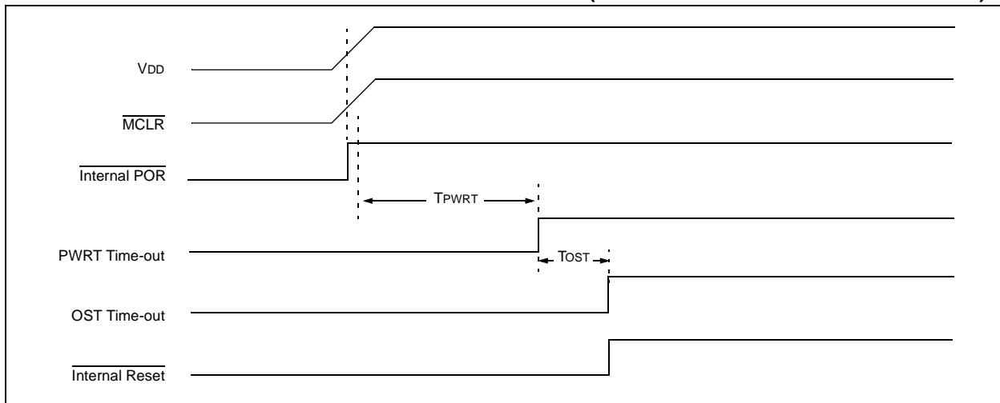


<span id="page-153-1"></span>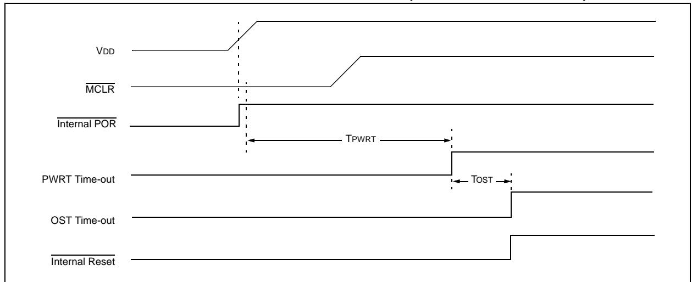

**FIGURE 14-8: TIME-OUT SEQUENCE ON POWER-UP (MCLR NOT TIED TO VDD): CASE 2** 

<span id="page-153-2"></span>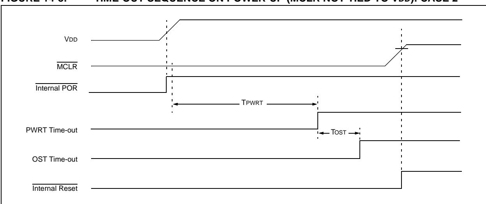

<span id="page-153-0"></span>**FIGURE 14-9: SLOW RISE TIME (MCLR TIED TO VDD VIA RC NETWORK)** 


## <span id="page-154-1"></span>**14.11 Interrupts**

The PIC16F87XA family has up to 15 sources of interrupt. The Interrupt Control register (INTCON) records individual interrupt requests in flag bits. It also has individual and global interrupt enable bits.

**Note:** Individual interrupt flag bits are set regardless of the status of their corresponding mask bit or the GIE bit.

A global interrupt enable bit, GIE (INTCON<7>), enables (if set) all unmasked interrupts or disables (if cleared) all interrupts. When bit GIE is enabled and an interrupt's flag bit and mask bit are set, the interrupt will vector immediately. Individual interrupts can be disabled through their corresponding enable bits in various registers. Individual interrupt bits are set regardless of the status of the GIE bit. The GIE bit is cleared on Reset.

The "return from interrupt" instruction, RETFIE, exits the interrupt routine, as well as sets the GIE bit, which re-enables interrupts.

The RB0/INT pin interrupt, the RB port change interrupt and the TMR0 overflow interrupt flags are contained in the INTCON register.

The peripheral interrupt flags are contained in the Special Function Registers, PIR1 and PIR2. The corresponding interrupt enable bits are contained in Special Function Registers, PIE1 and PIE2, and the peripheral interrupt enable bit is contained in Special Function Register, INTCON.

<span id="page-154-2"></span>When an interrupt is responded to, the GIE bit is cleared to disable any further interrupt, the return address is pushed onto the stack and the PC is loaded with 0004h. Once in the Interrupt Service Routine, the source(s) of the interrupt can be determined by polling the interrupt flag bits. The interrupt flag bit(s) must be cleared in software before re-enabling interrupts to avoid recursive interrupts.

For external interrupt events, such as the INT pin or PORTB change interrupt, the interrupt latency will be three or four instruction cycles. The exact latency depends when the interrupt event occurs. The latency is the same for one or two-cycle instructions. Individual interrupt flag bits are set regardless of the status of their corresponding mask bit, PEIE bit or GIE bit.

<span id="page-154-0"></span>**FIGURE 14-10: INTERRUPT LOGIC**

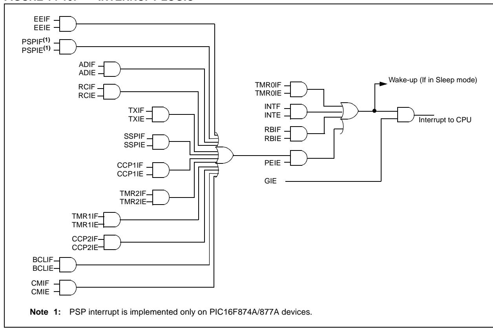

### <span id="page-155-3"></span><span id="page-155-0"></span>14.11.1 INT INTERRUPT

External interrupt on the RB0/INT pin is edge triggered, either rising if bit INTEDG (OPTION\_REG<6>) is set or falling if the INTEDG bit is clear. When a valid edge appears on the RB0/INT pin, flag bit, INTF (INTCON<1>), is set. This interrupt can be disabled by clearing enable bit, INTE (INTCON<4>). Flag bit INTF must be cleared in software in the Interrupt Service Routine before re-enabling this interrupt. The INT interrupt can wake-up the processor from Sleep if bit INTE was set prior to going into Sleep. The status of global interrupt enable bit, GIE, decides whether or not the processor branches to the interrupt vector following wake-up. See **[Section 14.14 "Power-down Mode](#page-157-0) [\(Sleep\)"](#page-157-0)** for details on Sleep mode.

### <span id="page-155-4"></span>14.11.2 TMR0 INTERRUPT

<span id="page-155-8"></span>An overflow (FFh → 00h) in the TMR0 register will set flag bit, TMR0IF (INTCON<2>). The interrupt can be enabled/disabled by setting/clearing enable bit, TMR0IE (INTCON<5>). See **[Section 5.0 "Timer0](#page-54-2) [Module"](#page-54-2)**.

### <span id="page-155-9"></span>14.11.3 PORTB INTCON CHANGE

<span id="page-155-6"></span>An input change on PORTB<7:4> sets flag bit, RBIF (INTCON<0>). The interrupt can be enabled/disabled by setting/clearing enable bit, RBIE (INTCON<4>). See **[Section 4.2 "PORTB and the TRISB Register"](#page-45-0)**.

### <span id="page-155-5"></span>**14.12 Context Saving During Interrupts**

During an interrupt, only the return PC value is saved on the stack. Typically, users may wish to save key registers during an interrupt (i.e., W register and Status register). This will have to be implemented in software.

For the PIC16F873A/874A devices, the register W\_TEMP must be defined in both Banks 0 and 1 and must be defined at the same offset from the bank base address (i.e., If W\_TEMP is defined at 0x20 in Bank 0, it must also be defined at 0xA0 in Bank 1). The registers, PCLATH\_TEMP and STATUS\_TEMP, are only defined in Bank 0.

<span id="page-155-7"></span>Since the upper 16 bytes of each bank are common in the PIC16F876A/877A devices, temporary holding registers, W\_TEMP, STATUS\_TEMP and PCLATH\_TEMP, should be placed in here. These 16 locations don't require banking and therefore, make it easier for context save and restore. The same code shown in [Example 14-1](#page-155-1) can be used.

### <span id="page-155-2"></span><span id="page-155-1"></span>**EXAMPLE 14-1: SAVING STATUS, W AND PCLATH REGISTERS IN RAM**

```
MOVWF W_TEMP ;Copy W to TEMP register
  SWAPF STATUS,W ;Swap status to be saved into W 
  CLRF STATUS ;bank 0, regardless of current bank, Clears IRP,RP1,RP0
  MOVWF STATUS_TEMP ;Save status to bank zero STATUS_TEMP register
  MOVF PCLATH, W ;Only required if using pages 1, 2 and/or 3
  MOVWF PCLATH_TEMP ;Save PCLATH into W
  CLRF PCLATH ;Page zero, regardless of current page
  :
  :(ISR) ;(Insert user code here)
  :
  MOVF PCLATH_TEMP, W ;Restore PCLATH
  MOVWF PCLATH ;Move W into PCLATH
  SWAPF STATUS_TEMP,W ;Swap STATUS_TEMP register into W 
 ;(sets bank to original state)
  MOVWF STATUS ;Move W into STATUS register
  SWAPF W_TEMP,F ;Swap W_TEMP
  SWAPF W_TEMP,W ;Swap W_TEMP into W
```

### <span id="page-156-3"></span>**14.13 Watchdog Timer (WDT)**

The Watchdog Timer is a free running, on-chip RC oscillator which does not require any external components. This RC oscillator is separate from the RC oscillator of the OSC1/CLKI pin. That means that the WDT will run even if the clock on the OSC1/CLKI and OSC2/CLKO pins of the device has been stopped, for example, by execution of a SLEEP instruction.

During normal operation, a WDT time-out generates a device Reset (Watchdog Timer Reset). If the device is in Sleep mode, a WDT time-out causes the device to wake-up and continue with normal operation (Watchdog Timer Wake-up). The TO bit in the Status register will be cleared upon a Watchdog Timer time-out.

<span id="page-156-4"></span>The WDT can be permanently disabled by clearing configuration bit, WDTE (**[Section 14.1 "Configuration](#page-144-3) [Bits"](#page-144-3)**).

<span id="page-156-7"></span><span id="page-156-1"></span>WDT time-out period values may be found in **[Section 17.0 "Electrical Characteristics"](#page-174-1)** under parameter #31. Values for the WDT prescaler (actually a postscaler but shared with the Timer0 prescaler) may be assigned using the OPTION\_REG register.

- <span id="page-156-6"></span><span id="page-156-5"></span>**Note 1:** The CLRWDT and SLEEP instructions clear the WDT and the postscaler, if assigned to the WDT and prevent it from timing out and generating a device Reset condition.
  - **2:** When a CLRWDT instruction is executed and the prescaler is assigned to the WDT, the prescaler count will be cleared but the prescaler assignment is not changed.

<span id="page-156-0"></span>**FIGURE 14-11: WATCHDOG TIMER BLOCK DIAGRAM**


<span id="page-156-2"></span>**TABLE 14-7: SUMMARY OF WATCHDOG TIMER REGISTERS**

| Address   | Name         | Bit 7 | Bit 6    | Bit 5 | Bit 4 | Bit 3    | Bit 2 | Bit 1 | Bit 0 |
|-----------|--------------|-------|----------|-------|-------|----------|-------|-------|-------|
| 2007h     | Config. bits | (1)   | BODEN(1) | CP1   | CP0   | PWRTE(1) | WDTE  | FOSC1 | FOSC0 |
| 81h, 181h | OPTION_REG   | RBPU  | INTEDG   | T0CS  | T0SE  | PSA      | PS2   | PS1   | PS0   |

**Legend:** Shaded cells are not used by the Watchdog Timer.

**Note 1:** See [Register 14-1](#page-145-1) for operation of these bits.

### <span id="page-157-1"></span><span id="page-157-0"></span>**14.14 Power-down Mode (Sleep)**

Power-down mode is entered by executing a SLEEP instruction.

If enabled, the Watchdog Timer will be cleared but keeps running, the PD bit (Status<3>) is cleared, the TO (Status<4>) bit is set and the oscillator driver is turned off. The I/O ports maintain the status they had before the SLEEP instruction was executed (driving high, low or high-impedance).

For lowest current consumption in this mode, place all I/O pins at either VDD or VSS, ensure no external circuitry is drawing current from the I/O pin, powerdown the A/D and disable external clocks. Pull all I/O pins that are high-impedance inputs, high or low externally, to avoid switching currents caused by floating inputs. The T0CKI input should also be at VDD or VSS for lowest current consumption. The contribution from on-chip pull-ups on PORTB should also be considered.

The MCLR pin must be at a logic high level (VIHMC).

### <span id="page-157-2"></span>14.14.1 WAKE-UP FROM SLEEP

The device can wake-up from Sleep through one of the following events:

- 1. External Reset input on MCLR pin.
- 2. Watchdog Timer wake-up (if WDT was enabled).
- 3. Interrupt from INT pin, RB port change or peripheral interrupt.

External MCLR Reset will cause a device Reset. All other events are considered a continuation of program execution and cause a "wake-up". The TO and PD bits in the Status register can be used to determine the cause of device Reset. The PD bit, which is set on power-up, is cleared when Sleep is invoked. The TO bit is cleared if a WDT time-out occurred and caused wake-up.

The following peripheral interrupts can wake the device from Sleep:

- 1. PSP read or write (PIC16F874/877 only).
- 2. TMR1 interrupt. Timer1 must be operating as an asynchronous counter.
- 3. CCP Capture mode interrupt.
- 4. Special event trigger (Timer1 in Asynchronous mode using an external clock).
- 5. SSP (Start/Stop) bit detect interrupt.
- 6. SSP transmit or receive in Slave mode (SPI/I2C).
- 7. USART RX or TX (Synchronous Slave mode).
- 8. A/D conversion (when A/D clock source is RC).
- 9. EEPROM write operation completion.
- 10. Comparator output changes state.

Other peripherals cannot generate interrupts since during Sleep, no on-chip clocks are present.

When the SLEEP instruction is being executed, the next instruction (PC + 1) is prefetched. For the device to wake-up through an interrupt event, the corresponding interrupt enable bit must be set (enabled). Wake-up is regardless of the state of the GIE bit. If the GIE bit is clear (disabled), the device continues execution at the instruction after the SLEEP instruction. If the GIE bit is set (enabled), the device executes the instruction after the SLEEP instruction and then branches to the interrupt address (0004h). In cases where the execution of the instruction following SLEEP is not desirable, the user should have a NOP after the SLEEP instruction.

### <span id="page-157-3"></span>14.14.2 WAKE-UP USING INTERRUPTS

When global interrupts are disabled (GIE cleared) and any interrupt source has both its interrupt enable bit and interrupt flag bit set, one of the following will occur:

- If the interrupt occurs **before** the execution of a SLEEP instruction, the SLEEP instruction will complete as a NOP. Therefore, the WDT and WDT postscaler will not be cleared, the TO bit will not be set and PD bits will not be cleared.
- If the interrupt occurs **during or after** the execution of a SLEEP instruction, the device will immediately wake-up from Sleep. The SLEEP instruction will be completely executed before the wake-up. Therefore, the WDT and WDT postscaler will be cleared, the TO bit will be set and the PD bit will be cleared.

Even if the flag bits were checked before executing a SLEEP instruction, it may be possible for flag bits to become set before the SLEEP instruction completes. To determine whether a SLEEP instruction executed, test the PD bit. If the PD bit is set, the SLEEP instruction was executed as a NOP.

To ensure that the WDT is cleared, a CLRWDT instruction should be executed before a SLEEP instruction.

<span id="page-158-5"></span>

## **14.15 In-Circuit Debugger**

When the DEBUG bit in the configuration word is programmed to a '0', the in-circuit debugger functionality is enabled. This function allows simple debugging functions when used with MPLAB® ICD. When the microcontroller has this feature enabled, some of the resources are not available for general use. [Table 14-8](#page-158-0) shows which features are consumed by the background debugger.

<span id="page-158-3"></span>**4:** CLKO is not available in these oscillator modes but shown here for timing reference.

<span id="page-158-0"></span>**TABLE 14-8: DEBUGGER RESOURCES** 

| I/O pins       | RB6, RB7                                   |
|----------------|--------------------------------------------|
| Stack          | 1 level                                    |
| Program Memory | Address 0000h must be NOP                  |
|                | Last 100h words                            |
| Data Memory    | 0x070 (0x0F0, 0x170, 0x1F0)<br>0x1EB-0x1EF |

To use the in-circuit debugger function of the microcontroller, the design must implement In-Circuit Serial Programming connections to MCLR/VPP, VDD, GND, RB7 and RB6. This will interface to the in-circuit debugger module available from Microchip or one of the third party development tool companies.

## <span id="page-158-1"></span>**14.16 Program Verification/Code Protection**

If the code protection bit(s) have not been programmed, the on-chip program memory can be read out for verification purposes.

### <span id="page-158-2"></span>**14.17 ID Locations**

<span id="page-158-4"></span>Four memory locations (2000h-2003h) are designated as ID locations, where the user can store checksum or other code identification numbers. These locations are not accessible during normal execution but are readable and writable during program/verify. It is recommended that only the 4 Least Significant bits of the ID location are used.

### <span id="page-159-0"></span>**14.18 In-Circuit Serial Programming**

PIC16F87XA microcontrollers can be serially programmed while in the end application circuit. This is simply done with two lines for clock and data and three other lines for power, ground and the programming voltage. This allows customers to manufacture boards with unprogrammed devices and then program the microcontroller just before shipping the product. This also allows the most recent firmware or a custom firmware to be programmed.

When using ICSP, the part must be supplied at 4.5V to 5.5V if a bulk erase will be executed. This includes reprogramming of the code-protect, both from an on state to an off state. For all other cases of ICSP, the part may be programmed at the normal operating voltages. This means calibration values, unique user IDs or user code can be reprogrammed or added.

For complete details of serial programming, please refer to the "*PIC16F87XA Flash Memory Programming Specification"* (DS39589).

## <span id="page-159-1"></span>**14.19 Low-Voltage (Single-Supply) ICSP Programming**

The LVP bit of the configuration word enables lowvoltage ICSP programming. This mode allows the microcontroller to be programmed via ICSP using a VDD source in the operating voltage range. This only means that VPP does not have to be brought to VIHH but can instead be left at the normal operating voltage. In this mode, the RB3/PGM pin is dedicated to the programming function and ceases to be a general purpose I/O pin. During programming, VDD is applied to the MCLR pin. To enter Programming mode, VDD must be applied to the RB3/PGM provided the LVP bit is set. The LVP bit defaults to on ('1') from the factory.

- **Note 1:** The High-Voltage Programming mode is always available, regardless of the state of the LVP bit, by applying VIHH to the MCLR pin.
  - **2:** While in Low-Voltage ICSP mode, the RB3 pin can no longer be used as a general purpose I/O pin.
  - **3:** When using Low-Voltage ICSP Programming (LVP) and the pull-ups on PORTB are enabled, bit 3 in the TRISB register must be cleared to disable the pull-up on RB3 and ensure the proper operation of the device.
  - **4:** RB3 should not be allowed to float if LVP is enabled. An external pull-down device should be used to default the device to normal operating mode. If RB3 floats high, the PIC16F87XA device will enter Programming mode.
  - **5:** LVP mode is enabled by default on all devices shipped from Microchip. It can be disabled by clearing the LVP bit in the CONFIG register.
  - **6:** Disabling LVP will provide maximum compatibility to other PIC16CXXX devices.

If Low-Voltage Programming mode is not used, the LVP bit can be programmed to a '0' and RB3/PGM becomes a digital I/O pin. However, the LVP bit may only be programmed when programming is entered with VIHH on MCLR. The LVP bit can only be charged when using high voltage on MCLR.

It should be noted, that once the LVP bit is programmed to '0', only the High-Voltage Programming mode is available and only High-Voltage Programming mode can be used to program the device.

When using low-voltage ICSP, the part must be supplied at 4.5V to 5.5V if a bulk erase will be executed. This includes reprogramming of the code-protect bits from an on state to an off state. For all other cases of low-voltage ICSP, the part may be programmed at the normal operating voltage. This means calibration values, unique user IDs or user code can be reprogrammed or added.

## <span id="page-160-1"></span><span id="page-160-0"></span>**15.0 INSTRUCTION SET SUMMARY**

The PIC16 instruction set is highly orthogonal and is comprised of three basic categories:

- **Byte-oriented** operations
- **Bit-oriented** operations
- **Literal and control** operations

Each PIC16 instruction is a 14-bit word divided into an **opcode** which specifies the instruction type and one or more **operands** which further specify the operation of the instruction. The formats for each of the categories is presented in [Figure 15-1](#page-160-2), while the various opcode fields are summarized in [Table 15-1.](#page-160-3)

[Table 15-2](#page-161-0) lists the instructions recognized by the MPASM™ Assembler. A complete description of each instruction is also available in the PICmicro® Mid-Range MCU Family Reference Manual (DS33023).

For **byte-oriented** instructions, 'f' represents a file register designator and 'd' represents a destination designator. The file register designator specifies which file register is to be used by the instruction.

The destination designator specifies where the result of the operation is to be placed. If 'd' is zero, the result is placed in the W register. If 'd' is one, the result is placed in the file register specified in the instruction.

For **bit-oriented** instructions, 'b' represents a bit field designator which selects the bit affected by the operation, while 'f' represents the address of the file in which the bit is located.

For **literal and control** operations, 'k' represents an eight or eleven-bit constant or literal value

One instruction cycle consists of four oscillator periods; for an oscillator frequency of 4 MHz, this gives a normal instruction execution time of 1 µs. All instructions are executed within a single instruction cycle, unless a conditional test is true, or the program counter is changed as a result of an instruction. When this occurs, the execution takes two instruction cycles with the second cycle executed as a NOP.

**Note:** To maintain upward compatibility with future PIC16F87XA products, do not use the OPTION and TRIS instructions.

All instruction examples use the format '0xhh' to represent a hexadecimal number, where 'h' signifies a hexadecimal digit.

## <span id="page-160-6"></span>**15.1 READ-MODIFY-WRITE OPERATIONS**

Any instruction that specifies a file register as part of the instruction performs a Read-Modify-Write (R-M-W) operation. The register is read, the data is modified, and the result is stored according to either the instruction or the destination designator 'd'. A read operation is performed on a register even if the instruction writes to that register.

For example, a "CLRF PORTB" instruction will read PORTB, clear all the data bits, then write the result back to PORTB. This example would have the unintended result that the condition that sets the RBIF flag would be cleared.

<span id="page-160-5"></span><span id="page-160-3"></span>**TABLE 15-1: OPCODE FIELD DESCRIPTIONS** 

| Field | Description                                                                                                                                                                  |
|-------|------------------------------------------------------------------------------------------------------------------------------------------------------------------------------|
| f     | Register file address (0x00 to 0x7F)                                                                                                                                         |
| W     | Working register (accumulator)                                                                                                                                               |
| b     | Bit address within an 8-bit file register                                                                                                                                    |
| k     | Literal field, constant data or label                                                                                                                                        |
| x     | Don't care location (= 0 or 1).<br>The assembler will generate code with x = 0.<br>It is the recommended form of use for<br>compatibility with all Microchip software tools. |
| d     | Destination select; d = 0: store result in W,<br>d = 1: store result in file register f.<br>Default is d = 1.                                                                |
| PC    | Program Counter                                                                                                                                                              |
| TO    | Time-out bit                                                                                                                                                                 |
| PD    | Power-down bit                                                                                                                                                               |

# <span id="page-160-2"></span>**FIGURE 15-1: GENERAL FORMAT FOR**

<span id="page-160-4"></span>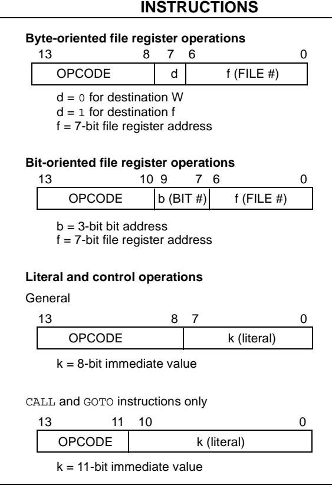

<span id="page-161-1"></span><span id="page-161-0"></span>**TABLE 15-2: PIC16F87XA INSTRUCTION SET** 

| Mnemonic, |          | Description                            |       | 14-Bit Opcode |      |      | Status |          |       |
|-----------|----------|----------------------------------------|-------|---------------|------|------|--------|----------|-------|
|           | Operands |                                        |       | MSb           |      |      | LSb    | Affected | Notes |
|           |          | BYTE-ORIENTED FILE REGISTER OPERATIONS |       |               |      |      |        |          |       |
| ADDWF     | f, d     | Add W and f                            | 1     | 00            | 0111 | dfff | ffff   | C,DC,Z   | 1,2   |
| ANDWF     | f, d     | AND W with f                           | 1     | 00            | 0101 | dfff | ffff   | Z        | 1,2   |
| CLRF      | f        | Clear f                                | 1     | 00            | 0001 | lfff | ffff   | Z        | 2     |
| CLRW      | -        | Clear W                                | 1     | 00            | 0001 | 0xxx | xxxx   | Z        |       |
| COMF      | f, d     | Complement f                           | 1     | 00            | 1001 | dfff | ffff   | Z        | 1,2   |
| DECF      | f, d     | Decrement f                            | 1     | 00            | 0011 | dfff | ffff   | Z        | 1,2   |
| DECFSZ    | f, d     | Decrement f, Skip if 0                 | 1(2)  | 00            | 1011 | dfff | ffff   |          | 1,2,3 |
| INCF      | f, d     | Increment f                            | 1     | 00            | 1010 | dfff | ffff   | Z        | 1,2   |
| INCFSZ    | f, d     | Increment f, Skip if 0                 | 1(2)  | 00            | 1111 | dfff | ffff   |          | 1,2,3 |
| IORWF     | f, d     | Inclusive OR W with f                  | 1     | 00            | 0100 | dfff | ffff   | Z        | 1,2   |
| MOVF      | f, d     | Move f                                 | 1     | 00            | 1000 | dfff | ffff   | Z        | 1,2   |
| MOVWF     | f        | Move W to f                            | 1     | 00            | 0000 | lfff | ffff   |          |       |
| NOP       | -        | No Operation                           | 1     | 00            | 0000 | 0xx0 | 0000   |          |       |
| RLF       | f, d     | Rotate Left f through Carry            | 1     | 00            | 1101 | dfff | ffff   | C        | 1,2   |
| RRF       | f, d     | Rotate Right f through Carry           | 1     | 00            | 1100 | dfff | ffff   | C        | 1,2   |
| SUBWF     | f, d     | Subtract W from f                      | 1     | 00            | 0010 | dfff | ffff   | C,DC,Z   | 1,2   |
| SWAPF     | f, d     | Swap nibbles in f                      | 1     | 00            | 1110 | dfff | ffff   |          | 1,2   |
| XORWF     | f, d     | Exclusive OR W with f                  | 1     | 00            | 0110 | dfff | ffff   | Z        | 1,2   |
|           |          | BIT-ORIENTED FILE REGISTER OPERATIONS  |       |               |      |      |        |          |       |
| BCF       | f, b     | Bit Clear f                            | 1     | 01            | 00bb | bfff | ffff   |          | 1,2   |
| BSF       | f, b     | Bit Set f                              | 1     | 01            | 01bb | bfff | ffff   |          | 1,2   |
| BTFSC     | f, b     | Bit Test f, Skip if Clear              | 1 (2) | 01            | 10bb | bfff | ffff   |          | 3     |
| BTFSS     | f, b     | Bit Test f, Skip if Set                | 1 (2) | 01            | 11bb | bfff | ffff   |          | 3     |
|           |          | LITERAL AND CONTROL OPERATIONS         |       |               |      |      |        |          |       |
| ADDLW     | k        | Add Literal and W                      | 1     | 11            | 111x | kkkk | kkkk   | C,DC,Z   |       |
| ANDLW     | k        | AND Literal with W                     | 1     | 11            | 1001 | kkkk | kkkk   | Z        |       |
| CALL      | k        | Call Subroutine                        | 2     | 10            | 0kkk | kkkk | kkkk   |          |       |
| CLRWDT    | -        | Clear Watchdog Timer                   | 1     | 00            | 0000 | 0110 | 0100   | TO,PD    |       |
| GOTO      | k        | Go to Address                          | 2     | 10            | 1kkk | kkkk | kkkk   |          |       |
| IORLW     | k        | Inclusive OR Literal with W            | 1     | 11            | 1000 | kkkk | kkkk   | Z        |       |
| MOVLW     | k        | Move Literal to W                      | 1     | 11            | 00xx | kkkk | kkkk   |          |       |
| RETFIE    | -        | Return from Interrupt                  | 2     | 00            | 0000 | 0000 | 1001   |          |       |
| RETLW     | k        | Return with Literal in W               | 2     | 11            | 01xx | kkkk | kkkk   |          |       |
| RETURN    | -        | Return from Subroutine                 | 2     | 00            | 0000 | 0000 | 1000   |          |       |
| SLEEP     | -        | Go into Standby mode                   | 1     | 00            | 0000 | 0110 | 0011   | TO,PD    |       |
| SUBLW     | k        | Subtract W from Literal                | 1     | 11            | 110x | kkkk | kkkk   | C,DC,Z   |       |
| XORLW     | k        | Exclusive OR Literal with W            | 1     | 11            | 1010 | kkkk | kkkk   | Z        |       |

**Note 1:** When an I/O register is modified as a function of itself ( e.g., MOVF PORTB, 1), the value used will be that value present on the pins themselves. For example, if the data latch is '1' for a pin configured as input and is driven low by an external device, the data will be written back with a '0'.

**Note:** Additional information on the mid-range instruction set is available in the PICmicro® Mid-Range MCU Family Reference Manual (DS33023).

**<sup>2:</sup>** If this instruction is executed on the TMR0 register (and where applicable, d = 1), the prescaler will be cleared if assigned to the Timer0 module.

**<sup>3:</sup>** If Program Counter (PC) is modified, or a conditional test is true, the instruction requires two cycles. The second cycle is executed as a NOP.

## **15.2 Instruction Descriptions**

<span id="page-162-0"></span>

| ADDLW            | Add Literal and W                                                                        | BCF              | Bit Clear f                         |
|------------------|------------------------------------------------------------------------------------------|------------------|-------------------------------------|
| Syntax:          | [ label ] ADDLW<br>k                                                                     | Syntax:          | [ label ] BCF<br>f,b                |
| Operands:        | 0 ≤ k ≤ 255                                                                              | Operands:        | 0 ≤ f ≤ 127                         |
| Operation:       | (W) + k → (W)                                                                            |                  | 0 ≤ b ≤ 7                           |
| Status Affected: | C, DC, Z                                                                                 | Operation:       | 0 → (f <b>)</b>                     |
| Description:     | The contents of the W register                                                           | Status Affected: | None                                |
|                  | are added to the eight-bit literal 'k'<br>and the result is placed in the W<br>register. | Description:     | Bit 'b' in register 'f' is cleared. |

<span id="page-162-1"></span>

| ADDWF            | Add W and f                                                                                                                                                                        |
|------------------|------------------------------------------------------------------------------------------------------------------------------------------------------------------------------------|
| Syntax:          | [ label ] ADDWF<br>f,d                                                                                                                                                             |
| Operands:        | 0 ≤ f ≤ 127<br>d ∈ [0,1]                                                                                                                                                           |
| Operation:       | (W) + (f) → (destination)                                                                                                                                                          |
| Status Affected: | C, DC, Z                                                                                                                                                                           |
| Description:     | Add the contents of the W register<br>with register 'f'. If 'd' is '0', the<br>result is stored in the W register. If<br>'d' is '1', the result is stored back<br>in register 'f'. |

<span id="page-162-5"></span><span id="page-162-4"></span>

| BSF              | Bit Set f                       |
|------------------|---------------------------------|
| Syntax:          | [ label ] BSF<br>f,b            |
| Operands:        | 0 ≤ f ≤ 127<br>0 ≤ b ≤ 7        |
| Operation:       | 1 → (f <b>)</b>                 |
| Status Affected: | None                            |
| Description:     | Bit 'b' in register 'f' is set. |
|                  |                                 |
|                  |                                 |
|                  |                                 |

<span id="page-162-2"></span>

| ANDLW            | AND Literal with W                                                                                                     |  |  |  |  |
|------------------|------------------------------------------------------------------------------------------------------------------------|--|--|--|--|
| Syntax:          | [ label ] ANDLW<br>k                                                                                                   |  |  |  |  |
| Operands:        | 0 ≤ k ≤ 255                                                                                                            |  |  |  |  |
| Operation:       | (W) .AND. (k) → (W)                                                                                                    |  |  |  |  |
| Status Affected: | Z                                                                                                                      |  |  |  |  |
| Description:     | The contents of W register are<br>AND'ed with the eight-bit literal<br>'k'. The result is placed in the W<br>register. |  |  |  |  |

| Syntax:          | [ label ] BTFSS f,b                                                                                                                                                                                            |
|------------------|----------------------------------------------------------------------------------------------------------------------------------------------------------------------------------------------------------------|
| Operands:        | 0 ≤ f ≤ 127<br>0 ≤ b < 7                                                                                                                                                                                       |
| Operation:       | skip if (f <b>) = 1</b>                                                                                                                                                                                        |
| Status Affected: | None                                                                                                                                                                                                           |
| Description:     | If bit 'b' in register 'f' is '0', the next<br>instruction is executed.<br>If bit 'b' is '1', then the next instruc<br>tion is discarded and a NOP is<br>executed instead, making this a<br>2 TCY instruction. |

<span id="page-162-7"></span>**BTFSS Bit Test f, Skip if Set**

<span id="page-162-3"></span>

| ANDWF            | AND W with f                                                                                                                                                    |  |  |  |  |
|------------------|-----------------------------------------------------------------------------------------------------------------------------------------------------------------|--|--|--|--|
| Syntax:          | [ label ] ANDWF<br>f,d                                                                                                                                          |  |  |  |  |
| Operands:        | 0 ≤ f ≤ 127<br>d ∈ [0,1]                                                                                                                                        |  |  |  |  |
| Operation:       | (W) .AND. (f) → (destination)                                                                                                                                   |  |  |  |  |
| Status Affected: | Z                                                                                                                                                               |  |  |  |  |
| Description:     | AND the W register with register<br>'f'. If 'd' is '0', the result is stored in<br>the W register. If 'd' is '1', the<br>result is stored back in register 'f'. |  |  |  |  |

<span id="page-162-6"></span>

| BTFSC            | Bit Test, Skip if Clear                                                                                                                                                                                                  |
|------------------|--------------------------------------------------------------------------------------------------------------------------------------------------------------------------------------------------------------------------|
| Syntax:          | [ label ] BTFSC f,b                                                                                                                                                                                                      |
| Operands:        | 0 ≤ f ≤ 127<br>0 ≤ b ≤ 7                                                                                                                                                                                                 |
| Operation:       | skip if (f <b>) = 0</b>                                                                                                                                                                                                  |
| Status Affected: | None                                                                                                                                                                                                                     |
| Description:     | If bit 'b' in register 'f' is '1', the next<br>instruction is executed.<br>If bit 'b' in register 'f' is '0', the next<br>instruction is discarded and a NOP<br>is executed instead, making this a<br>2 TCY instruction. |

<span id="page-163-3"></span><span id="page-163-1"></span><span id="page-163-0"></span>

| CALL             | Call Subroutine                                                                                                                                                                                           | CLRWDT           | Clear Watchdog Timer                                                                                                                                           |
|------------------|-----------------------------------------------------------------------------------------------------------------------------------------------------------------------------------------------------------|------------------|----------------------------------------------------------------------------------------------------------------------------------------------------------------|
| Syntax:          | [ label ] CALL k                                                                                                                                                                                          | Syntax:          | [ label ] CLRWDT                                                                                                                                               |
| Operands:        | 0 ≤ k ≤ 2047                                                                                                                                                                                              | Operands:        | None                                                                                                                                                           |
| Operation:       | (PC)+ 1→ TOS,<br>k → PC<10:0>,<br>(PCLATH<4:3>) → PC<12:11>                                                                                                                                               | Operation:       | 00h → WDT<br>0 → WDT prescaler,<br>1 → TO                                                                                                                      |
| Status Affected: | None                                                                                                                                                                                                      |                  | 1 → PD                                                                                                                                                         |
| Description:     | Call Subroutine. First, return                                                                                                                                                                            | Status Affected: | TO, PD                                                                                                                                                         |
|                  | address (PC+1) is pushed onto<br>the stack. The eleven-bit<br>immediate address is loaded into<br>PC bits <10:0>. The upper bits of<br>the PC are loaded from PCLATH.<br>CALL is a two-cycle instruction. | Description:     | CLRWDT instruction resets the<br>Watchdog Timer. It also resets the<br>prescaler of the WDT. Status bits,<br>TO and PD, are set.                               |
| CLRF             | Clear f                                                                                                                                                                                                   | COMF             | Complement f                                                                                                                                                   |
| Syntax:          | [ label ] CLRF<br>f                                                                                                                                                                                       | Syntax:          | [ label ] COMF<br>f,d                                                                                                                                          |
| Operands:        | 0 ≤ f ≤ 127                                                                                                                                                                                               | Operands:        | 0 ≤ f ≤ 127                                                                                                                                                    |
| Operation:       | 00h → (f)                                                                                                                                                                                                 |                  | d ∈ [0,1]                                                                                                                                                      |
|                  | 1 → Z                                                                                                                                                                                                     | Operation:       | (f) → (destination)                                                                                                                                            |
| Status Affected: | Z                                                                                                                                                                                                         | Status Affected: | Z                                                                                                                                                              |
| Description:     | The contents of register 'f' are<br>cleared and the Z bit is set.                                                                                                                                         | Description:     | The contents of register 'f' are<br>complemented. If 'd' is '0', the<br>result is stored in W. If 'd' is '1',<br>the result is stored back in<br>register 'f'. |
| CLRW             | Clear W                                                                                                                                                                                                   | DECF             | Decrement f                                                                                                                                                    |
| Syntax:          | [ label ] CLRW                                                                                                                                                                                            | Syntax:          | [ label ] DECF f,d                                                                                                                                             |
| Operands:        | None                                                                                                                                                                                                      | Operands:        | 0 ≤ f ≤ 127<br>d ∈ [0,1]                                                                                                                                       |
| Operation:       | 00h → (W)<br>1 → Z                                                                                                                                                                                        | Operation:       | (f) - 1 → (destination)                                                                                                                                        |
| Status Affected: | Z                                                                                                                                                                                                         | Status Affected: | Z                                                                                                                                                              |
| Description:     | W register is cleared. Zero bit (Z)<br>is set.                                                                                                                                                            | Description:     | Decrement register 'f'. If 'd' is '0',<br>the result is stored in the W                                                                                        |

<span id="page-163-5"></span><span id="page-163-4"></span><span id="page-163-2"></span>register. If 'd' is '1', the result is stored back in register 'f'.

<span id="page-164-3"></span><span id="page-164-1"></span><span id="page-164-0"></span>

| DECFSZ           | Decrement f, Skip if 0<br>INCFSZ                                                                                                                                                                                                                                                                                                     |                                | Increment f, Skip if 0                                                                                                                                                                                                                                                                                                          |  |  |
|------------------|--------------------------------------------------------------------------------------------------------------------------------------------------------------------------------------------------------------------------------------------------------------------------------------------------------------------------------------|--------------------------------|---------------------------------------------------------------------------------------------------------------------------------------------------------------------------------------------------------------------------------------------------------------------------------------------------------------------------------|--|--|
| Syntax:          | [ label ] DECFSZ f,d                                                                                                                                                                                                                                                                                                                 | Syntax:                        | [ label ]<br>INCFSZ f,d                                                                                                                                                                                                                                                                                                         |  |  |
| Operands:        | 0 ≤ f ≤ 127<br>d ∈ [0,1]                                                                                                                                                                                                                                                                                                             | Operands:                      | 0 ≤ f ≤ 127<br>d ∈ [0,1]                                                                                                                                                                                                                                                                                                        |  |  |
| Operation:       | (f) - 1 → (destination);<br>skip if result = 0                                                                                                                                                                                                                                                                                       | Operation:                     | (f) + 1 → (destination),<br>skip if result = 0                                                                                                                                                                                                                                                                                  |  |  |
| Status Affected: | None                                                                                                                                                                                                                                                                                                                                 | Status Affected:               | None                                                                                                                                                                                                                                                                                                                            |  |  |
| Description:     | The contents of register 'f' are<br>decremented. If 'd' is '0', the result<br>is placed in the W register. If 'd' is<br>'1', the result is placed back in<br>register 'f'.<br>If the result is '1', the next instruc<br>tion is executed. If the result is '0',<br>then a NOP is executed instead,<br>making it a 2 TCY instruction. | Description:                   | The contents of register 'f' are<br>incremented. If 'd' is '0', the result<br>is placed in the W register. If 'd' is<br>'1', the result is placed back in<br>register 'f'.<br>If the result is '1', the next instruc<br>tion is executed. If the result is '0',<br>a NOP is executed instead, making<br>it a 2 TCY instruction. |  |  |
| GOTO             | Unconditional Branch                                                                                                                                                                                                                                                                                                                 | IORLW                          | Inclusive OR Literal with W                                                                                                                                                                                                                                                                                                     |  |  |
| Syntax:          | [ label ]<br>GOTO k                                                                                                                                                                                                                                                                                                                  | Syntax:                        | [ label ]<br>IORLW k                                                                                                                                                                                                                                                                                                            |  |  |
| Operands:        | 0 ≤ k ≤ 2047                                                                                                                                                                                                                                                                                                                         | Operands:                      | 0 ≤ k ≤ 255                                                                                                                                                                                                                                                                                                                     |  |  |
| Operation:       | k → PC<10:0><br>PCLATH<4:3> → PC<12:11>                                                                                                                                                                                                                                                                                              | Operation:<br>Status Affected: | (W) .OR. k → (W)<br>Z                                                                                                                                                                                                                                                                                                           |  |  |
| Status Affected: | None                                                                                                                                                                                                                                                                                                                                 | Description:                   | The contents of the W register are                                                                                                                                                                                                                                                                                              |  |  |
| Description:     | GOTO is an unconditional branch.<br>The eleven-bit immediate value is<br>loaded into PC bits <10:0>. The<br>upper bits of PC are loaded from<br>PCLATH<4:3>. GOTO is a<br>two-cycle instruction.                                                                                                                                     |                                | OR'ed with the eight-bit literal 'k'.<br>The result is placed in the W<br>register.                                                                                                                                                                                                                                             |  |  |
| INCF             | Increment f                                                                                                                                                                                                                                                                                                                          | IORWF                          | Inclusive OR W with f                                                                                                                                                                                                                                                                                                           |  |  |
| Syntax:          | [ label ]<br>INCF f,d                                                                                                                                                                                                                                                                                                                | Syntax:                        | [ label ]<br>IORWF<br>f,d                                                                                                                                                                                                                                                                                                       |  |  |
| Operands:        | 0 ≤ f ≤ 127<br>d ∈ [0,1]                                                                                                                                                                                                                                                                                                             | Operands:                      | 0 ≤ f ≤ 127<br>d ∈ [0,1]                                                                                                                                                                                                                                                                                                        |  |  |
| Operation:       | (f) + 1 → (destination)                                                                                                                                                                                                                                                                                                              | Operation:                     | (W) .OR. (f) → (destination)                                                                                                                                                                                                                                                                                                    |  |  |
| Status Affected: | Z                                                                                                                                                                                                                                                                                                                                    | Status Affected:               | Z                                                                                                                                                                                                                                                                                                                               |  |  |
| Description:     | The contents of register 'f' are<br>incremented. If 'd' is '0', the result<br>is placed in the W register. If 'd' is<br>'1', the result is placed back in                                                                                                                                                                            | Description:                   | Inclusive OR the W register with<br>register 'f'. If 'd' is '0', the result is<br>placed in the W register. If 'd' is<br>'1', the result is placed back in                                                                                                                                                                      |  |  |

<span id="page-164-2"></span>register 'f'.

<span id="page-164-5"></span><span id="page-164-4"></span>register 'f'.

## <span id="page-165-1"></span>**RLF Rotate Left f through Carry** Syntax: [ *label* ] RLF f,d Operands: 0 ≤ f ≤ 127 d ∈ [0,1] Operation: See description below Status Affected: C Description: The contents of register 'f' are rotated one bit to the left through the Carry flag. If 'd' is '0', the result is placed in the W register. If 'd' is '1', the result is stored back in register 'f'.

C Register f

#### <span id="page-165-3"></span>**SLEEP**

| Syntax:          | [ label ] SLEEP                                                                                                                                                       |
|------------------|-----------------------------------------------------------------------------------------------------------------------------------------------------------------------|
| Operands:        | None                                                                                                                                                                  |
| Operation:       | 00h → WDT,<br>0 → WDT prescaler,<br>1 → TO,<br>0 → PD                                                                                                                 |
| Status Affected: | TO, PD                                                                                                                                                                |
| Description:     | The power-down status bit, PD,<br>is cleared. Time-out status bit,<br>TO, is set. Watchdog Timer and<br>its prescaler are cleared.<br>The processor is put into Sleep |

<span id="page-165-0"></span>

| RETURN           | Return from Subroutine                                                                                                                                     |  |  |  |  |  |  |
|------------------|------------------------------------------------------------------------------------------------------------------------------------------------------------|--|--|--|--|--|--|
| Syntax:          | [ label ]<br>RETURN                                                                                                                                        |  |  |  |  |  |  |
| Operands:        | None                                                                                                                                                       |  |  |  |  |  |  |
| Operation:       | TOS → PC                                                                                                                                                   |  |  |  |  |  |  |
| Status Affected: | None                                                                                                                                                       |  |  |  |  |  |  |
| Description:     | Return from subroutine. The stack<br>is POPed and the top of the stack<br>(TOS) is loaded into the program<br>counter. This is a two-cycle<br>instruction. |  |  |  |  |  |  |

<span id="page-165-4"></span>

| SUBLW            | Subtract W from Literal                                                                                                               |  |  |  |  |  |  |  |
|------------------|---------------------------------------------------------------------------------------------------------------------------------------|--|--|--|--|--|--|--|
| Syntax:          | [ label ]<br>SUBLW k                                                                                                                  |  |  |  |  |  |  |  |
| Operands:        | 0 ≤ k ≤ 255                                                                                                                           |  |  |  |  |  |  |  |
| Operation:       | k - (W) → (W)                                                                                                                         |  |  |  |  |  |  |  |
| Status Affected: | C, DC, Z                                                                                                                              |  |  |  |  |  |  |  |
| Description:     | The W register is subtracted (2's<br>complement method) from the<br>eight-bit literal 'k'. The result is<br>placed in the W register. |  |  |  |  |  |  |  |

mode with the oscillator stopped.

<span id="page-165-2"></span>

| RRF              | Rotate Right f through Carry                                                                                                                                                                                          |  |  |  |  |  |  |
|------------------|-----------------------------------------------------------------------------------------------------------------------------------------------------------------------------------------------------------------------|--|--|--|--|--|--|
| Syntax:          | [ label ]<br>RRF f,d                                                                                                                                                                                                  |  |  |  |  |  |  |
| Operands:        | 0 ≤ f ≤ 127<br>d ∈ [0,1]                                                                                                                                                                                              |  |  |  |  |  |  |
| Operation:       | See description below                                                                                                                                                                                                 |  |  |  |  |  |  |
| Status Affected: | C                                                                                                                                                                                                                     |  |  |  |  |  |  |
| Description:     | The contents of register 'f' are<br>rotated one bit to the right through<br>the Carry flag. If 'd' is '0', the<br>result is placed in the W register.<br>If 'd' is '1', the result is placed<br>back in register 'f'. |  |  |  |  |  |  |
|                  | C<br>Register f                                                                                                                                                                                                       |  |  |  |  |  |  |

<span id="page-165-5"></span>

| SUBWF                                   | Subtract W from f                                                                                                                                                                           |  |  |  |  |  |
|-----------------------------------------|---------------------------------------------------------------------------------------------------------------------------------------------------------------------------------------------|--|--|--|--|--|
| Syntax:                                 | [ label ]<br>SUBWF f,d                                                                                                                                                                      |  |  |  |  |  |
| Operands:                               | 0 ≤ f ≤ 127<br>d ∈ [0,1]                                                                                                                                                                    |  |  |  |  |  |
| Operation:<br>(f) - (W) → (destination) |                                                                                                                                                                                             |  |  |  |  |  |
| Status<br>Affected:                     | C, DC, Z                                                                                                                                                                                    |  |  |  |  |  |
| Description:                            | Subtract (2's complement method)<br>W register from register 'f'. If 'd' is<br>'0', the result is stored in the W<br>register. If 'd' is '1', the result is<br>stored back in register 'f'. |  |  |  |  |  |

<span id="page-166-0"></span>

| SWAPF            | Swap Nibbles in f                                                                                                                                                                  |  |  |  |  |  |  |  |
|------------------|------------------------------------------------------------------------------------------------------------------------------------------------------------------------------------|--|--|--|--|--|--|--|
| Syntax:          | [ label ] SWAPF f,d                                                                                                                                                                |  |  |  |  |  |  |  |
| Operands:        | 0 ≤ f ≤ 127<br>d ∈ [0,1]                                                                                                                                                           |  |  |  |  |  |  |  |
| Operation:       | (f<3:0>) → (destination<7:4>),<br>(f<7:4>) → (destination<3:0>)                                                                                                                    |  |  |  |  |  |  |  |
| Status Affected: | None                                                                                                                                                                               |  |  |  |  |  |  |  |
| Description:     | The upper and lower nibbles of<br>register 'f' are exchanged. If 'd' is<br>'0', the result is placed in the W<br>register. If 'd' is '1', the result is<br>placed in register 'f'. |  |  |  |  |  |  |  |

<span id="page-166-1"></span>

| XORLW            | Exclusive OR Literal with W                                                                                                |  |  |  |  |  |  |
|------------------|----------------------------------------------------------------------------------------------------------------------------|--|--|--|--|--|--|
| Syntax:          | [ label ]<br>XORLW k                                                                                                       |  |  |  |  |  |  |
| Operands:        | 0 ≤ k ≤ 255                                                                                                                |  |  |  |  |  |  |
| Operation:       | (W) .XOR. k → (W)                                                                                                          |  |  |  |  |  |  |
| Status Affected: | Z                                                                                                                          |  |  |  |  |  |  |
| Description:     | The contents of the W register<br>are XOR'ed with the eight-bit<br>literal 'k'. The result is placed in<br>the W register. |  |  |  |  |  |  |

<span id="page-166-2"></span>

| XORWF            | Exclusive OR W with f                                                                                                                                                                       |  |  |  |  |  |  |
|------------------|---------------------------------------------------------------------------------------------------------------------------------------------------------------------------------------------|--|--|--|--|--|--|
| Syntax:          | [ label ]<br>XORWF<br>f,d                                                                                                                                                                   |  |  |  |  |  |  |
| Operands:        | 0 ≤ f ≤ 127<br>d ∈ [0,1]                                                                                                                                                                    |  |  |  |  |  |  |
| Operation:       | (W) .XOR. (f) → (destination)                                                                                                                                                               |  |  |  |  |  |  |
| Status Affected: | Z                                                                                                                                                                                           |  |  |  |  |  |  |
| Description:     | Exclusive OR the contents of the<br>W register with register 'f'. If 'd' is<br>'0', the result is stored in the W<br>register. If 'd' is '1', the result is<br>stored back in register 'f'. |  |  |  |  |  |  |

**NOTES:**

## <span id="page-168-2"></span><span id="page-168-0"></span>**16.0 DEVELOPMENT SUPPORT**

The PICmicro® microcontrollers are supported with a full range of hardware and software development tools:

- Integrated Development Environment
  - MPLAB® IDE Software
- Assemblers/Compilers/Linkers
  - MPASMTM Assembler
  - MPLAB C17 and MPLAB C18 C Compilers
  - MPLINKTM Object Linker/ MPLIBTM Object Librarian
  - MPLAB C30 C Compiler
  - MPLAB ASM30 Assembler/Linker/Library
- Simulators
  - MPLAB SIM Software Simulator
  - MPLAB dsPIC30 Software Simulator
- Emulators
  - MPLAB ICE 2000 In-Circuit Emulator
  - MPLAB ICE 4000 In-Circuit Emulator
- In-Circuit Debugger
  - MPLAB ICD 2
- Device Programmers
  - PRO MATE® II Universal Device Programmer
  - PICSTART® Plus Development Programmer
- Low Cost Demonstration Boards
  - PICDEMTM 1 Demonstration Board
  - PICDEM.netTM Demonstration Board
  - PICDEM 2 Plus Demonstration Board
  - PICDEM 3 Demonstration Board
  - PICDEM 4 Demonstration Board
  - PICDEM 17 Demonstration Board
  - PICDEM 18R Demonstration Board
  - PICDEM LIN Demonstration Board
  - PICDEM USB Demonstration Board
- Evaluation Kits
  - KEELOQ®
  - PICDEM MSC
  - microID®
  - CAN
  - PowerSmart®
  - Analog

## <span id="page-168-3"></span>**16.1 MPLAB Integrated Development Environment Software**

The MPLAB IDE software brings an ease of software development previously unseen in the 8/16-bit microcontroller market. The MPLAB IDE is a Windows® based application that contains:

- An interface to debugging tools
  - simulator
  - programmer (sold separately)
  - emulator (sold separately)
  - in-circuit debugger (sold separately)
- A full-featured editor with color coded context
- A multiple project manager
- Customizable data windows with direct edit of contents
- High level source code debugging
- Mouse over variable inspection
- Extensive on-line help

The MPLAB IDE allows you to:

- Edit your source files (either assembly or C)
- One touch assemble (or compile) and download to PICmicro emulator and simulator tools (automatically updates all project information)
- Debug using:
  - source files (assembly or C)
  - absolute listing file (mixed assembly and C)
  - machine code

MPLAB IDE supports multiple debugging tools in a single development paradigm, from the cost effective simulators, through low cost in-circuit debuggers, to full-featured emulators. This eliminates the learning curve when upgrading to tools with increasing flexibility and power.

## <span id="page-168-1"></span>**16.2 MPASM Assembler**

The MPASM assembler is a full-featured, universal macro assembler for all PICmicro MCUs.

The MPASM assembler generates relocatable object files for the MPLINK object linker, Intel® standard HEX files, MAP files to detail memory usage and symbol reference, absolute LST files that contain source lines and generated machine code and COFF files for debugging.

The MPASM assembler features include:

- Integration into MPLAB IDE projects
- User defined macros to streamline assembly code
- Conditional assembly for multi-purpose source files
- Directives that allow complete control over the assembly process

## <span id="page-169-1"></span><span id="page-169-0"></span>**16.3 MPLAB C17 and MPLAB C18 C Compilers**

The MPLAB C17 and MPLAB C18 Code Development Systems are complete ANSI C compilers for Microchip's PIC17CXXX and PIC18CXXX family of microcontrollers. These compilers provide powerful integration capabilities, superior code optimization and ease of use not found with other compilers.

For easy source level debugging, the compilers provide symbol information that is optimized to the MPLAB IDE debugger.

## **16.4 MPLINK Object Linker/ MPLIB Object Librarian**

The MPLINK object linker combines relocatable objects created by the MPASM assembler and the MPLAB C17 and MPLAB C18 C compilers. It can link relocatable objects from precompiled libraries, using directives from a linker script.

The MPLIB object librarian manages the creation and modification of library files of pre-compiled code. When a routine from a library is called from a source file, only the modules that contain that routine will be linked in with the application. This allows large libraries to be used efficiently in many different applications.

The object linker/library features include:

- Efficient linking of single libraries instead of many smaller files
- Enhanced code maintainability by grouping related modules together
- Flexible creation of libraries with easy module listing, replacement, deletion and extraction

### <span id="page-169-2"></span>**16.5 MPLAB C30 C Compiler**

The MPLAB C30 C compiler is a full-featured, ANSI compliant, optimizing compiler that translates standard ANSI C programs into dsPIC30F assembly language source. The compiler also supports many commandline options and language extensions to take full advantage of the dsPIC30F device hardware capabilities, and afford fine control of the compiler code generator.

MPLAB C30 is distributed with a complete ANSI C standard library. All library functions have been validated and conform to the ANSI C library standard. The library includes functions for string manipulation, dynamic memory allocation, data conversion, timekeeping, and math functions (trigonometric, exponential and hyperbolic). The compiler provides symbolic information for high level source debugging with the MPLAB IDE.

## <span id="page-169-3"></span>**16.6 MPLAB ASM30 Assembler, Linker, and Librarian**

MPLAB ASM30 assembler produces relocatable machine code from symbolic assembly language for dsPIC30F devices. MPLAB C30 compiler uses the assembler to produce it's object file. The assembler generates relocatable object files that can then be archived or linked with other relocatable object files and archives to create an executable file. Notable features of the assembler include:

- Support for the entire dsPIC30F instruction set
- <span id="page-169-4"></span>• Support for fixed-point and floating-point data
- Command line interface
- Rich directive set
- Flexible macro language
- MPLAB IDE compatibility

### <span id="page-169-5"></span>**16.7 MPLAB SIM Software Simulator**

The MPLAB SIM software simulator allows code development in a PC hosted environment by simulating the PICmicro series microcontrollers on an instruction level. On any given instruction, the data areas can be examined or modified and stimuli can be applied from a file, or user defined key press, to any pin. The execution can be performed in Single-Step, Execute Until Break, or Trace mode.

The MPLAB SIM simulator fully supports symbolic debugging using the MPLAB C17 and MPLAB C18 C Compilers, as well as the MPASM assembler. The software simulator offers the flexibility to develop and debug code outside of the laboratory environment, making it an excellent, economical software development tool.

## <span id="page-169-6"></span>**16.8 MPLAB SIM30 Software Simulator**

The MPLAB SIM30 software simulator allows code development in a PC hosted environment by simulating the dsPIC30F series microcontrollers on an instruction level. On any given instruction, the data areas can be examined or modified and stimuli can be applied from a file, or user defined key press, to any of the pins.

The MPLAB SIM30 simulator fully supports symbolic debugging using the MPLAB C30 C Compiler and MPLAB ASM30 assembler. The simulator runs in either a Command Line mode for automated tasks, or from MPLAB IDE. This high speed simulator is designed to debug, analyze and optimize time intensive DSP routines.

## **16.9 MPLAB ICE 2000 High Performance Universal In-Circuit Emulator**

The MPLAB ICE 2000 universal in-circuit emulator is intended to provide the product development engineer with a complete microcontroller design tool set for PICmicro microcontrollers. Software control of the MPLAB ICE 2000 in-circuit emulator is advanced by the MPLAB Integrated Development Environment, which allows editing, building, downloading and source debugging from a single environment.

The MPLAB ICE 2000 is a full-featured emulator system with enhanced trace, trigger and data monitoring features. Interchangeable processor modules allow the system to be easily reconfigured for emulation of different processors. The universal architecture of the MPLAB ICE in-circuit emulator allows expansion to support new PICmicro microcontrollers.

The MPLAB ICE 2000 in-circuit emulator system has been designed as a real-time emulation system with advanced features that are typically found on more expensive development tools. The PC platform and Microsoft® Windows 32-bit operating system were chosen to best make these features available in a simple, unified application.

## **16.10 MPLAB ICE 4000 High Performance Universal In-Circuit Emulator**

The MPLAB ICE 4000 universal in-circuit emulator is intended to provide the product development engineer with a complete microcontroller design tool set for highend PICmicro microcontrollers. Software control of the MPLAB ICE in-circuit emulator is provided by the MPLAB Integrated Development Environment, which allows editing, building, downloading and source debugging from a single environment.

The MPLAB ICD 4000 is a premium emulator system, providing the features of MPLAB ICE 2000, but with increased emulation memory and high speed performance for dsPIC30F and PIC18XXXX devices. Its advanced emulator features include complex triggering and timing, up to 2 Mb of emulation memory, and the ability to view variables in real-time.

The MPLAB ICE 4000 in-circuit emulator system has been designed as a real-time emulation system with advanced features that are typically found on more expensive development tools. The PC platform and Microsoft Windows 32-bit operating system were chosen to best make these features available in a simple, unified application.

### <span id="page-170-0"></span>**16.11 MPLAB ICD 2 In-Circuit Debugger**

<span id="page-170-1"></span>Microchip's In-Circuit Debugger, MPLAB ICD 2, is a powerful, low-cost, run-time development tool, connecting to the host PC via an RS-232 or high-speed USB interface. This tool is based on the Flash PICmicro MCUs and can be used to develop for these and other PICmicro microcontrollers. The MPLAB ICD 2 utilizes the in-circuit debugging capability built into the Flash devices. This feature, along with Microchip's In-Circuit Serial ProgrammingTM (ICSPTM) protocol, offers cost effective in-circuit Flash debugging from the graphical user interface of the MPLAB Integrated Development Environment. This enables a designer to develop and debug source code by setting breakpoints, single-stepping and watching variables, CPU status and peripheral registers. Running at full speed enables testing hardware and applications in real-time. MPLAB ICD 2 also serves as a development programmer for selected PICmicro devices.

## <span id="page-170-4"></span>**16.12 PRO MATE II Universal Device Programmer**

The PRO MATE II is a universal, CE compliant device programmer with programmable voltage verification at VDDMIN and VDDMAX for maximum reliability. It features an LCD display for instructions and error messages and a modular detachable socket assembly to support various package types. In Stand-Alone mode, the PRO MATE II device programmer can read, verify, and program PICmicro devices without a PC connection. It can also set code protection in this mode.

## <span id="page-170-3"></span><span id="page-170-2"></span>**16.13 PICSTART Plus Development Programmer**

The PICSTART Plus development programmer is an easy-to-use, low-cost, prototype programmer. It connects to the PC via a COM (RS-232) port. MPLAB Integrated Development Environment software makes using the programmer simple and efficient. The PICSTART Plus development programmer supports most PICmicro devices up to 40 pins. Larger pin count devices, such as the PIC16C92X and PIC17C76X, may be supported with an adapter socket. The PICSTART Plus development programmer is CE compliant.

## <span id="page-171-0"></span>**16.14 PICDEM 1 PICmicro Demonstration Board**

The PICDEM 1 demonstration board demonstrates the capabilities of the PIC16C5X (PIC16C54 to PIC16C58A), PIC16C61, PIC16C62X, PIC16C71, PIC16C8X, PIC17C42, PIC17C43 and PIC17C44. All necessary hardware and software is included to run basic demo programs. The sample microcontrollers provided with the PICDEM 1 demonstration board can be programmed with a PRO MATE II device programmer, or a PICSTART Plus development programmer. The PICDEM 1 demonstration board can be connected to the MPLAB ICE in-circuit emulator for testing. A prototype area extends the circuitry for additional application components. Features include an RS-232 interface, a potentiometer for simulated analog input, push button switches and eight LEDs.

## <span id="page-171-5"></span>**16.15 PICDEM.net Internet/Ethernet Demonstration Board**

The PICDEM.net demonstration board is an Internet/ Ethernet demonstration board using the PIC18F452 microcontroller and TCP/IP firmware. The board supports any 40-pin DIP device that conforms to the standard pinout used by the PIC16F877 or PIC18C452. This kit features a user friendly TCP/IP stack, web server with HTML, a 24L256 Serial EEPROM for Xmodem download to web pages into Serial EEPROM, ICSP/MPLAB ICD 2 interface connector, an Ethernet interface, RS-232 interface, and a 16 x 2 LCD display. Also included is the book and CD-ROM *"TCP/IP Lean, Web Servers for Embedded Systems,"* by Jeremy Bentham.

## <span id="page-171-2"></span>**16.16 PICDEM 2 Plus Demonstration Board**

The PICDEM 2 Plus demonstration board supports many 18-, 28-, and 40-pin microcontrollers, including PIC16F87X and PIC18FXX2 devices. All the necessary hardware and software is included to run the demonstration programs. The sample microcontrollers provided with the PICDEM 2 demonstration board can be programmed with a PRO MATE II device programmer, PICSTART Plus development programmer, or MPLAB ICD 2 with a Universal Programmer Adapter. The MPLAB ICD 2 and MPLAB ICE in-circuit emulators may also be used with the PICDEM 2 demonstration board to test firmware. A prototype area extends the circuitry for additional application components. Some of the features include an RS-232 interface, a 2 x 16 LCD display, a piezo speaker, an on-board temperature sensor, four LEDs, and sample PIC18F452 and PIC16F877 Flash microcontrollers.

## <span id="page-171-3"></span>**16.17 PICDEM 3 PIC16C92X Demonstration Board**

The PICDEM 3 demonstration board supports the PIC16C923 and PIC16C924 in the PLCC package. All the necessary hardware and software is included to run the demonstration programs.

## <span id="page-171-4"></span>**16.18 PICDEM 4 8/14/18-Pin Demonstration Board**

The PICDEM 4 can be used to demonstrate the capabilities of the 8, 14, and 18-pin PIC16XXXX and PIC18XXXX MCUs, including the PIC16F818/819, PIC16F87/88, PIC16F62XA and the PIC18F1320 family of microcontrollers. PICDEM 4 is intended to showcase the many features of these low pin count parts, including LIN and Motor Control using ECCP. Special provisions are made for low power operation with the supercapacitor circuit, and jumpers allow on-board hardware to be disabled to eliminate current draw in this mode. Included on the demo board are provisions for Crystal, RC or Canned Oscillator modes, a five volt regulator for use with a nine volt wall adapter or battery, DB-9 RS-232 interface, ICD connector for programming via ICSP and development with MPLAB ICD 2, 2x16 liquid crystal display, PCB footprints for H-Bridge motor driver, LIN transceiver and EEPROM. Also included are: header for expansion, eight LEDs, four potentiometers, three push buttons and a prototyping area. Included with the kit is a PIC16F627A and a PIC18F1320. Tutorial firmware is included along with the User's Guide.

### <span id="page-171-1"></span>**16.19 PICDEM 17 Demonstration Board**

The PICDEM 17 demonstration board is an evaluation board that demonstrates the capabilities of several Microchip microcontrollers, including PIC17C752, PIC17C756A, PIC17C762 and PIC17C766. A programmed sample is included. The PRO MATE II device programmer, or the PICSTART Plus development programmer, can be used to reprogram the device for user tailored application development. The PICDEM 17 demonstration board supports program download and execution from external on-board Flash memory. A generous prototype area is available for user hardware expansion.

## **16.20 PICDEM 18R PIC18C601/801 Demonstration Board**

The PICDEM 18R demonstration board serves to assist development of the PIC18C601/801 family of Microchip microcontrollers. It provides hardware implementation of both 8-bit Multiplexed/Demultiplexed and 16-bit Memory modes. The board includes 2 Mb external Flash memory and 128 Kb SRAM memory, as well as serial EEPROM, allowing access to the wide range of memory types supported by the PIC18C601/801.

## **16.21 PICDEM LIN PIC16C43X Demonstration Board**

The powerful LIN hardware and software kit includes a series of boards and three PICmicro microcontrollers. The small footprint PIC16C432 and PIC16C433 are used as slaves in the LIN communication and feature on-board LIN transceivers. A PIC16F874 Flash microcontroller serves as the master. All three microcontrollers are programmed with firmware to provide LIN bus communication.

### <span id="page-172-4"></span>**16.22 PICkitTM 1 Flash Starter Kit**

A complete "development system in a box", the PICkit Flash Starter Kit includes a convenient multi-section board for programming, evaluation and development of 8/14-pin Flash PIC® microcontrollers. Powered via USB, the board operates under a simple Windows GUI. The PICkit 1 Starter Kit includes the user's guide (on CD ROM), PICkit 1 tutorial software and code for various applications. Also included are MPLAB® IDE (Integrated Development Environment) software, software and hardware "Tips 'n Tricks for 8-pin Flash PIC® Microcontrollers" Handbook and a USB Interface Cable. Supports all current 8/14-pin Flash PIC microcontrollers, as well as many future planned devices.

## <span id="page-172-2"></span><span id="page-172-0"></span>**16.23 PICDEM USB PIC16C7X5 Demonstration Board**

The PICDEM USB Demonstration Board shows off the capabilities of the PIC16C745 and PIC16C765 USB microcontrollers. This board provides the basis for future USB products.

## <span id="page-172-3"></span>**16.24 Evaluation and Programming Tools**

<span id="page-172-1"></span>In addition to the PICDEM series of circuits, Microchip has a line of evaluation kits and demonstration software for these products.

- KEELOQ evaluation and programming tools for Microchip's HCS Secure Data Products
- CAN developers kit for automotive network applications
- Analog design boards and filter design software
- PowerSmart battery charging evaluation/ calibration kits
- IrDA® development kit
- microID development and rfLabTM development software
- SEEVAL® designer kit for memory evaluation and endurance calculations
- PICDEM MSC demo boards for Switching mode power supply, high power IR driver, delta sigma ADC, and flow rate sensor

Check the Microchip web page and the latest Product Line Card for the complete list of demonstration and evaluation kits.

**NOTES:**

## <span id="page-174-3"></span><span id="page-174-1"></span><span id="page-174-0"></span>**17.0 ELECTRICAL CHARACTERISTICS**

### <span id="page-174-2"></span>**Absolute Maximum Ratings †**

| Ambient temperature under bias55 to +125°C                                                                            |  |
|-----------------------------------------------------------------------------------------------------------------------|--|
| Storage temperature65°C to +150°C                                                                                     |  |
| Voltage on any pin with respect to VSS (except VDD, MCLR. and RA4)0.3V to (VDD + 0.3V)                                |  |
| Voltage on VDD with respect to VSS0.3 to +7.5V                                                                        |  |
| Voltage on MCLR with respect to VSS (Note 2)0 to +14V                                                                 |  |
| Voltage on RA4 with respect to Vss0 to +8.5V                                                                          |  |
| Total power dissipation (Note 1)1.0W                                                                                  |  |
| Maximum current out of VSS pin300 mA                                                                                  |  |
| Maximum current into VDD pin250 mA                                                                                    |  |
| Input clamp current, IIK (VI < 0 or VI > VDD) ± 20 mA                                                                 |  |
| Output clamp current, IOK (VO < 0 or VO > VDD) ± 20 mA                                                                |  |
| Maximum output current sunk by any I/O pin25 mA                                                                       |  |
| Maximum output current sourced by any I/O pin25 mA                                                                    |  |
| Maximum current sunk by PORTA, PORTB and PORTE (combined) (Note 3)200 mA                                              |  |
| Maximum current sourced by PORTA, PORTB and PORTE (combined) (Note 3)200 mA                                           |  |
| Maximum current sunk by PORTC and PORTD (combined) (Note 3)200 mA                                                     |  |
| Maximum current sourced by PORTC and PORTD (combined) (Note 3)200 mA                                                  |  |
| Note 1: Power dissipation is calculated as follows: Pdis = VDD x {IDD - ∑ IOH} + ∑ {(VDD - VOH) x IOH} + ∑(VOl x IOL) |  |

- **2:** Voltage spikes below VSS at the MCLR pin, inducing currents greater than 80 mA, may cause latch-up. Thus, a series resistor of 50-100Ω should be used when applying a "low" level to the MCLR pin rather than pulling this pin directly to VSS.
- **3:** PORTD and PORTE are not implemented on PIC16F873A/876A devices.

† NOTICE: Stresses above those listed under "Absolute Maximum Ratings" may cause permanent damage to the device. This is a stress rating only and functional operation of the device at those or any other conditions above those indicated in the operation listings of this specification is not implied. Exposure to maximum rating conditions for extended periods may affect device reliability.


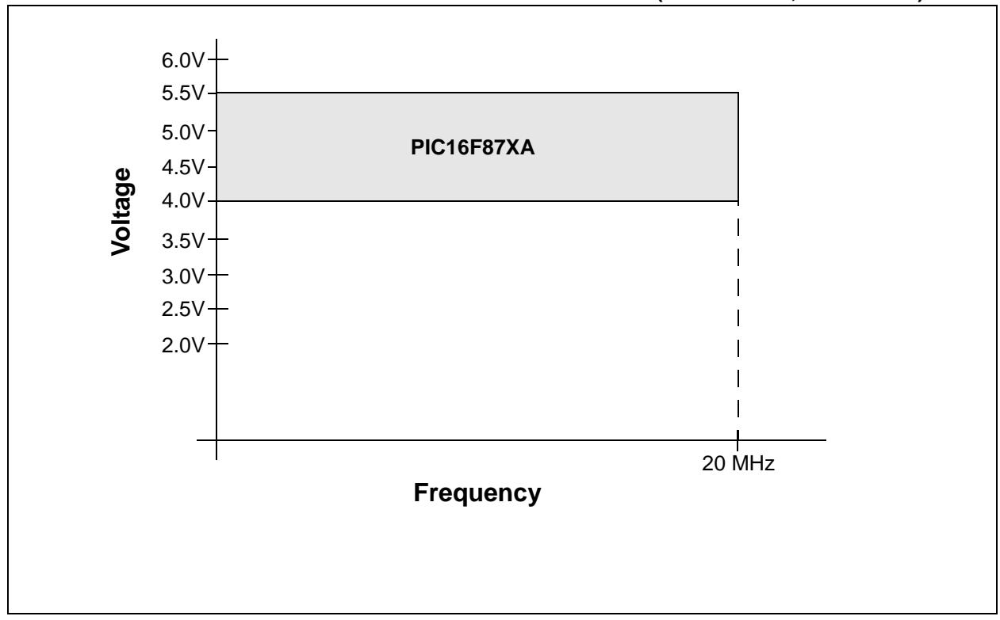

**FIGURE 17-2: PIC16LF87XA VOLTAGE-FREQUENCY GRAPH (INDUSTRIAL)** 


# <span id="page-176-1"></span><span id="page-176-0"></span>17.1 DC Characteristics: PIC16F873A/874A/876A/877A (Industrial, Extended) PIC16LF873A/874A/876A/877A (Industrial)

| PIC16LF873A/874A/876A/877A<br>(Industrial)          |        |                                                                  | Standard Operating Conditions (unless otherwise stated)  Operating temperature -40°C ≤ TA ≤ +85°C for industrial |                                                                                                                                                                                                                                     |      |      |                                                        |  |  |
|-----------------------------------------------------|--------|------------------------------------------------------------------|------------------------------------------------------------------------------------------------------------------|-------------------------------------------------------------------------------------------------------------------------------------------------------------------------------------------------------------------------------------|------|------|--------------------------------------------------------|--|--|
| PIC16F873A/874A/876A/877A<br>(Industrial, Extended) |        |                                                                  |                                                                                                                  | Standard Operating Conditions (unless otherwise stated)  Operating temperature $-40^{\circ}\text{C} \le \text{TA} \le +85^{\circ}\text{C}$ for industrial $-40^{\circ}\text{C} \le \text{TA} \le +125^{\circ}\text{C}$ for extended |      |      |                                                        |  |  |
| Param<br>No.                                        | Symbol | Characteristic/<br>Device                                        | Min                                                                                                              | Min Typ† Max Units Conditions                                                                                                                                                                                                       |      |      |                                                        |  |  |
|                                                     | VDD    | Supply Voltage                                                   |                                                                                                                  |                                                                                                                                                                                                                                     |      |      |                                                        |  |  |
| D001                                                |        | 16LF87XA                                                         | 2.0                                                                                                              | _                                                                                                                                                                                                                                   | 5.5  | V    | All configurations<br>(DC to 10 MHz)                   |  |  |
| D001                                                |        | 16F87XA                                                          | 4.0                                                                                                              | _                                                                                                                                                                                                                                   | 5.5  | V    | All configurations                                     |  |  |
| D001A                                               |        |                                                                  | VBOR                                                                                                             |                                                                                                                                                                                                                                     | 5.5  | V    | BOR enabled, FMAX = 14 MHz <sup>(7)</sup>              |  |  |
| D002                                                | VDR    | RAM Data Retention Voltage <sup>(1)</sup>                        | _                                                                                                                | 1.5                                                                                                                                                                                                                                 | _    | V    |                                                        |  |  |
| D003                                                | VPOR   | VDD Start Voltage to<br>ensure internal Power-on<br>Reset signal | _                                                                                                                | Vss                                                                                                                                                                                                                                 | _    | V    | See Section 14.5 "Power-on<br>Reset (POR)" for details |  |  |
| D004                                                | SVDD   | VDD Rise Rate to ensure internal Power-on Reset signal           | 0.05                                                                                                             | _                                                                                                                                                                                                                                   | _    | V/ms | See Section 14.5 "Power-on<br>Reset (POR)" for details |  |  |
| D005                                                | VBOR   | Brown-out Reset<br>Voltage                                       | 3.65                                                                                                             | 4.0                                                                                                                                                                                                                                 | 4.35 | V    | BODEN bit in configuration word enabled                |  |  |

- Legend: Rows with standard voltage device data only are shaded for improved readability.
  - † Data in "Typ" column is at 5V, 25°C, unless otherwise stated. These parameters are for design guidance only and are not tested.
- Note 1: This is the limit to which VDD can be lowered without losing RAM data.
  - 2: The supply current is mainly a function of the operating voltage and frequency. Other factors, such as I/O pin loading, switching rate, oscillator type, internal code execution pattern and temperature, also have an impact on the current consumption.

The test conditions for all IDD measurements in active operation mode are:

 $\overline{\text{OSC1}}$  = external square wave, from rail-to-rail; all I/O pins tri-stated, pulled to VDD;  $\overline{\text{MCLR}}$  = VDD; WDT enabled/disabled as specified.

- **3:** The power-down current in Sleep mode does not depend on the oscillator type. Power-down current is measured with the part in Sleep mode, with all I/O pins in high-impedance state and tied to VDD and Vss.
- **4:** For RC osc configuration, current through REXT is not included. The current through the resistor can be estimated by the formula Ir = VDD/2REXT (mA) with REXT in kΩ.
- 5: Timer1 oscillator (when enabled) adds approximately 20 μA to the specification. This value is from characterization and is for design guidance only. This is not tested.
- **6:** The  $\Delta$  current is the additional current consumed when this peripheral is enabled. This current should be added to the base IDD or IPD measurement.
- 7: When BOR is enabled, the device will operate correctly until the VBOR voltage trip point is reached.

# 17.1 DC Characteristics: PIC16F873A/874A/876A/877A (Industrial, Extended) PIC16LF873A/874A/876A/877A (Industrial) (Continued)

| PIC16LF873A/874A/876A/877A<br>(Industrial)          |               |                                           | Standard Operating Conditions (unless otherwise stated)  Operating temperature -40°C ≤ TA ≤ +85°C for industrial                                                                                                                    |                               |     |    |                                                                     |  |  |
|-----------------------------------------------------|---------------|-------------------------------------------|-------------------------------------------------------------------------------------------------------------------------------------------------------------------------------------------------------------------------------------|-------------------------------|-----|----|---------------------------------------------------------------------|--|--|
| PIC16F873A/874A/876A/877A<br>(Industrial, Extended) |               |                                           | Standard Operating Conditions (unless otherwise stated)  Operating temperature $-40^{\circ}\text{C} \le \text{TA} \le +85^{\circ}\text{C}$ for industrial $-40^{\circ}\text{C} \le \text{TA} \le +125^{\circ}\text{C}$ for extended |                               |     |    |                                                                     |  |  |
| Param<br>No.                                        | Symbol        | Characteristic/<br>Device                 | Min                                                                                                                                                                                                                                 | Min Typ† Max Units Conditions |     |    |                                                                     |  |  |
|                                                     | IDD           | Supply Current <sup>(2,5)</sup>           |                                                                                                                                                                                                                                     |                               |     |    |                                                                     |  |  |
| D010                                                |               | 16LF87XA                                  | -                                                                                                                                                                                                                                   | 0.6                           | 2.0 | mA | XT, RC osc configurations,<br>Fosc = 4 MHz, VDD = 3.0V              |  |  |
| D010                                                |               | 16F87XA                                   | _                                                                                                                                                                                                                                   | 1.6                           | 4   | mA | XT, RC osc configurations,<br>Fosc = 4 MHz, VDD = 5.5V              |  |  |
| D010A                                               |               | 16LF87XA                                  |                                                                                                                                                                                                                                     | 20                            | 35  | μΑ | LP osc configuration,<br>Fosc = 32 kHz, VDD = 3.0V,<br>WDT disabled |  |  |
| D013                                                |               | 16F87XA                                   | <ul> <li>7 15 mA HS osc configuration,<br/>FOSC = 20 MHz, VDD = 5.5V</li> </ul>                                                                                                                                                     |                               |     |    |                                                                     |  |  |
| D015                                                | $\Delta IBOR$ | Brown-out<br>Reset Current <sup>(6)</sup> | _                                                                                                                                                                                                                                   | 85                            | 200 | μΑ | BOR enabled, VDD = 5.0V                                             |  |  |

Legend: Rows with standard voltage device data only are shaded for improved readability.

- † Data in "Typ" column is at 5V, 25°C, unless otherwise stated. These parameters are for design guidance only and are not tested.
- Note 1: This is the limit to which VDD can be lowered without losing RAM data.
  - 2: The supply current is mainly a function of the operating voltage and frequency. Other factors, such as I/O pin loading, switching rate, oscillator type, internal code execution pattern and temperature, also have an impact on the current consumption.

The test conditions for all IDD measurements in active operation mode are:

OSC1 = external square wave, from rail-to-rail; all I/O pins tri-stated, pulled to VDD; MCLR = VDD; WDT enabled/disabled as specified.

- 3: The power-down current in Sleep mode does not depend on the oscillator type. Power-down current is measured with the part in Sleep mode, with all I/O pins in high-impedance state and tied to VDD and Vss.
- **4:** For RC osc configuration, current through REXT is not included. The current through the resistor can be estimated by the formula Ir = VDD/2REXT (mA) with REXT in kΩ.
- 5: Timer1 oscillator (when enabled) adds approximately 20 μA to the specification. This value is from characterization and is for design guidance only. This is not tested.
- **6:** The  $\Delta$  current is the additional current consumed when this peripheral is enabled. This current should be added to the base IDD or IPD measurement.
- 7: When BOR is enabled, the device will operate correctly until the VBOR voltage trip point is reached.

# 17.1 DC Characteristics: PIC16F873A/874A/876A/877A (Industrial, Extended) PIC16LF873A/874A/876A/877A (Industrial) (Continued)

| PIC16LF873A/874A/876A/877A<br>(Industrial)          |        |                                           | Standard Operating Conditions (unless otherwise stated)<br>Operating temperature $-40^{\circ}\text{C} \le \text{TA} \le +85^{\circ}\text{C}$ for industrial |                                                                                                                                                                                                                                     |          |          |                                                                                                        |  |  |
|-----------------------------------------------------|--------|-------------------------------------------|-------------------------------------------------------------------------------------------------------------------------------------------------------------|-------------------------------------------------------------------------------------------------------------------------------------------------------------------------------------------------------------------------------------|----------|----------|--------------------------------------------------------------------------------------------------------|--|--|
| PIC16F873A/874A/876A/877A<br>(Industrial, Extended) |        |                                           |                                                                                                                                                             | Standard Operating Conditions (unless otherwise stated)  Operating temperature $-40^{\circ}\text{C} \le \text{TA} \le +85^{\circ}\text{C}$ for industrial $-40^{\circ}\text{C} \le \text{TA} \le +125^{\circ}\text{C}$ for extended |          |          |                                                                                                        |  |  |
| Param<br>No.                                        | Symbol | Characteristic/<br>Device                 | Min                                                                                                                                                         | Min Typ† Max Units Conditions                                                                                                                                                                                                       |          |          |                                                                                                        |  |  |
|                                                     | IPD    | Power-down Current <sup>(3,5)</sup>       |                                                                                                                                                             |                                                                                                                                                                                                                                     |          |          |                                                                                                        |  |  |
| D020                                                |        | 16LF87XA                                  | _                                                                                                                                                           | 7.5                                                                                                                                                                                                                                 | 30       | μА       | VDD = 3.0V, WDT enabled,<br>-40°C to +85°C                                                             |  |  |
| D020                                                |        | 16F87XA                                   | _                                                                                                                                                           | 10.5                                                                                                                                                                                                                                | 42<br>60 | μA<br>μA | VDD = 4.0V, WDT enabled,<br>-40°C to +85°C<br>VDD = 4.0V, WDT enabled,<br>-40°C to +125°C (extended)   |  |  |
| D021                                                |        | 16LF87XA                                  | _                                                                                                                                                           | 0.9                                                                                                                                                                                                                                 | 5        | μА       | VDD = 3.0V, WDT disabled,<br>0°C to +70°C                                                              |  |  |
| D021                                                |        | 16F87XA                                   | _                                                                                                                                                           | 1.5                                                                                                                                                                                                                                 | 16<br>20 | μA<br>μA | VDD = 4.0V, WDT disabled,<br>-40°C to +85°C<br>VDD = 4.0V, WDT disabled,<br>-40°C to +125°C (extended) |  |  |
| D021A                                               |        | 16LF87XA                                  |                                                                                                                                                             | 0.9                                                                                                                                                                                                                                 | 5        | μА       | VDD = 3.0V, WDT disabled,<br>-40°C to +85°C                                                            |  |  |
| D021A                                               |        | 16F87XA                                   |                                                                                                                                                             | 1.5                                                                                                                                                                                                                                 | 19       | μА       | VDD = 4.0V, WDT disabled,<br>-40°C to +85°C                                                            |  |  |
| D023                                                | ΔIBOR  | Brown-out<br>Reset Current <sup>(6)</sup> | _                                                                                                                                                           | 85                                                                                                                                                                                                                                  | 200      | μΑ       | BOR enabled, VDD = 5.0V                                                                                |  |  |

Legend: Rows with standard voltage device data only are shaded for improved readability.

- † Data in "Typ" column is at 5V, 25°C, unless otherwise stated. These parameters are for design guidance only and are not tested.
- Note 1: This is the limit to which VDD can be lowered without losing RAM data.
  - 2: The supply current is mainly a function of the operating voltage and frequency. Other factors, such as I/O pin loading, switching rate, oscillator type, internal code execution pattern and temperature, also have an impact on the current consumption.

The test conditions for all IDD measurements in active operation mode are:

OSC1 = external square wave, from rail-to-rail; all I/O pins tri-stated, pulled to VDD; MCLR = VDD; WDT enabled/disabled as specified.

- 3: The power-down current in Sleep mode does not depend on the oscillator type. Power-down current is measured with the part in Sleep mode, with all I/O pins in high-impedance state and tied to VDD and Vss.
- **4:** For RC osc configuration, current through REXT is not included. The current through the resistor can be estimated by the formula Ir = VDD/2REXT (mA) with REXT in  $k\Omega$ .
- 5: Timer1 oscillator (when enabled) adds approximately 20 μA to the specification. This value is from characterization and is for design guidance only. This is not tested.
- **6:** The  $\Delta$  current is the additional current consumed when this peripheral is enabled. This current should be added to the base IDD or IPD measurement.
- 7: When BOR is enabled, the device will operate correctly until the VBOR voltage trip point is reached.

## **17.2 DC Characteristics: PIC16F873A/874A/876A/877A (Industrial, Extended) PIC16LF873A/874A/876A/877A (Industrial)**

| DC CHARACTERISTICS | Standard Operating Conditions (unless otherwise stated)<br>Operating temperature<br>-40°C ≤ TA ≤ +85°C for industrial<br>-40°C ≤ TA ≤ +125°C for extended<br>Operating voltage VDD range as described in DC specification<br>(Section 17.1) |                             |                                           |     |          |    |                                                      |  |  |  |
|--------------------|---------------------------------------------------------------------------------------------------------------------------------------------------------------------------------------------------------------------------------------------|-----------------------------|-------------------------------------------|-----|----------|----|------------------------------------------------------|--|--|--|
| Param<br>No.       | Sym                                                                                                                                                                                                                                         | Characteristic              | Min<br>Typ†<br>Max<br>Units<br>Conditions |     |          |    |                                                      |  |  |  |
|                    | VIL                                                                                                                                                                                                                                         | Input Low Voltage           |                                           |     |          |    |                                                      |  |  |  |
|                    |                                                                                                                                                                                                                                             | I/O ports:                  |                                           |     |          |    |                                                      |  |  |  |
| D030               |                                                                                                                                                                                                                                             | with TTL buffer             | VSS                                       | —   | 0.15 VDD | V  | For entire VDD range                                 |  |  |  |
| D030A              |                                                                                                                                                                                                                                             |                             | VSS                                       | —   | 0.8V     | V  | 4.5V ≤ VDD ≤ 5.5V                                    |  |  |  |
| D031               |                                                                                                                                                                                                                                             | with Schmitt Trigger buffer | VSS                                       | —   | 0.2 VDD  | V  |                                                      |  |  |  |
| D032               |                                                                                                                                                                                                                                             | MCLR, OSC1 (in RC mode)     | VSS                                       | —   | 0.2 VDD  | V  |                                                      |  |  |  |
| D033               |                                                                                                                                                                                                                                             | OSC1 (in XT and LP modes)   | VSS                                       | —   | 0.3V     | V  | (Note 1)                                             |  |  |  |
|                    |                                                                                                                                                                                                                                             | OSC1 (in HS mode)           | VSS                                       | —   | 0.3 VDD  | V  |                                                      |  |  |  |
|                    |                                                                                                                                                                                                                                             | Ports RC3 and RC4:          |                                           | —   |          |    |                                                      |  |  |  |
| D034               |                                                                                                                                                                                                                                             | with Schmitt Trigger buffer | VSS                                       | —   | 0.3 VDD  | V  | For entire VDD range                                 |  |  |  |
| D034A              |                                                                                                                                                                                                                                             | with SMBus                  | -0.5                                      | —   | 0.6      | V  | For VDD = 4.5 to 5.5V                                |  |  |  |
|                    | VIH                                                                                                                                                                                                                                         | Input High Voltage          |                                           |     |          |    |                                                      |  |  |  |
|                    |                                                                                                                                                                                                                                             | I/O ports:                  |                                           | —   |          |    |                                                      |  |  |  |
| D040               |                                                                                                                                                                                                                                             | with TTL buffer             | 2.0                                       | —   | VDD      | V  | 4.5V ≤ VDD ≤ 5.5V                                    |  |  |  |
| D040A              |                                                                                                                                                                                                                                             |                             | 0.25 VDD<br>+ 0.8V                        | —   | VDD      | V  | For entire VDD range                                 |  |  |  |
| D041               |                                                                                                                                                                                                                                             | with Schmitt Trigger buffer | 0.8 VDD                                   | —   | VDD      | V  | For entire VDD range                                 |  |  |  |
| D042               |                                                                                                                                                                                                                                             | MCLR                        | 0.8 VDD                                   | —   | VDD      | V  |                                                      |  |  |  |
| D042A              |                                                                                                                                                                                                                                             | OSC1 (in XT and LP modes)   | 1.6V                                      | —   | VDD      | V  | (Note 1)                                             |  |  |  |
|                    |                                                                                                                                                                                                                                             | OSC1 (in HS mode)           | 0.7 VDD                                   | —   | VDD      | V  |                                                      |  |  |  |
| D043               |                                                                                                                                                                                                                                             | OSC1 (in RC mode)           | 0.9 VDD                                   | —   | VDD      | V  |                                                      |  |  |  |
|                    |                                                                                                                                                                                                                                             | Ports RC3 and RC4:          |                                           |     |          |    |                                                      |  |  |  |
| D044               |                                                                                                                                                                                                                                             | with Schmitt Trigger buffer | 0.7 VDD                                   | —   | VDD      | V  | For entire VDD range                                 |  |  |  |
| D044A              |                                                                                                                                                                                                                                             | with SMBus                  | 1.4                                       | —   | 5.5      | V  | For VDD = 4.5 to 5.5V                                |  |  |  |
| D070               | IPURB                                                                                                                                                                                                                                       | PORTB Weak Pull-up Current  | 50                                        | 250 | 400      | µA | VDD = 5V, VPIN = VSS,<br>-40°C TO +85°C              |  |  |  |
|                    | IIL                                                                                                                                                                                                                                         | Input Leakage Current(2, 3) |                                           |     |          |    |                                                      |  |  |  |
| D060               |                                                                                                                                                                                                                                             | I/O ports                   | —                                         | —   | ±1       | µA | VSS ≤ VPIN ≤ VDD,<br>pin at high-impedance           |  |  |  |
| D061               |                                                                                                                                                                                                                                             | MCLR, RA4/T0CKI             | —                                         | —   | ±5       | µA | VSS ≤ VPIN ≤ VDD                                     |  |  |  |
| D063               |                                                                                                                                                                                                                                             | OSC1                        | —                                         | —   | ±5       | µA | VSS ≤ VPIN ≤ VDD, XT, HS<br>and LP osc configuration |  |  |  |

<sup>\*</sup> These parameters are characterized but not tested.

<sup>†</sup> Data in "Typ" column is at 5V, 25°C unless otherwise stated. These parameters are for design guidance only and are not tested.

**Note 1:** In RC oscillator configuration, the OSC1/CLKI pin is a Schmitt Trigger input. It is not recommended that the PIC16F87XA be driven with external clock in RC mode.

**<sup>2:</sup>** The leakage current on the MCLR pin is strongly dependent on the applied voltage level. The specified levels represent normal operating conditions. Higher leakage current may be measured at different input voltages.

**<sup>3:</sup>** Negative current is defined as current sourced by the pin.

## **17.2 DC Characteristics: PIC16F873A/874A/876A/877A (Industrial, Extended) PIC16LF873A/874A/876A/877A (Industrial) (Continued)**

|              | DC CHARACTERISTICS |                                            | Operating temperature<br>(Section 17.1) |      |     |       | Standard Operating Conditions (unless otherwise stated)<br>-40°C ≤ TA ≤ +85°C for industrial<br>-40°C ≤ TA ≤ +125°C for extended<br>Operating voltage VDD range as described in DC specification |
|--------------|--------------------|--------------------------------------------|-----------------------------------------|------|-----|-------|--------------------------------------------------------------------------------------------------------------------------------------------------------------------------------------------------|
| Param<br>No. | Sym                | Characteristic                             | Min                                     | Typ† | Max | Units | Conditions                                                                                                                                                                                       |
|              | VOL                | Output Low Voltage                         |                                         |      |     |       |                                                                                                                                                                                                  |
| D080         |                    | I/O ports                                  | —                                       | —    | 0.6 | V     | IOL = 8.5 mA, VDD = 4.5V,<br>-40°C to +85°C                                                                                                                                                      |
| D083         |                    | OSC2/CLKO (RC osc config)                  | —                                       | —    | 0.6 | V     | IOL = 1.6 mA, VDD = 4.5V,<br>-40°C to +85°C                                                                                                                                                      |
|              | VOH                | Output High Voltage                        |                                         |      |     |       |                                                                                                                                                                                                  |
| D090         |                    | I/O ports(3)                               | VDD – 0.7                               | —    | —   | V     | IOH = -3.0 mA, VDD = 4.5V,<br>-40°C to +85°C                                                                                                                                                     |
| D092         |                    | OSC2/CLKO (RC osc config)                  | VDD – 0.7                               | —    | —   | V     | IOH = -1.3 mA, VDD = 4.5V,<br>-40°C to +85°C                                                                                                                                                     |
| D150*        | VOD                | Open-Drain High Voltage                    | —                                       | —    | 8.5 | V     | RA4 pin                                                                                                                                                                                          |
|              |                    | Capacitive Loading Specs on<br>Output Pins |                                         |      |     |       |                                                                                                                                                                                                  |
| D100         | COSC2              | OSC2 pin                                   | —                                       | —    | 15  | pF    | In XT, HS and LP modes when<br>external clock is used to drive<br>OSC1                                                                                                                           |
| D101         | CIO                | All I/O pins and OSC2 (RC mode)            | —                                       | —    | 50  | pF    |                                                                                                                                                                                                  |
| D102         | CB                 | SCL, SDA (I2C mode)                        | —                                       | —    | 400 | pF    |                                                                                                                                                                                                  |
|              |                    | Data EEPROM Memory                         |                                         |      |     |       |                                                                                                                                                                                                  |
| D120         | ED                 | Endurance                                  | 100K                                    | 1M   | —   | E/W   | -40°C to +85°C                                                                                                                                                                                   |
| D121         | VDRW               | VDD for read/write                         | VMIN                                    | —    | 5.5 | V     | Using EECON to read/write,<br>VMIN = min. operating voltage                                                                                                                                      |
| D122         | TDEW               | Erase/write cycle time                     | —                                       | 4    | 8   | ms    |                                                                                                                                                                                                  |
|              |                    | Program Flash Memory                       |                                         |      |     |       |                                                                                                                                                                                                  |
| D130         | EP                 | Endurance                                  | 10K                                     | 100K | —   | E/W   | -40°C to +85°C                                                                                                                                                                                   |
| D131         | VPR                | VDD for read                               | VMIN                                    | —    | 5.5 | V     | VMIN = min. operating voltage                                                                                                                                                                    |
| D132A        |                    | VDD for erase/write                        | VMIN                                    | —    | 5.5 | V     | Using EECON to read/write,<br>VMIN = min. operating voltage                                                                                                                                      |
| D133         | TPEW               | Erase/Write cycle time                     | —                                       | 4    | 8   | ms    |                                                                                                                                                                                                  |

<sup>\*</sup> These parameters are characterized but not tested.

<span id="page-180-0"></span><sup>†</sup> Data in "Typ" column is at 5V, 25°C unless otherwise stated. These parameters are for design guidance only and are not tested.

**Note 1:** In RC oscillator configuration, the OSC1/CLKI pin is a Schmitt Trigger input. It is not recommended that the PIC16F87XA be driven with external clock in RC mode.

**<sup>2:</sup>** The leakage current on the MCLR pin is strongly dependent on the applied voltage level. The specified levels represent normal operating conditions. Higher leakage current may be measured at different input voltages.

**<sup>3:</sup>** Negative current is defined as current sourced by the pin.

### **TABLE 17-1: COMPARATOR SPECIFICATIONS**

<span id="page-181-0"></span>**Operating Conditions:** 3.0V < VDD < 5.5V, -40°C < TA < +85°C (unless otherwise stated) 4.0V < VDD < 5.5V, -40°C < TA < +125°C (unless otherwise stated)

| Param<br>No. | Sym    | Characteristics                            | Min | Typ   | Max        | Units    | Comments                  |
|--------------|--------|--------------------------------------------|-----|-------|------------|----------|---------------------------|
| D300         | VIOFF  | Input Offset Voltage                       | —   | ± 5.0 | ± 10       | mV       |                           |
| D301         | VICM   | Input Common Mode Voltage*                 | 0   | -     | VDD – 1.5  | V        |                           |
| D302         | CMRR   | Common Mode Rejection Ratio*               | 55  | -     | —          | dB       |                           |
| 300<br>300A  | TRESP  | Response Time*(1)                          | —   | 150   | 400<br>600 | ns<br>ns | PIC16F87XA<br>PIC16LF87XA |
| 301          | TMC2OV | Comparator Mode Change to<br>Output Valid* | —   | —     | 10         | µs       |                           |

<span id="page-181-1"></span><sup>\*</sup> These parameters are characterized but not tested.

**Note 1:** Response time measured with one comparator input at (VDD – 1.5)/2 while the other input transitions from VSS to VDD.

### **TABLE 17-2: VOLTAGE REFERENCE SPECIFICATIONS**

**Operating Conditions:** 3.0V < VDD < 5.5V, -40°C < TA < +85°C (unless otherwise stated) 4.0V < VDD < 5.5V, -40°C < TA < +125°C (unless otherwise stated)

| Spec<br>No. | Sym  | Characteristics          | Min    | Typ | Max    | Units | Comments             |
|-------------|------|--------------------------|--------|-----|--------|-------|----------------------|
| D310        | VRES | Resolution               | VDD/24 | —   | VDD/32 | LSb   |                      |
| D311        | VRAA | Absolute Accuracy        | —      | —   | 1/2    | LSb   | Low Range (VRR = 1)  |
|             |      |                          | —      | —   | 1/2    | LSb   | High Range (VRR = 0) |
| D312        | VRUR | Unit Resistor Value (R)* | —      | 2k  | —      | Ω     |                      |
| 310         | TSET | Settling Time*(1)        | —      | —   | 10     | µs    |                      |

<sup>\*</sup> These parameters are characterized but not tested.

**Note 1:** Settling time measured while VRR = 1 and VR<3:0> transitions from '0000' to '1111'.

### <span id="page-182-1"></span>**17.3 Timing Parameter Symbology**

The timing parameter symbols have been created following one of the following formats:

| 1. TppS2ppS  |                                            | 3. TCC:ST | (I2C specifications only) |
|--------------|--------------------------------------------|-----------|---------------------------|
| 2. TppS      |                                            | 4. Ts     | (I2C specifications only) |
| T            |                                            |           |                           |
| F            | Frequency                                  | T         | Time                      |
|              | Lowercase letters (pp) and their meanings: |           |                           |
| pp           |                                            |           |                           |
| cc           | CCP1                                       | osc       | OSC1                      |
| ck           | CLKO                                       | rd        | RD                        |
| cs           | CS                                         | rw        | RD or WR                  |
| di           | SDI                                        | sc        | SCK                       |
| do           | SDO                                        | ss        | SS                        |
| dt           | Data in                                    | t0        | T0CKI                     |
| io           | I/O port                                   | t1        | T1CKI                     |
| mc           | MCLR                                       | wr        | WR                        |
|              | Uppercase letters and their meanings:      |           |                           |
| S            |                                            |           |                           |
| F            | Fall                                       | P         | Period                    |
| H            | High                                       | R         | Rise                      |
| I            | Invalid (High-impedance)                   | V         | Valid                     |
| L            | Low                                        | Z         | High-impedance            |
| 2C only<br>I |                                            |           |                           |
| AA           | output access                              | High      | High                      |
| BUF          | Bus free                                   | Low       | Low                       |
|              | TCC:ST (I2C specifications only)           |           |                           |
| CC           |                                            |           |                           |
| HD           | Hold                                       | SU        | Setup                     |
| ST           |                                            |           |                           |
| DAT          | Data input hold                            | STO       | Stop condition            |

### <span id="page-182-0"></span>**FIGURE 17-3: LOAD CONDITIONS**

STA Start condition


<span id="page-183-1"></span>**FIGURE 17-4: EXTERNAL CLOCK TIMING**

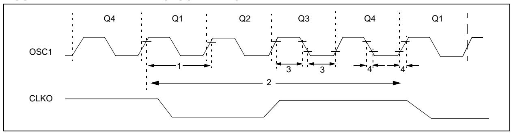

<span id="page-183-0"></span>**TABLE 17-3: EXTERNAL CLOCK TIMING REQUIREMENTS** 

| Param<br>No. | Symbol | Characteristic                     | Min    | Typ†   | Max       | Units      | Conditions                 |
|--------------|--------|------------------------------------|--------|--------|-----------|------------|----------------------------|
|              | FOSC   | External CLKI Frequency            | DC     | —      | 1         | MHz        | XT and RC Osc mode         |
|              |        | (Note 1)                           | DC     | —      | 20        | MHz        | HS Osc mode                |
|              |        |                                    | DC     | —      | 32        | kHz        | LP Osc mode                |
|              |        | Oscillator Frequency               | DC     | —      | 4         | MHz        | RC Osc mode                |
|              |        | (Note 1)                           | 0.1    | —      | 4         | MHz        | XT Osc mode                |
|              |        |                                    | 4<br>5 | —<br>— | 20<br>200 | MHz<br>kHz | HS Osc mode<br>LP Osc mode |
| 1            | TOSC   | External CLKI Period               | 1000   | —      | —         | ns         | XT and RC Osc mode         |
|              |        | (Note 1)                           | 50     | —      | —         | ns         | HS Osc mode                |
|              |        |                                    | 5      | —      | —         | µs         | LP Osc mode                |
|              |        | Oscillator Period                  | 250    | —      | —         | ns         | RC Osc mode                |
|              |        | (Note 1)                           | 250    | —      | 1         | µs         | XT Osc mode                |
|              |        |                                    | 100    | —      | 250       | ns         | HS Osc mode                |
|              |        |                                    | 50     | —      | 250       | ns         | HS Osc mode                |
|              |        |                                    | 31.25  | —      | —         | µs         | LP Osc mode                |
| 2            | TCY    | Instruction Cycle Time<br>(Note 1) | 200    | TCY    | DC        | ns         | TCY = 4/FOSC               |
| 3            | TOSL,  | External Clock in (OSC1) High or   | 100    | —      | —         | ns         | XT oscillator              |
|              | TOSH   | Low Time                           | 2.5    | —      | —         | µs         | LP oscillator              |
|              |        |                                    | 15     | —      | —         | ns         | HS oscillator              |
| 4            | TOSR,  | External Clock in (OSC1) Rise or   | —      | —      | 25        | ns         | XT oscillator              |
|              | TOSF   | Fall Time                          | —      | —      | 50        | ns         | LP oscillator              |
|              |        |                                    | —      | —      | 15        | ns         | HS oscillator              |

<sup>†</sup> Data in "Typ" column is at 5V, 25°C unless otherwise stated. These parameters are for design guidance only and are not tested.

**Note 1:** Instruction cycle period (TCY) equals four times the input oscillator time base period. All specified values are based on characterization data for that particular oscillator type, under standard operating conditions, with the device executing code. Exceeding these specified limits may result in an unstable oscillator operation and/or higher than expected current consumption. All devices are tested to operate at "min." values with an external clock applied to the OSC1/CLKI pin. When an external clock input is used, the "max." cycle time limit is "DC" (no clock) for all devices.

**Note:** Refer to [Figure 17-3](#page-182-0) for load conditions. OSC1 CLKO I/O pin (Input) I/O pin (Output) Q4 Q1 Q2 Q3 10 13 14 17 20, 21 <sup>19</sup> <sup>18</sup> 15 11 12 16 Old Value New Value

<span id="page-184-1"></span>**FIGURE 17-5: CLKO AND I/O TIMING**

<span id="page-184-0"></span>**TABLE 17-4: CLKO AND I/O TIMING REQUIREMENTS**

| Param<br>No. | Symbol   | Characteristic                                 |               | Min        | Typ† | Max          |    | Units Conditions |
|--------------|----------|------------------------------------------------|---------------|------------|------|--------------|----|------------------|
| 10*          | TOSH2CKL | OSC1 ↑ to CLKO ↓                               |               | —          | 75   | 200          | ns | (Note 1)         |
| 11*          |          | TOSH2CKH OSC1 ↑ to CLKO ↑                      |               | —          | 75   | 200          | ns | (Note 1)         |
| 12*          | TCKR     | CLKO Rise Time                                 |               | —          | 35   | 100          | ns | (Note 1)         |
| 13*          | TCKF     | CLKO Fall Time                                 |               | —          | 35   | 100          | ns | (Note 1)         |
| 14*          | TCKL2IOV | CLKO ↓ to Port Out Valid                       |               | —          | —    | 0.5 TCY + 20 | ns | (Note 1)         |
| 15*          | TIOV2CKH | Port In Valid before CLKO ↑                    |               | TOSC + 200 | —    | —            | ns | (Note 1)         |
| 16*          | TCKH2IOI | Port In Hold after CLKO ↑                      |               | 0          | —    | —            | ns | (Note 1)         |
| 17*          | TOSH2IOV | OSC1 ↑ (Q1 cycle) to Port Out Valid            |               | —          | 100  | 255          | ns |                  |
| 18*          | TOSH2IOI | OSC1 ↑ (Q2 cycle) to Port Input                | Standard (F)  | 100        | —    | —            | ns |                  |
|              |          | Invalid (I/O in hold time)                     | Extended (LF) | 200        | —    | —            | ns |                  |
| 19*          | TIOV2OSH | Port Input Valid to OSC1 ↑ (I/O in setup time) |               | 0          | —    | —            | ns |                  |
| 20*          | TIOR     | Port Output Rise Time                          | Standard (F)  | —          | 10   | 40           | ns |                  |
|              |          |                                                | Extended (LF) | —          | —    | 145          | ns |                  |
| 21*          | TIOF     | Port Output Fall Time                          | Standard (F)  | —          | 10   | 40           | ns |                  |
|              |          |                                                | Extended (LF) | —          | —    | 145          | ns |                  |
| 22††*        | TINP     | INT pin High or Low Time                       |               | TCY        | —    | —            | ns |                  |
| 23††*        | TRBP     | RB7:RB4 Change INT High or Low Time            |               | TCY        | —    | —            | ns |                  |

<sup>\*</sup> These parameters are characterized but not tested.

**Note 1:** Measurements are taken in RC mode where CLKO output is 4 x TOSC.

<sup>†</sup> Data in "Typ" column is at 5V, 25°C unless otherwise stated. These parameters are for design guidance only and are not tested.

<sup>††</sup> These parameters are asynchronous events not related to any internal clock edges.

<span id="page-185-2"></span>**FIGURE 17-6: RESET, WATCHDOG TIMER, OSCILLATOR START-UP TIMER AND POWER-UP TIMER TIMING**

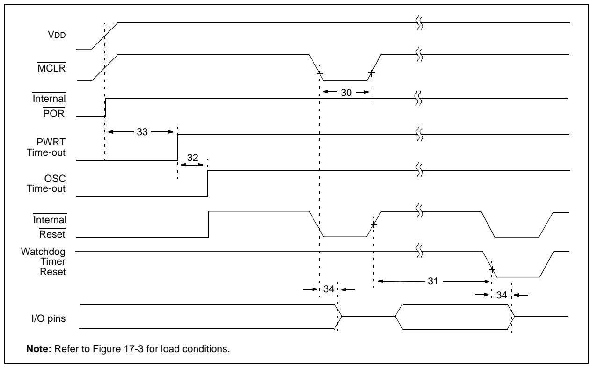

<span id="page-185-1"></span>**FIGURE 17-7: BROWN-OUT RESET TIMING**


<span id="page-185-0"></span>**TABLE 17-5: RESET, WATCHDOG TIMER, OSCILLATOR START-UP TIMER, POWER-UP TIMER AND BROWN-OUT RESET REQUIREMENTS**

| Param<br>No. | Symbol | Characteristic                                              | Min | Typ†      | Max | Units | Conditions               |
|--------------|--------|-------------------------------------------------------------|-----|-----------|-----|-------|--------------------------|
| 30           | TMCL   | MCLR Pulse Width (low)                                      | 2   | —         | —   | µs    | VDD = 5V, -40°C to +85°C |
| 31*          | TWDT   | Watchdog Timer Time-out Period<br>(no prescaler)            | 7   | 18        | 33  | ms    | VDD = 5V, -40°C to +85°C |
| 32           | TOST   | Oscillation Start-up Timer Period                           | —   | 1024 TOSC | —   | —     | TOSC = OSC1 period       |
| 33*          | TPWRT  | Power-up Timer Period                                       | 28  | 72        | 132 | ms    | VDD = 5V, -40°C to +85°C |
| 34           | TIOZ   | I/O High-Impedance from MCLR Low<br>or Watchdog Timer Reset | —   | —         | 2.1 | µs    |                          |
| 35           | TBOR   | Brown-out Reset Pulse Width                                 | 100 | —         | —   | µs    | VDD ≤ VBOR (D005)        |

<sup>\*</sup> These parameters are characterized but not tested.

<sup>†</sup> Data in "Typ" column is at 5V, 25°C unless otherwise stated. These parameters are for design guidance only and are not tested.

**Note:** Refer to [Figure 17-3](#page-182-0) for load conditions. 46 47 45 48 41 42 40 RA4/T0CKI RC0/T1OSO/T1CKI TMR0 or TMR1

<span id="page-186-1"></span>**FIGURE 17-8: TIMER0 AND TIMER1 EXTERNAL CLOCK TIMINGS**

<span id="page-186-0"></span>**TABLE 17-6: TIMER0 AND TIMER1 EXTERNAL CLOCK REQUIREMENTS** 

| Param<br>No. | Symbol |                        | Characteristic                                                                         |                | Min                                | Typ† | Max    | Units | Conditions                         |
|--------------|--------|------------------------|----------------------------------------------------------------------------------------|----------------|------------------------------------|------|--------|-------|------------------------------------|
| 40*          | TT0H   | T0CKI High Pulse Width |                                                                                        | No Prescaler   | 0.5 TCY + 20                       | —    | —      | ns    | Must also meet                     |
|              |        |                        |                                                                                        | With Prescaler | 10                                 | —    | —      | ns    | parameter 42                       |
| 41*          | TT0L   | T0CKI Low Pulse Width  |                                                                                        | No Prescaler   | 0.5 TCY + 20                       | —    | —      | ns    | Must also meet                     |
|              |        |                        |                                                                                        | With Prescaler | 10                                 | —    | —      | ns    | parameter 42                       |
| 42*          | TT0P   | T0CKI Period           |                                                                                        | No Prescaler   | TCY + 40                           | —    | —      | ns    |                                    |
|              |        |                        |                                                                                        | With Prescaler | Greater of:                        | —    | —      | ns    | N = prescale value                 |
|              |        |                        |                                                                                        |                | 20 or TCY + 40<br>N                |      |        |       | (2, 4,, 256)                       |
| 45*          | TT1H   | T1CKI High             | Synchronous, Prescaler = 1                                                             |                | 0.5 TCY + 20                       | —    | —      | ns    | Must also meet                     |
|              |        | Time                   | Synchronous,                                                                           | Standard(F)    | 15                                 | —    | —      | ns    | parameter 47                       |
|              |        |                        | Prescaler = 2, 4, 8                                                                    | Extended(LF)   | 25                                 | —    | —      | ns    |                                    |
|              |        |                        | Asynchronous                                                                           | Standard(F)    | 30                                 | —    | —      | ns    |                                    |
|              |        |                        |                                                                                        | Extended(LF)   | 50                                 | —    | —      | ns    |                                    |
| 46*          | TT1L   |                        | T1CKI Low Time Synchronous, Prescaler = 1                                              |                | 0.5 TCY + 20                       | —    | —      | ns    | Must also meet                     |
|              |        |                        | Synchronous,                                                                           | Standard(F)    | 15                                 | —    | —      | ns    | parameter 47                       |
|              |        |                        | Prescaler = 2, 4, 8                                                                    | Extended(LF)   | 25                                 | —    | —      | ns    |                                    |
|              |        |                        | Asynchronous                                                                           | Standard(F)    | 30                                 | —    | —      | ns    |                                    |
|              |        |                        |                                                                                        | Extended(LF)   | 50                                 | —    | —      | ns    |                                    |
| 47*          | TT1P   | T1CKI Input<br>Period  | Synchronous                                                                            | Standard(F)    | Greater of:<br>30 or TCY + 40<br>N | —    | —      | ns    | N = prescale value<br>(1, 2, 4, 8) |
|              |        |                        |                                                                                        | Extended(LF)   | Greater of:<br>50 or TCY + 40<br>N |      |        |       | N = prescale value<br>(1, 2, 4, 8) |
|              |        |                        | Asynchronous                                                                           | Standard(F)    | 60                                 | —    | —      | ns    |                                    |
|              |        |                        |                                                                                        | Extended(LF)   | 100                                | —    | —      | ns    |                                    |
|              | FT1    |                        | Timer1 Oscillator Input Frequency Range<br>(oscillator enabled by setting bit T1OSCEN) |                | DC                                 | —    | 200    | kHz   |                                    |
| 48           |        |                        | TCKEZTMR1 Delay from External Clock Edge to Timer Increment                            |                | 2 TOSC                             | —    | 7 TOSC | —     |                                    |

<sup>\*</sup> These parameters are characterized but not tested.

<sup>†</sup> Data in "Typ" column is at 5V, 25°C unless otherwise stated. These parameters are for design guidance only and are not tested.

### <span id="page-187-1"></span>**FIGURE 17-9: CAPTURE/COMPARE/PWM TIMINGS (CCP1 AND CCP2)**

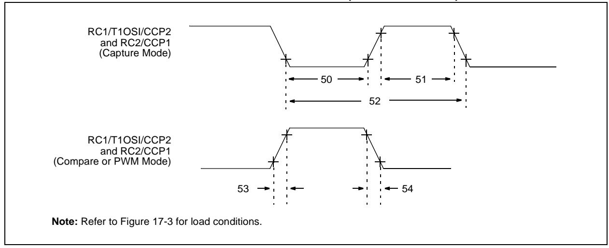

### <span id="page-187-0"></span>**TABLE 17-7: CAPTURE/COMPARE/PWM REQUIREMENTS (CCP1 AND CCP2)**

| Param<br>No. | Symbol |                                | Characteristic |              | Min             | Typ† | Max | Units | Conditions                         |
|--------------|--------|--------------------------------|----------------|--------------|-----------------|------|-----|-------|------------------------------------|
| 50*          | TCCL   | CCP1 and CCP2                  | No Prescaler   |              |                 | —    | —   | ns    |                                    |
|              |        | Input Low Time                 | Standard(F)    |              | 10              | —    | —   | ns    |                                    |
|              |        |                                | With Prescaler | Extended(LF) | 20              | —    | —   | ns    |                                    |
| 51*          | TCCH   | CCP1 and CCP2                  | No Prescaler   |              | 0.5 TCY + 20    | —    | —   | ns    |                                    |
|              |        | Input High Time                |                | Standard(F)  | 10              | —    | —   | ns    |                                    |
|              |        |                                | With Prescaler | Extended(LF) | 20              | —    | —   | ns    |                                    |
| 52*          | TCCP   | CCP1 and CCP2 Input Period     |                |              | 3 TCY + 40<br>N | —    | —   | ns    | N = prescale value<br>(1, 4 or 16) |
| 53*          | TCCR   | CCP1 and CCP2 Output Rise Time |                | Standard(F)  | —               | 10   | 25  | ns    |                                    |
|              |        |                                |                | Extended(LF) | —               | 25   | 50  | ns    |                                    |
| 54*          | TCCF   | CCP1 and CCP2 Output Fall Time | Standard(F)    |              | —               | 10   | 25  | ns    |                                    |
|              |        |                                | Extended(LF)   |              | —               | 25   | 45  | ns    |                                    |

<sup>\*</sup> These parameters are characterized but not tested.

<sup>†</sup> Data in "Typ" column is at 5V, 25°C unless otherwise stated. These parameters are for design guidance only and are not tested.

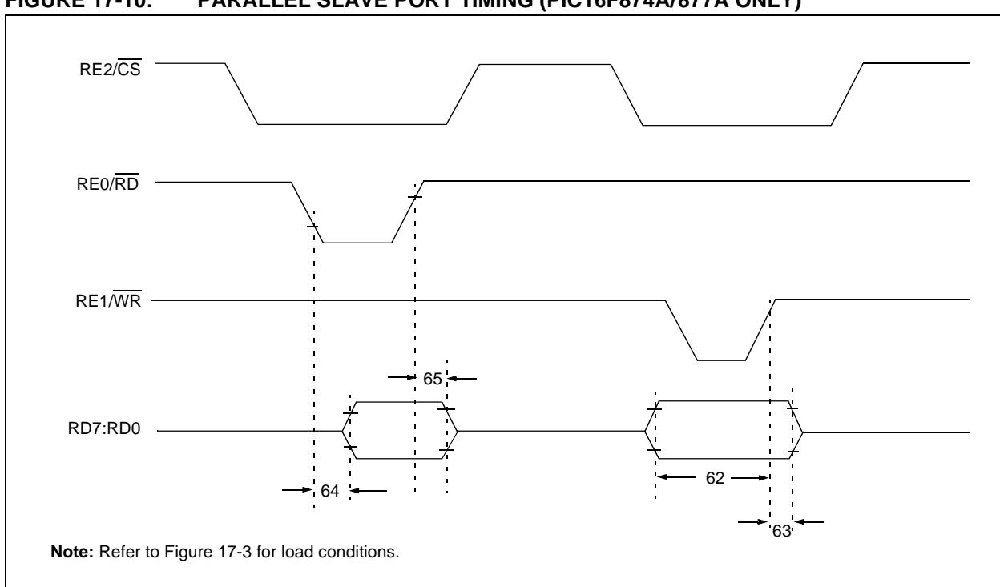

<span id="page-188-1"></span>**FIGURE 17-10: PARALLEL SLAVE PORT TIMING (PIC16F874A/877A ONLY)**

<span id="page-188-0"></span>**TABLE 17-8: PARALLEL SLAVE PORT REQUIREMENTS (PIC16F874A/877A ONLY)**

| Param<br>No. | Symbol   | Characteristic                   |                                                |    | Typ† | Max | Units | Conditions |
|--------------|----------|----------------------------------|------------------------------------------------|----|------|-----|-------|------------|
| 62           | TDTV2WRH |                                  | Data In Valid before WR ↑ or CS ↑ (setup time) |    |      | —   | ns    |            |
| 63*          | TWRH2DTI | WR ↑ or CS ↑ to Data–in Invalid  | Standard(F)                                    | 20 | —    | —   | ns    |            |
|              |          | (hold time)                      | Extended(LF)                                   | 35 | —    | —   | ns    |            |
| 64           | TRDL2DTV | RD ↓ and CS ↓ to Data–out Valid  |                                                |    | —    | 80  | ns    |            |
| 65           | TRDH2DTI | RD ↑ or CS ↓ to Data–out Invalid |                                                | 10 | —    | 30  | ns    |            |

<sup>\*</sup> These parameters are characterized but not tested.

<sup>†</sup> Data in "Typ" column is at 5V, 25°C unless otherwise stated. These parameters are for design guidance only and are not tested.

<span id="page-189-0"></span>**FIGURE 17-11: SPI MASTER MODE TIMING (CKE = 0, SMP = 0)**


<span id="page-189-1"></span>**FIGURE 17-12: SPI MASTER MODE TIMING (CKE = 1, SMP = 1)**

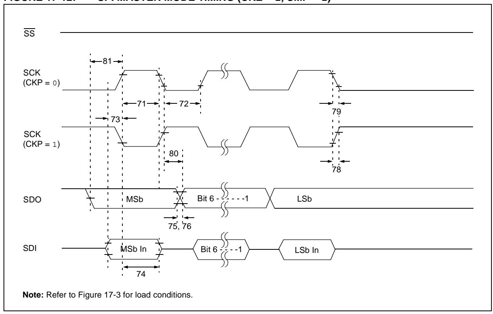

<span id="page-190-0"></span>**FIGURE 17-13: SPI SLAVE MODE TIMING (CKE = 0)**


<span id="page-190-1"></span>**FIGURE 17-14: SPI SLAVE MODE TIMING (CKE = 1)**

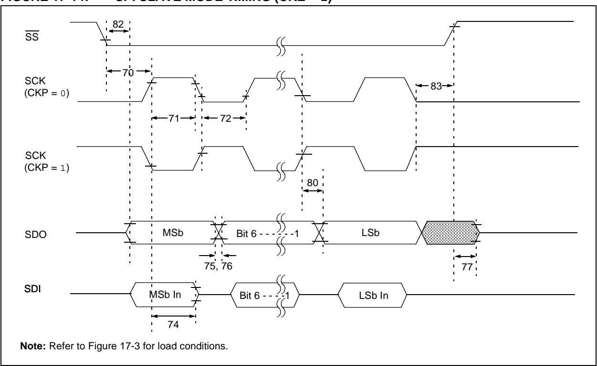

<span id="page-191-0"></span>**TABLE 17-9: SPI MODE REQUIREMENTS** 

| Param<br>No. | Symbol                | Characteristic                           |                             | Min          | Typ†     | Max       | Units    | Conditions |
|--------------|-----------------------|------------------------------------------|-----------------------------|--------------|----------|-----------|----------|------------|
| 70*          | TSSL2SCH,<br>TSSL2SCL | SS ↓ to SCK ↓ or SCK ↑ Input             |                             |              |          | —         | ns       |            |
| 71*          | TSCH                  | SCK Input High Time (Slave mode)         |                             | TCY + 20     | —        | —         | ns       |            |
| 72*          | TSCL                  | SCK Input Low Time (Slave mode)          |                             | TCY + 20     | —        | —         | ns       |            |
| 73*          | TDIV2SCH,<br>TDIV2SCL | Setup Time of SDI Data Input to SCK Edge |                             | 100          | —        | —         | ns       |            |
| 74*          | TSCH2DIL,<br>TSCL2DIL | Hold Time of SDI Data Input to SCK Edge  |                             | 100          | —        | —         | ns       |            |
| 75*          | TDOR                  | SDO Data Output Rise Time                | Standard(F)<br>Extended(LF) | —<br>—       | 10<br>25 | 25<br>50  | ns<br>ns |            |
| 76*          | TDOF                  | SDO Data Output Fall Time                |                             | —            | 10       | 25        | ns       |            |
| 77*          | TSSH2DOZ              | SS ↑ to SDO Output High-Impedance        |                             | 10           | —        | 50        | ns       |            |
| 78*          | TSCR                  | SCK Output Rise Time<br>(Master mode)    | Standard(F)<br>Extended(LF) | —<br>—       | 10<br>25 | 25<br>50  | ns<br>ns |            |
| 79*          | TSCF                  | SCK Output Fall Time (Master mode)       |                             | —            | 10       | 25        | ns       |            |
| 80*          | TSCH2DOV,<br>TSCL2DOV | SDO Data Output Valid after<br>SCK Edge  | Standard(F)<br>Extended(LF) | —<br>—       | —<br>—   | 50<br>145 | ns       |            |
| 81*          | TDOV2SCH,<br>TDOV2SCL | SDO Data Output Setup to SCK Edge        |                             | TCY          | —        | —         | ns       |            |
| 82*          | TSSL2DOV              | SDO Data Output Valid after SS ↓ Edge    |                             | —            | —        | 50        | ns       |            |
| 83*          | TSCH2SSH,<br>TSCL2SSH | SS ↑ after SCK Edge                      |                             | 1.5 TCY + 40 | —        | —         | ns       |            |

<sup>\*</sup> These parameters are characterized but not tested.

**FIGURE 17-15: I2C BUS START/STOP BITS TIMING**

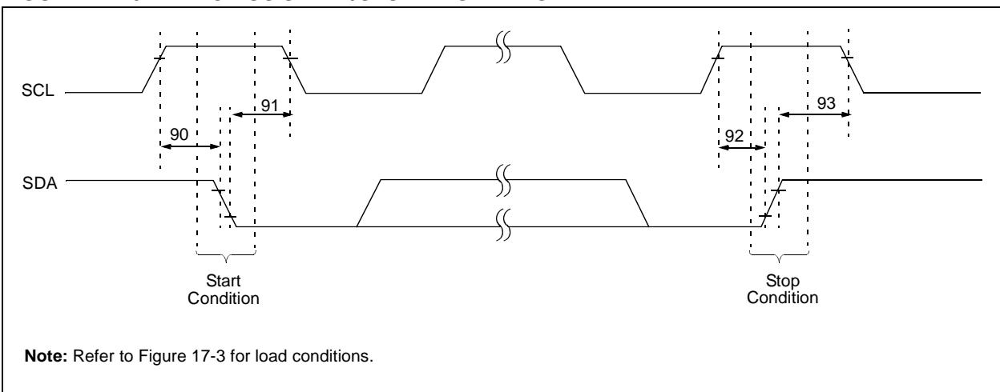

<span id="page-191-1"></span><sup>†</sup> Data in "Typ" column is at 5V, 25°C unless otherwise stated. These parameters are for design guidance only and are not tested.

<span id="page-192-0"></span>**TABLE 17-10: I2C BUS START/STOP BITS REQUIREMENTS**

| Param<br>No. | Symbol  | Characteristic  |              | Min  | Typ | Max | Units | Conditions                               |
|--------------|---------|-----------------|--------------|------|-----|-----|-------|------------------------------------------|
| 90           | TSU:STA | Start condition | 100 kHz mode | 4700 | —   | —   | ns    | Only relevant for Repeated Start         |
|              |         | Setup time      | 400 kHz mode | 600  | —   | —   |       | condition                                |
| 91           | THD:STA | Start condition | 100 kHz mode | 4000 | —   | —   | ns    | After this period, the first clock pulse |
|              |         | Hold time       | 400 kHz mode | 600  | —   | —   |       | is generated                             |
| 92           | TSU:STO | Stop condition  | 100 kHz mode | 4700 | —   | —   | ns    |                                          |
|              |         | Setup time      | 400 kHz mode | 600  | —   | —   |       |                                          |
| 93           | THD:STO | Stop condition  | 100 kHz mode | 4000 | —   | —   | ns    |                                          |
|              |         | Hold time       | 400 kHz mode | 600  | —   | —   |       |                                          |

## <span id="page-192-1"></span>**FIGURE 17-16: I2C BUS DATA TIMING**


<span id="page-193-0"></span>**TABLE 17-11: I2C BUS DATA REQUIREMENTS**

| Param<br>No. | Sym     | Characteristic                     |              | Min         | Max  | Units | Conditions                                 |
|--------------|---------|------------------------------------|--------------|-------------|------|-------|--------------------------------------------|
| 100          | THIGH   | Clock High Time                    | 100 kHz mode | 4.0         | —    | µs    |                                            |
|              |         |                                    | 400 kHz mode | 0.6         | —    | µs    |                                            |
|              |         |                                    | SSP Module   | 0.5 TCY     | —    |       |                                            |
| 101          | TLOW    | Clock Low Time                     | 100 kHz mode | 4.7         | —    | µs    |                                            |
|              |         |                                    | 400 kHz mode | 1.3         | —    | µs    |                                            |
|              |         |                                    | SSP Module   | 0.5 TCY     | —    |       |                                            |
| 102          | TR      | SDA and SCL Rise                   | 100 kHz mode | —           | 1000 | ns    |                                            |
|              |         | Time                               | 400 kHz mode | 20 + 0.1 CB | 300  | ns    | Cb is specified to be from 10 to<br>400 pF |
| 103          | TF      | SDA and SCL Fall                   | 100 kHz mode | —           | 300  | ns    |                                            |
|              |         | Time                               | 400 kHz mode | 20 + 0.1 CB | 300  | ns    | CB is specified to be from 10 to<br>400 pF |
| 90           | TSU:STA | Start Condition Setup              | 100 kHz mode | 4.7         | —    | µs    | Only relevant for Repeated Start           |
|              |         | Time                               | 400 kHz mode | 0.6         | —    | µs    | condition                                  |
| 91           | THD:STA | Start Condition Hold               | 100 kHz mode | 4.0         | —    | µs    | After this period, the first clock         |
|              |         | Time                               | 400 kHz mode | 0.6         | —    | µs    | pulse is generated                         |
| 106          | THD:DAT | Data Input Hold Time               | 100 kHz mode | 0           | —    | ns    |                                            |
|              |         |                                    | 400 kHz mode | 0           | 0.9  | µs    |                                            |
| 107          | TSU:DAT | Data Input Setup Time 100 kHz mode |              | 250         | —    | ns    | (Note 2)                                   |
|              |         |                                    | 400 kHz mode | 100         | —    | ns    |                                            |
| 92           | TSU:STO | Stop Condition Setup               | 100 kHz mode | 4.7         | —    | µs    |                                            |
|              |         | Time                               | 400 kHz mode | 0.6         | —    | µs    |                                            |
| 109          | TAA     | Output Valid from                  | 100 kHz mode | —           | 3500 | ns    | (Note 1)                                   |
|              |         | Clock                              | 400 kHz mode | —           | —    | ns    |                                            |
| 110          | TBUF    | Bus Free Time                      | 100 kHz mode | 4.7         | —    | µs    | Time the bus must be free before           |
|              |         |                                    | 400 kHz mode | 1.3         | —    | µs    | a new transmission can start               |
|              | CB      | Bus Capacitive Loading             |              | —           | 400  | pF    |                                            |

**Note 1:** As a transmitter, the device must provide this internal minimum delay time to bridge the undefined region (min. 300 ns) of the falling edge of SCL to avoid unintended generation of Start or Stop conditions.

**<sup>2:</sup>** A fast mode (400 kHz) I2C bus device can be used in a standard mode (100 kHz) I2C bus system, but the requirement that, TSU:DAT ≥ 250 ns, must then be met. This will automatically be the case if the device does not stretch the LOW period of the SCL signal. If such a device does stretch the LOW period of the SCL signal, it must output the next data bit to the SDA line, TR MAX. + TSU:DAT = 1000 + 250 = 1250 ns (according to the standard mode I2C bus specification), before the SCL line is released.

### <span id="page-194-1"></span>**FIGURE 17-17: USART SYNCHRONOUS TRANSMISSION (MASTER/SLAVE) TIMING**

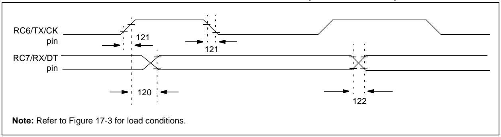

**TABLE 17-12: USART SYNCHRONOUS TRANSMISSION REQUIREMENTS**

| Param<br>No. | Symbol   | Characteristic                                             |              |   | Typ† | Max |    | Units Conditions |
|--------------|----------|------------------------------------------------------------|--------------|---|------|-----|----|------------------|
| 120          | TCKH2DTV | SYNC XMIT (MASTER & SLAVE)<br>Clock High to Data Out Valid | Standard(F)  | — | —    | 80  | ns |                  |
|              |          |                                                            | Extended(LF) | — | —    | 100 | ns |                  |
| 121          | TCKRF    | Clock Out Rise Time and Fall Time                          | Standard(F)  | — | —    | 45  | ns |                  |
|              |          | (Master mode)                                              | Extended(LF) | — | —    | 50  | ns |                  |
| 122          | TDTRF    | Data Out Rise Time and Fall Time                           | Standard(F)  | — | —    | 45  | ns |                  |
|              |          |                                                            | Extended(LF) | — | —    | 50  | ns |                  |

<span id="page-194-0"></span><sup>†</sup> Data in "Typ" column is at 5V, 25°C unless otherwise stated. These parameters are for design guidance only and are not tested.

**FIGURE 17-18: USART SYNCHRONOUS RECEIVE (MASTER/SLAVE) TIMING**

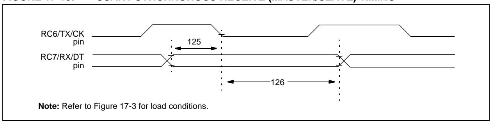

<span id="page-194-2"></span>**TABLE 17-13: USART SYNCHRONOUS RECEIVE REQUIREMENTS**

| Param<br>No. | Symbol   | Characteristic                                                      | Min | Typ† | Max | Units | Conditions |
|--------------|----------|---------------------------------------------------------------------|-----|------|-----|-------|------------|
| 125          | TDTV2CKL | SYNC RCV (MASTER & SLAVE)<br>Data Setup before CK ↓ (DT setup time) | 15  | —    | —   | ns    |            |
| 126          | TCKL2DTL | Data Hold after CK ↓ (DT hold time)                                 | 15  | —    | —   | ns    |            |

<sup>†</sup> Data in "Typ" column is at 5V, 25°C unless otherwise stated. These parameters are for design guidance only and are not tested.

<span id="page-195-0"></span>**TABLE 17-14: A/D CONVERTER CHARACTERISTICS:PIC16F873A/874A/876A/877A (INDUSTRIAL) PIC16LF873A/874A/876A/877A (INDUSTRIAL)**

| Param<br>No. | Sym   | Characteristic                                    |             | Min          | Typ†          | Max          | Units    | Conditions                                                                                                                                                                |     |                                          |
|--------------|-------|---------------------------------------------------|-------------|--------------|---------------|--------------|----------|---------------------------------------------------------------------------------------------------------------------------------------------------------------------------|-----|------------------------------------------|
| A01          | NR    | Resolution                                        |             | —            | —             | 10-bits      | bit      | VREF = VDD = 5.12V,<br>VSS ≤ VAIN ≤ VREF                                                                                                                                  |     |                                          |
| A03          | EIL   | Integral Linearity Error                          |             | —            | —             | < ± 1        | LSb      | VREF = VDD = 5.12V,<br>VSS ≤ VAIN ≤ VREF                                                                                                                                  |     |                                          |
| A04          | EDL   | Differential Linearity Error                      |             | —            | —             | < ± 1        | LSb      | VREF = VDD = 5.12V,<br>VSS ≤ VAIN ≤ VREF                                                                                                                                  |     |                                          |
| A06          | EOFF  |                                                   |             | Offset Error |               | —            | —        | < ± 2                                                                                                                                                                     | LSb | VREF = VDD = 5.12V,<br>VSS ≤ VAIN ≤ VREF |
| A07          | EGN   | Gain Error                                        |             | —            | —             | < ± 1        | LSb      | VREF = VDD = 5.12V,<br>VSS ≤ VAIN ≤ VREF                                                                                                                                  |     |                                          |
| A10          | —     | Monotonicity                                      |             | —            | guaranteed(3) | —            | —        | VSS ≤ VAIN ≤ VREF                                                                                                                                                         |     |                                          |
| A20          | VREF  | Reference Voltage (VREF+ – VREF-)                 |             | 2.0          | —             | VDD + 0.3    | V        |                                                                                                                                                                           |     |                                          |
| A21          |       | VREF+ Reference Voltage High                      |             | AVDD – 2.5V  |               | AVDD + 0.3V  | V        |                                                                                                                                                                           |     |                                          |
| A22          | VREF- | Reference Voltage Low                             |             | AVSS – 0.3V  |               | VREF+ – 2.0V | V        |                                                                                                                                                                           |     |                                          |
| A25          | VAIN  | Analog Input Voltage                              |             | VSS – 0.3V   | —             | VREF + 0.3V  | V        |                                                                                                                                                                           |     |                                          |
| A30          | ZAIN  | Recommended Impedance of<br>Analog Voltage Source |             | —            | —             | 2.5          | kΩ       | (Note 4)                                                                                                                                                                  |     |                                          |
| A40          | IAD   | A/D Conversion                                    | PIC16F87XA  | —            | 220           | —            | µA       | Average current                                                                                                                                                           |     |                                          |
|              |       | Current (VDD)                                     | PIC16LF87XA | —            | 90            | —            | µA       | consumption when A/D is<br>on (Note 1)                                                                                                                                    |     |                                          |
| A50          | IREF  | VREF Input Current (Note 2)                       |             | —<br>—       | —<br>—        | 5<br>150     | µA<br>µA | During VAIN acquisition.<br>Based on differential of<br>VHOLD to VAIN to charge<br>CHOLD, see Section 11.1<br>"A/D Acquisition<br>Requirements".<br>During A/D conversion |     |                                          |
|              |       |                                                   |             |              |               |              |          | cycle                                                                                                                                                                     |     |                                          |

<sup>\*</sup> These parameters are characterized but not tested.

**Note 1:** When A/D is off, it will not consume any current other than minor leakage current. The power-down current spec includes any such leakage from the A/D module.

- **2:** VREF current is from RA3 pin or VDD pin, whichever is selected as reference input.
- **3:** The A/D conversion result never decreases with an increase in the input voltage and has no missing codes.
- **4:** Maximum allowed impedance for analog voltage source is 10 kΩ. This requires higher acquisition time.

<sup>†</sup> Data in "Typ" column is at 5V, 25°C unless otherwise stated. These parameters are for design guidance only and are not tested.

<span id="page-196-1"></span>**FIGURE 17-19: A/D CONVERSION TIMING**

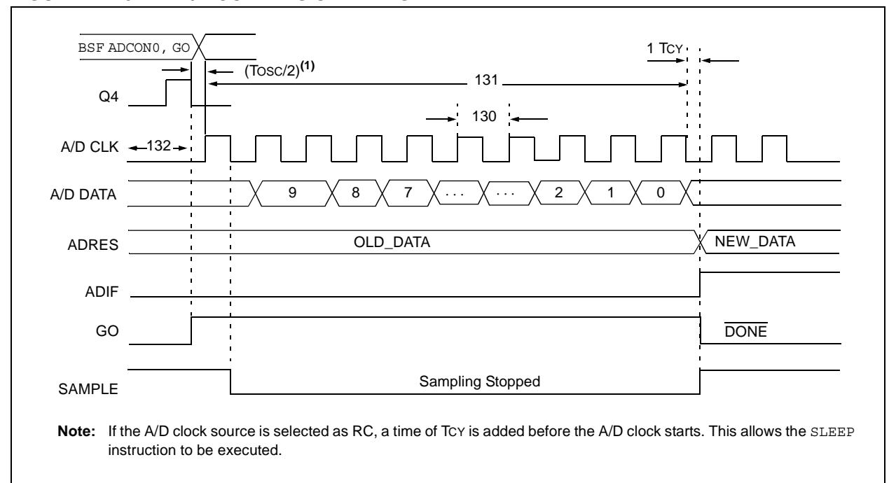

<span id="page-196-0"></span>**TABLE 17-15: A/D CONVERSION REQUIREMENTS**

| Param<br>No. | Symbol | Characteristic                                       |            | Min      | Typ†     | Max | Units | Conditions                                                                                                                                                                                                                     |
|--------------|--------|------------------------------------------------------|------------|----------|----------|-----|-------|--------------------------------------------------------------------------------------------------------------------------------------------------------------------------------------------------------------------------------|
| 130          | TAD    | A/D Clock Period                                     | PIC16F87XA | 1.6      | —        | —   | µs    | TOSC based, VREF ≥ 3.0V                                                                                                                                                                                                        |
|              |        | PIC16LF87XA<br>PIC16F87XA<br>PIC16LF87XA             |            | 3.0      | —        | —   | µs    | TOSC based, VREF ≥ 2.0V                                                                                                                                                                                                        |
|              |        |                                                      |            | 2.0      | 4.0      | 6.0 | µs    | A/D RC mode                                                                                                                                                                                                                    |
|              |        |                                                      |            | 3.0      | 6.0      | 9.0 | µs    | A/D RC mode                                                                                                                                                                                                                    |
| 131          | TCNV   | Conversion Time (not including S/H time)<br>(Note 1) |            |          | —        | 12  | TAD   |                                                                                                                                                                                                                                |
| 132          | TACQ   |                                                      |            | (Note 2) | 40       | —   | µs    |                                                                                                                                                                                                                                |
|              |        | Acquisition Time                                     |            | 10*      | —        | —   | µs    | The minimum time is the<br>amplifier settling time. This may<br>be used if the "new" input volt<br>age has not changed by more<br>than 1 LSb (i.e., 20.0 mV @<br>5.12V) from the last sampled<br>voltage (as stated on CHOLD). |
| 134          | TGO    | Q4 to A/D Clock Start                                |            | —        | TOSC/2 § | —   | —     | If the A/D clock source is<br>selected as RC, a time of TCY is<br>added before the A/D clock<br>starts. This allows the SLEEP<br>instruction to be executed.                                                                   |

<sup>\*</sup> These parameters are characterized but not tested.

**Note 1:** ADRES register may be read on the following TCY cycle.

<sup>†</sup> Data in "Typ" column is at 5V, 25°C unless otherwise stated. These parameters are for design guidance only and are not tested.

<sup>§</sup> This specification ensured by design.

**<sup>2:</sup>** See **[Section 11.1 "A/D Acquisition Requirements"](#page-131-3)** for minimum conditions.

**NOTES:**

## <span id="page-198-0"></span>**18.0 DC AND AC CHARACTERISTICS GRAPHS AND TABLES**

<span id="page-198-1"></span>**Note:** The graphs and tables provided following this note are a statistical summary based on a limited number of samples and are provided for informational purposes only. The performance characteristics listed herein are not tested or guaranteed. In some graphs or tables, the data presented may be outside the specified operating range (e.g., outside specified power supply range) and therefore, outside the warranted range.

"Typical" represents the mean of the distribution at 25°C. "Maximum" or "minimum" represents (mean + 3σ) or (mean – 3σ) respectively, where σ is a standard deviation, over the whole temperature range.

**FIGURE 18-1: TYPICAL IDD vs. FOSC OVER VDD (HS MODE)** 


**FIGURE 18-2: MAXIMUM IDD vs. FOSC OVER VDD (HS MODE)**

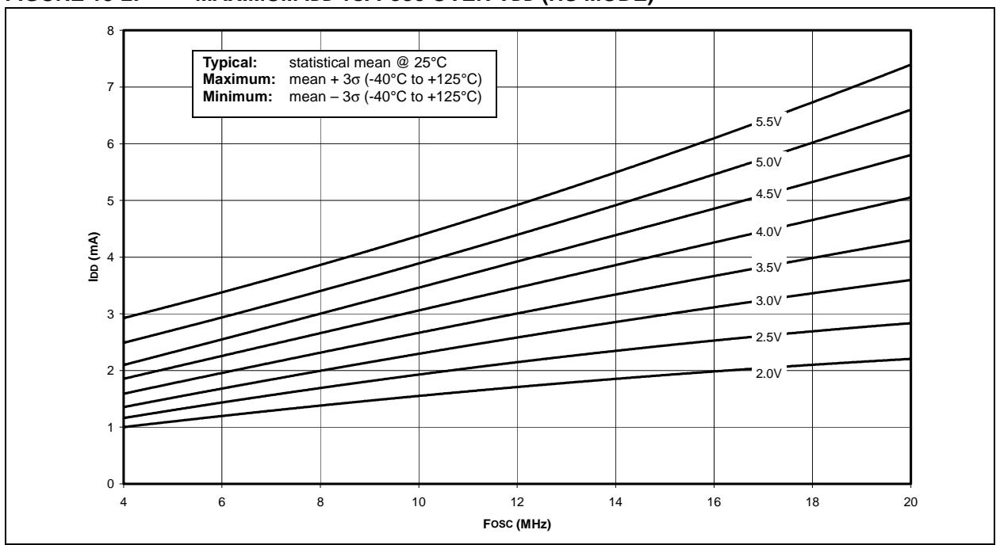

**FIGURE 18-3: TYPICAL IDD vs. FOSC OVER VDD (XT MODE)**

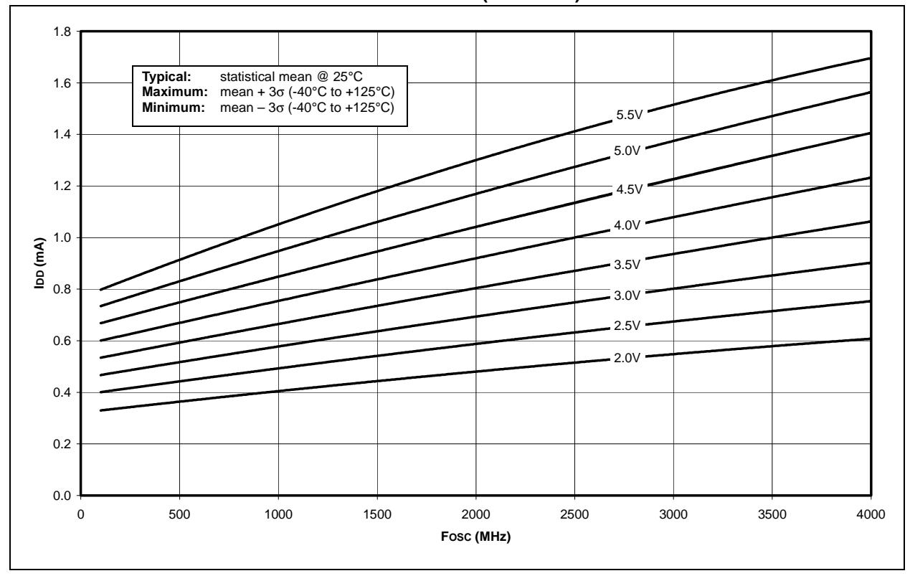

**FIGURE 18-4: MAXIMUM IDD vs. FOSC OVER VDD (XT MODE)**


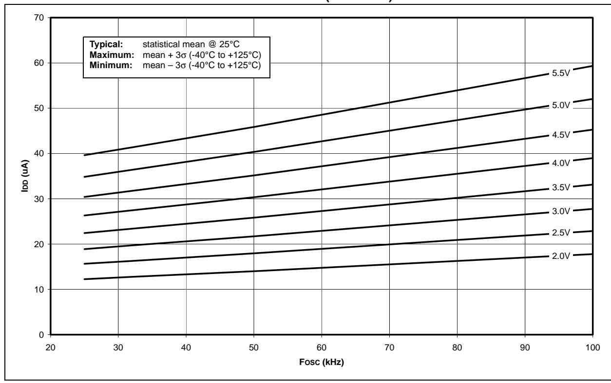


**FIGURE 18-7: AVERAGE FOSC vs. VDD FOR VARIOUS VALUES OF R (RC MODE, C = 20 pF, +25**°**C)**


**FIGURE 18-8: AVERAGE FOSC vs. VDD FOR VARIOUS VALUES OF R (RC MODE, C = 100 pF, +25**°**C)**


**FIGURE 18-9: AVERAGE FOSC vs. VDD FOR VARIOUS VALUES OF R (RC MODE, C = 300 pF, +25**°**C)**


**FIGURE 18-10: IPD vs. VDD, -40**°**C TO +125**°**C (SLEEP MODE, ALL PERIPHERALS DISABLED)**


FIGURE 18-11: TYPICAL AND MAXIMUM  $\triangle$ ITMR1 vs. VDD OVER TEMPERATURE (-10°C TO +70°C, TIMER1 WITH OSCILLATOR, XTAL = 32 kHz, C1 AND C2 = 47 pF)


FIGURE 18-12: TYPICAL AND MAXIMUM AIWDT vs. VDD OVER TEMPERATURE (WDT ENABLED)

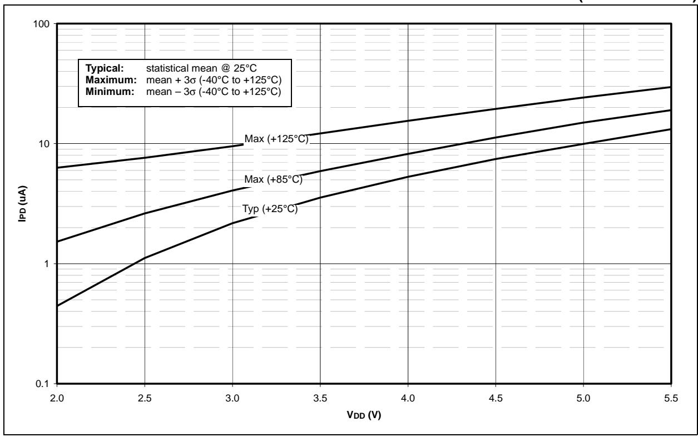

**FIGURE 18-13:** ∆**IBOR vs. VDD OVER TEMPERATURE**


**FIGURE 18-14: TYPICAL, MINIMUM AND MAXIMUM WDT PERIOD vs. VDD (-40**°**C TO +125**°**C)**

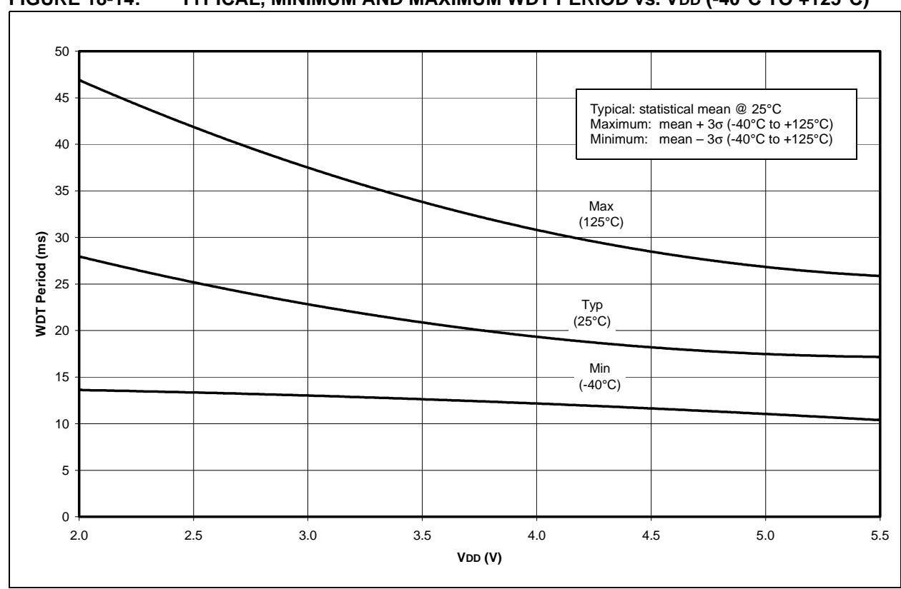

**FIGURE 18-15: AVERAGE WDT PERIOD vs. VDD OVER TEMPERATURE (-40**°**C TO +125**°**C)** 

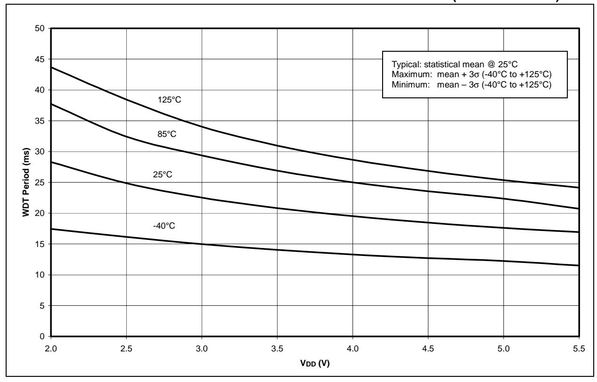

**FIGURE 18-16: TYPICAL, MINIMUM AND MAXIMUM VOH vs. IOH (VDD = 5V, -40**°**C TO +125**°**C)**


**FIGURE 18-17: TYPICAL, MINIMUM AND MAXIMUM VOH vs. IOH (VDD = 3V, -40**°**C TO +125**°**C)**

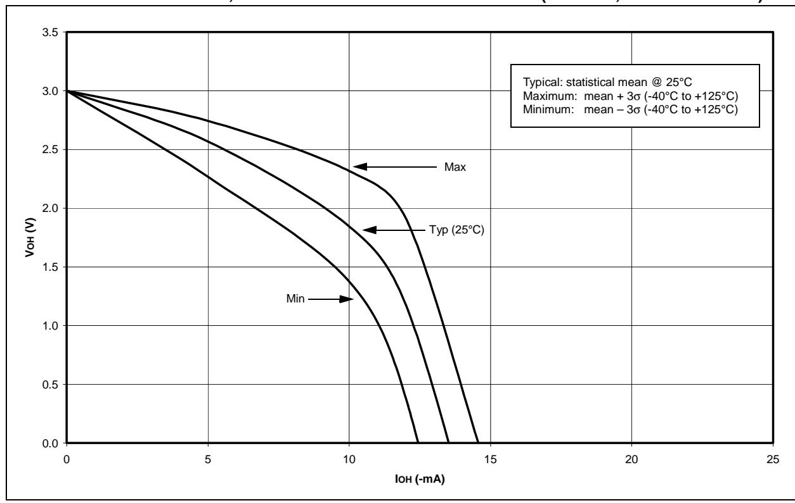

**FIGURE 18-18: TYPICAL, MINIMUM AND MAXIMUM VOL vs. IOL (VDD = 5V, -40**°**C TO +125**°**C)**

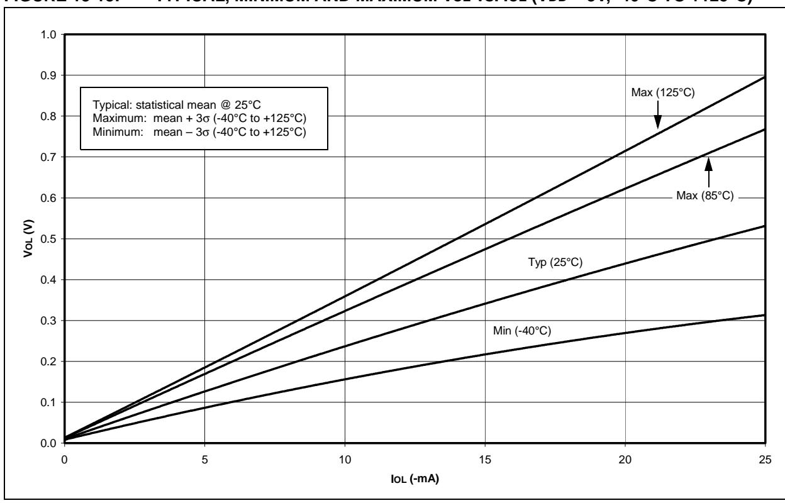

**FIGURE 18-19: TYPICAL, MINIMUM AND MAXIMUM VOL vs. IOL (VDD = 3V, -40**°**C TO +125**°**C)**


**FIGURE 18-20: MINIMUM AND MAXIMUM VIN vs. VDD (TTL INPUT, -40**°**C TO +125**°**C)** 

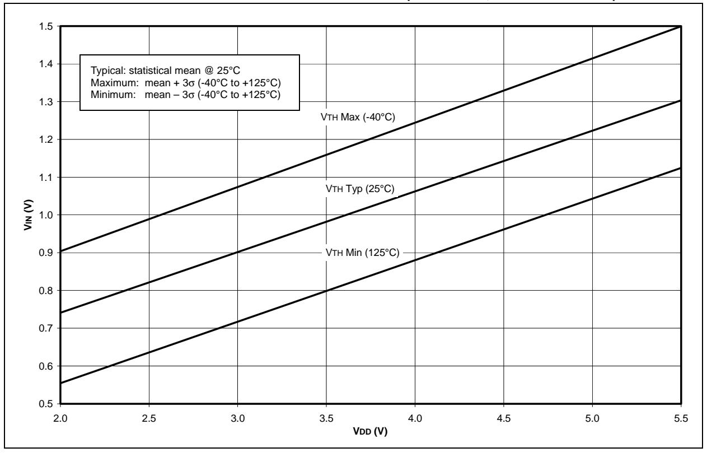

**FIGURE 18-21: MINIMUM AND MAXIMUM VIN vs. VDD (ST INPUT, -40**°**C TO +125**°**C)** 


**FIGURE 18-22: MINIMUM AND MAXIMUM VIN vs. VDD (I2C INPUT, -40**°**C TO +125**°**C)**


**FIGURE 18-23: A/D NONLINEARITY vs. VREFH (VDD = VREFH, -40**°**C TO +125**°**C)**


**FIGURE 18-24: A/D NONLINEARITY vs. VREFH (VDD = 5V, -40**°**C TO +125**°**C)**

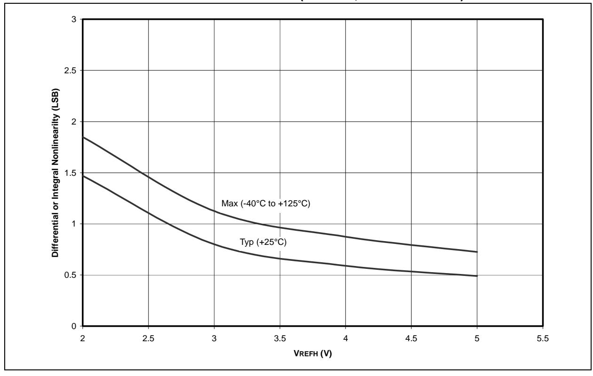

### <span id="page-210-0"></span>19.0 PACKAGING INFORMATION

### 19.1 Package Marking Information

#### <span id="page-210-2"></span>40-Lead PDIP

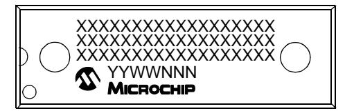

### <span id="page-210-1"></span>Example


#### 44-Lead TQFP

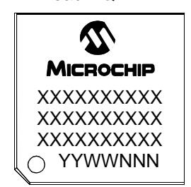

### Example

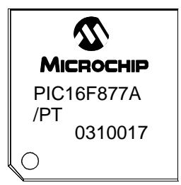

#### 44-Lead PLCC


### Example


Legend: XX...X Customer specific information\*

Y Year code (last digit of calendar year)
YY Year code (last 2 digits of calendar year)
WW Week code (week of January 1 is week '01')

NNN Alphanumeric traceability code

**Note**: In the event the full Microchip part number cannot be marked on one line, it will be carried over to the next line thus limiting the number of available characters for customer specific information.

\* Standard PICmicro device marking consists of Microchip part number, year code, week code, and traceability code. For PICmicro device marking beyond this, certain price adders apply. Please check with your Microchip Sales Office. For QTP devices, any special marking adders are included in QTP price.

## **Package Marking Information (Cont'd)**

44-Lead QFN


Example

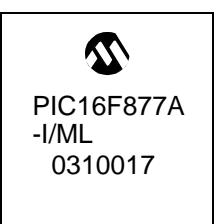

28-Lead PDIP (Skinny DIP)

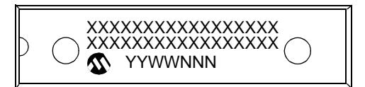

Example

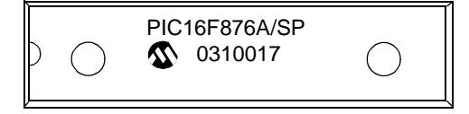

28-Lead SOIC


Example


28-Lead SSOP


Example


28-Lead QFN Example

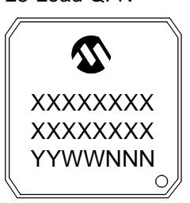

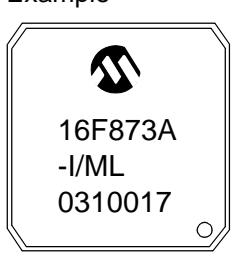

## **40-Lead Plastic Dual In-line (P) – 600 mil (PDIP)**


|                            | Units |       | INCHES* |       | MILLIMETERS |       |       |
|----------------------------|-------|-------|---------|-------|-------------|-------|-------|
| Dimension Limits           |       | MIN   | NOM     | MAX   | MIN         | NOM   | MAX   |
| Number of Pins             | n     |       | 40      |       |             | 40    |       |
| Pitch                      | p     |       | .100    |       |             | 2.54  |       |
| Top to Seating Plane       | A     | .160  | .175    | .190  | 4.06        | 4.45  | 4.83  |
| Molded Package Thickness   | A2    | .140  | .150    | .160  | 3.56        | 3.81  | 4.06  |
| Base to Seating Plane      | A1    | .015  |         |       | 0.38        |       |       |
| Shoulder to Shoulder Width | E     | .595  | .600    | .625  | 15.11       | 15.24 | 15.88 |
| Molded Package Width       | E1    | .530  | .545    | .560  | 13.46       | 13.84 | 14.22 |
| Overall Length             | D     | 2.045 | 2.058   | 2.065 | 51.94       | 52.26 | 52.45 |
| Tip to Seating Plane       | L     | .120  | .130    | .135  | 3.05        | 3.30  | 3.43  |
| Lead Thickness             | c     | .008  | .012    | .015  | 0.20        | 0.29  | 0.38  |
| Upper Lead Width           | B1    | .030  | .050    | .070  | 0.76        | 1.27  | 1.78  |
| Lower Lead Width           | B     | .014  | .018    | .022  | 0.36        | 0.46  | 0.56  |
| Overall Row Spacing<br>§   | eB    | .620  | .650    | .680  | 15.75       | 16.51 | 17.27 |
| Mold Draft Angle Top       | α     | 5     | 10      | 15    | 5           | 10    | 15    |
| Mold Draft Angle Bottom    | β     | 5     | 10      | 15    | 5           | 10    | 15    |

<sup>\*</sup> Controlling Parameter

Notes:

Dimensions D and E1 do not include mold flash or protrusions. Mold flash or protrusions shall not exceed

.010" (0.254mm) per side. JEDEC Equivalent: MO-011

Drawing No. C04-016

<sup>§</sup> Significant Characteristic

## **44-Lead Plastic Thin Quad Flatpack (PT) 10x10x1 mm Body, 1.0/0.10 mm Lead Form (TQFP)**


|                          | Units |      | INCHES |      | MILLIMETERS* |       |       |
|--------------------------|-------|------|--------|------|--------------|-------|-------|
| Dimension Limits         |       | MIN  | NOM    | MAX  | MIN          | NOM   | MAX   |
| Number of Pins           | n     |      | 44     |      |              | 44    |       |
| Pitch                    | p     |      | .031   |      |              | 0.80  |       |
| Pins per Side            | n1    |      | 11     |      |              | 11    |       |
| Overall Height           | A     | .039 | .043   | .047 | 1.00         | 1.10  | 1.20  |
| Molded Package Thickness | A2    | .037 | .039   | .041 | 0.95         | 1.00  | 1.05  |
| Standoff<br>§            | A1    | .002 | .004   | .006 | 0.05         | 0.10  | 0.15  |
| Foot Length              | L     | .018 | .024   | .030 | 0.45         | 0.60  | 0.75  |
| Footprint (Reference)    | (F)   |      | .039   |      | 1.00         |       |       |
| Foot Angle               | φ     | 0    | 3.5    | 7    | 0            | 3.5   | 7     |
| Overall Width            | E     | .463 | .472   | .482 | 11.75        | 12.00 | 12.25 |
| Overall Length           | D     | .463 | .472   | .482 | 11.75        | 12.00 | 12.25 |
| Molded Package Width     | E1    | .390 | .394   | .398 | 9.90         | 10.00 | 10.10 |
| Molded Package Length    | D1    | .390 | .394   | .398 | 9.90         | 10.00 | 10.10 |
| Lead Thickness           | c     | .004 | .006   | .008 | 0.09         | 0.15  | 0.20  |
| Lead Width               | B     | .012 | .015   | .017 | 0.30         | 0.38  | 0.44  |
| Pin 1 Corner Chamfer     | CH    | .025 | .035   | .045 | 0.64         | 0.89  | 1.14  |
| Mold Draft Angle Top     | α     | 5    | 10     | 15   | 5            | 10    | 15    |
| Mold Draft Angle Bottom  | β     | 5    | 10     | 15   | 5            | 10    | 15    |

<sup>\*</sup> Controlling Parameter

Notes:

Dimensions D1 and E1 do not include mold flash or protrusions. Mold flash or protrusions shall not exceed

.010" (0.254mm) per side. JEDEC Equivalent: MS-026

Drawing No. C04-076

<sup>§</sup> Significant Characteristic

## **44-Lead Plastic Leaded Chip Carrier (L) – Square (PLCC)**


|                          | Units |      | INCHES* |      | MILLIMETERS |       |       |
|--------------------------|-------|------|---------|------|-------------|-------|-------|
| Dimension Limits         |       | MIN  | NOM     | MAX  | MIN         | NOM   | MAX   |
| Number of Pins           | n     |      | 44      |      |             | 44    |       |
| Pitch                    | p     |      | .050    |      |             | 1.27  |       |
| Pins per Side            | n1    |      | 11      |      |             | 11    |       |
| Overall Height           | A     | .165 | .173    | .180 | 4.19        | 4.39  | 4.57  |
| Molded Package Thickness | A2    | .145 | .153    | .160 | 3.68        | 3.87  | 4.06  |
| Standoff<br>§            | A1    | .020 | .028    | .035 | 0.51        | 0.71  | 0.89  |
| Side 1 Chamfer Height    | A3    | .024 | .029    | .034 | 0.61        | 0.74  | 0.86  |
| Corner Chamfer 1         | CH1   | .040 | .045    | .050 | 1.02        | 1.14  | 1.27  |
| Corner Chamfer (others)  | CH2   | .000 | .005    | .010 | 0.00        | 0.13  | 0.25  |
| Overall Width            | E     | .685 | .690    | .695 | 17.40       | 17.53 | 17.65 |
| Overall Length           | D     | .685 | .690    | .695 | 17.40       | 17.53 | 17.65 |
| Molded Package Width     | E1    | .650 | .653    | .656 | 16.51       | 16.59 | 16.66 |
| Molded Package Length    | D1    | .650 | .653    | .656 | 16.51       | 16.59 | 16.66 |
| Footprint Width          | E2    | .590 | .620    | .630 | 14.99       | 15.75 | 16.00 |
| Footprint Length         | D2    | .590 | .620    | .630 | 14.99       | 15.75 | 16.00 |
| Lead Thickness           | c     | .008 | .011    | .013 | 0.20        | 0.27  | 0.33  |
| Upper Lead Width         | B1    | .026 | .029    | .032 | 0.66        | 0.74  | 0.81  |
| Lower Lead Width         | B     | .013 | .020    | .021 | 0.33        | 0.51  | 0.53  |
| Mold Draft Angle Top     | α     | 0    | 5       | 10   | 0           | 5     | 10    |
| Mold Draft Angle Bottom  | β     | 0    | 5       | 10   | 0           | 5     | 10    |

<sup>\*</sup> Controlling Parameter

Notes:

Dimensions D and E1 do not include mold flash or protrusions. Mold flash or protrusions shall not exceed

.010" (0.254mm) per side. JEDEC Equivalent: MO-047 Drawing No. C04-048

<sup>§</sup> Significant Characteristic

## 44-Lead Plastic Quad Flat No Lead Package (ML) 8x8 mm Body (QFN)

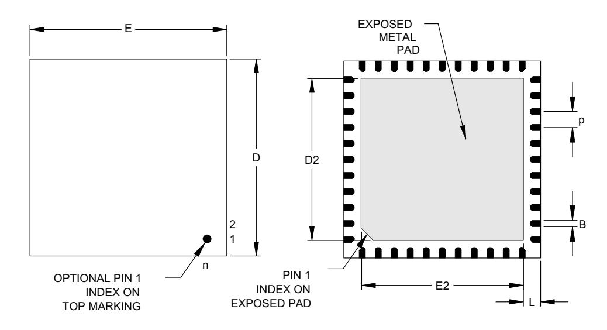


**BOTTOM VIEW** 

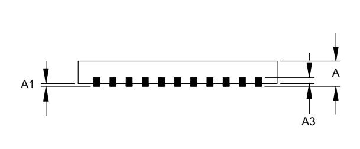


|                    | Units           | INCHES      |          |      | М    | ILLIMETERS* |      |
|--------------------|-----------------|-------------|----------|------|------|-------------|------|
| D                  | imension Limits | MIN NOM MAX |          |      | MIN  | NOM         | MAX  |
| Number of Pins     | n               |             | 44       |      |      | 44          |      |
| Pitch              | р               |             | .026 BSC |      |      | 0.65 BSC    |      |
| Overall Height     | A               | .031        | .035     | .039 | 0.80 | 0.90        | 1.00 |
| Standoff           | A1              | .000        | .001     | .002 | 0    | 0.02        | 0.05 |
| Base Thickness     | A3              |             | .010 REF |      |      | 0.25 REF    |      |
| Overall Width      | E               |             | .315 BSC |      |      | 8.00 BSC    |      |
| Exposed Pad Width  | E2              | .262        | .268     | .274 | 6.65 | 6.80        | 6.95 |
| Overall Length     | D               | .315 BSC    |          |      |      | 8.00 BSC    |      |
| Exposed Pad Length | D2              | .262        | .268     | .274 | 6.65 | 6.80        | 6.95 |
| Lead Width         | В               | .012        | .013     | .013 | 0.30 | 0.33        | 0.35 |
| Lead Length        | L               | .014        | .016     | .018 | 0.35 | 0.40        | 0.45 |

<sup>\*</sup>Controlling Parameter

Notes:

Dimensions D and E1 do not include mold flash or protrusions. Mold flash or protrusions shall not exceed .010" (0.254mm) per side.

JEDEC equivalent: M0-220

Drawing No. C04-103

## **28-Lead Skinny Plastic Dual In-line (SP) – 300 mil (PDIP)**

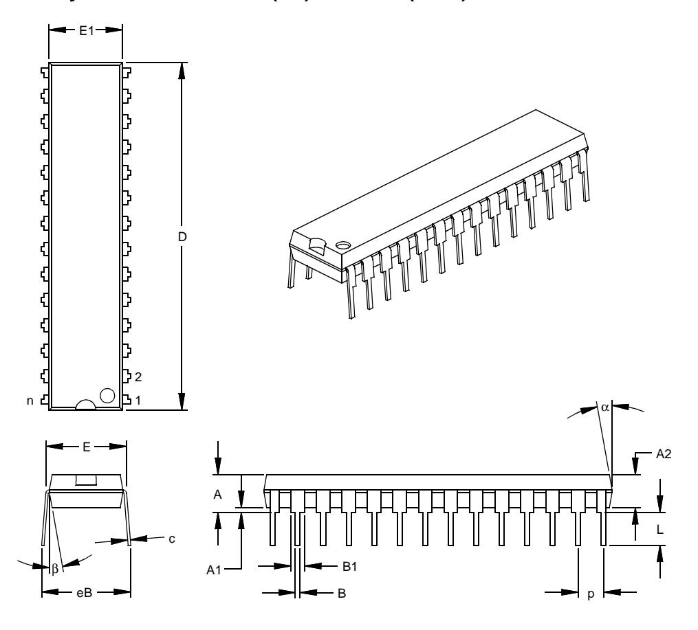

|                            | Units            |       | INCHES* |       |       | MILLIMETERS |       |
|----------------------------|------------------|-------|---------|-------|-------|-------------|-------|
|                            | Dimension Limits | MIN   | NOM     | MAX   | MIN   | NOM         | MAX   |
| Number of Pins             | n                |       | 28      |       |       | 28          |       |
| Pitch                      | p                |       | .100    |       |       | 2.54        |       |
| Top to Seating Plane       | A                | .140  | .150    | .160  | 3.56  | 3.81        | 4.06  |
| Molded Package Thickness   | A2               | .125  | .130    | .135  | 3.18  | 3.30        | 3.43  |
| Base to Seating Plane      | A1               | .015  |         |       | 0.38  |             |       |
| Shoulder to Shoulder Width | E                | .300  | .310    | .325  | 7.62  | 7.87        | 8.26  |
| Molded Package Width       | E1               | .275  | .285    | .295  | 6.99  | 7.24        | 7.49  |
| Overall Length             | D                | 1.345 | 1.365   | 1.385 | 34.16 | 34.67       | 35.18 |
| Tip to Seating Plane       | L                | .125  | .130    | .135  | 3.18  | 3.30        | 3.43  |
| Lead Thickness             | c                | .008  | .012    | .015  | 0.20  | 0.29        | 0.38  |
| Upper Lead Width           | B1               | .040  | .053    | .065  | 1.02  | 1.33        | 1.65  |
| Lower Lead Width           | B                | .016  | .019    | .022  | 0.41  | 0.48        | 0.56  |
| Overall Row Spacing        | eB<br>§          | .320  | .350    | .430  | 8.13  | 8.89        | 10.92 |
| Mold Draft Angle Top       | α                | 5     | 10      | 15    | 5     | 10          | 15    |
| Mold Draft Angle Bottom    | β                | 5     | 10      | 15    | 5     | 10          | 15    |

<sup>\*</sup> Controlling Parameter

Notes:

Dimension D and E1 do not include mold flash or protrusions. Mold flash or protrusions shall not exceed

JEDEC Equivalent: MO-095 .010" (0.254mm) per side.

Drawing No. C04-070

<sup>§</sup> Significant Characteristic

## **28-Lead Plastic Small Outline (SO) – Wide, 300 mil (SOIC)**


|                          | Units |      | INCHES* |      |       | MILLIMETERS |       |
|--------------------------|-------|------|---------|------|-------|-------------|-------|
| Dimension Limits         |       | MIN  | NOM     | MAX  | MIN   | NOM         | MAX   |
| Number of Pins           | n     |      | 28      |      |       | 28          |       |
| Pitch                    | p     |      | .050    |      |       | 1.27        |       |
| Overall Height           | A     | .093 | .099    | .104 | 2.36  | 2.50        | 2.64  |
| Molded Package Thickness | A2    | .088 | .091    | .094 | 2.24  | 2.31        | 2.39  |
| Standoff<br>§            | A1    | .004 | .008    | .012 | 0.10  | 0.20        | 0.30  |
| Overall Width            | E     | .394 | .407    | .420 | 10.01 | 10.34       | 10.67 |
| Molded Package Width     | E1    | .288 | .295    | .299 | 7.32  | 7.49        | 7.59  |
| Overall Length           | D     | .695 | .704    | .712 | 17.65 | 17.87       | 18.08 |
| Chamfer Distance         | h     | .010 | .020    | .029 | 0.25  | 0.50        | 0.74  |
| Foot Length              | L     | .016 | .033    | .050 | 0.41  | 0.84        | 1.27  |
| Foot Angle Top           | φ     | 0    | 4       | 8    | 0     | 4           | 8     |
| Lead Thickness           | c     | .009 | .011    | .013 | 0.23  | 0.28        | 0.33  |
| Lead Width               | B     | .014 | .017    | .020 | 0.36  | 0.42        | 0.51  |
| Mold Draft Angle Top     | α     | 0    | 12      | 15   | 0     | 12          | 15    |
| Mold Draft Angle Bottom  | β     | 0    | 12      | 15   | 0     | 12          | 15    |

<sup>\*</sup> Controlling Parameter

#### Notes:

Dimensions D and E1 do not include mold flash or protrusions. Mold flash or protrusions shall not exceed .010" (0.254mm) per side.

JEDEC Equivalent: MS-013 Drawing No. C04-052

<sup>§</sup> Significant Characteristic

## **28-Lead Plastic Shrink Small Outline (SS) – 209 mil, 5.30 mm (SSOP)**


|                          | Units |      | INCHES |      |       | MILLIMETERS* |        |
|--------------------------|-------|------|--------|------|-------|--------------|--------|
| Dimension Limits         |       | MIN  | NOM    | MAX  | MIN   | NOM          | MAX    |
| Number of Pins           | n     |      | 28     |      |       | 28           |        |
| Pitch                    | p     |      | .026   |      |       | 0.65         |        |
| Overall Height           | A     | .068 | .073   | .078 | 1.73  | 1.85         | 1.98   |
| Molded Package Thickness | A2    | .064 | .068   | .072 | 1.63  | 1.73         | 1.83   |
| Standoff<br>§            | A1    | .002 | .006   | .010 | 0.05  | 0.15         | 0.25   |
| Overall Width            | E     | .299 | .309   | .319 | 7.59  | 7.85         | 8.10   |
| Molded Package Width     | E1    | .201 | .207   | .212 | 5.11  | 5.25         | 5.38   |
| Overall Length           | D     | .396 | .402   | .407 | 10.06 | 10.20        | 10.34  |
| Foot Length              | L     | .022 | .030   | .037 | 0.56  | 0.75         | 0.94   |
| Lead Thickness           | c     | .004 | .007   | .010 | 0.10  | 0.18         | 0.25   |
| Foot Angle               | φ     | 0    | 4      | 8    | 0.00  | 101.60       | 203.20 |
| Lead Width               | B     | .010 | .013   | .015 | 0.25  | 0.32         | 0.38   |
| Mold Draft Angle Top     | α     | 0    | 5      | 10   | 0     | 5            | 10     |
| Mold Draft Angle Bottom  | β     | 0    | 5      | 10   | 0     | 5            | 10     |

<sup>\*</sup> Controlling Parameter

#### Notes:

Dimensions D and E1 do not include mold flash or protrusions. Mold flash or protrusions shall not exceed .010" (0.254mm) per side.

JEDEC Equivalent: MS-150 Drawing No. C04-073

<sup>§</sup> Significant Characteristic

## 28-Lead Plastic Quad Flat No Lead Package (ML) 6x6 mm Body, Punch Singulated (QFN)


|                          | Units  |      | INCHES   |      | М    | ILLIMETERS' | k    |
|--------------------------|--------|------|----------|------|------|-------------|------|
| Dimension                | Limits | MIN  | NOM      | MAX  | MIN  | NOM         | MAX  |
| Number of Pins           | n      | 28   |          |      |      | 28          |      |
| Pitch                    | р      |      | .026 BSC |      |      | 0.65 BSC    |      |
| Overall Height           | Α      |      | .033     | .039 |      | 0.85        | 1.00 |
| Molded Package Thickness | A2     |      | .026     | .031 |      | 0.65        | 0.80 |
| Standoff                 | A1     | .000 | .0004    | .002 | 0.00 | 0.01        | 0.05 |
| Base Thickness           | A3     |      | .008 REF |      |      | 0.20 REF    |      |
| Overall Width            | E      |      | .236 BSC |      |      | 6.00 BSC    |      |
| Molded Package Width     | E1     |      | .226 BSC |      |      | 5.75 BSC    |      |
| Exposed Pad Width        | E2     | .140 | .146     | .152 | 3.55 | 3.70        | 3.85 |
| Overall Length           | D      |      | .236 BSC |      |      | 6.00 BSC    |      |
| Molded Package Length    | D1     |      | .226 BSC |      |      | 5.75 BSC    |      |
| Exposed Pad Length       | D2     | .140 | .146     | .152 | 3.55 | 3.70        | 3.85 |
| Lead Width               | В      | .009 | .011     | .014 | 0.23 | 0.28        | 0.35 |
| Lead Length              | L      | .020 | .024     | .030 | 0.50 | 0.60        | 0.75 |
| Tie Bar Width            | R      | .005 | .007     | .010 | 0.13 | 0.17        | 0.23 |
| Tie Bar Length           | Q      | .012 | .016     | .026 | 0.30 | 0.40        | 0.65 |
| Chamfer                  | СН     | .009 | .017     | .024 | 0.24 | 0.42        | 0.60 |
| Mold Draft Angle Top     | α      |      |          | 12°  |      |             | 12°  |

<sup>\*</sup>Controlling Parameter

Notes:

Dimensions D and E1 do not include mold flash or protrusions. Mold flash or protrusions shall not exceed .010" (0.254mm) per side.

JEDEC equivalent: mMO-220

Drawing No. C04-114

## <span id="page-220-0"></span>**APPENDIX A: REVISION HISTORY**

### **Revision A (November 2001)**

Original data sheet for PIC16F87XA devices. The devices presented are enhanced versions of the PIC16F87X microcontrollers discussed in the "*PIC16F87X Data Sheet"* (DS30292).

## **Revision B (October 2003)**

This revision includes the DC and AC Characteristics Graphs and Tables. The Electrical Specifications in **[Section 17.0 "Electrical Characteristics"](#page-174-1)** have been updated and there have been minor corrections to the data sheet text.

## <span id="page-220-4"></span><span id="page-220-1"></span>**APPENDIX B: DEVICE**

<span id="page-220-3"></span>**DIFFERENCES**

The differences between the devices in this data sheet are listed in [Table B-1](#page-220-2).

<span id="page-220-2"></span>**TABLE B-1: DIFFERENCES BETWEEN DEVICES IN THE PIC16F87XA FAMILY**

|                                        | PIC16F873A                                              | PIC16F874A                                              | PIC16F876A                                              | PIC16F877A                                              |
|----------------------------------------|---------------------------------------------------------|---------------------------------------------------------|---------------------------------------------------------|---------------------------------------------------------|
| Flash Program Memory<br>(14-bit words) | 4K                                                      | 4K                                                      | 8K                                                      | 8K                                                      |
| Data Memory (bytes)                    | 192                                                     | 192                                                     | 368                                                     | 368                                                     |
| EEPROM Data Memory (bytes)             | 128                                                     | 128                                                     | 256                                                     | 256                                                     |
| Interrupts                             | 14                                                      | 15                                                      | 14                                                      | 15                                                      |
| I/O Ports                              | Ports A, B, C                                           | Ports A, B, C, D, E                                     | Ports A, B, C                                           | Ports A, B, C, D, E                                     |
| Serial Communications                  | MSSP, USART                                             | MSSP, USART                                             | MSSP, USART                                             | MSSP, USART                                             |
| Parallel Slave Port                    | No                                                      | Yes                                                     | No                                                      | Yes                                                     |
| 10-bit Analog-to-Digital Module        | 5 input channels                                        | 8 input channels                                        | 5 input channels                                        | 8 input channels                                        |
| Packages                               | 28-pin PDIP<br>28-pin SOIC<br>28-pin SSOP<br>28-pin QFN | 40-pin PDIP<br>44-pin PLCC<br>44-pin TQFP<br>44-pin QFN | 28-pin PDIP<br>28-pin SOIC<br>28-pin SSOP<br>28-pin QFN | 40-pin PDIP<br>44-pin PLCC<br>44-pin TQFP<br>44-pin QFN |

## <span id="page-221-2"></span><span id="page-221-0"></span>**APPENDIX C: CONVERSION CONSIDERATIONS**

Considerations for converting from previous versions of devices to the ones listed in this data sheet are listed in [Table C-1.](#page-221-1)

<span id="page-221-1"></span>**TABLE C-1: CONVERSION CONSIDERATIONS**

| Characteristic                     | PIC16C7X                             | PIC16F87X                                       | PIC16F87XA                                               |
|------------------------------------|--------------------------------------|-------------------------------------------------|----------------------------------------------------------|
| Pins                               | 28/40                                | 28/40                                           | 28/40                                                    |
| Timers                             | 3                                    | 3                                               | 3                                                        |
| Interrupts                         | 11 or 12                             | 13 or 14                                        | 14 or 15                                                 |
| Communication                      | PSP, USART, SSP<br>(SPI, I2C Slave)  | PSP, USART, SSP<br>(SPI, I2C Master/Slave)      | PSP, USART, SSP<br>(SPI, I2C Master/Slave)               |
| Frequency                          | 20 MHz                               | 20 MHz                                          | 20 MHz                                                   |
| Voltage                            | 2.5V-5.5V                            | 2.2V-5.5V                                       | 2.0V-5.5V                                                |
| A/D                                | 8-bit,<br>4 conversion clock selects | 10-bit,<br>4 conversion clock selects           | 10-bit,<br>7 conversion clock selects                    |
| CCP                                | 2                                    | 2                                               | 2                                                        |
| Comparator                         | —                                    | —                                               | 2                                                        |
| Comparator Voltage<br>Reference    | —                                    | —                                               | Yes                                                      |
| Program Memory                     | 4K, 8K EPROM                         | 4K, 8K Flash<br>(Erase/Write on<br>single-word) | 4K, 8K Flash<br>(Erase/Write on<br>four-word blocks)     |
| RAM                                | 192, 368 bytes                       | 192, 368 bytes                                  | 192, 368 bytes                                           |
| EEPROM Data                        | None                                 | 128, 256 bytes                                  | 128, 256 bytes                                           |
| Code Protection                    | On/Off                               | Segmented, starting at end<br>of program memory | On/Off                                                   |
| Program Memory<br>Write Protection | —                                    | On/Off                                          | Segmented, starting at<br>beginning of<br>program memory |
| Other                              |                                     | In-Circuit Debugger,<br>Low-Voltage Programming | In-Circuit Debugger,<br>Low-Voltage Programming          |

## <span id="page-222-0"></span>**INDEX**

| A                                              | Interrupt Logic 153                                 |  |
|------------------------------------------------|-----------------------------------------------------|--|
| A/D 127                                        | MSSP (I2C Mode)<br>80                               |  |
| Acquisition Requirements 130                   | MSSP (SPI Mode) 71                                  |  |
| ADCON0 Register 127                            | On-Chip Reset Circuit 147                           |  |
| ADCON1 Register 127                            | PIC16F873A/PIC16F876A Architecture 6                |  |
| ADIF Bit 129                                   | PIC16F874A/PIC16F877A Architecture 7                |  |
| ADRESH Register 127                            | PORTC                                               |  |
| ADRESL Register 127                            | Peripheral Output Override                          |  |
|                                                | (RC2:0, RC7:5) Pins 46                              |  |
| Analog Port Pins 49, 51                        | Peripheral Output Override (RC4:3) Pins 46          |  |
| Associated Registers and Bits 133              | PORTD (in I/O Port Mode) 48                         |  |
| Calculating Acquisition Time 130               | PORTD and PORTE (Parallel Slave Port) 51            |  |
| Configuring Analog Port Pins 131               | PORTE (In I/O Port Mode) 49                         |  |
| Configuring the Interrupt 129                  | RA3:RA0 Pins 41                                     |  |
| Configuring the Module 129                     | RA4/T0CKI Pin 42                                    |  |
| Conversion Clock 131                           | RA5 Pin 42                                          |  |
| Conversions 132                                | RB3:RB0 Pins 44                                     |  |
| Converter Characteristics 194                  | RB7:RB4 Pins 44                                     |  |
| Effects of a Reset 133                         | RC Oscillator Mode 146                              |  |
| GO/DONE Bit 129                                | Recommended MCLR Circuit 148                        |  |
| Internal Sampling Switch (Rss) Impedance 130   | Simplified PWM Mode 67                              |  |
| Operation During Sleep 133                     | Timer0/WDT Prescaler 53                             |  |
| Result Registers 132                           | Timer1 58                                           |  |
| Source Impedance 130                           | Timer2 61                                           |  |
| A/D Conversion Requirements 195                | USART Receive117, 119                               |  |
| Absolute Maximum Ratings 173                   | USART Transmit 115                                  |  |
| ACKSTAT 101                                    | Watchdog Timer 155                                  |  |
| ADCON0 Register 19                             | BOR. See Brown-out Reset.                           |  |
| ADCON1 Register 20                             | BRG. See Baud Rate Generator.                       |  |
| Addressable Universal Synchronous Asynchronous | BRGH Bit 113                                        |  |
| Receiver Transmitter. See USART.               | Brown-out Reset (BOR) 143, 147, 148, 149, 150       |  |
| ADRESH Register 19                             | BOR Status (BOR Bit) 29                             |  |
| ADRESL Register 20                             | Bus Collision During a Repeated Start Condition 108 |  |
| Analog-to-Digital Converter. See A/D.          | Bus Collision During a Start Condition 106          |  |
| Application Notes                              | Bus Collision During a Stop Condition 109           |  |
| AN552 (Implementing Wake-up                    | Bus Collision Interrupt Flag bit, BCLIF 28          |  |
| on Key Stroke) 44                              |                                                     |  |
| AN556 (Implementing a Table Read) 30           | C                                                   |  |
| Assembler                                      | C Compilers                                         |  |
| MPASM Assembler 167                            | MPLAB C17 168                                       |  |
| Asynchronous Reception                         | MPLAB C18 168                                       |  |
| Associated Registers 118, 120                  | MPLAB C30 168                                       |  |
| Asynchronous Transmission                      | Capture/Compare/PWM (CCP) 63                        |  |
| Associated Registers 116                       | Associated Registers                                |  |
| B                                              | Capture, Compare and Timer1 68                      |  |
|                                                | PWM and Timer2 69                                   |  |
| Banking, Data Memory 16, 22                    | Capture Mode 65                                     |  |
| Baud Rate Generator 97                         | CCP1IF 65                                           |  |
| Associated Registers 113                       | Prescaler 65                                        |  |
| BCLIF 28                                       | CCP Timer Resources 63                              |  |
| BF 101                                         | Compare                                             |  |
| Block Diagrams                                 | Special Event Trigger Output of CCP1 66             |  |
| A/D 129                                        | Special Event Trigger Output of CCP2 66             |  |
| Analog Input Model 130, 139                    | Compare Mode 66                                     |  |
| Baud Rate Generator 97                         | Software Interrupt Mode 66                          |  |
| Capture Mode Operation 65                      | Special Event Trigger 66                            |  |
| Comparator I/O Operating Modes 136             | Interaction of Two CCP Modules (table) 63           |  |
| Comparator Output 138                          | PWM Mode 67                                         |  |
| Comparator Voltage Reference 142               |                                                     |  |
| Compare Mode Operation 66                      | Duty Cycle 67                                       |  |
| Crystal/Ceramic Resonator Operation            | Example Frequencies/Resolutions (table) 68          |  |
| (HS, XT or LP Osc Configuration) 145           | PWM Period 67                                       |  |
| External Clock Input Operation                 | Special Event Trigger and A/D Conversions 66        |  |
| (HS, XT or LP Osc Configuration) 145           |                                                     |  |

| Capture/Compare/PWM Requirements             | Data EEPROM Memory                      |
|----------------------------------------------|-----------------------------------------|
| (CCP1 and CCP2)186                           | Associated Registers                    |
| CCP. See Capture/Compare/PWM.                | EEADR Register                          |
| CCP1CON Register19                           | EEADRH Register                         |
| CCP2CON Register19                           |                                         |
| CCPR1H Register 19, 63                       | <u> </u>                                |
| CCPR1L Register19, 63                        |                                         |
| CCPR2H Register19, 63                        | ·                                       |
| CCPR2L Register                              |                                         |
| CCPxM0 Bit                                   |                                         |
| CCPxM1 Bit 64                                | ,                                       |
| CCPxM2 Bit                                   |                                         |
| CCPxM3 Bit64                                 | · · · · · · · · · · · · · · · · · · ·   |
|                                              | ,                                       |
| CCPxX Bit                                    | 1 0                                     |
| CCPxY Bit                                    | •                                       |
| CLKO and I/O Timing Requirements             |                                         |
| CMCON Register                               | •                                       |
| Code Examples                                | DC Characteristics175–179               |
| Call of a Subroutine in Page 1 from Page 030 |                                         |
| Indirect Addressing31                        | PICDEM 1 170                            |
| Initializing PORTA41                         | PICDEM 17 170                           |
| Loading the SSPBUF (SSPSR) Register74        | PICDEM 18R PIC18C601/801 171            |
| Reading Data EEPROM35                        | 5 PICDEM 2 Plus 170                     |
| Reading Flash Program Memory36               | PICDEM 3 PIC16C92X                      |
| Saving Status, W and PCLATH Registers        | PICDEM 4170                             |
| in RAM154                                    |                                         |
| Writing to Data EEPROM35                     |                                         |
| Writing to Flash Program Memory              |                                         |
| Code Protection143, 157                      |                                         |
| Comparator Module                            | • • • • • • • • • • • • • • • • • • • • |
| Analog Input Connection                      | Device Overview                         |
| <b>5</b> ·                                   |                                         |
| Considerations                               | <u> </u>                                |
| Associated Registers                         | <b>F</b>                                |
| Configuration                                |                                         |
| Effects of a Reset                           | ==+==+                                  |
| Interrupts138                                |                                         |
| Operation137                                 |                                         |
| Operation During Sleep139                    |                                         |
| Outputs137                                   |                                         |
| Reference137                                 |                                         |
| Response Time137                             | Electrical Characteristics              |
| Comparator Specifications180                 | ) Errata <sup>2</sup>                   |
| Comparator Voltage Reference141              |                                         |
| Associated Registers142                      |                                         |
| Computed GOTO30                              |                                         |
| Configuration Bits143                        |                                         |
| Configuration Word144                        |                                         |
| Conversion Considerations                    |                                         |
| CVRCON Register                              | · · · · · · · · · · · · · · · · · ·     |
| CVNCON Negister20                            | Flash Program Memory                    |
| D                                            | Associated Registers39                  |
|                                              | EECON1 Register                         |
| Data EEPROM and Flash Program Memory         |                                         |
| EEADR Register                               |                                         |
| EEADRH Register                              |                                         |
| EECON1 Register                              |                                         |
| EECON2 Register                              |                                         |
| EEDATA Register33                            | \ <b>7</b>                              |
| EEDATH Register33                            | -                                       |
|                                              | General Call Address Support94          |

| I                                                 |     | RRF                                             |           |
|---------------------------------------------------|-----|-------------------------------------------------|-----------|
| I/O Ports                                         | 41  | SLEEP                                           | 164       |
| I2C Bus Data Requirements                         |     | SUBLW                                           | 164       |
| I <sup>2</sup> C Bus Start/Stop Bits Requirements |     | SUBWF                                           | 164       |
| I <sup>2</sup> C Mode                             |     | SWAPF                                           | 165       |
| Registers                                         | 80  | XORLW                                           | 165       |
| I <sup>2</sup> C Mode                             |     | XORWF                                           | 165       |
| ACK Pulse                                         |     | Summary Table                                   | 160       |
|                                                   |     | INT Interrupt (RB0/INT). See Interrupt Sources. |           |
| Acknowledge Sequence Timing                       |     | INTCON Register                                 | 24        |
| Baud Rate Generator                               | 97  | GIE Bit                                         |           |
| Bus Collision                                     |     | INTE Bit                                        |           |
| Repeated Start Condition                          |     | INTF Bit                                        |           |
| Start Condition                                   |     | PEIE Bit                                        |           |
| Stop Condition                                    | 109 | RBIE Bit                                        |           |
| Clock Arbitration                                 | 98  | RBIF Bit                                        |           |
| Effect of a Reset                                 | 105 | TMR0IE Bit                                      |           |
| General Call Address Support                      | 94  |                                                 |           |
| Master Mode                                       | 95  | TMR0IF Bit                                      | 24        |
| Operation                                         | 96  | Inter-Integrated Circuit. See I <sup>2</sup> C. | 407       |
| Repeated Start Timing                             | 100 | Internal Reference Signal                       |           |
| Master Mode Reception                             | 101 | Internal Sampling Switch (Rss) Impedance        |           |
| Master Mode Start Condition                       |     | Interrupt Sources                               |           |
| Master Mode Transmission                          | 101 | Interrupt-on-Change (RB7:RB4)                   |           |
| Multi-Master Communication, Bus Collision         |     | RB0/INT Pin, External                           |           |
| and Arbitration                                   | 105 | TMR0 Overflow                                   |           |
| Multi-Master Mode                                 |     | USART Receive/Transmit Complete                 | 111       |
| Read/Write Bit Information (R/W Bit)              |     | Interrupts                                      |           |
| Serial Clock (RC3/SCK/SCL)                        |     | Bus Collision Interrupt                         | 28        |
| Slave Mode                                        |     | Synchronous Serial Port Interrupt               | 26        |
| Addressing                                        |     | Interrupts, Context Saving During               | 154       |
| <u> </u>                                          |     | Interrupts, Enable Bits                         |           |
| Reception                                         |     | Global Interrupt Enable (GIE Bit)               | 24, 153   |
| Transmission                                      |     | Interrupt-on-Change (RB7:RB4)                   |           |
| Sleep Operation                                   |     | Enable (RBIE Bit)                               | 24, 154   |
| Stop Condition Timing                             |     | Peripheral Interrupt Enable (PEIE Bit)          |           |
| ID Locations                                      |     | RB0/INT Enable (INTE Bit)                       |           |
| In-Circuit Debugger                               |     | TMR0 Overflow Enable (TMR0IE Bit)               |           |
| Resources                                         |     | Interrupts, Flag Bits                           |           |
| In-Circuit Serial Programming (ICSP)              |     | Interrupt-on-Change (RB7:RB4) Flag              |           |
| INDF Register                                     |     | (RBIF Bit)                                      | 24 44 154 |
| Indirect Addressing                               |     | RB0/INT Flag (INTF Bit)                         |           |
| FSR Register                                      |     | TMR0 Overflow Flag (TMR0IF Bit)                 |           |
| Instruction Format                                | 159 | TWING Overnow Flag (TWINOIT Bit)                | 24, 134   |
| Instruction Set                                   | 159 | L                                               |           |
| ADDLW                                             | 161 | Loading of PC                                   | 30        |
| ADDWF                                             | 161 | Low-Voltage ICSP Programming                    |           |
| ANDLW                                             | 161 |                                                 |           |
| ANDWF                                             | 161 | Low-Voltage In-Circuit Serial Programming       | 143       |
| BCF                                               | 161 | M                                               |           |
| BSF                                               | 161 | Moster Clear (MCLD)                             |           |
| BTFSC                                             | 161 | Master Clear (MCLR)                             |           |
| BTFSS                                             |     | MCLR Reset, Normal Operation14                  |           |
| CALL                                              |     | MCLR Reset, Sleep14                             |           |
| CLRF                                              | _   | Master Synchronous Serial Port (MSSP). See MS   |           |
| CLRW                                              | _   | MCLR                                            |           |
| CLRWDT                                            | _   | MCLR/VPP                                        |           |
| COMF                                              |     | Memory Organization                             |           |
|                                                   |     | Data EEPROM Memory                              | 33        |
| DECF                                              |     | Data Memory                                     | 16        |
| DECFSZ                                            |     | Flash Program Memory                            | 33        |
| GOTO                                              |     | Program Memory                                  |           |
| INCF                                              |     | MPLAB ASM30 Assembler, Linker, Librarian        |           |
| INCFSZ                                            |     | MPLAB ICD 2 In-Circuit Debugger                 |           |
| IORLW                                             |     | MPLAB ICE 2000 High-Performance Universal       |           |
| IORWF                                             |     | In-Circuit Emulator                             | 169       |
| RETURN                                            | _   |                                                 |           |
| RIF                                               | 164 |                                                 |           |

| MPLAB ICE 4000 High-Performance Universal      | PICSTART Plus Development Programmer | 169      |
|------------------------------------------------|--------------------------------------|----------|
| In-Circuit Emulator169                         | PIE1 Register                        |          |
| MPLAB Integrated Development                   | PIE2 Register                        | 20, 27   |
| Environment Software167                        | Pinout Descriptions                  |          |
| MPLINK Object Linker/MPLIB Object Librarian168 | PIC16F873A/PIC16F876A                |          |
| MSSP71                                         | PIR1 Register                        |          |
| I <sup>2</sup> C Mode. See I <sup>2</sup> C.   | PIR2 Register                        | 19, 28   |
| SPI Mode71                                     | POP                                  | 30       |
| SPI Mode. See SPI.                             | POR. See Power-on Reset.             |          |
| MSSP Module                                    | PORTA                                |          |
| Clock Stretching90                             | Associated Registers                 |          |
| Clock Synchronization and the CKP Bit91        | Functions                            |          |
| Control Registers (General)71                  | PORTA Register                       |          |
| Operation84                                    | TRISA Register                       |          |
| Overview71                                     | PORTB                                |          |
| SPI Master Mode76                              | Associated Registers                 |          |
| SPI Slave Mode77                               | Functions                            |          |
| SSPBUF76                                       | PORTB Register                       |          |
| SSPSR76                                        | Pull-up Enable (RBPU Bit)            |          |
| Multi-Master Mode105                           | RB0/INT Edge Select (INTEDG Bit)     |          |
| 0                                              | RB0/INT Pin, External                |          |
|                                                | RB7:RB4 Interrupt-on-Change          | 154      |
| Opcode Field Descriptions                      | RB7:RB4 Interrupt-on-Change Enable   | 04.454   |
| OPTION_REG Register                            | (RBIE Bit)                           | 24, 154  |
| INTEDG Bit                                     | RB7:RB4 Interrupt-on-Change Flag     | 04 44 45 |
| PS2:PS0 Bits                                   | (RBIF Bit)                           |          |
| PSA Bit                                        | TRISB Register                       |          |
| RBPU Bit23 T0CS Bit23                          | PORTB Register                       |          |
| TOSE Bit                                       | PORTC                                | ,        |
| OSC1/CLKI Pin                                  | Associated Registers                 |          |
| OSC2/CLKO Pin                                  | Functions                            |          |
| Oscillator Configuration                       | PORTC Register                       |          |
| HS145, 149                                     | RC3/SCK/SCL Pin                      |          |
| LP145, 149                                     | RC6/TX/CK Pin                        |          |
| RC145, 149                                     | RC7/RX/DT Pin                        |          |
| XT145, 149                                     | TRISC Register PORTD                 |          |
| Oscillator Selection                           | Associated Registers                 |          |
| Oscillator Start-up Timer (OST)                | Functions                            |          |
| Oscillator, WDT                                | Parallel Slave Port (PSP) Function   |          |
| Oscillators                                    | PORTD Register                       |          |
| Capacitor Selection146                         | TRISD Register                       |          |
| Ceramic Resonator Selection145                 | PORTE                                |          |
| Crystal and Ceramic Resonators145              | Analog Port Pins                     |          |
| RC146                                          | Associated Registers                 | ,        |
|                                                | Functions                            |          |
| P                                              | Input Buffer Full Status (IBF Bit)   |          |
| Package Information                            | Input Buffer Overflow (IBOV Bit)     |          |
| Marking209                                     | Output Buffer Full Status (OBF Bit)  |          |
| Packaging Information209                       | PORTE Register                       |          |
| Paging, Program Memory30                       | PSP Mode Select (PSPMODE Bit)        |          |
| Parallel Slave Port (PSP)                      | RE0/RD/AN5 Pin                       |          |
| Associated Registers52                         | RE1/WR/AN6 Pin                       | 49, 51   |
| RE0/ <u>RD/</u> AN5 Pin49, 51                  | RE2/CS/AN7 Pin                       | 49, 51   |
| RE1/ <u>WR</u> /AN6 Pin49, 51                  | TRISE Register                       | 49       |
| RE2/CS/AN7 Pin                                 | Postscaler, WDT                      |          |
| Select (PSPMODE Bit)48, 49, 50, 51             | Assignment (PSA Bit)                 | 23       |
| Parallel Slave Port Requirements               | Rate Select (PS2:PS0 Bits)           | 23       |
| (PIC16F874A/ 877A Only)187                     | Power-down Mode. See Sleep.          |          |
| PCL Register 19, 20, 30                        | Power-on Reset (POR)143, 147,        |          |
| PCLATH Register                                | POR Status (POR Bit)                 |          |
| PCON Register                                  | Power Control (PCON) Register        |          |
| BOR Bit                                        | Power-down (PD Bit)                  |          |
| POR Bit                                        | Power-up Timer (PWRT)                |          |
| PIC16F87XA Product Identification System231    | Time-out (TO Bit)                    | 22, 147  |
| PICkit 1 Flash Starter Kit171                  |                                      |          |

| Power-up Timer (PWRT)                            | RE0/RD/AN5 Pin                                    |
|--------------------------------------------------|---------------------------------------------------|
| Prescaler, Timer0                                | RE2/CS/AN7 Pin                                    |
| Assignment (PSA Bit)23                           | Read-Modify-Write Operations                      |
| Rate Select (PS2:PS0 Bits)                       | Register File                                     |
| PRO MATE II Universal Device Programmer          | Register File Map (PIC16F873A/874A)               |
| Program Counter                                  | Register File Map (PIC16F876A/877A)               |
| Reset Conditions                                 | Registers                                         |
| Program Memory                                   | ADCON0 (A/D Control 0)                            |
| Interrupt Vector                                 | ADCON1 (A/D Control 1)                            |
| Paging30                                         | CCP1CON/CCP2CON (CCP Control 1                    |
| Program Memory Map and Stack                     | and CCP Control 2)64                              |
| (PIC16F873A/874A)15                              | CMCON (Comparator Control)                        |
| Program Memory Map and Stack                     | CVRCON (Comparator Voltage                        |
| (PIC16F876A/877A)15                              | Reference Control)141                             |
| Reset Vector                                     | EECON1 (EEPROM Control 1)                         |
| Program Verification                             | FSR                                               |
| Programming Pin (VPP)8                           | INTCON                                            |
| Programming, Device Instructions                 | OPTION_REG23, 54                                  |
| PSP. See Parallel Slave Port.                    | PCON (Power Control)                              |
| Pulse Width Modulation. See Capture/Compare/PWM, | PIE1 (Peripheral Interrupt Enable 1)              |
| PWM Mode.                                        | PIE2 (Peripheral Interrupt Enable 2)              |
| PUSH30                                           | PIR1 (Peripheral Interrupt Request 1)             |
| 1 0011                                           | PIR2 (Peripheral Interrupt Request 2)             |
| R                                                | RCSTA (Receive Status and Control)112             |
| RA0/AN0 Pin                                      | Special Function, Summary                         |
| RA1/AN1 Pin                                      | SSPCON (MSSP Control 1, I <sup>2</sup> C Mode)    |
| RA2/AN2/VREF-/CVREF Pin                          | SSPCON (MSSP Control 1, FPI Mode)                 |
| RA3/AN3/VREF+ Pin                                | SSPCON2 (MSSP Control 2, I <sup>2</sup> C Mode)   |
| RA4/T0CKI/C1OUT Pin                              | SSPSTAT (MSSP Status, I <sup>2</sup> C Mode)      |
| RA5/AN4/SS/C2OUT Pin                             | SSPSTAT (MSSP Status, SPI Mode)                   |
| RAM. See Data Memory.                            | Status                                            |
| RB0/INT Pin9, 11                                 | T1CON (Timer1 Control)                            |
| RB1 Pin                                          | T2CON (Timer2 Control)                            |
| RB2 Pin                                          | TRISE Register                                    |
| RB3/PGM Pin                                      | TXSTA (Transmit Status and Control)111            |
| RB4 Pin                                          | Reset143, 147                                     |
| RB5 Pin                                          | Brown-out Reset (BOR). See Brown-out Reset (BOR). |
| RB6/PGC Pin                                      | MCLR Reset. See MCLR.                             |
| RB7/PGD Pin                                      | Power-on Reset (POR). See Power-on Reset (POR).   |
| RC0/T1OSO/T1CKI Pin                              | Reset Conditions for PCON Register                |
| RC1/T1OSI/CCP2 Pin                               | Reset Conditions for Program Counter              |
| RC2/CCP1 Pin                                     | Reset Conditions for Status Register              |
| RC3/SCK/SCL Pin                                  | WDT Reset. See Watchdog Timer (WDT).              |
| RC4/SDI/SDA Pin                                  | Reset, Watchdog Timer, Oscillator Start-up Timer, |
| RC5/SDO Pin                                      | Power-up Timer and Brown-out Reset                |
| RC6/TX/CK Pin                                    | Requirements                                      |
| RC7/RX/DT Pin                                    | Revision History                                  |
| RCREG Register                                   | •                                                 |
| RCSTA Register                                   | S                                                 |
| ADDEN Bit112                                     | SCI. See USART.                                   |
| CREN Bit                                         | SCK                                               |
| FERR Bit                                         | SDI                                               |
| OERR Bit                                         | SDO                                               |
| RX9 Bit                                          | Serial Clock, SCK                                 |
| RX9D Bit112                                      | Serial Communication Interface. See USART.        |
| SPEN Bit                                         | Serial Data In, SDI                               |
| SREN Bit                                         | Serial Data Out, SDO71                            |
| RD0/PSP0 Pin                                     | Serial Peripheral Interface. See SPI.             |
| RD1/PSP1 Pin                                     | Slave Select Synchronization                      |
| RD2/PSP2 Pin                                     | Slave Select Sylicinonization 77 Slave Select, SS |
| RD3/PSP3 Pin                                     | Sleep                                             |
| RD4/PSP4 Pin                                     | Software Simulator (MPLAB SIM)                    |
| RD5/PSP5 Pin                                     | Software Simulator (MPLAB SIM)                    |
| RD6/PSP6 Pin                                     | SPBRG Register                                    |
| RD7/PSP7 Pin                                     | Special Features of the CPU                       |
| 10                                               | Special 1 catalog of the of 0                     |

| Special Function Registers        | 19      | Timer0                                        | 53  |
|-----------------------------------|---------|-----------------------------------------------|-----|
| Special Function Registers (SFRs) | 19      | Associated Registers                          | 55  |
| Speed, Operating                  | 1       | Clock Source Edge Select (T0SE Bit)           | 23  |
| SPI Mode                          | 71, 77  | Clock Source Select (T0CS Bit)                |     |
| Associated Registers              | 79      | External Clock                                | 54  |
| Bus Mode Compatibility            | 79      | Interrupt                                     | 53  |
| Effects of a Reset                | 79      | Overflow Enable (TMR0IE Bit)                  | 24  |
| Enabling SPI I/O                  |         | Overflow Flag (TMR0IF Bit)                    |     |
| Master Mode                       |         | Overflow Interrupt                            |     |
| Master/Slave Connection           |         | Prescaler                                     |     |
| Serial Clock                      |         | TOCKI                                         |     |
| Serial Data In                    |         | Timer0 and Timer1 External Clock Requirements |     |
| Serial Data Out                   |         | Timer1                                        |     |
|                                   |         |                                               |     |
| Slave Select                      |         | Associated Registers                          |     |
| Slave Select Synchronization      |         | Asynchronous Counter Mode                     |     |
| Sleep Operation                   |         | Reading and Writing to                        |     |
| SPI Clock                         |         | Counter Operation                             |     |
| Typical Connection                |         | Operation in Timer Mode                       |     |
| SPI Mode Requirements             |         | Oscillator                                    |     |
| SS                                | 71      | Capacitor Selection                           |     |
| SSP                               |         | Prescaler                                     |     |
| SPI Master/Slave Connection       | 75      | Resetting of Timer1 Registers                 | 60  |
| SSPADD Register                   | 20      | Resetting Timer1 Using a CCP Trigger Output.  | 59  |
| SSPBUF Register                   | 19      | Synchronized Counter Mode                     | 58  |
| SSPCON Register                   | 19      | TMR1H                                         | 59  |
| SSPCON2 Register                  | 20      | TMR1L                                         | 59  |
| SSPIF                             |         | Timer2                                        | 61  |
| SSPOV                             |         | Associated Registers                          |     |
| SSPSTAT Register                  |         | Output                                        |     |
| R/W Bit                           |         | Postscaler                                    |     |
| Stack                             |         | Prescaler                                     |     |
| Overflows                         |         | Prescaler and Postscaler                      |     |
| Underflow                         |         |                                               | 02  |
|                                   |         | Timing Diagrams                               | 105 |
| Status Register                   | 00      | A/D Conversion                                |     |
| C Bit                             |         | Acknowledge Sequence                          |     |
| DC Bit                            |         | Asynchronous Master Transmission              | 116 |
| IRP Bit                           |         | Asynchronous Master Transmission              |     |
| PD Bit                            |         | (Back to Back)                                | 116 |
| RP1:RP0 Bits                      |         | Asynchronous Reception                        | 118 |
| TO Bit                            | 22, 147 | Asynchronous Reception with                   |     |
| Z Bit                             | 22      | Address Byte First                            | 120 |
| Synchronous Master Reception      |         | Asynchronous Reception with                   |     |
| Associated Registers              | 123     | Address Detect                                | 120 |
| Synchronous Master Transmission   |         | Baud Rate Generator with Clock Arbitration    | 98  |
| Associated Registers              | 122     | BRG Reset Due to SDA Arbitration During       |     |
| Synchronous Serial Port Interrupt |         | Start Condition                               | 107 |
| Synchronous Slave Reception       |         | Brown-out Reset                               | 184 |
| Associated Registers              | 125     | Bus Collision During a Repeated               | _   |
| Synchronous Slave Transmission    |         | Start Condition (Case 1)                      | 108 |
| Associated Registers              | 125     | Bus Collision During Repeated                 |     |
|                                   |         | Start Condition (Case 2)                      | 108 |
| T                                 |         | Bus Collision During Start Condition          | 100 |
| T1CKPS0 Bit                       | 57      |                                               | 107 |
|                                   |         | (SCL = 0)                                     | 107 |
| T1CKPS1 Bit                       |         | Bus Collision During Start Condition          | 400 |
| T1CON Register                    |         | (SDA Only)                                    | 106 |
| T10SCEN Bit                       |         | Bus Collision During Stop Condition           |     |
| T1SYNC Bit                        |         | (Case 1)                                      | 109 |
| T2CKPS0 Bit                       |         | Bus Collision During Stop Condition           |     |
| T2CKPS1 Bit                       |         | (Case 2)                                      | 109 |
| T2CON Register                    | 19      | Bus Collision for Transmit and Acknowledge    |     |
| TAD                               | 131     | Capture/Compare/PWM (CCP1 and CCP2)           |     |
| Time-out Sequence                 | 148     | CLKO and I/O                                  |     |
|                                   |         | Clock Synchronization                         |     |
|                                   |         | External Clock                                |     |
|                                   |         | First Start Bit                               |     |

| 2C Bus Data<br>I<br>191                                 | TRISB Register 20                             |  |
|---------------------------------------------------------|-----------------------------------------------|--|
| 2C Bus Start/Stop Bits<br>I<br>190                      | TRISC Register 20                             |  |
| 2C Master Mode (Reception, 7-bit Address)<br>I<br>103   | TRISD Register 20                             |  |
| 2C Master Mode (Transmission,<br>I                      | TRISE Register 20                             |  |
| 7 or 10-bit Address) 102                                | IBF Bit 50                                    |  |
| 2C Slave Mode (Transmission, 10-bit Address)<br>I<br>89 | IBOV Bit 50                                   |  |
| 2C Slave Mode (Transmission, 7-bit Address)             |                                               |  |
| I<br>87<br>2C Slave Mode with SEN = 1 (Reception,       | OBF Bit 50                                    |  |
| I                                                       | PSPMODE Bit 48, 49, 50, 51                    |  |
| 10-bit Address) 93                                      | TXREG Register 19                             |  |
| 2C Slave Mode with SEN = 0 (Reception,<br>I             | TXSTA Register 20                             |  |
| 10-bit Address) 88                                      | BRGH Bit 111                                  |  |
| 2C Slave Mode with SEN = 0 (Reception,<br>I             | CSRC Bit 111                                  |  |
| 7-bit Address) 86                                       | SYNC Bit 111                                  |  |
| 2C Slave Mode with SEN = 1 (Reception,<br>I             | TRMT Bit 111                                  |  |
| 7-bit Address) 92                                       | TX9 Bit 111                                   |  |
| Parallel Slave Port (PIC16F874A/877A Only) 187          | TX9D Bit 111                                  |  |
| Parallel Slave Port (PSP) Read 52                       | TXEN Bit 111                                  |  |
| Parallel Slave Port (PSP) Write 52                      |                                               |  |
| Repeat Start Condition 100                              | U                                             |  |
| Reset, Watchdog Timer, Start-up Timer                   | USART 111                                     |  |
| and Power-up Timer 184                                  | Address Detect Enable (ADDEN Bit) 112         |  |
| Slave Mode General Call Address Sequence                | Asynchronous Mode 115                         |  |
|                                                         | Asynchronous Receive (9-bit Mode) 119         |  |
| (7 or 10-bit Address Mode) 94                           | Asynchronous Receive with Address Detect.     |  |
| Slave Synchronization 77                                |                                               |  |
| Slow Rise Time (MCLR Tied to VDD via                    | See Asynchronous Receive (9-bit Mode).        |  |
| RC Network) 152                                         | Asynchronous Receiver 117                     |  |
| SPI Master Mode (CKE = 0, SMP = 0) 188                  | Asynchronous Reception 118                    |  |
| SPI Master Mode (CKE = 1, SMP = 1) 188                  | Asynchronous Transmitter 115                  |  |
| SPI Mode (Master Mode) 76                               | Baud Rate Generator (BRG) 113                 |  |
| SPI Mode (Slave Mode with CKE = 0) 78                   | Baud Rate Formula 113                         |  |
| SPI Mode (Slave Mode with CKE = 1) 78                   | Baud Rates, Asynchronous Mode                 |  |
| SPI Slave Mode (CKE = 0) 189                            | (BRGH = 0) 114                                |  |
| SPI Slave Mode (CKE = 1) 189                            | Baud Rates, Asynchronous Mode                 |  |
| Stop Condition Receive or Transmit Mode 104             | (BRGH = 1) 114                                |  |
| Synchronous Reception                                   | High Baud Rate Select (BRGH Bit) 111          |  |
| (Master Mode, SREN) 124                                 | Sampling 113                                  |  |
| Synchronous Transmission 122                            | Clock Source Select (CSRC Bit) 111            |  |
| Synchronous Transmission (Through TXEN) 122             | Continuous Receive Enable (CREN Bit) 112      |  |
| Time-out Sequence on Power-up                           | Framing Error (FERR Bit) 112                  |  |
|                                                         | Mode Select (SYNC Bit) 111                    |  |
| (MCLR Not Tied to VDD)                                  | Overrun Error (OERR Bit) 112                  |  |
| Case 1 152                                              |                                               |  |
| Case 2 152                                              | Receive Data, 9th Bit (RX9D Bit) 112          |  |
| Time-out Sequence on Power-up (MCLR Tied                | Receive Enable, 9-bit (RX9 Bit) 112           |  |
| to VDD via RC Network) 151                              | Serial Port Enable (SPEN Bit)111, 112         |  |
| Timer0 and Timer1 External Clock 185                    | Single Receive Enable (SREN Bit) 112          |  |
| USART Synchronous Receive                               | Synchronous Master Mode 121                   |  |
| (Master/Slave) 193                                      | Synchronous Master Reception 123              |  |
| USART Synchronous Transmission                          | Synchronous Master Transmission 121           |  |
| (Master/Slave) 193                                      | Synchronous Slave Mode 124                    |  |
| Wake-up from Sleep via Interrupt 157                    | Synchronous Slave Reception 125               |  |
| Timing Parameter Symbology 181                          | Synchronous Slave Transmit 124                |  |
| TMR0 Register 19                                        | Transmit Data, 9th Bit (TX9D) 111             |  |
| TMR1CS Bit 57                                           | Transmit Enable (TXEN Bit) 111                |  |
| TMR1H Register 19                                       | Transmit Enable, 9-bit (TX9 Bit) 111          |  |
|                                                         | Transmit Shift Register Status (TRMT Bit) 111 |  |
| TMR1L Register 19                                       |                                               |  |
| TMR1ON Bit 57                                           | USART Synchronous Receive Requirements 193    |  |
| TMR2 Register 19                                        | V                                             |  |
| TMR2ON Bit 61                                           |                                               |  |
| TMRO Register 21                                        | VDD Pin9, 13                                  |  |
| TOUTPS0 Bit 61                                          | Voltage Reference Specifications 180          |  |
| TOUTPS1 Bit 61                                          | VSS Pin9, 13                                  |  |
| TOUTPS2 Bit 61                                          |                                               |  |
| TOUTPS3 Bit 61                                          |                                               |  |

TRISA Register [.................................................................. 20](#page-21-16)

### **W**

| Wake-up from Sleep 143, 156               |  |
|-------------------------------------------|--|
| Interrupts 149, 150                       |  |
| MCLR Reset 150                            |  |
| WDT Reset 150                             |  |
| Wake-up Using Interrupts 156              |  |
| Watchdog Timer                            |  |
| Register Summary155                       |  |
| Watchdog Timer (WDT) 143, 155             |  |
| Enable (WDTE Bit)155                      |  |
| Postscaler. See Postscaler, WDT.          |  |
| Programming Considerations 155            |  |
| RC Oscillator 155                         |  |
| Time-out Period 155                       |  |
| WDT Reset, Normal Operation 147, 149, 150 |  |
| WDT Reset, Sleep 147, 149, 150            |  |
| WCOL 99, 101, 104                         |  |
| WCOL Status Flag 99                       |  |
| WWW, On-Line Support4                     |  |
|                                           |  |

## <span id="page-230-0"></span>**ON-LINE SUPPORT**

Microchip provides on-line support on the Microchip World Wide Web site.

The web site is used by Microchip as a means to make files and information easily available to customers. To view the site, the user must have access to the Internet and a web browser, such as Netscape® or Microsoft® Internet Explorer. Files are also available for FTP download from our FTP site.

## **Connecting to the Microchip Internet Web Site**

The Microchip web site is available at the following URL:

#### **www.microchip.com**

The file transfer site is available by using an FTP service to connect to:

#### **ftp://ftp.microchip.com**

The web site and file transfer site provide a variety of services. Users may download files for the latest Development Tools, Data Sheets, Application Notes, User's Guides, Articles and Sample Programs. A variety of Microchip specific business information is also available, including listings of Microchip sales offices, distributors and factory representatives. Other data available for consideration is:

- Latest Microchip Press Releases
- Technical Support Section with Frequently Asked Questions
- Design Tips
- Device Errata
- Job Postings
- Microchip Consultant Program Member Listing
- Links to other useful web sites related to Microchip Products
- Conferences for products, Development Systems, technical information and more
- Listing of seminars and events

## <span id="page-230-1"></span>**SYSTEMS INFORMATION AND UPGRADE HOT LINE**

The Systems Information and Upgrade Line provides system users a listing of the latest versions of all of Microchip's development systems software products. Plus, this line provides information on how customers can receive the most current upgrade kits. The Hot Line Numbers are:

1-800-755-2345 for U.S. and most of Canada, and 1-480-792-7302 for the rest of the world.

042003

## <span id="page-231-0"></span>**READER RESPONSE**

It is our intention to provide you with the best documentation possible to ensure successful use of your Microchip product. If you wish to provide your comments on organization, clarity, subject matter, and ways in which our documentation can better serve you, please FAX your comments to the Technical Publications Manager at (480) 792-4150.

Please list the following information, and use this outline to provide us with your comments about this document.

| To:     | Technical Publications Manager                                     | Total Pages Sent                                                                         |
|---------|--------------------------------------------------------------------|------------------------------------------------------------------------------------------|
| RE:     | Reader Response                                                    |                                                                                          |
| From:   | Name                                                               |                                                                                          |
|         | Company                                                            |                                                                                          |
|         | Address                                                            |                                                                                          |
|         | City / State / ZIP / Country                                       |                                                                                          |
|         | Telephone: ()                                                      | FAX: ()                                                                                  |
|         | Application (optional):                                            |                                                                                          |
|         | Would you like a reply?<br>Y<br>N                                  |                                                                                          |
| Device: | PIC16F87XA                                                         | DS39582B<br>Literature Number:                                                           |
|         | Questions:                                                         |                                                                                          |
| 1.      | What are the best features of this document?                       |                                                                                          |
|         |                                                                    |                                                                                          |
|         |                                                                    |                                                                                          |
| 2.      |                                                                    | How does this document meet your hardware and software development needs?                |
|         |                                                                    |                                                                                          |
|         |                                                                    |                                                                                          |
| 3.      |                                                                    | Do you find the organization of this document easy to follow? If not, why?               |
|         |                                                                    |                                                                                          |
|         |                                                                    |                                                                                          |
| 4.      |                                                                    | What additions to the document do you think would enhance the structure and subject?     |
|         |                                                                    |                                                                                          |
|         |                                                                    |                                                                                          |
| 5.      |                                                                    | What deletions from the document could be made without affecting the overall usefulness? |
|         |                                                                    |                                                                                          |
|         |                                                                    |                                                                                          |
| 6.      | Is there any incorrect or misleading information (what and where)? |                                                                                          |
|         |                                                                    |                                                                                          |
|         |                                                                    |                                                                                          |
| 7.      | How would you improve this document?                               |                                                                                          |
|         |                                                                    |                                                                                          |
|         |                                                                    |                                                                                          |

## <span id="page-232-1"></span><span id="page-232-0"></span>**PIC16F87XA PRODUCT IDENTIFICATION SYSTEM**

To order or obtain information, e.g., on pricing or delivery, refer to the factory or the listed sales office.

| PART NO.<br>Device | X<br>/XX<br>XXX<br>Temperature<br>Package<br>Pattern<br>Range                                                                                                                       | Examples:<br>a)<br>PIC16F873A-I/P 301 = Industrial temp., PDIP<br>package, normal VDD limits, QTP pattern #301.<br>b)<br>PIC16LF876A-I/SO = Industrial temp., SOIC |
|--------------------|-------------------------------------------------------------------------------------------------------------------------------------------------------------------------------------|--------------------------------------------------------------------------------------------------------------------------------------------------------------------|
| Device             | PIC16F87XA(1), PIC16F87XAT(2); VDD range 4.0V to 5.5V<br>PIC16LF87XA(1), PIC16LF87XAT(2); VDD range 2.0V to 5.5V                                                                    | package, Extended VDD limits.<br>c)<br>PIC16F877A-I/P = Industrial temp., PDIP package,<br>10 MHz, normal VDD limits.                                              |
| Temperature Range  | I<br>=<br>-40°C to +85°C (Industrial)                                                                                                                                               |                                                                                                                                                                    |
| Package            | ML<br>=<br>QFN (Metal Lead Frame)<br>PT<br>=<br>TQFP (Thin Quad Flatpack)<br>SO<br>=<br>SOIC<br>SP<br>=<br>Skinny Plastic DIP<br>P<br>=<br>PDIP<br>L<br>=<br>PLCC<br>S<br>=<br>SSOP | Note<br>1:<br>F<br>= CMOS Flash<br>LF = Low-Power CMOS Flash<br>2:<br>T<br>= in tape and reel - SOIC, PLCC,<br>TQFP packages only                                  |


# **WORLDWIDE SALES AND SERVICE**

#### **AMERICAS**

**Corporate Office**

2355 West Chandler Blvd. Chandler, AZ 85224-6199 Tel: 480-792-7200

Fax: 480-792-7277 Technical Support: 480-792-7627 Web Address: http://www.microchip.com

**Atlanta**

3780 Mansell Road, Suite 130 Alpharetta, GA 30022 Tel: 770-640-0034 Fax: 770-640-0307

**Boston**

2 Lan Drive, Suite 120 Westford, MA 01886 Tel: 978-692-3848 Fax: 978-692-3821

**Chicago**

333 Pierce Road, Suite 180 Itasca, IL 60143 Tel: 630-285-0071 Fax: 630-285-0075

**Dallas**

4570 Westgrove Drive, Suite 160 Addison, TX 75001 Tel: 972-818-7423 Fax: 972-818-2924

**Detroit**

Tri-Atria Office Building 32255 Northwestern Highway, Suite 190 Farmington Hills, MI 48334

Tel: 248-538-2250 Fax: 248-538-2260

**Kokomo**

2767 S. Albright Road Kokomo, IN 46902 Tel: 765-864-8360 Fax: 765-864-8387

**Los Angeles**

18201 Von Karman, Suite 1090 Irvine, CA 92612 Tel: 949-263-1888 Fax: 949-263-1338

**Phoenix**

2355 West Chandler Blvd. Chandler, AZ 85224-6199 Tel: 480-792-7966 Fax: 480-792-4338

**San Jose**

2107 North First Street, Suite 590 San Jose, CA 95131 Tel: 408-436-7950 Fax: 408-436-7955

**Toronto**

6285 Northam Drive, Suite 108 Mississauga, Ontario L4V 1X5, Canada

Tel: 905-673-0699 Fax: 905-673-6509

### **ASIA/PACIFIC**

**Australia**

Suite 22, 41 Rawson Street Epping 2121, NSW Australia Tel: 61-2-9868-6733

Fax: 61-2-9868-6755

**China - Beijing**

Unit 915 Bei Hai Wan Tai Bldg. No. 6 Chaoyangmen Beidajie Beijing, 100027, No. China Tel: 86-10-85282100 Fax: 86-10-85282104 **China - Chengdu**

Rm. 2401-2402, 24th Floor, Ming Xing Financial Tower No. 88 TIDU Street Chengdu 610016, China Tel: 86-28-86766200 Fax: 86-28-86766599

**China - Fuzhou**

Unit 28F, World Trade Plaza No. 71 Wusi Road Fuzhou 350001, China Tel: 86-591-7503506 Fax: 86-591-7503521

**China - Hong Kong SAR**

Unit 901-6, Tower 2, Metroplaza 223 Hing Fong Road Kwai Fong, N.T., Hong Kong Tel: 852-2401-1200

Fax: 852-2401-3431 **China - Shanghai**

Room 701, Bldg. B Far East International Plaza No. 317 Xian Xia Road Shanghai, 200051 Tel: 86-21-6275-5700 Fax: 86-21-6275-5060

**China - Shenzhen**

Rm. 1812, 18/F, Building A, United Plaza No. 5022 Binhe Road, Futian District Shenzhen 518033, China

Tel: 86-755-82901380 Fax: 86-755-8295-1393 **China - Shunde**

Room 401, Hongjian Building

No. 2 Fengxiangnan Road, Ronggui Town Shunde City, Guangdong 528303, China Tel: 86-765-8395507 Fax: 86-765-8395571

**China - Qingdao**

Rm. B505A, Fullhope Plaza, No. 12 Hong Kong Central Rd. Qingdao 266071, China

Tel: 86-532-5027355 Fax: 86-532-5027205

**India**

Divyasree Chambers 1 Floor, Wing A (A3/A4) No. 11, O'Shaugnessey Road Bangalore, 560 025, India Tel: 91-80-2290061 Fax: 91-80-2290062

**Japan**

Benex S-1 6F 3-18-20, Shinyokohama Kohoku-Ku, Yokohama-shi Kanagawa, 222-0033, Japan Tel: 81-45-471- 6166 Fax: 81-45-471-6122 **Korea**

168-1, Youngbo Bldg. 3 Floor Samsung-Dong, Kangnam-Ku Seoul, Korea 135-882 Tel: 82-2-554-7200 Fax: 82-2-558-5932 or

82-2-558-5934

**Singapore** 200 Middle Road #07-02 Prime Centre Singapore, 188980

Tel: 65-6334-8870 Fax: 65-6334-8850

**Taiwan**

Kaohsiung Branch 30F - 1 No. 8 Min Chuan 2nd Road Kaohsiung 806, Taiwan Tel: 886-7-536-4818 Fax: 886-7-536-4803

**Taiwan**

Taiwan Branch 11F-3, No. 207 Tung Hua North Road Taipei, 105, Taiwan

Tel: 886-2-2717-7175 Fax: 886-2-2545-0139

#### **EUROPE**

**Austria**

Durisolstrasse 2 A-4600 Wels Austria Tel: 43-7242-2244-399

Fax: 43-7242-2244-393

**Denmark**

Regus Business Centre Lautrup hoj 1-3 Ballerup DK-2750 Denmark Tel: 45-4420-9895 Fax: 45-4420-9910

**France**

Parc d'Activite du Moulin de Massy 43 Rue du Saule Trapu Batiment A - ler Etage 91300 Massy, France Tel: 33-1-69-53-63-20 Fax: 33-1-69-30-90-79

**Germany**

Steinheilstrasse 10 D-85737 Ismaning, Germany Tel: 49-89-627-144-0 Fax: 49-89-627-144-44

**Italy**

Via Quasimodo, 12 20025 Legnano (MI) Milan, Italy Tel: 39-0331-742611

Fax: 39-0331-466781 **Netherlands**

P. A. De Biesbosch 14

NL-5152 SC Drunen, Netherlands Tel: 31-416-690399

Fax: 31-416-690340 **United Kingdom**

505 Eskdale Road Winnersh Triangle Wokingham

Berkshire, England RG41 5TU Tel: 44-118-921-5869 Fax: 44-118-921-5820

07/28/03