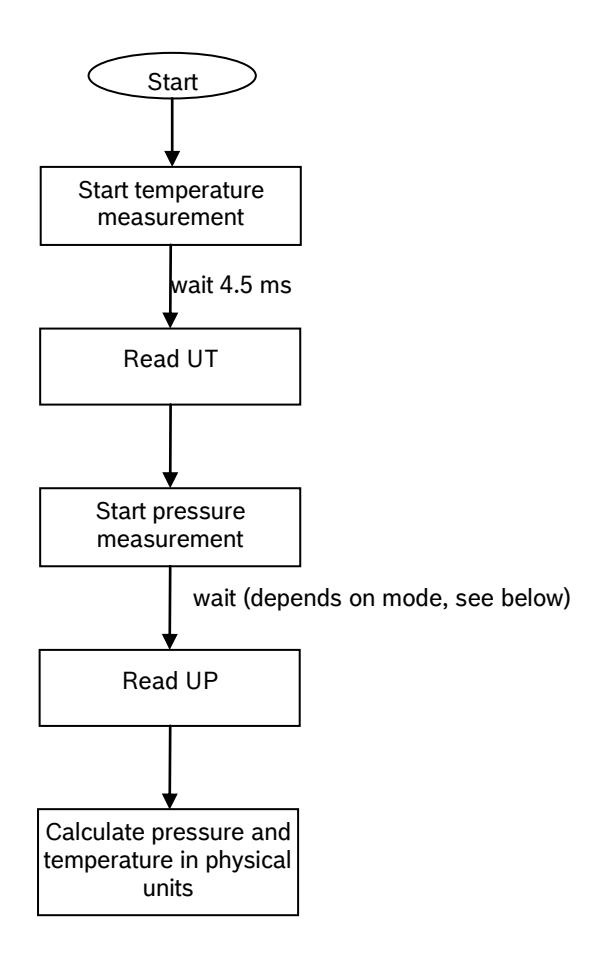
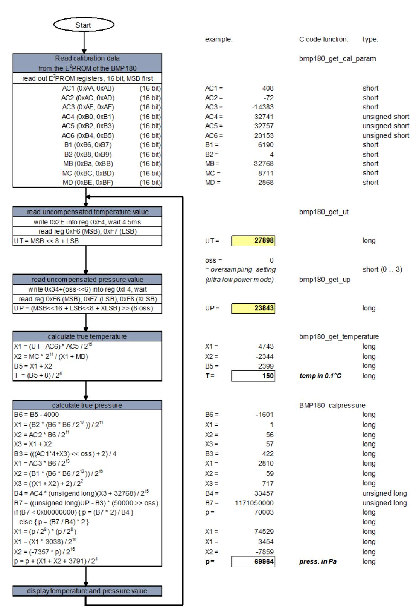
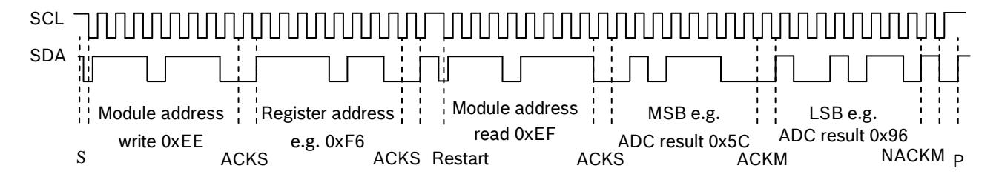
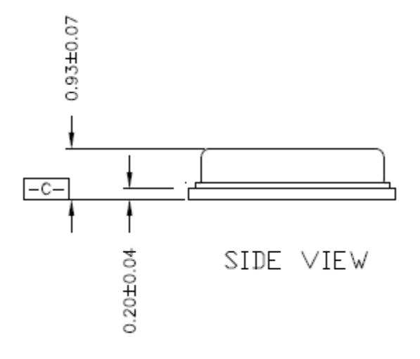

Data sheet

# **BMP180**Digital pressure sensor

**Bosch Sensortec** 

# **BMP180 Data sheet**

Document revision 2.5

Document release date 5 April 2013

Document number BST-BMP180-DS000-09

Technical reference code(s) 0 273 300 244

Notes Data in this document are subject to change without notice. Product

photos and pictures are for illustration purposes only and may differ from

the real product's appearance.

# **BMP180**

# DIGITAL PRESSURE SENSOR

# **Key features**

Pressure range: 300 ... 1100hPa (+9000m ... -500m relating to sea level)

Supply voltage: 1.8 ... 3.6V (VDD)

1.62V ... 3.6V (VDDIO)

Package: LGA package with metal lid

> Small footprint: 3.6mm x 3.8mm Super-flat: 0.93mm height

5µA at 1 sample / sec. in standard mode Low power:

Low noise: 0.06hPa (0.5m) in ultra low power mode

0.02hPa (0.17m) advanced resolution mode

- Temperature measurement included

- I2C interface

- Fully calibrated

- Pb-free, halogen-free and RoHS compliant,

# Typical applications

- Enhancement of GPS navigation (dead-reckoning, slope detection, etc.)
- In- and out-door navigation
- Leisure and sports
- Weather forecast
- Vertical velocity indication (rise/sink speed)

# Data sheet **BMP180**

Page 3

## **BMP180** general description

The BMP180 is the function compatible successor of the BMP085, a new generation of high precision digital pressure sensors for consumer applications.

The ultra-low power, low voltage electronics of the BMP180 is optimized for use in mobile phones, PDAs, GPS navigation devices and outdoor equipment. With a low altitude noise of merely 0.25m at fast conversion time, the BMP180 offers superior performance. The I2C interface allows for easy system integration with a microcontroller.

The BMP180 is based on piezo-resistive technology for EMC robustness, high accuracy and linearity as well as long term stability.

Robert Bosch is the world market leader for pressure sensors in automotive applications. Based on the experience of over 400 million pressure sensors in the field, the BMP180 continues a new generation of micro-machined pressure sensors.

# **Index of Contents**

| 1. ELECTRICAL CHARACTERISTICS                              | 6   |
|------------------------------------------------------------|-----|
| 2. ABSOLUTE MAXIMUM RATINGS                                | 8   |
| 3. OPERATION                                               | 9   |
| 3.1 GENERAL DESCRIPTION                                    | 9   |
| 3.2 GENERAL FUNCTION AND APPLICATION SCHEMATICS            | 9   |
| 3.3 MEASUREMENT OF PRESSURE AND TEMPERATURE                | 11  |
| 3.3.1 Hardware pressure sampling accuracy modes            | 13  |
| 3.5 CALCULATING PRESSURE AND TEMPERATURE                   | 14  |
| 3.6 CALCULATING ABSOLUTE ALTITUDE                          | 16  |
| 3.7 CALCULATING PRESSURE AT SEA LEVEL                      | 17  |
| 4. GLOBAL MEMORY MAP                                       | 18  |
| 5. I 2 C INTERFACE                              | 19  |
| 5.1 I 2 C SPECIFICATION                         | 19  |
| 5.2 DEVICE AND REGISTER ADDRESS                            | 20  |
| 5.3 I 2 C PROTOCOL                              | 20  |
| 5.4 START TEMPERATURE AND PRESSURE MEASUREMENT             | 21  |
| 5.5 READ A/D CONVERSION RESULT OR E 2 PROM DATA | 22  |
| 6. PACKAGE                                                 | 23  |
| 6.1 PIN CONFIGURATION                                      | 23  |
| 6.2 OUTLINE DIMENSIONS                                     | 24  |
| 6.2.1 Bottom view                                          | 24  |
| 6.2.2 Top view                                             |     |
| 6.2.3 Side view                                            |     |
| 6.4 Rohs compliancy                                        |     |
| 6.5 MOUNTING AND ASSEMBLY RECOMMENDATIONS                  |     |
| 7 LEGAL DISCLAIMER                                         | 27  |
| / LEGAL MAGNER                                             | ,,, |

# Data sheet **BMP180**

Page 5

| 8 | DOCUMENT HISTORY AND MODIFICATION  | 28 |
|---|------------------------------------|----|
|   | 7.3 APPLICATION EXAMPLES AND HINTS | 27 |
|   | 7.2 PRODUCT USE                    | 27 |
|   | 7.1 Engineering samples            | 27 |

# 1. Electrical characteristics

If not stated otherwise, the given values are ±3-Sigma values over temperature/voltage range in the given operation mode. All values represent the new parts specification; additional solder drift is shown separately.

Table 1: Operating conditions, output signal and mechanical characteristics

| Parameter                   | Symbol             | Condition                | Min         | Тур       | Max                   | Units |
|-----------------------------|--------------------|--------------------------|-------------|-----------|-----------------------|-------|
| Operating temperature       | т                  | operational              | -40         |           | +85                   | °C    |
| Operating temperature       | T A     | full accuracy            | 0           |           | +65                   | ٠.    |
| Supply voltage              | $V_{DD}$           | ripple max. 50mVpp       | 1.8         | 2.5       | 3.6                   | V     |
| Supply voltage              | <b>v</b> DD        |                          | 1.62        | 2.5       | 3.6                   | V     |
|                             | $I_{DDLOW}$        | ultra low power mode     |             | 3         |                       | μΑ    |
| Supply current              | I DDSTD | standard mode            |             | 5         |                       | μΑ    |
| @ 1 sample / sec. 25°C   | $I_{\rm DDHR}$     | high resolution mode     |             | 7         |                       | μΑ    |
| 25°C                        | I DDUHR | Ultra high res. mode     |             | 12        |                       | μΑ    |
|                             | I DDAR  | Advanced res. mode       |             | 32        |                       | μΑ    |
| Peak current                | I peak  | during conversion        |             | 650       | 1000                  | μΑ    |
| Standby current             | I DDSBM | @ 25°C                   |             | 0.1       | <b>4</b> 1 | μΑ    |
|                             |                    | 950 1050 hPa             |             | ±0.12     |                       | hPa   |
| Relative accuracy pressure  |                    | @ 25 °C                  |             | ±1.0      |                       | m     |
| $V_{DD} = 3.3V$             |                    | 700 900hPa               |             | ±0.12     |                       | hPa   |
|                             |                    | 25 40 °C                 |             | ±1.0      |                       | m     |
| Absolute accuracy pressure  |                    | 300 1100 hPa 0 +65 °C | -4.0        | -1.0*     | +2.0                  | hPa   |
| V DD = 3.3V      |                    | 300 1100 hPa -20 0 °C | -6.0        | -1.0*     | +4.5                  | hPa   |
| Resolution of               |                    | pressure                 |             | 0.01      |                       | hPa   |
| output data                 |                    | temperature              |             | 0.1       |                       | °C    |
| Noise in pressure           |                    | see                      | table on pa | age 12-13 |                       |       |
| Absolute accuracy           |                    | @ 25 °C                  | -1.5        | ±0.5      | +1.5                  | °C    |
| temperature $V_{DD} = 3.3V$ |                    | 0 +65 °C                 | -2.0        | ±1.0      | +2.0                  | °C    |

1 at 85°C

\_

|                             | $t_{c_plow}$          | ultra low power mode          |      | 3    | 4.5  | ms  |
|-----------------------------|-----------------------|-------------------------------|------|------|------|-----|
|                             | t c_p_std  | standard mode                 |      | 5    | 7.5  | ms  |
| Conversion time pressure    | t c_p_hr   | high resolution mode          |      | 9    | 13.5 | ms  |
| procoure                    | t c_p_luhr | ultra high res. mode          |      | 17   | 25.5 | ms  |
|                             | t c_p_ar   | Advanced res. mode            |      | 51   | 76.5 | ms  |
| Conversion time temperature | $t_{C\_temp}$         | standard mode                 |      | 3    | 4.5  | ms  |
| Serial data clock           | $f_{SCL}$             |                               |      |      | 3.4  | MHz |
| Solder drifts               |                       | Minimum solder height 50µm | -0.5 |      | +2   | hPa |
| Long term stability**       |                       | 12 months                     |      | ±1.0 |      | hPa |

\* The typical value is: -1±1

\*\* Long term stability is specified in the full accuracy operating pressure range 0 ... 65°C

sheet

Page 8

# **BOSCH**

# 2. Absolute maximum ratings

Table 2: Absolute maximum ratings

| Parameter           | Condition                    | Min  | Max    | Units |
|---------------------|------------------------------|------|--------|-------|
| Storage temperature |                              | -40  | +85    | °C    |
| Supply voltage      | all pins                     | -0.3 | +4.25  | V     |
| ESD rating          | HBM, R = 1.5kΩ, C = 100pF |      | ±2     | kV    |
| Overpressure        |                              |      | 10,000 | hPa   |

The BMP180 has to be handled as

Electrostatic Sensitive Device (ESD).

Figure 1: ESD

# 3. Operation

# 3.1 General description

The BMP180 is designed to be connected directly to a microcontroller of a mobile device via the  $I^2C$  bus. The pressure and temperature data has to be compensated by the calibration data of the  $E^2PROM$  of the BMP180.

#### 3.2 General function and application schematics

The BMP180 consists of a piezo-resistive sensor, an analog to digital converter and a control unit with  $E^2PROM$  and a serial  $I^2C$  interface. The BMP180 delivers the uncompensated value of pressure and temperature. The  $E^2PROM$  has stored 176 bit of individual calibration data. This is used to compensate offset, temperature dependence and other parameters of the sensor.

- UP = pressure data (16 to 19 bit)
- UT = temperature data (16 bit)

Figure 2: Typical application circuit

## 3.3 Measurement of pressure and temperature

For all calculations presented here an ANSI C code is available from Bosch Sensortec ("BMP180 \_API").

The microcontroller sends a start sequence to start a pressure or temperature measurement. After converting time, the result value (UP or UT, respectively) can be read via the I2C interface. For calculating temperature in °C and pressure in hPa, the calibration data has to be used. These constants can be read out from the BMP180 E2PROM via the I2C interface at software initialization.

The sampling rate can be increased up to 128 samples per second (standard mode) for dynamic measurement. In this case, it is sufficient to measure the temperature only once per second and to use this value for all pressure measurements during the same period.

Figure 3: Measurement flow BMP180

# 3.3.1 Hardware pressure sampling accuracy modes

By using different modes the optimum compromise between power consumption, speed and resolution can be selected, see below table.

Table 3: Overview of BMP180 hardware accuracy modes, selected by driver software via the variable oversampling\_setting

| Mode                  | Parameter oversampling_setting | Internal number of samples | Conversion time pressure max. [ms] | Avg. current @ 1 sample/s typ. [µA] | RMS noise typ. [hPa] | RMS noise typ. [m] |
|-----------------------|--------------------------------|----------------------------------|------------------------------------|-------------------------------------------|-------------------------------|-----------------------------|
| ultra low power       | 0                              | 1                                | 4.5                                | 3                                         | 0.06                          | 0.5                         |
| standard              | 1                              | 2                                | 7.5                                | 5                                         | 0.05                          | 0.4                         |
| high resolution       | 2                              | 4                                | 13.5                               | 7                                         | 0.04                          | 0.3                         |
| ultra high resolution | 3                              | 8                                | 25.5                               | 12                                        | 0.03                          | 0.25                        |

For further information on noise characteristics see the relevant application note "Noise in pressure sensor applications".

All modes can be performed at higher speeds, e.g. up to 128 times per second for standard mode, with the current consumption increasing proportionally to the sample rate.

heet Page 13

## 3.3.2 Software pressure sampling accuracy modes

For applications where a low noise level is critical, averaging is recommended if the lower bandwidth is acceptable. Oversampling can be enabled using the software API driver (with OSR = 3).

Table 4: Overview of BMP180 software accuracy mode, selected by driver software via the variable software\_oversampling\_setting

| Mode                | Parameter oversampling_setting | software_ oversampl ing_settin g | Conversion time pressure max. [ms] | Avg. current @ 1 sample/s typ. [μΑ] | RMS noise typ. [hPa] | RMS noise typ. [m] |
|---------------------|--------------------------------|-------------------------------------------|---------------------------------------------|----------------------------------------------|-------------------------|-----------------------|
| Advanced resolution | 3                              | 1                                         | 76.5                                        | 32                                           | 0.02                    | 0.17                  |

#### 3.4 Calibration coefficients

The 176 bit  $E^2PROM$  is partitioned in 11 words of 16 bit each. These contain 11 calibration coefficients. Every sensor module has individual coefficients. Before the first calculation of temperature and pressure, the master reads out the  $E^2PROM$  data.

The data communication can be checked by checking that none of the words has the value 0 or 0xFFFF.

Table 5: Calibration coefficients

|           | BMP180 | reg adr |
|-----------|--------|---------|
| Parameter | MSB    | LSB     |
| AC1       | 0xAA   | 0xAB    |
| AC2       | 0xAC   | 0xAD    |
| AC3       | 0xAE   | 0xAF    |
| AC4       | 0xB0   | 0xB1    |
| AC5       | 0xB2   | 0xB3    |
| AC6       | 0xB4   | 0xB5    |
| B1        | 0xB6   | 0xB7    |
| B2        | 0xB8   | 0xB9    |
| MB        | 0xBA   | 0xBB    |
| MC        | 0xBC   | 0xBD    |
| MD        | 0xBE   | 0xBF    |

BST-BMP180-DS000-09 | Revision 2.5 | April 2013

© Bosch Sensortec GmbH reserves all rights even in the event of industrial property rights. We reserve all rights of disposal such as copying and passing on to third parties. BOSCH and the symbol are registered trademarks of Robert Bosch GmbH, Germany.

Note: Specifications within this document are subject to change without notice.

# Data sheet **BMP180**

Page 14

# 3.5 Calculating pressure and temperature

The mode (ultra low power, standard, high, ultra high resolution) can be selected by the variable  $oversampling\_setting$  (0, 1, 2, 3) in the C code.

Calculation of true temperature and pressure in steps of 1Pa (= 0.01hPa = 0.01mbar) and temperature in steps of  $0.1^{\circ}C$ .

The following figure shows the detailed algorithm for pressure and temperature measurement.

This algorithm is available to customers as reference C source code ("BMP180\_ API") from Bosch Sensortec and via its sales and distribution partners. **Please contact your Bosch Sensortec representative for details.** 

#### Calculation of pressure and temperature for BMP180

Figure 4: Algorithm for pressure and temperature measurement

# 3.6 Calculating absolute altitude

With the measured pressure p and the pressure at sea level  $p_0$  e.g. 1013.25hPa, the altitude in meters can be calculated with the international barometric formula:

altitude = 44330 \* 
$$\left(1 - \left(\frac{p}{p_0}\right)^{\frac{1}{5.255}}\right)$$

Thus, a pressure change of  $\Delta p$  = 1hPa corresponds to 8.43m at sea level.

Figure 5: Transfer function: Altitude over sea level – Barometric pressure

# Data sheet **BMP180**

Page 17

# 3.7 Calculating pressure at sea level

With the measured pressure *p* and the absolute altitude the pressure at sea level can be calculated:

$$p_0 = \frac{p}{\left(1 - \frac{altitude}{44330}\right)^{5.255}}$$

Thus, a difference in altitude of  $\Delta$ altitude = 10m corresponds to 1.2hPa pressure change at sea level.

# 4. Global Memory Map

The memory map below shows all externally accessible data registers which are needed to operate BMP180. The left columns show the memory addresses. The columns in the middle depict the content of each register bit. The colors of the bits indicate whether they are read-only, write-only or read- and writable. The memory is volatile so that the writable content has to be re-written after each power-on.

Not all register addresses are shown. These registers are reserved for further Bosch factory testing and trimming.

| Register Name         | Register Adress | bit7    | bit6                    | bit5  | bit4        | bit3         | bit2        | bit1  | bit0 | Reset state |
|-----------------------|-----------------|---------|-------------------------|-------|-------------|--------------|-------------|-------|------|-------------|
| out_xlsb              | F8h             |         | adc_out_xlsb<7:3> 0 0 0 |       |             |              | 00h         |       |      |             |
| out_lsb               | F7h             |         | adc_out_lsb<7:0>        |       |             | 00h          |             |       |      |             |
| out_msb               | F6h             |         | adc_out_msb<7:0>        |       |             | 80h          |             |       |      |             |
| ctrl_meas             | F4h             | oss<    | <1:0>                   | SCO   |             | mea          | surement co | ntrol |      | 00h         |
| soft reset            | E0h             |         |                         | •     | rese        | et           |             |       |      | 00h         |
| id                    | D0h             | id<7:0> |                         |       | 55h         |              |             |       |      |             |
| calib21 downto calib0 | BFh down to AAh |         | _                       | calib | 21<7:0> dow | nto calib0<7 | :0>         | •     | •    | n/a         |

| Registers: | Control      | Calibration | Data      |           |
|------------|--------------|-------------|-----------|-----------|
|            | registers    | registers   | registers | Fixed     |
| Type:      | read / write | read only   | read only | read only |

Figure 6: Memory map

**Measurement control (register F4h <4:0>)**: Controls measurements. Refer to Figure 6 for usage details.

**Sco (register F4h <5>):** Start of conversion. The value of this bit stays "1" during conversion and is reset to "0" after conversion is complete (data registers are filled).

Oss (register F4h <7:6>): controls the oversampling ratio of the pressure measurement (00b: single, 01b: 2 times, 10b: 4 times, 11b: 8 times).

**Soft reset (register E0h)**: Write only register. If set to 0xB6, will perform the same sequence as power on reset.

**Chip-id (register D0h)**: This value is fixed to 0x55 and can be used to check whether communication is functioning.

After conversion, data registers can be read out in any sequence (i.e. MSB first or LSB first). Using a burst read is not mandatory.

# 5. I2C Interface

- I2C is a digital two wire interface
- Clock frequencies up to 3.4Mbit/sec. (I2C standard, fast and high-speed mode supported)
- SCL and SDA needs a pull-up resistor, typ. 4.7kOhm to  $V_{DDIO}$  (one resistor each for all the  $I^2C$  bus)

The I2C bus is used to control the sensor, to read calibration data from the E2PROM and to read the measurement data when A/D conversion is finished. SDA (serial data) and SCL (serial clock) have open-drain outputs.

For detailed I2C-bus specification please refer to: <a href="http://www.nxp.com/acrobat\_download/literature/9398/39340011.pdf">http://www.nxp.com/acrobat\_download/literature/9398/39340011.pdf</a>

# **5.1** I2C specification

Table 6: Electrical parameters for the I2C interface

| Parameter                                                      | Symbol                | Min.                    | Тур | Max.                    | Units |
|----------------------------------------------------------------|-----------------------|-------------------------|-----|-------------------------|-------|
| Clock input frequency                                          | $f_{SCL}$             |                         |     | 3.4                     | MHz   |
| Input-low level                                                | $V_{IL}$              | 0                       |     | 0.2 * V DDIO | V     |
| Input-high level                                               | $V_{IH}$              | 0.8 * V DDIO |     | $V_{\text{DDIO}}$       | V     |
| Voltage output low level @ $V_{DDIO} = 1.62V$ , $I_{OL} = 3mA$ | $V_{OL}$              |                         |     | 0.3                     | V     |
| SDA and SCL pull-up resistor                                   | $R_{\text{pull-up}}$  | 2.2                     |     | 10                      | kOhm  |
| SDA sink current @ $V_{DDIO} = 1.62V$ , $V_{OL} = 0.3V$        | I SDA_sink |                         | 9   |                         | mA    |
| Start-up time after power-up, before first communication       | t Start    | 10                      |     |                         | Ms    |

## 5.2 Device and register address

The BMP180 module address is shown below. The LSB of the device address distinguishes between read (1) and write (0) operation, corresponding to address 0xEF (read) and 0xEE (write).

Table 7: BMP180 addresses

| A7 | <b>A6</b> | <b>A5</b> | Α4 | <b>A3</b> | A2 | A1 | W/R |
|----|-----------|-----------|----|-----------|----|----|-----|
| 1  | 1         | 1         | 0  | 1         | 1  | 1  | 0/1 |

## 5.3 I2C protocol

The I2C interface protocol has special bus signal conditions. Start (S), stop (P) and binary data conditions are shown below. At start condition, SCL is high and SDA has a falling edge. Then the slave address is sent. After the 7 address bits, the direction control bit R/W selects the read or write operation. When a slave device recognizes that it is being addressed, it should acknowledge by pulling SDA low in the ninth SCL (ACK) cycle.

At stop condition, SCL is also high, but SDA has a rising edge. Data must be held stable at SDA when SCL is high. Data can change value at SDA only when SCL is low.

Even though  $V_{DDIO}$  can be powered on before  $V_{DD}$ , there is a chance of excessive power consumption (a few mA) if this sequence is used, and the state of the output pins is undefined so that the bus can be locked. Therefore,  $V_{DD}$  *must* be powered before  $V_{DDIO}$  unless the limitations above are understood and not critical.

Figure 7: I2C protocol

## 5.4 Start temperature and pressure measurement

The timing diagrams to start the measurement of the temperature value UT and pressure value UP are shown below. After start condition the master sends the device address write, the register address and the control register data. The BMP180 sends an acknowledgement (ACKS) every 8 data bits when data is received. The master sends a stop condition after the last ACKS.

Figure 8: Timing diagram for starting pressure measurement

# Abbreviations:

S Start P Stop

ACKS Acknowledge by Slave
ACKM Acknowledge by Master
NACKM Not Acknowledge by Master

Table 8: Control registers values for different internal oversampling\_setting (oss)

| Measurement           | Control register value (register address 0xF4) | Max. conversion time [ms] |
|-----------------------|------------------------------------------------|---------------------------|
| Temperature           | 0x2E                                           | 4.5                       |
| Pressure (oss = 0) | 0x34                                           | 4.5                       |
| Pressure (oss = 1) | 0x74                                           | 7.5                       |
| Pressure (oss = 2) | 0xB4                                           | 13.5                      |
| Pressure (oss = 3) | 0xF4                                           | 25.5                      |

# 5.5 Read A/D conversion result or E2PROM data

To read out the temperature data word UT (16 bit), the pressure data word UP (16 to 19 bit) and the E2PROM data proceed as follows:

After the start condition the master sends the module address write command and register address. The register address selects the read register:

E2PROM data registers 0xAA to 0xBF Temperature or pressure value UT or UP 0xF6 (MSB), 0xF7 (LSB), optionally 0xF8 (XLSB)

Then the master sends a restart condition followed by the module address read that will be acknowledged by the BMP180 (ACKS). The BMP180 sends first the 8 MSB, acknowledged by the master (ACKM), then the 8 LSB. The master sends a "not acknowledge" (NACKM) and finally a stop condition.

Optionally for ultra high resolution, the XLSB register with address 0xF8 can be read to extend the 16 bit word to up to 19 bits; refer to the application programming interface (API) software rev. 1.1 ("BMP180\_ API", available from Bosch Sensortec).

Figure 9: Timing diagram read 16 bit A/D conversion result

# 6. Package

# 6.1 Pin configuration

Picture shows the device in top view. Device pins are shown here transparently only for orientation purposes.

Figure 10: Layout pin configuration BMP180

Table 9: Pin configuration BMP180

| in No | Name  | Function                           |
|-------|-------|------------------------------------|
| 1     | CSB*  | Chip select                        |
| 2     | VDD   | Power supply                       |
| 3     | VDDIO | Digital power supply               |
| 4     | SDO*  | SPI output                         |
| 5     | SCL   | I2C serial bus clock input         |
| 6     | SDA   | I2C serial bus data (or SPI input) |
| 7     | GND   | Ground                             |

\* A pin compatible product variant with SPI interface is possible upon customer's request. For I2C (standard case) CSB and SDO are not used, they have to be left open. All pins have to be soldered to the PCB for symmetrical stress input even though they are not connected internally.

#### **6.2 Outline dimensions**

The sensor housing is a 7Pin LGA package with metal lid. Its dimensions are 3.60mm ( $\pm 0.1$  mm) x 3.80mm ( $\pm 0.1$  mm) x 0.93mm ( $\pm 0.07$  mm).

Note: All dimensions are in mm.

# 6.2.1 Bottom view

BOTTOM VIEW

Figure 11: Bottom view BMP180

# 6.2.2 Top view

Figure 12: Top view BMP180

# 6.2.3 Side view

Figure 13: Side view BMP180

# Data sheet **BMP180**

Page 26

# 6.3 Moisture sensitivity level and soldering

The BMP180 is classified MSL 1 (moisture sensitivity level) according to IPC/JEDEC standards J-STD-020D and J-STD-033A.

The device can be soldered Pb-free with a peak temperature of 260°C for 20 to 40 sec. The minimum height of the solder after reflow shall be at least 50µm. This is required for good mechanical decoupling between the sensor device and the printed circuit board (PCB).

To ensure good solder-ability, the devices shall be stored at room temperature (20°C).

The soldering process can lead to an offset shift.

#### 6.4 RoHS compliancy

The BMP180 sensor meets the requirements of the EC directive "Restriction of hazardous substances (RoHS)", please refer also to:

"Directive 2002/95/EC of the European Parliament and of the Council of 27 January 2003 on the restriction of the use of certain hazardous substances in electrical and electronic equipment".

The BMP180 sensor is also halogen-free.

#### 6.5 Mounting and assembly recommendations

In order to achieve the specified performance for you design, the following recommendations and the "Handling, soldering & mounting instructions BMP180" should be taken into consideration when mounting a pressure sensor on a printed-circuit board (PCB):

- The clearance above the metal lid shall be 0.1mm at minimum.
- For the device housing appropriate venting needs to be provided in case the ambient pressure shall be measured.
- Liquids shall not come into direct contact with the device.
- During operation the sensor is sensitive to light, which can influence the accuracy of the measurement (photo-current of silicon).
- The BMP180 shall not the placed close the fast heating parts. In case of gradients > 3°C/sec.
  it is recommended to follow Bosch Sensortec application note ANP015, "Correction of errors
  induced by fast temperature changes". Please contact your Bosch Sensortec representative
  for details.

# 7. Legal disclaimer

# 7.1 Engineering samples

Engineering Samples are marked with an asterisk (\*) or (e). Samples may vary from the valid technical specifications of the product series contained in this data sheet. They are therefore not intended or fit for resale to third parties or for use in end products. Their sole purpose is internal client testing. The testing of an engineering sample may in no way replace the testing of a product series. Bosch Sensortec assumes no liability for the use of engineering samples. The Purchaser shall indemnify Bosch Sensortec from all claims arising from the use of engineering samples.

#### 7.2 Product use

Bosch Sensortec products are developed for the consumer goods industry. They may only be used within the parameters of this product data sheet. They are not fit for use in life-sustaining or security sensitive systems. Security sensitive systems are those for which a malfunction is expected to lead to bodily harm or significant property damage. In addition, they are not fit for use in products which interact with motor vehicle systems.

The resale and/or use of products are at the purchaser's own risk and his own responsibility. The examination of fitness for the intended use is the sole responsibility of the Purchaser.

The purchaser shall indemnify Bosch Sensortec from all third party claims arising from any product use not covered by the parameters of this product data sheet or not approved by Bosch Sensortec and reimburse Bosch Sensortec for all costs in connection with such claims.

The purchaser must monitor the market for the purchased products, particularly with regard to product safety, and inform Bosch Sensortec without delay of all security relevant incidents.

# 7.3 Application examples and hints

With respect to any examples or hints given herein, any typical values stated herein and/or any information regarding the application of the device, Bosch Sensortec hereby disclaims any and all warranties and liabilities of any kind, including without limitation warranties of non-infringement of intellectual property rights or copyrights of any third party. The information given in this document shall in no event be regarded as a guarantee of conditions or characteristics. They are provided for illustrative purposes only and no evaluation regarding infringement of intellectual property rights or copyrights or regarding functionality, performance or error has been made.

# 8. Document history and modification

| Rev. No | Chapter    | Description of modifications/changes                               | Date              |
|---------|------------|--------------------------------------------------------------------|-------------------|
| 1.0     |            | First edition for description of serial production material        |                   |
|         |            | - Preliminary version                                              |                   |
| 1.1     | 5.1        | New nomenclature of pin configuration                              | 27 July 2010      |
| 1.2     | 5          | Design change in package – hole in Lid and without slit            | 13 September 2010 |
| 1.3     | 3.2 5.1 | - Standardizing pin naming over Bosch Sensortec                    |                   |
|         |            | products - typical application circuit                             | 15 December 2010  |
|         |            | - Optimizing pin description, SPI description                      |                   |
| 2.0     | 1          | - Non-preliminary version                                          | 28 January 2011   |
|         |            | - Verifying parameter through characterization                     |                   |
| 2.1     | 3.2        | - Declaration of SDO and CSB pins in the typical                   |                   |
|         |            | application circuit                                                |                   |
|         | 4          | - Adding global memory map and bits description                    | 1 April 2011      |
|         | 5.3        | - Power-up sequence                                                | Ι Αριίί 2011      |
|         | 6.1        | - Description of used interfaces                                   |                   |
|         | 6.2.1      | - Dimension pin7                                                   |                   |
| 2.2     | 6.1        | Correction of the pin configuration (editorial change)             | 14 April 2011     |
| 2.3     | 3.3        | Optimizing noise performance                                       | 25 May 2011       |
| 2.4     | 6.3        | Removed shelf-life constraints                                     |                   |
|         | page 2     | Comparison removed                                                 | 26 January 2012   |
|         | 5.1        | Voltage output low level added                                     |                   |
|         | 5.3        | Power on sequence of $V_{\text{DD}}$ and $V_{\text{DDIO}}$ defined |                   |
| 2.5     | 1          | Added max values for supply current for restricted                 | 15 Feb 2013       |
|         |            | version                                                            |                   |
|         | 1          | Added max value for standby current for restricted                 |                   |
|         | 1          | version                                                            |                   |
|         | Figure 4   | Update of calculation of algorithm for pressure and                | 5 Apr 2013        |
|         |            | temperature measurement                                            |                   |
|         | Page 2     | Changed wording from "ultra high resolution mode" to               |                   |
|         |            | "advanced resolution mode"                                         |                   |

Bosch Sensortec GmbH Gerhard-Kindler-Strasse 8 72770 Reutlingen / Germany

contact@bosch-sensortec.com www.bosch-sensortec.com

Modifications reserved | Printed in Germany Specifications are subject to change without notice Revision\_2.5\_042013

Document number: BST-BMP180-DS000-09